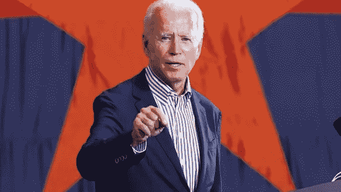

# 关于扩大最高法院，乔·拜登应该说些什么

> 原文：<https://medium.datadriveninvestor.com/what-joe-biden-should-say-about-expanding-the-supreme-court-dac9f6fc7385?source=collection_archive---------7----------------------->

乔没有问我，我似乎已经失去了他的手机号码。所以我把这个放在这里，以防他要用。
_ _ _ _ _ _ _ _ _ _ _ _ _ _ _ _ _ _ _ _ _ _ _ _ _ _ _ _ _ _ _ _ _ _ _ _ _ _ _ _ _ _ _ _ _ _ _ _ _ _

我的美国同胞们，

2016 年，共和党人放弃了 150 年的先例，并通过将最高法院提名推迟 11 个月来破坏参议院的规范。当时，他们说他们只是遵循先例，如果在共和党总统任期的最后一年出现空缺，他们也会做完全相同的事情。林赛·格雷厄姆(Lindsey Graham)甚至告诉记者，如果他批准在唐纳德·特朗普(Donald Trump)的最后一个任期内任命一名候选人，“用我的话来反对我”。就在几周前，同一个林赛·格拉玛一边说“拿着我的啤酒”，一边继续做他承诺永远不会做的事情。

米奇·麦康奈尔(Mitch McConnell)和他的共和党同僚在这些确认战中谈论了很多“先例”。根据米奇的说法，一个由一个政党控制的参议院从未在总统任期的最后一年确认另一个政党的最高法院提名人，这个月有 31 天，满月在星期二到来。除了 1968 年，但那是整个不算数费利克斯·弗兰克福特交易。这些家伙已经用很多方式将事实切割成碎片，以至于他们忍不住偶然发现了一个“先例”——即使没有人有机会做他们说没有人做过的事情。

好吧，这里有两个先例，它们不必用六个不同的形容词来限定，就可以让米奇·麦康奈尔(Mitch McConnell)不必站在角落里。

1.  没有一个参议院允许最高法院的提名持续 11 个月，甚至没有对总统的提名进行投票。从来没有。哪个政党控制什么并不重要。这绝对是参议院前所未有的拖延，他们没有履行宪法义务，对总统提名采取行动。
2.  没有一个参议院在选举前不到一个月就确认了最高法院的提名人。再说一次，这从来没有发生过。

现在，你必须明白为什么这是一个问题。美国参议院是一个罕见的机构。它运行的许多规则没有被写下来。这些是参议员们随着时间的推移而达成的谅解，因为在过去，当选为美国参议员的人深深关心我们的国家和我们的宪法，他们更重视维护参议院的机构，而不是每次赢得每一场政治斗争。我在参议院工作了 30 多年，和民主党人、共和党人以及其他所有人一起工作。我们都知道我们继承了作为参议员的特殊责任，我们不想摧毁世界上最伟大的立法机构。

 [## 卡玛拉·哈里斯的经济政策到底有多有限？数据驱动的投资者

### 大多数人多少知道唐纳德·特朗普的企业减税、反全球主义贸易政策和保护主义…

www.datadriveninvestor.com](https://www.datadriveninvestor.com/2020/08/28/just-how-limited-are-kamala-harriss-economic-policies/) 

我们吵了很多架。我们为我们的信仰而努力奋斗。但是我们没有尽全力去争取。我们没有为了赢得可能会摧毁参议院的短期战斗而去做事情。我们遵守某些行为规范，这些规范给予少数人一些发言权，并遵从总统的意愿——即使他来自不同的政党——因为我们知道有一天我们会成为少数人。我们相信选举是有后果的。

1988 年，罗纳德·里根提名安东尼·肯尼迪时，我是参议院司法委员会主席。当时，我本可以像米奇·麦康奈尔(Mitch McConnell)那样，干脆拒绝举行听证会，因为这是一个选举年。但我没有。我们通过委员会批准了他，他担任最高法院的助理法官，直到 2018 年。一年前，参议院否决了里根对罗伯特·博克的提名。但我们举行了听证会，给他一个赞成或反对的投票。我们甚至不会考虑不对总统候选人进行投票。我们知道游戏不是这么玩的。

因此，当米奇·麦康奈尔(Mitch McConnell)干脆拒绝承认奥巴马总统在 2016 年提名梅里克·加兰(Merrick Garland)进入最高法院时，他是在藐视参议院的一项基本规范。当时，他说这是因为今年是选举年。(1988 年也是选举年)。但我想我们都知道，共和党人忽略了梅里克·加兰的提名，因为他们可以这样做，他们急于通过艾米·科尼·巴雷特的提名，即使委员会的一半成员拥有新冠肺炎，因为他们可以。归根结底，这就是麦康奈尔主义:尽你所能逃脱惩罚。

与此同时，共和党人正在破坏美国参议院的规范，以获得他们想要的东西，他们竟敢要求我承诺，如果民主党人在 11 月份控制了参议院，他们不会让民主党人做同样的事情。他们希望得到保证，民主党人将遵守他们在 2016 年和 2020 年甚至拒绝承认的不成文规则。他们希望得到保证，民主党不会给最高法院增加任何额外的法官。

嗯，我不知道民主党人如果赢回参议院会做什么，我肯定不会做出米奇·麦康奈尔和林赛·格雷厄姆在 2016 年向美国人民做出的承诺，他们在 2020 年无耻地违背了这些承诺。我不会那样做的。如果我答应你什么，我会说到做到。如果我不能百分百认真，我就不会说。我不会成为唐纳德·特朗普(Donald Trump)那样的总统，今天想说什么就说什么，明天却食言撒谎。美国已经受够了。

但是让我明确一点:美国宪法对最高法院法官的数量没有任何规定。最高法院最初有五名法官。其他时候有七个或九个。但这是一个完全留给立法部门的问题。这是他们对政府其他两个部门权力的关键制衡之一。绝对没有宪法上的理由说大法官的人数不能是七个，或者十三个，或者七百零三个。任何地方都没有这方面的书面规定。

但是有不成文的规定。有一些行为规范指导了参议院 150 年。根据这些规范，国会为确保最高法院做出有利于多数党的裁决而增加更多法官是不合适的。当富兰克林·d·罗斯福在 1937 年尝试这样做时，国会拒绝同意，尽管它由总统的政党压倒性地控制。他们不愿意推翻这些规范。

但是现在的游戏已经很不一样了。米奇·麦康奈尔(Mitch McConnell)和共和党人为了实现他们的短期政治目标，已经破坏了规范和规范的概念。“麦康奈尔规则”很简单，是 2500 年前修昔底德在世界上第一个民主国家处于崩溃过程中时提出的:“强者尽力而为，弱者必须承受。”当然，共和党人更希望不受他们控制的参议院不受他们控制时制定的规则的约束。他们可能也更希望所有最高法院的提名都由小妖精来处理。但这一切都不是这样。

我不知道 2021 年谁会控制参议院，也不知道他们会通过什么立法。因此，我不会对任何可能或不可能出现在我办公桌上的具体法案发表评论。但是不管发生什么，共和党还有三个月的时间来控制参议院和总统职位。如果他们想回到一个由规范和民主价值观管理的世界——我想我们都同意，这将是一个比我们今天更好的世界——他们应该开始像一个政党那样行事，而不是相信不受管制地使用权力。他们可以从承诺在就职日之前不确认另一位最高法院法官开始。

## 访问专家视图— [订阅 DDI 英特尔](https://datadriveninvestor.com/ddi-intel)