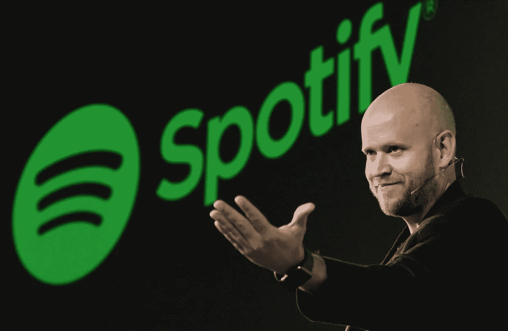

# 是什么让丹尼尔·埃克价值 210 亿美元的音乐流媒体巨头获得成功

> 原文：<https://medium.datadriveninvestor.com/what-made-daniel-eks-21-billion-music-streaming-giant-a-success-16af28835a84?source=collection_archive---------12----------------------->

## Spotify 的估值超过苹果 Itunes 和亚马逊音乐的估值

Image of Daniel EK, CEO of Spotify. Source: CNBC.

正如我们所知，世界上有如此多的音乐流媒体服务。按公司划分，Spotify 在 2019 年全球音乐流媒体用户中占有 35%的高份额，高于亚马逊、Youtube 和苹果的份额- [statistia data](https://www.statista.com/statistics/653926/music-streaming-service-subscriber-share/) 。

在 Spotify 出现之前，像 Napster 这样的公司是音乐流媒体行业的初创公司。 [Napster 是一款 P2P 文件共享互联网软件](https://en.wikipedia.org/wiki/Napster_(pay_service))，由肖恩·范宁和肖恩·帕克创立。尽管 Napster 在流行文化和商业领域获得了广泛认可，但它曾面临金融动荡。最终，该公司宣布破产。

Spotify 已经成为音乐流媒体服务行业的革命性变革者。这一切都要归功于创始人丹尼尔·埃克，他带领公司一路走到今天的 210 亿美元的估值——据 fortune.com[报道。](https://fortune.com/longform/spotify-music-industry-profits-apple-amazon/#:~:text=Today%2C%20Spotify%20has%20a%20market,worth%20of%20nearly%20%242%20billion.)

在过去的几周里，我被丹尼尔·埃克的创业历程和成功所鼓舞。在看了许多丹尼尔·埃克的新闻采访后，我能够剖析我们能从这位瑞典技术绝地学到的重要经验。我们如何将这些策略应用到我们自己的创业公司和潜在的商业投资中？

 [## 不见面就做交易？风投和企业家的 5 个指南|数据驱动…

### 自从 covid 六个月前登陆美国以来，全球的风险投资家和企业家都不得不适应新的现实…

www.datadriveninvestor.com](https://www.datadriveninvestor.com/2020/09/20/doing-deals-without-meeting-in-person-5-guidelines-for-vcs-and-entrepreneurs/) 

## 不要只关注广告

一些企业在广告上花了大量的钱来推广他们的业务，因为他们想让所有的消费者都知道他们的标签。例如，“数字公司增加了广告支出，像亚马逊(32%)、网飞(70%)、谷歌母公司 Alphabet(23%)”——[Businessinsider.com](https://www.businessinsider.com/10-biggest-advertising-spenders-in-the-us-2015-7?r=US&IR=T)。

对于 Spotify 来说，情况并非如此。丹尼尔·埃克在美国消费者新闻与商业频道的一次采访中说:“广告大约占我们业务的 10%。在美国消费者新闻与商业频道的一次采访中,“这只是整体业务的一小部分。”。

从丹尼尔·埃克对广告的建议来看，应该注意的是，过多的广告费用并不是企业成功的必要条件。有时广告可能会有回报，也可能没有回报。

确保你的商业成本不全是基于广告是至关重要的。因此，企业有必要将成本分摊到不同的业务职能部门。通过更加专注于发展公司和有机地促进业务。

## 增长和扩张对企业来说很重要

> “最终，我希望音乐产业比现在更大”——丹尼尔·埃克

许多公司喜欢他们所处的位置。它们很稳定并且正在运行。但是我们能从中学到什么吗？还是我们从企业的成长和扩张中学习？

Spotify 不是一家完美的公司；他们确实面临着一些业务效率低下的问题。然而，他们正在朝这个方向努力。他们在朝什么方向努力？

他们研究了音乐产业过去是如何运作的。从生产 CD 到分销给零售商。随着在线流媒体服务的普及，这种方式不再有效。有了音乐便携在线就方便多了。

长期机会，他们的重点都是增长。Spotify 通过改善用户体验建立了自己的业务。他们提议开创音乐流媒体行业。

2018 年美国无线电产业价值 180 亿美元- [彭博数据](https://www.bloomberg.com/news/articles/2020-05-05/spotify-ceo-sees-an-18-billion-opportunity-in-selling-ads)。丹尼尔注意到，广播行业的主要颠覆者是在线流媒体行业。

Spotify 的产品/服务生命周期——引入在线流媒体服务。他们正在考虑价格上涨，他们发现很难适应。Spotify 希望达到成熟水平，但他们还没有达到，因为他们处于增长周期的早期阶段。他们面临的下降是消费者拒绝为他们的竞争对手提供服务。这对营销人员来说非常重要，他们需要注意“观察[spotfiy 的]产品[服务]生命周期；但更重要的是，观察市场生命周期”——菲利普·科特勒。

## 用行业教育自己

> “教育是一件令人钦佩的事情，但是要时常记住，没有什么值得知道的东西是可以教会的。”——奥斯卡·王尔德

“Spotify 让人们更容易创建播客、分发播客，同时也全面改善了消费者体验。”——丹尼尔·埃克-彭博访谈。

都是为了教育整个行业。通过对你的企业进行 SWOT 分析，充分了解你的市场。在你的商务旅程中，另一个可以帮助你的重要方面是研究客户习惯。最重要的是，通过期待新的机会来寻找改进的空间。

> “Spotify 的旅程不仅仅是娱乐大众，还包括为他们提供信息和教育。”——丹尼尔·埃克，彭博访谈。

那么，为什么教育对 Spotify 很重要呢？Spotify 利用了播客空间，因为许多消费者通过在手机或其他设备上听播客来自学。任何客户都可以在 Spotify 上搜索生产力主题、ted 演讲，甚至是与商业相关的脱口秀，由专家发言人分享建议。

## 在音乐社区中建立互动

Spotify 的参与度是其最接近的竞争对手的 3 倍。那是什么意思？

消费者经常在他们的平台上使用 Spotify 的音乐和播客内容。他们想要重新定义音频平台，并试图颠覆无线电行业。

Spotify 一直在关注的另一项业务是消费者的转变。消费者行为以及消费者每天都在开发新兴趣的原因。消费者过去只谈论一个特定的话题。Spotify 发现越来越多的消费者“乐于花一个半小时深入了解某个主题”——丹尼尔·埃克在接受彭博采访时说道。

# 外卖食品

那么，我们到底应该从丹尼尔·埃克(Daniel Ek)的十亿美元 Spotify 帝国中学习和借鉴什么呢？我们能注意到的是。

*   **不要只关注广告**。你的企业吸引注意力的根本目的是把信息传递出去。使用正确的营销策略和工具，你可以变得有机而高效。
*   **成长和扩张。**继续发展您的业务，发展合作伙伴关系，甚至创造吸引所有消费者的新服务。
*   在你的行业中自我教育。充分了解你的行业。继续观察你的竞争对手的成长，从新的变化中学习，抓住能给你的业务带来革命性变化的新趋势。
*   **在基于音乐的社区中建立互动。关注你的客户，了解他们是谁。他们的利益和要求是。**

如今，创建像 Spotify 这样价值 10 亿美元的流媒体服务并不是什么难事。但是，从丹尼尔·埃克成功创建公司的经验中吸取教训是值得的。

记住，他“不是发明家；[他]想让事情变得更好”——丹尼尔·埃克。记住这一点，采纳这些教训，今天就改变你的企业，而不是明天。创建一个企业，让你努力比你的竞争对手“总是把事情做得更好”。最重要的是，“愿原力与你同在(你的创业之旅)”——尤达，《星球大战》。

## 访问专家视图— [订阅 DDI 英特尔](https://datadriveninvestor.com/ddi-intel)