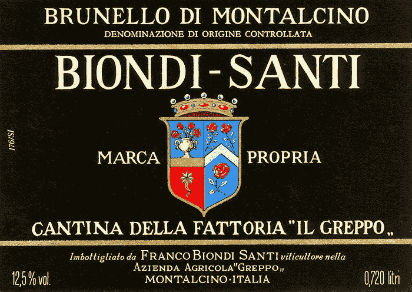

# 对买家来说，是什么让生意变得美好？

> 原文：<https://medium.datadriveninvestor.com/what-makes-a-business-beautiful-to-a-buyer-28c01eaac029?source=collection_archive---------17----------------------->

## 理解让一个企业有吸引力的“美学”规则

Image found on [https://wallpapersafari.com/w/UomIK5](https://wallpapersafari.com/w/UomIK5)

上图是有史以来最漂亮的汽车；法拉利 250 GTO。如此确定一种观点似乎有些奇怪。美是主观的。然而，有一些美学美的组成部分似乎是被普遍接受的。曲线、线条、优雅、比例、材料和构成。

无论我们谈论的是人、风景、雕塑还是葡萄酒，美的品质都有着广泛的共识。在细节上有不同的观点，但是主观性并没有阻止我们在美丽的含义上达成一致。

在西方文化中，最后的记分卡往往是市值。2018 年最后一辆法拉利 250 GTO 在[拍卖会上以 4840 万美元](https://www.cnbc.com/2018/08/27/most-expensive-car-ever-sold-at-auction-fetches-48-million.html#:~:text=Most%20expensive%20car%20ever%20sold%20at%20auction%20fetches%20%2448%20million,-Published%20Mon%2C%20Aug&text=A%20Ferrari%20250%20GTO%20was,Pebble%20Beach%20Concours%20d'Elegance.)成交；有史以来最多的车。这是美丽的吗？当然不是。但是，买家最终为一件物品支付的价格是证明其吸引力的一个令人信服的论据。一个企业也是如此。买家愿意支付的价格有力地证明了它的可取性。

Photo by [Hervé Piglowski](https://www.pexels.com/@herve-piglowski-1457017?utm_content=attributionCopyText&utm_medium=referral&utm_source=pexels) from [Pexels](https://www.pexels.com/photo/low-angle-photography-of-white-concrete-building-4008644/?utm_content=attributionCopyText&utm_medium=referral&utm_source=pexels)

美学让一个企业对买家有吸引力或美丽。“美学”可能是一个用词不当的词，因为企业没有外表美。让生意变得美好的东西本质上不是感官的。

商业并不美好:

> 凭视觉；摸上去像一件建筑杰作
> ；喜欢精致的面料和服装
> 听到；就像贝多芬的交响曲
> 闻起来一样；喜欢冲泡
> 完美烘焙的咖啡来品尝；就像一个伟大的布鲁内洛迪蒙塔尔奇诺托斯卡纳牛排

当一家企业很好的时候，一个老练的买家会愿意出高价收购它。目标是成为同行业的法拉利 250 GTO。

## 为什么企业主应该关心企业是否有吸引力？

无论是否有出售计划，企业主都应该强调价值增长。所有者可以通过理解老练的买家看待企业的方式，专注于创造价值。这些因素大部分都在企业主的控制范围内。

## 我已经确定了 6 个类别和 54 个单独的因素。

大多数因素都可以通过有意识、有纪律的执行来改善。

一个企业不需要在每一个领域都取得完美的成绩才算漂亮。但由于某些类别的改进可能需要数年时间，所以最好始终从创造价值的心态出发。

 [## 商业无国界:如何走向全球？数据驱动的投资者

### 首先，你要形成你的主要目标。例如，寻找投资，固定你的市场…

www.datadriveninvestor.com](https://www.datadriveninvestor.com/2020/07/14/business-without-borders-how-to-go-global/) 

以创造价值的心态经营*就像*企业总是待售一样。

以下是潜在买家眼中的因素。每个类别中的各个因素都有超链接，以便于访问。

# 1.个人因素

在封闭的家族企业中，商业和个人因素交织在一起。潜在的追求者明白这一点。对企业收购进行尽职调查需要投入大量的时间和金钱。这是第一类，因为它仍然是交易无法达成的首要原因。当个人因素被忽视时，时间就被浪费了。对所有者来说，制定详细的个人和财务计划是非常重要的。潜在买家会问很多细节问题，以了解业主在他们的个人规划上投入了多少心思。如果业主看起来没有准备好或小心翼翼，买家就会错过。

[点击这里查看 5 个个人因素](https://medium.com/@brupnow/personal-factors-6d63c3095d35)

# 2.业务运营因素

一旦个人规划完成，商业吸引力的核心和灵魂，也就是商业运作本身。这些因素在很大程度上是在所有者和管理者的控制之内。在这些因素中得分较高的企业表现良好，非常受企业买家欢迎。改善这些因素，商业价值就会提高。在每个类别中都取得好成绩是不现实的。通过选择这些因素中的 1-3 个在一年内重点关注，增长公司的企业价值是现实的。通过这一过程的重复，一个公司可以系统地变得更加美好和可转让。

[点击此处查看 18 项业务运营因素](https://medium.com/@brupnow/business-operational-factors-6cecafbe9e7d)

# 3.行业/市场因素

企业在行业和市场的背景下运作。即使是高度专业化的公司。有时公司创造产业，如优步和电梯公司。商业运作不是在真空中进行的。在买家愿意拿自己的资本冒险之前，他们希望了解企业在行业和市场背景下的表现和前景。企业成功和发展的能力面临哪些威胁。

[点击此处了解 7 个行业/市场因素](https://medium.com/@brupnow/industry-market-factors-f18faa5baa7f)

# 4.法律/监管因素

很难将“法律/监管”与“美观”相协调。但是记住我们的记分牌是价值。一个正在考虑为一家企业开一张 8 位数或更多的支票的企业买家会希望看到法律和监管方面是干净的、有条理的，并且不会带来隐藏的风险。许多大企业忽略了这些。不要。如果法律和监管方面存在缺陷，买家会对价值打折扣。保值是商业美的一部分。

[点击此处了解 8 个法律/监管因素](https://medium.com/@brupnow/legal-regulatory-factors-e2f746b4767e)

# 5.金融因素

强大的财务状况向潜在的追求者证明了可信度。财务表现持续强劲的企业将会引起收购者的注意。由于尽职调查过程非常复杂，公司财务中的细节很重要。那些试图掩盖缺陷或提高收入以保持一年良好业绩的公司不会在价格上得到回报。最好将时间和注意力放在这些指标上，作为管理业务的一部分。通过关注正确的指标，企业无论如何都会表现得更好。买家会对财务状况可信且稳定的企业给予更高的评价。

[点击此处查看 14 个财务因素](https://medium.com/@brupnow/financial-factors-c2a921228334)

# 6.经济/M&A 市场因素

所有者无法控制这些因素。然而，重要的是要意识到当前的经济或市场环境会如何影响购买者对美的感知。从理论上讲，一个企业可以在我们到目前为止详细描述的每个领域都获得很高的分数，但由于经济或市场背景的原因，仍然没有吸引力。这些周期不是永久性的，但在短期内可能会产生巨大的影响。企业主应该意识到这些周期。

[点击此处获取 2 经济/M & A 市场因素](https://medium.com/@brupnow/economic-m-a-market-factors-fc9507e39d4d)

提升商业美感或价值并不容易。然而，它是实用的，可以系统化。关键是不要被业务中有多少领域需要改进所淹没。我建议从 1-3 个因素开始，并真正专注于对这些因素产生影响。大多数管理团队在经营企业的日常运营时，不能同时消化 1-3 个以上的项目。

改善这一个、两个或三个因素，企业价值就会增长。然后你可以继续下一个。随着时间的推移，所有者发现他们从这项工作中增加的价值往往比他们从增量销售增长中增加的价值更多。

image: Biondi-Santi

Brent Rupnow 是国际金融理财师和南加州的注册离职计划顾问。 [*这里是他其他文章*](https://www.brentrupnow.com/blog) *的链接。*

**访问专家视图—** [**订阅 DDI 英特尔**](https://datadriveninvestor.com/ddi-intel)