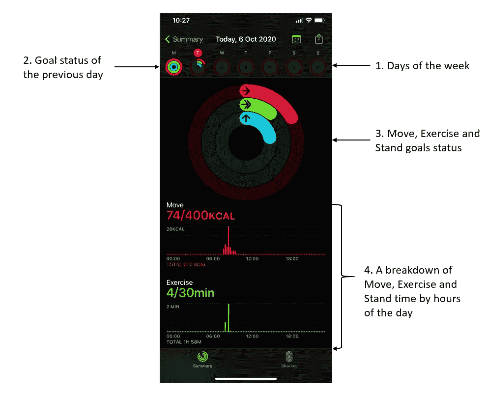
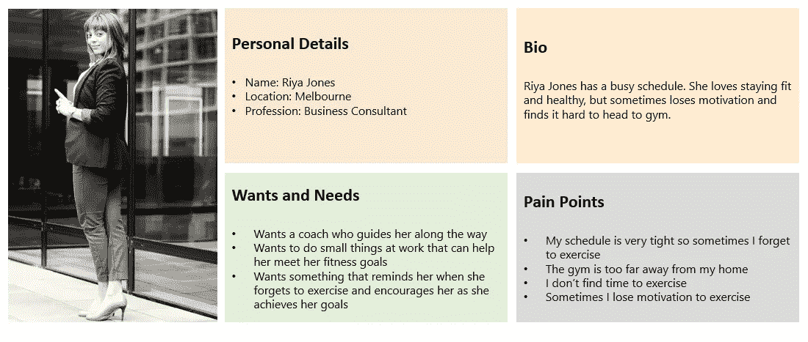
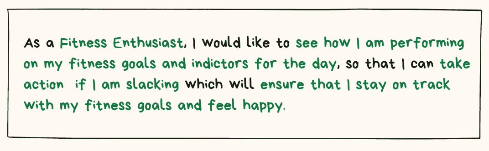

# 什么是好的仪表板——让我们通过解构来找出答案

> 原文：<https://medium.datadriveninvestor.com/what-makes-a-good-dashboard-lets-find-out-by-deconstructing-one-372988331fba?source=collection_archive---------17----------------------->

有仪表盘。此外，还有很好的仪表盘。那么，什么是好的仪表板呢？当我继续思考这个问题时，我收到了苹果手表的一个提示，说

> “普里扬卡，你怎么样了？通常，在一天的这个时候，你的活动圈会更远。去散散步”

我订婚了。我喜欢这种推动是因为它是可行的——它促使我采取行动，不管行动多么小，但如果我采取行动，我就在向前推进我的健身目标。那么我该怎么做…？

我要行动了！

让我们观察一下这个仪表板，看看它想要传达什么。

1.  它显示了一周中的每一天，我可以看到今天是星期二(很高兴知道)
2.  它显示了我一周中每天的振铃状态摘要。看起来我周一做得很好，完成了我的移动，锻炼和站立环(感觉已经很好了！)
3.  然后它把我带到今天(星期二),告诉我今天做了什么。很明显，我需要开始行动，否则我可能无法完成当天的目标。
4.  最后但同样重要的是，它显示了我一天中按小时划分的运动、锻炼和站立目标。

***总之一个干净、信息丰富、可操作的仪表盘*。**

作为一个喜欢深入事物是如何被创造的幕后的人，我决定解构这个仪表板设计的制作。让我们看看我是否接近正确。

1.  **定义一个人物角色**——我想仪表板的创建者一定是从定义一个人物角色开始的——一个虚构的角色，用来代表可能使用某个网站、品牌或产品的用户类型。一个人物角色的例子可能是这样的。

2.**了解他们的需求** —接下来，他们必须找到一些符合这个角色的用户，并问他们一些问题以更好地了解他们和他们的需求。有些问题可能是

 [## 设计隐私|数据驱动的投资者

### 我们生活在一个由技术进步和数字创新主导的时代。关于数据，这些…

www.datadriveninvestor.com](https://www.datadriveninvestor.com/2020/05/18/on-privacy-by-design/) 

*   你的一天是什么样子的？
*   你如何保持活跃？
*   你做什么来保持活跃？
*   为什么达到你的健身目标对你很重要？当你错过或完成了当天的目标时，你感觉如何？

3.**定义用户情景**——基于对上述问题的回答，他们必须想出几个用户情景，其中一个可能是这样的

4.**定义可操作的指标** —接下来，他们会将问题进一步分解成可量化的指标

*   用户想知道的关于健身的关键问题(关键性能问题)是什么？
*   我们能否定义一些指标(关键性能指标)来帮助回答这些问题？
*   他们一天中何时以及多久需要了解这些指标？
*   我们有足够的数据来满足这些指标吗？
*   为什么这个指标对他们很重要，他们会因此采取什么行动？
*   我们如何激励他们采取行动？

5.**线框和原型** —他们必须已经建立了一个原型或线框，并与几个用户进行了测试。

6.**提炼**——基于从用户如何与原型互动中学到的知识，在将这些变化纳入设计后，他们必须将这些变化发送给开发人员来构建它。

7.**构建、测试&部署**——当然，在那之后，构建、测试和部署的循环就会随之而来。

这就对了——仪表板诞生了！

我现在有答案了吗——什么是好的仪表板？在我看来，一个好的仪表板有以下特点

1.它通过与最终用户协作，始终牢记他们的需求。

2.它有足够的信息和度量来通知用户并激发行动。

3.它在轻推的帮助下与用户互动。

那么，回到我的仪表盘上——我进展如何——我达到了当天的健康目标了吗？

你打赌我做了，这里有证据:-)

## 访问专家视图— [订阅 DDI 英特尔](https://datadriveninvestor.com/ddi-intel)