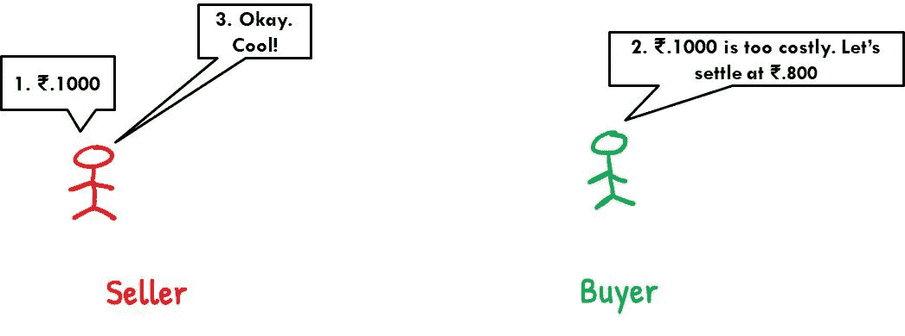

# 是什么让信实公司或苹果公司的股票波动更小？

> 原文：<https://medium.datadriveninvestor.com/what-makes-a-reliance-or-an-apple-share-fluctuate-less-d61cc553c7da?source=collection_archive---------2----------------------->

## 波动背后的经济学解释。

Photo by [Jamie Street](https://unsplash.com/@jamie452?utm_source=medium&utm_medium=referral) on [Unsplash](https://unsplash.com?utm_source=medium&utm_medium=referral)

你有没有想过为什么像 Reliance Industries Limited 或 Apple inc .这样的大市值公司的价格波动幅度较小，而小盘股或小市值公司的股价却经历了巨大的波动？

你有没有观察到“外汇”汇率波动很小，而且是有范围限制的？

在这篇文章中，我真诚地试图解读价格波动背后的经济学原理。

我们将学到两件事，

1.  为什么大公司的价格变化很快，尽管变化幅度较小？
2.  是什么导致了细价股价格的暴涨？或者为什么在糟糕的一天，它们很容易以巨大的幅度下跌？

首先要做的事情。让我们明白谁决定商品的价格？是“买方”还是“卖方”？

这个基本问题的答案是，价格是由他们两个决定的。这是因为，

1.  “买家”总是愿意以更低的价格购买任何商品。
2.  另一方面，一个“卖方”会试图以更高的价格出售他的产品。

要进行交易，买方和卖方必须达成共识。在经济学中，我们称之为“均衡价格”。

Photo by [Cytonn Photography](https://unsplash.com/@cytonn_photography?utm_source=medium&utm_medium=referral) on [Unsplash](https://unsplash.com?utm_source=medium&utm_medium=referral)

**案例 1:只有一个买方和一个卖方**

(Created by author in MS Power Point)

考虑只有一个卖方和一个买方的情况。最初，卖方在₹.1000.确定他的商品价格然而，买方认为价格被夸大了。因此，他谈判，他们共同解决在₹.800.

如果你仔细观察，你会意识到从₹.1000 到₹.800 的价格变化，这是一个巨大的价格波动。如果你做一点数学，你会发现这是一个很好的 20%的价格变化。

价格很容易就从₹.1000 变成了₹.800.为什么真的会这样？

原因很简单。只有一个买方和一个卖方。因此，这里很少有人控制价格。每当这种情况发生时，价格就会很容易发生变化。这就是我们所说的价格波动。这里的价格波动幅度会很大。

**案例二:更多的买家和更多的卖家**

现在，让我们改变现状。

(Created by author using MS Power Point)

比方说，一种商品有许多买主和许多卖主。现在卖方准备出售来自₹.的产品 1000 到₹.买方愿意购买不同于₹.的产品 990 到₹.1000.

在这种情况下，由于有许多买方和卖方，很难达成价格共识。记住一件简单的事情，只有当买方和卖方达成共识，并达成共同的价格时，交易才会发生。

 [## 金融行业如何受益于机器学习发展和人工智能|数据驱动的投资者

### 在快速变化的金融世界中做出正确的决定并抓住机会可以让你的…

www.datadriveninvestor.com](https://www.datadriveninvestor.com/2020/07/28/how-finance-sector-can-benefit-by-machine-learning-development-and-ai/) 

在这种情况下，你可以说准备在₹.购买的买方 1000 和准备在₹.出售的卖方 1000 可以成功交易。其他人必须修改他们的报价才能成功交易。当这种情况发生时，你会看到价格会迅速变化，但价格变化的 T2 幅度会很小。

现在考虑一个新的买家进入这个场景，并报出₹.的价格 800!你能想象有哪个卖家愿意在₹.卖这个新买家吗 800?如果市场上有许多买主，卖主肯定会犹豫是否以如此低的价格出售他的商品。

反之亦然。想象一个新的卖家进入这个场景，并报出₹.的价格 1200.没有买家会愿意向这个卖家购买。为什么会有人以这么高的价格购买？

总而言之，如果有许多买方和卖方，价格波动的幅度会小一些。

从这两个案例中可以观察到两个重要的东西，

1.  **价格波动的幅度**与买方和卖方的数量成反比。买方和卖方的数量越少，价格必然会以越大的幅度变化(情况 1)。然而，随着交易商品的人数增加，价格波动的幅度下降(案例 2)。
2.  价格波动的速度与买方和卖方的数量直接相关。买方和卖方越多，价格必然变化越快，尽管价格波动的幅度会越小。发生这种情况是因为当我们增加买方和卖方的数量时，价格共识将难以达成。

你一定看到了大市值公司的价格在一眨眼的时间里变化有多快。你按下刷新按钮，砰！价格已经变了。发生这种情况是因为如上所述，有太多的买方和太多的卖方，因此买方和卖方的报价变化太快。

“外汇”汇率的情况也是如此。在不到一秒的时间里，我们看到速率发生了变化。同样，你可以注意到在外汇汇率的情况下，市场比股票市场大。我的意思是，任何人坐在世界的任何角落都可以买卖外汇。这是世界上最大的市场。因此，价格必然会迅速变化，但价格波动的幅度较小。也就是说，将只有一个范围限制的运动。

但是，在这种情况下，为什么我们没有看到价格的大幅上涨呢？或者说为什么价格下跌不太深？正如所讨论的，当有这么多的买方和卖方时，一个人无法影响价格。因此，如果像我这样的小投资者购买 1 股苹果公司的股票，它的价格不会有任何变化。这是因为有数百万像我一样的买家和同等数量的卖家。

在细价股的情况下，市场资金较少。因此，如果有人买了大量的股票，价格就会突然上涨。反之亦然。供给稍有增加，股价就会跳水，全线飘红！

**进入专家视图—** [**订阅 DDI 英特尔**](https://datadriveninvestor.com/ddi-intel)