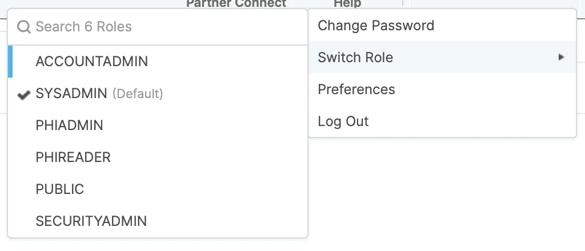
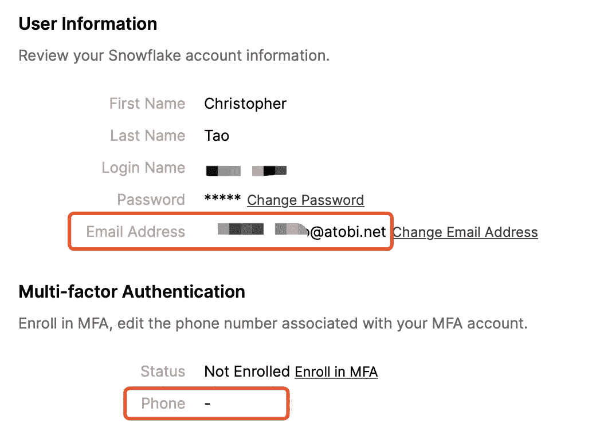
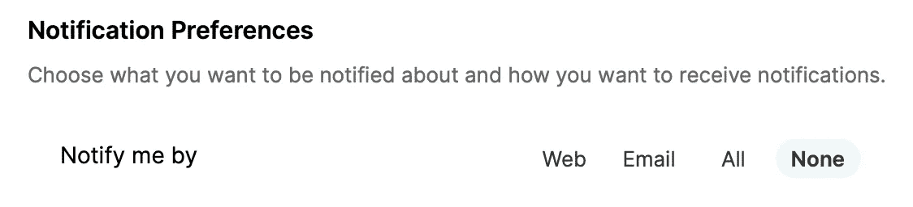
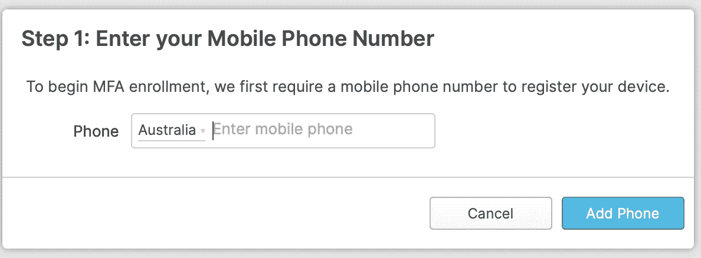
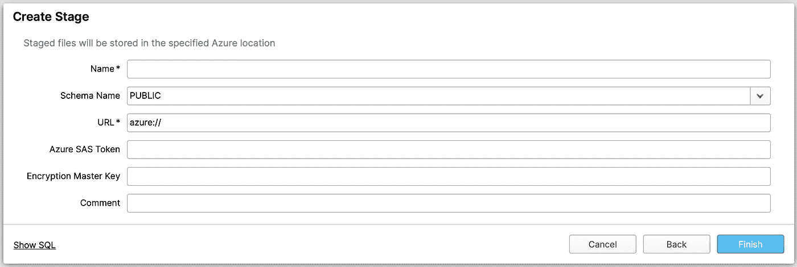

# 雪花作为“基于云”的软件，有什么不同于其他 DBMS 的地方？

> 原文：<https://medium.datadriveninvestor.com/what-makes-snowflake-different-from-other-dbms-as-a-cloud-based-software-3f21457cd78f?source=collection_archive---------0----------------------->


近年来，雪花 DB 因其创意特色越来越受欢迎。许多公司，如索尼、罗技和艺电，都是从雪花开始他们的旅程的。那么，是什么样的“特征”让雪花如此具有吸引力和竞争力呢？在这篇文章中，我将挑选一些点，使我喜欢这个数据库管理系统。我不会衡量它的性能和能力，而是将重点放在 Snowflake 的独特特性上，因为它是一个真正的“基于云”的数据库。

# 我将跳过的内容

我会跳过一些在网上到处都被说得太多的功能，比如**创意架构**、**高性能**和**定价模式**。当然，这些都是雪花引以为豪的。但是，作为一个咨询师，我见过太多在“现有”维度上互相较劲的工具和软件，没有一个能保证永远是第一。

具体来说，如果他们不是技术爱好者，大多数客户可能不会对其创造性的架构感兴趣。对于性能，没有一个流行的数据库管理系统会很差。最后，价格并不总是促使人们购买的关键因素。

因此，我在这里所做的，是试图让你知道雪花可能会让你哇的特性。此外，如果适用的话，我会将雪花与其他两个流行的基于云的 DBMS，Azure Synapse Analytics(以前的 Azure 数据仓库)和 AWS Redshift 进行比较，以了解雪花如何利用其“基于云”的图标。

# 1.开发环境的零努力


Photo by [RawFilm](https://unsplash.com/@rawfilm?utm_source=medium&utm_medium=referral) on [Unsplash](https://unsplash.com?utm_source=medium&utm_medium=referral)

雪花不是唯一的基于云的 DBMS，但它可能是唯一一个提供如此全面的 UI，支持所有流行的 web 浏览器的 DBMS。

**Azure Synapse Analytics:**
需要下载 SQL Server Management Studio

**AWS 红移:**
需要下载 SQL Workbench 等第三方 SQL 客户端

**雪花:**

不仅仅是下载管理软件。想想我们你需要在一台新机器上工作…

# 2.保留您的工作表


Photo by [Annie Spratt](https://unsplash.com/@anniespratt?utm_source=medium&utm_medium=referral) on [Unsplash](https://unsplash.com?utm_source=medium&utm_medium=referral)

我相信我不是唯一一个为了不同的目的而打开带有许多 SQL 语句的工作表的人。大多数时候，我不会关闭 SQL 客户端和我的笔记本电脑很多天，直到达到项目的一个里程碑，因为我只是不想丢失我的 SQL 语句。我知道我可以把它们保存到脚本文件中，下次再导入，但是我太懒了，重新导入这些文件也会引起一些麻烦。

有了雪花，你可以随时冷静地关闭你的浏览器标签。每当你打开这个网址，你的工作表就会一直在那里，即使你换到另一台机器，因为所有的东西都存储在云中。

# 3.改变你的角色


Photo by [Christina @ wocintechchat.com](https://unsplash.com/@wocintechchat?utm_source=medium&utm_medium=referral) on [Unsplash](https://unsplash.com?utm_source=medium&utm_medium=referral)

如果您是管理员或拥有主权限的人，您可能会经常被要求向其他用户授予权限。当使用其他 DBMS 时，您需要做好自己的工作，然后向您授予权限的用户确认资源是否已经可用。

使用雪花，只需切换您的角色，看看这个角色有什么权限。这也将让您轻松地测试您是否过度授予了权限。



# 4.SQL 语句执行历史


Photo by [Djim Loic](https://unsplash.com/@loic?utm_source=medium&utm_medium=referral) on [Unsplash](https://unsplash.com?utm_source=medium&utm_medium=referral)

在开发过程中，有时我们想看看我们以前做了什么，这并不罕见。至少我曾经为了测试的目的写了很多 SQL 语句，然后我让查询工作了，所以我删除了测试代码。但后来，我可能会意识到，我想看看我测试了什么。

有了雪花，你所有的查询历史将被保留 **1 年**。无论何时，只要你想查看你以前做过的事情，只需到历史中去找就可以了。


# 5.将通知配置为电子邮件和短信


Photo by [Webaroo](https://unsplash.com/@webaroo?utm_source=medium&utm_medium=referral) on [Unsplash](https://unsplash.com?utm_source=medium&utm_medium=referral)

作为一个基于云的数据库管理系统，雪花使它非常容易配置您的电子邮件或短信通知。

**Azure Synapse Analytics:**
邮件:请你的 IT 部门为你提供 SMTP 服务器，并为你配置白名单。然后，在邮件配置文件
SMS 中配置您的 SMTP:配置您的 Azure 操作组

**AWS 红移:**
需要创建一个 Kinesis 数据消防软管传输流，然后对其进行配置

**雪花:**
填写你的邮箱和/或电话号码。然后，启用它。



您甚至可以在 30 秒内启用 MFA(多因素身份验证)。只需提供您的电话号码，收到一个验证码，并填写回来。



# 6.时间旅行


Photo by [Jake Blucker](https://unsplash.com/@jakeblucker?utm_source=medium&utm_medium=referral) on [Unsplash](https://unsplash.com?utm_source=medium&utm_medium=referral)

这是我开始探索雪花 DB 时最 WOW 的功能。具体来说，使用标准版，您可以启用带有“时间旅行”的表，并保留 1 天的数据，无论您如何删除或更新它。有了企业版，时间旅行长达 **90 天。**

我们如何使用“时间旅行”功能？轻松点。

```
SELECT <columns>
FROM <your_table>
AT (timestamp => '<timestamp>');
```

此外，我从未在任何其他数据库管理系统中见过这样的表述:

```
UNDROP TABLE <table_name>;
```

想想其他的数据库管理系统，你需要一个全面的计划来定期备份你的数据，以防灾难恢复，然后实现自动化。您可能至少需要 1-3 名开发人员/数据库管理员来做这项工作，至少需要几周时间并进行测试。但是有了雪花，就完全没有必要了。

# 7.快速克隆


Photo by [henry perks](https://unsplash.com/@hjkp?utm_source=medium&utm_medium=referral) on [Unsplash](https://unsplash.com?utm_source=medium&utm_medium=referral)

有了雪花，你可以立即克隆一个表、一个模式甚至一个数据库，而且不占用任何空间。这是因为克隆的表创建指针(指向存储的数据)而不是实际的数据。换句话说，克隆的表只有与其原始表不同的数据。

为什么我们需要克隆一个表？

*   当你想用数据做一些实验，但又不想因为错误而伤害数据时。
*   当您想要在某个时间捕获快照中的数据时。
*   当你想得到一个表的历史的单独的副本，然后使用克隆和时间旅行！
*   当您希望与其他人共享生产数据，但不想直接访问生产数据库时。
*   等等。

# 8.与云存储快速集成


Photo by [Norbert Kundrak](https://unsplash.com/@trebron?utm_source=medium&utm_medium=referral) on [Unsplash](https://unsplash.com?utm_source=medium&utm_medium=referral)

如果你使用三大云提供商之一:Azure、AWS 或 GCP，你可以使用他们廉价的存储服务 Blob Storage、S3 或 GCS。您可以使用 1 分钟来配置您的雪花，以便能够从该存储中导入数据。



# 9.自动数据接收(SnowPipe)


Photo by [Samuel Sianipar](https://unsplash.com/@samthewam24?utm_source=medium&utm_medium=referral) on [Unsplash](https://unsplash.com?utm_source=medium&utm_medium=referral)

雪花，作为一个 DBMS，并没有被设计成一个全面的 ETL 工具，但如果你的数据摄取是如此复杂，它肯定会满足你的要求，实现非常快。

例如，如果您有另一个流程将数据从任何数据源放入云存储(例如 Azure Blob 存储)，那么您需要做的是将数据自动摄取到雪花中:

*   创建 Azure 事件网格，以便在 blob 存储中创建 Blob 时发出事件
*   在雪花中，创建一个与事件网格的“集成”(可以在一个 SQL 命令`CREATE EVENT`中完成)
*   在雪花中，创建一个 SnowPipe 来监控“集成”并设置目标表

```
CREATE PIPE <snowpipe_name>
AUTO_INGEST = TRUE
INTEGRATION = <integration_name>
AS
COPY INTO <destination_table>
FROM <blob_storage_path>
FILE_FORMAT = (type = '<e.g. JSON>')
```

然后，每当 Azure Blob 存储中创建了一个新文件时，就会发出事件，SnowPipe 会感知并运行`COPY INTO`命令将数据接收到目标表中。

如果你想了解更多，请点击这里查看我以前的一篇文章:

[](https://towardsdatascience.com/building-snowpipe-on-azure-blob-storage-using-azure-portal-web-ui-for-snowflake-data-warehouse-f0cdd7997250) [## 使用 Azure Portal Web UI 为雪花数据仓库在 Azure Blob 存储上构建 Snowpipe

### Snowpipe 是雪花数据仓库的内置数据摄取机制。它能够监控和自动…

towardsdatascience.com](https://towardsdatascience.com/building-snowpipe-on-azure-blob-storage-using-azure-portal-web-ui-for-snowflake-data-warehouse-f0cdd7997250) 

# 10.有史以来最简单的计划 SQL 任务


Photo by [Estée Janssens](https://unsplash.com/@esteejanssens?utm_source=medium&utm_medium=referral) on [Unsplash](https://unsplash.com?utm_source=medium&utm_medium=referral)

如果你想让你的 SQL 语句有规律地运行，我发现在雪花发明之前从来没有这么容易。你只需要做的是:

```
CREATE TASK <task_name>
WAREHOUSE = <warehouse_name>
SCHEDULE = <frequency (e.g.'10 MINTUE')>
AS
<sql_statement>
```

您还记得在 SQL Server 中需要如何做吗？启用 SQL 代理 Windows 服务，创建一个新任务，然后填写几页表单…

如果你愿意，你也可以使用 SnowPiple 和 Tasks 一起做一些复杂的 ETL，虽然它不是“拖放”，但你也不需要涉及一个单独的工具，它都在你的 DBMS 中。

[](https://medium.com/@qiuyujx/membership) [## 通过我的推荐链接加入灵媒-陶

### 作为一个媒体会员，你的会员费的一部分会给你阅读的作家，你可以完全接触到每一个故事…

medium.com](https://medium.com/@qiuyujx/membership) 

如果你觉得我的文章有帮助，请考虑加入 Medium 会员来支持我和成千上万的其他作者！(点击上面的链接)

# 资源

雪花建筑:【https://www.snowflake.com/product/architecture/】
T3