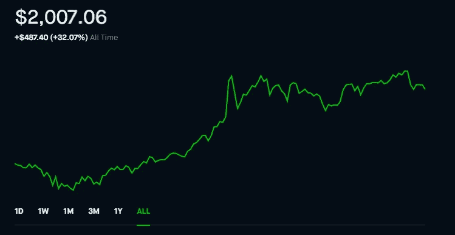
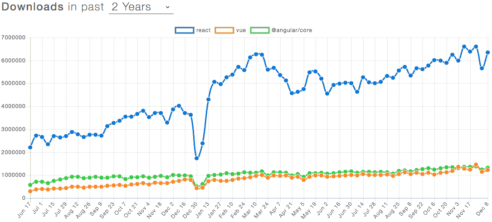
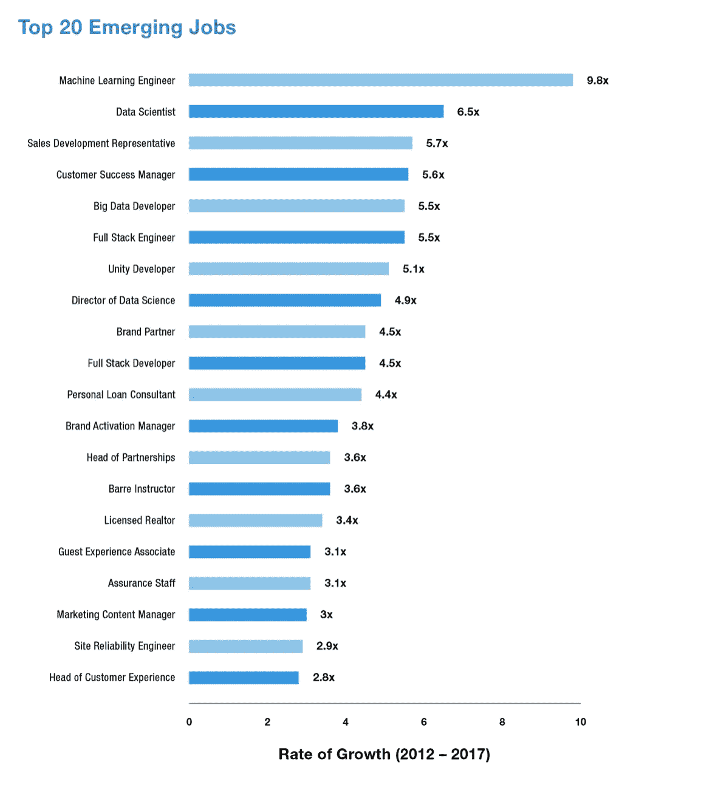

# 市场分析师忽略了脸书的什么

> 原文：<https://medium.datadriveninvestor.com/what-market-analysts-overlook-about-facebook-57fc81dc45bb?source=collection_archive---------21----------------------->

## 为什么 FB 是最好的科技股。句号。

My Stock Performance September 11, 2020\. Shoutout to the Federal Reserve

我写代码和构建工具。在我的工作经历中，我展示了我的机器学习和数学能力。我不是金融大师。我读了关于市场的书。我有投资，但我的方法很简单:购买并持有可靠的公司。没有图表，没有花时间看趋势。效果很好。现在，我将把我的技术背景和我对投资的兴趣结合起来，向你展示 FaceBook 的两个垂直领域，它们被传统的金融大师们忽视了，主要是因为无知。请继续阅读，寻找答案。

# 在分析 FaceBook 时，大家都忽略了哪些秘密

选股人在买入脸书时会指出两件事。它在社交媒体上的垄断地位(我们的关注)以及过去出色的表现。FB 管理层在识别新的社交媒体并将它们整合到 FB 巨头中方面表现出色。同时收购 IG、Snapchat 和 WhatsApp 似乎太多了，但对所有相关方来说都很好。这些都不是新的。因为这个原因，你点击了:

## 反应堆

Usage Statistics for React

React JS 是 JavaScript 上的 Facebooks 扩展。对于那些不编码的人来说，网络运行在 JavaScript 上(美国编码员称之为 JS)。JS 非常强大，有很多好处，是目前世界上最流行的编程语言。在 JS 中，我们有 3 个非常大的框架，允许程序员能够创建完整的 JavaScript 应用程序:React、Angular 和 Vue。如果你对使用报告感兴趣，请查看这个网站，但简单来说，React 是目前最流行的语言，而且还在增长。它主导了几乎所有的指标。关于 React 领先的另一个例子，请看这个整洁的图形堆叠 React 对 Vue，这是另一个 big 3 框架。

Pure Domination.

由于我主要不是一名 web 开发人员，我花了很多心思为我的在线数据结构可视化项目选择最佳框架: [datastructers.dev](https://datastructures.dev/) 。到目前为止，这是一次很好的经历。

React 也不仅仅是一个 web 开发平台。React Native 用于开发移动应用，React VR 是迄今为止最先进的虚拟现实和增强现实。这两个市场都很重要，具有巨大的增长潜力。脸书在这些领域的领先地位凸显了管理层的前瞻性和工程师的技术才华。

 [## 这么说一家大型风投基金正在投资你的初创公司？4 实际考虑|数据驱动的投资者

### 首先，恭喜你。融资总是需要努力的，一个大的风险投资基金当然是一个大的…

www.datadriveninvestor.com](https://www.datadriveninvestor.com/2020/08/09/so-a-big-vc-fund-is-investing-in-your-startup-4-practical-considerations/) 

## 机器学习研究

Look at all the areas where ML dominated

如果你住在岩石下，通过烟雾信号阅读这篇文章，机器学习是一件大事。它已经改变了许多公司和行业的商业模式，并将继续这样做。FB 非常依赖数据分析和机器学习，所以他们有大量的机器学习投资和研究也就不足为奇了。作为一个对 ML 研究非常感兴趣的人，我可以证明他们走在了前沿。他们在不同编程语言之间进行翻译的工作走在了时代的前列，证明了他们的能力。如果你想了解更多关于这篇里程碑式论文的信息，请在 Medium 和其他社交媒体上关注我。我将很快发布一篇文章来分解这份文件。为了说明大规模并购的重要性，这里有一个有趣的统计数据:根据世界经济论坛(WEF) [2018 年就业前景报告](https://www.weforum.org/reports/the-future-of-jobs-report-2018)大规模并购将创造**1.33 亿个就业岗位**。除了谷歌，脸书在所有主要科技公司中拥有最大的机器学习研究。

# 这是什么意思

简单来说:不要忽视脸书。他们不仅完全主导了社交媒体游戏，而且他们也是一家拥有出色管理的公司，将公司置于其他两个垂直领域，将保持增长。React 对于 Web 开发来说是很神奇的。React VR 是将虚拟现实带入网络的最佳工具。它就要来了。大公司已经。只要谷歌，你就会看到来自阿里巴巴的投资到达创建虚拟现实展厅。所有的大公司都在投资 VR 和 AR，FB 通过提供一个优秀的工具给自己定位很好。而且我确定我不需要把前沿 AI 的好处卖给你。这是其他公司的两个坚实的基础，但当结合脸书对社交媒体的控制以及由此引起的我们的关注，这些公司就成了极端的赚钱机器。

# 向我伸出手

请在下面留下您对这篇文章的反馈。如果这对你有用，请分享并跟我来这里。

查看我在 Medium 上的其他文章。:[https://rb.gy/zn1aiu](https://rb.gy/oaojch)

我的 YouTube。这是一个正在进行中的工作哈哈:[https://rb.gy/88iwdd](https://rb.gy/88iwdd)

在 LinkedIn 上联系我。我们来连线:[https://rb.gy/m5ok2y](https://rb.gy/m5ok2y)

我的推特:[https://twitter.com/Machine01776819](https://twitter.com/Machine01776819)

我的子任务:[https://devanshacc.substack.com/](https://devanshacc.substack.com/)

如果你想和我一起工作，请发邮件给我:devanshverma425@gmail.com

这里是 twitch 的现场对话:【https://rb.gy/zlhk9y 

获取我的内容更新-insta gram:【https://rb.gy/gmvuy9 

获得罗宾汉的免费股票:[https://join.robinhood.com/fnud75](https://www.youtube.com/redirect?redir_token=QUFFLUhqa0xDdC1jTW9nSU91WXlCSFhEVkJ0emJvN1FaUXxBQ3Jtc0ttWkRObUdfem1DZzIyZElfcXVZNGlVNE1xSUc4aVhSVkxBVGtHMWpmei1lWWVKNzlDUXVJR24ydHBtWG1PSXNaMlBMWDQycnlIVXNMYjJZWjdXcHNZQWNnaFBnQUhCV2dNVERQajFLTTVNMV9NVnA3UQ%3D%3D&q=https%3A%2F%2Fjoin.robinhood.com%2Ffnud75&v=WAYRtSj0ces&event=video_description)

**访问专家视图—** [**订阅 DDI 英特尔**](https://datadriveninvestor.com/ddi-intel)