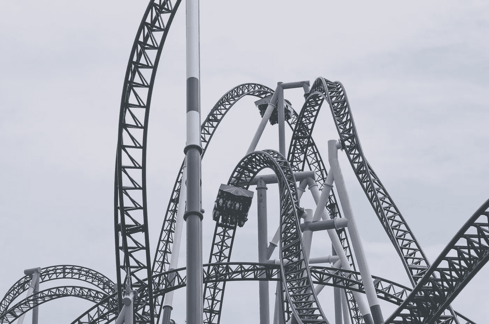

# 我在 2020 年的创业经历教会了我什么是工作(和生活)

> 原文：<https://medium.datadriveninvestor.com/what-my-2020-startup-experience-taught-me-about-work-and-life-9331f8131f0?source=collection_archive---------9----------------------->

Photo by [Priscilla Du Preez](https://unsplash.com/@priscilladupreez?utm_source=unsplash&utm_medium=referral&utm_content=creditCopyText) on [Unsplash](https://unsplash.com/s/photos/rollercoaster?utm_source=unsplash&utm_medium=referral&utm_content=creditCopyText)

我一直讨厌坐过山车。我讨厌马车停在高峰的那一瞬间——我会闭上眼睛，等待旅程结束。我不介意高度或速度，但我讨厌不知道接下来会有什么转弯或斜坡。这种期待让我焦虑。

回想过去十个月的创业经历，我仍然不相信这段旅程是如此不可预测。快速的节奏和持续的救火并不令人惊讶——我知道这些会到来。

但让我震惊的是我的心态是如何变化的。我不再担心工作的不可预测性或预见变化的不可能性。我现在睁开眼睛，举起我的手臂，向车前进的方向倾斜。

那么，发生了什么变化？我没有一夜之间获得洞察力，我的经历也不允许我更好地预见未来。我学会了以不同的方式思考——不再担心未来，而是享受旅程。

以下是我从 2020 年学到的推动这种思维转变的五条经验:

## 我不知道前方是什么，但我知道我会想出办法的。

作为一个分析型的人，我发现电子表格和定量分析令人欣慰。但是，尽管电子表格作为决策框架很好，但再多的统计工作也无法预测不确定性。

工作和生活不是平均进行的，我们好的和坏的时刻的“季节性”不会根据历史时间表表现出来。我不能模拟意外的惊喜，所以我不再试图分析它们。

相反，我只是相信我(和我一起工作的了不起的人)能够解决任何出现的问题——这对我来说足够确定了。有了这种信念，我的预测的贴现率就变成了零。

## 当手推车燃烧时，首先扑灭最近的火。

在我职业生涯的早期，一个关键的成功标准是清空我的收件箱。生产率是工作进展的唯一决定因素。但是随着我的职责范围扩大，这种方法不再可行。

解决重大挑战需要的不仅仅是生产力。它需要清晰地确定关键问题的优先次序，以及成熟的情感来承认自己的有限能力。

当所有东西同时向你扑来时，先扑灭最大、最近的火。愿意把剩下的火留给下一次，或者留给其他人。你只有一个灭火器。

 [## 旋转你的创业？4 种正确的方法|数据驱动的投资者

### 1)储备现金——在早期阶段，尤其是种子期，你有可能会一直转到找到…

www.datadriveninvestor.com](https://www.datadriveninvestor.com/2020/12/13/pivoting-your-startup-4-ways-to-do-it-right/) 

## 颠倒过来，问题就是机会。

最初几个月，我一直在努力适应在家工作的环境——我因为长时间看电视而生病，并且因为缺乏人际交往而感到情绪枯竭。

但是这些挑战也是新形式的个人和职业发展的机会。我联系了世界各地的许多老朋友(并结交了新朋友)，参加了远程全球会议，并腾出了大量时间用于阅读和写作。

虽然我对远程工作和社会距离带来的心理健康挑战深有同感，但在痛苦中徘徊对我从来没有帮助。相反，我找到了将这些挑战转化为机遇的方法。

## 融入变化。

在过去的六个月里，我的角色换了很多次，这种动态设置让我受益匪浅。每一项新的职责都拓宽了我对业务的看法，让我知道了自己的优势和劣势。

当然，这些变化让我紧张。这种不断的转变与我寻求稳定的本能相矛盾。有了新的角色意味着我要从头开始——我需要发展一套新的技能，适应新的常规。

但我并没有感到慌乱，反而很兴奋。这些变化对我的自我意识的影响在很大程度上与心态有关。我没有把这些变化看作是破坏性的，而是倾向于这些变化，看到了它们的本来面目——一个新的可能性领域。

## 享受旅程，别吐了。

这是我最重要的一课:不管你的工作有多么雄心勃勃、高尚或改变世界，不管有多少人的生计受到威胁，在你的旅程中最重要的人是你自己。

你分配给自己快乐和幸福的时间并不与你完成目标和使命的时间相冲突。相反，你的快乐和幸福是做有意义的工作的先决条件。

你的工作(和生活)是过山车，但它是你的过山车。如果你感到焦虑，并且一直蒙着眼睛，那么骑自行车有什么意义呢？设定适合你的配速、高度和复杂度。找到能给你带来快乐并让你超越舒适区边缘的设置。

如果你感到头晕，暂停旅程。出去喘口气。不要让自己痛苦；别吐了。

工作和生活的旅程令人激动，但前提是你要张开双臂，睁大双眼去经历它。

## 获得专家视图— [订阅 DDI 英特尔](https://datadriveninvestor.com/ddi-intel)