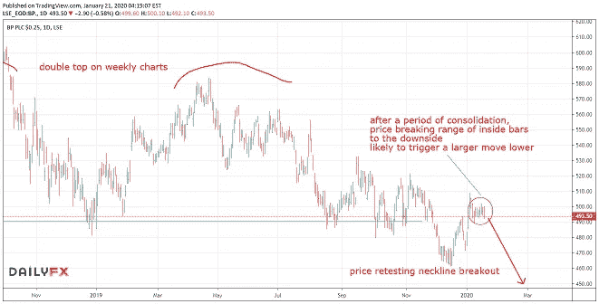
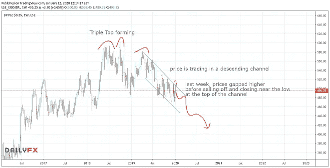

# 石油和英国石油公司现在怎么办？

> 原文：<https://medium.datadriveninvestor.com/what-now-for-oil-and-bp-847fc9858259?source=collection_archive---------13----------------------->

**本周一周交易:*空头 BP***

在[上周的本周交易](https://mangrovetrading.krtra.com/c/SwAHI2gmZUZa/kOJV)中，我分享了我的观点，任何油价上涨都应该卖出。我们确实看到了一次反弹，随后是一次跳空高开，然后是一次回跌。我希望你们中的一些人能够开始建立空头头寸。价格现在正在下跌，我预计价格会继续下跌。

我上周的主要想法是做空 BP。长期读者会知道，我不只是以市场价格卖出或买入。我等待市场用挂单来确认我的分析。上周一整周，英国石油公司都在横盘整理，所以我把我的挂单维持在最近的范围之下。

 [## 跑步摆脱疯狂:锻炼如何提高你的生产力|数据驱动的投资者

### 没有比锻炼更好的方式来开始一天的工作了。我试着一周至少做四天，在…

www.datadriveninvestor.com](https://www.datadriveninvestor.com/2018/10/23/running-to-get-rid-of-the-crazy-how-working-out-increases-your-productivity/) 

终于在本周初，我的订单被触发，我现在做空 BP。我非常喜欢这种设置，所以如果价格继续证实我的分析，我会增加更多的头寸，特别是在两周前的大周线的低点以下。

请看下面我的图表注释，包括本周和上周的周线图和日线图。

在我看来，外汇交易目前仍然缺乏机会。

记住交易是一场马拉松，不是短跑。

强行进行不存在的交易会导致亏损…

你想学习如何从市场中获得持续的利润吗？ [*点击此处*](https://mangrovetrading.krtra.com/c/2fNo0bnwiY9c/kOJV) *，我们将通过一系列免费的培训视频带您一步步了解我们的整个交易策略。*

*—*

请注意，一如既往，这不是投资建议，您应该在做出任何投资决定之前咨询您的财务顾问。我不是财务顾问，提供这些信息只是为了提供信息和教育目的。