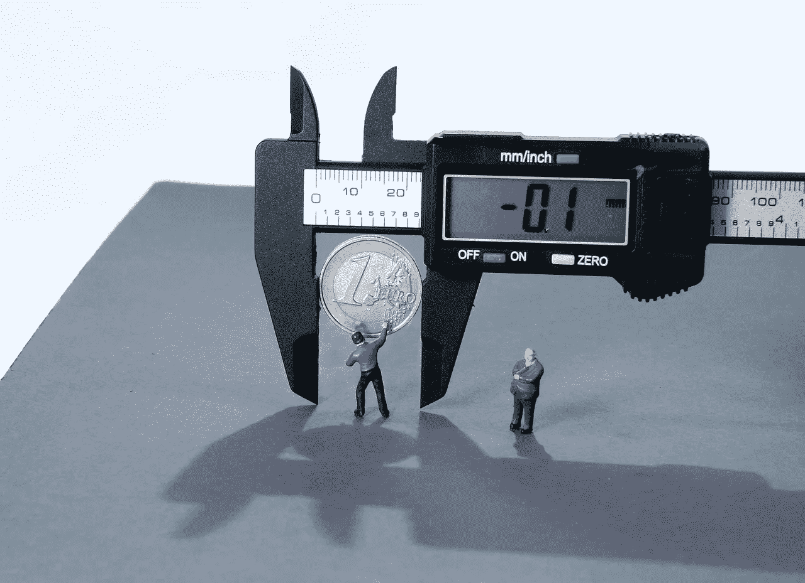

# 关于通货膨胀，哪些在线金融专家搞错了

> 原文：<https://medium.datadriveninvestor.com/what-online-financial-gurus-get-wrong-about-inflation-d7435a5f615a?source=collection_archive---------23----------------------->

为什么通货膨胀不仅仅是印钞的副作用…

Source:Needpix

这篇文章的灵感来源于 Medium 上的一个故事，一位“金融大师”呼吁人们投资他们的钱，因为通货膨胀的怪物很快就会吞噬它的价值。我无法控制自己不去评论那个故事中出现的误解，我的评论成为我在媒体上最受欢迎的出版物(好吧，这可能不是一个很大的成就，因为我是一个新作家)。

在那之后，我不禁注意到许多在线金融“顾问”提出的其他与通胀相关的建议，他们敦促人们投资自己的钱，以避免通胀。

所有这些顾问犯的错误是，他们将通货膨胀(这是经济学中最复杂的现象之一)简化为央行印钞导致的简单货币贬值。

请原谅，但如果这是真的，美国和欧盟肯定会遭受恶性通货膨胀的极端情况，因为他们的印钞机着火已经有一段时间了。

我不是金融大师；我不能告诉你如何投资。然而，我是一名经济学家，我可以告诉你一些关于通货膨胀的事情。

什么是通货膨胀，什么不是:

通货膨胀不是你持有的货币价值的损失。它是一个经济体中商品和服务价格总体水平的增长。不是你的钱贬值了，而是商品和服务越来越贵了。这些似乎是同一枚硬币的不同面，但当我们讨论导致通货膨胀的机制时，这种澄清会变得更好理解。

通货膨胀是坏事吗？

在适度的水平上，通胀是一件好事。大多数央行认为这一水平为 2%，而一些经济学家认为 4%更有意义。适度的通货膨胀是有益的，因为随着价格的上涨，公司会获得更多的利润，这使他们能够扩大规模和提高工资。然而，如果通货膨胀爆发，企业无法支付新投资的成本，也不会获得任何利润，因为消费者将会以非常高的价格购买他们生产的商品。这是通货膨胀变成坏事的时候。

央行印钞导致通货膨胀吗？

嗯…理论上，是的，但现实似乎不同意。理论上，央行印制货币，通过商业银行贷给人们进行投资(所谓投资，我们指的是工厂和生产设备等实际投资)。这些投资创造了新的就业机会和更多的收入，随着人们现在有更多的钱，他们会花更多的钱，从而通过需求法则提高产品的价格。

实际上，在过去的几十年里，新印刷的货币被用来保证金融市场的平稳运行；它很少用于真正的投资，商品和服务的价格也不会增加很多。这就是为什么央行近年来难以实现 2%的通胀目标。

此外，有许多经济学家认为，在某些条件下，现代发达国家可以随心所欲地印刷货币，而不会引发通胀(我不同意这种观点，但如果你感兴趣，可以查阅现代货币理论)。

如果通货膨胀不是对印钞的简单反应，那么是什么导致了通货膨胀？

除了印钞，通货膨胀还有很多原因。与印钞无关的几个通胀原因如下:

工资导致的通货膨胀:当工资上涨时(例如当政府提高最低工资时),整体生产成本也会上涨。这导致价格上涨。

输入型通货膨胀:当进口商品的价格高于国内商品时，国内生产者可能会试图与出口商品的价格相匹配，这也会导致价格的上涨。当进口生产设备变得更加昂贵时，也会发生同样的情况。

产品短缺通货膨胀:当商品供不应求时，它们的价格会随着需求规律的发生而暴涨，这导致了恶性通货膨胀。这种类型的通货膨胀发生在欠发达国家

你应该担心你存的钱吗？

如果你生活在发达国家，如美国或欧盟的某个地方，通货膨胀应该不是问题。现代央行有足够的经验来对抗高通胀。此外，通货膨胀就像经济活动一样，有起有落。通货膨胀时期之后是通货紧缩时期，所以价格不会一直上涨。从长远来看，为存入银行的钱支付的利率将补偿通货膨胀。我知道，在央行利率为负的时代，这可能看起来不真实，但我们在这里谈论的是长期游戏。这种情况发生的原因是，除了放贷的回报之外，你储蓄的利息通常也会补偿你预期的通胀(查阅术语“[利率结构](https://en.wikipedia.org/wiki/Interest_rate#Inflationary_expectations)”)。

总而言之，事实上你必须记住，未来价格可能会稍微高一点，但你不应该每次听到美联储或欧洲央行干预时都感到恐慌，因为通胀是一种非常奇怪的生物。你也不应该相信投资大师在网上告诉你的一切，但你应该向真正的专业人士咨询投资事宜。

感谢阅读！

*如果你觉得这个故事有用，并且你想继续阅读这样的故事，支持我提供高质量的内容，你可以关注我！*

*您也可以点击* [*将我的故事直接发送到您的电子邮箱！*](https://johnkrompas.medium.com/subscribe)

*此外，如果你像我一样是一个投资爱好者，并且希望获得强大的投资平台，并在这个过程中帮助我不断提供有趣的故事，你可以在下面的任何平台上注册:*

*(如果你想更多地了解那些平台，以及为什么它们应该成为你投资组合的一部分，你可以在这里* *阅读关于它们的* [】。)](https://johnkrompas.medium.com/50f610d8ec89)

[***自由 24***](https://freedom24.com/invite/?utm_source=referral&utm_medium=invite&utm_campaign=pfu1648424)*——顶级投资平台之一，可以低到零费用投资股票、债券、ETF 等。它还有一个存款账户，每年 3%的利息，每天支付，另外，通过这个* [***链接***](https://freedom24.com/invite/?utm_source=referral&utm_medium=invite&utm_campaign=pfu1648424) *注册后，他们会给你免费的股票。*

[***Nexo***](https://nexo.io/ref/fvx8kocnqe?src=web-link)*——最受监管的加密货币投资平台之一。赚取加密和法定货币的利息，使用您的加密获得抵押贷款，并获得第一张加密信用卡。*

[***Mintos***](https://www.mintos.com/en/l/ref/E273A9/?utm_source=mintos&utm_medium=app&utm_campaign=raf)*——或许是欧盟唯一受监管的 P2P 平台。他们最近开始将贷款转化为正式的投资工具(称为“票据”)。他们还计划在未来扩大并提供 ETF 等工具。*

[***Revolut***](https://www.revolut.com/referral/ioannilrk!MAY1-22-AR?fbclid=IwAR3P9zHusaMmGkLxPdro7q0Sp_qfBsGnJDgMq4UxY_sIuYuntmp2jBRLNcM)*——将所有其他平台集合在一起的那个。Revolut 是在投资平台和银行账户之间转移资金的最佳解决方案。他们最近成为了一家完全持牌的银行，并提供从保险和加密账户到计息存款账户(在一些国家)的各种产品。*

不管你信不信，经济学家靠喝咖啡为生。所以，如果你不想在上面的任何一个平台上注册，你可以通过 [***帮我买早咖啡来支持我！***](https://www.buymeacoffee.com/johnkro)

*(并在此过程中帮助应对气候变化，因为 1%的捐款用于碳排放！)*