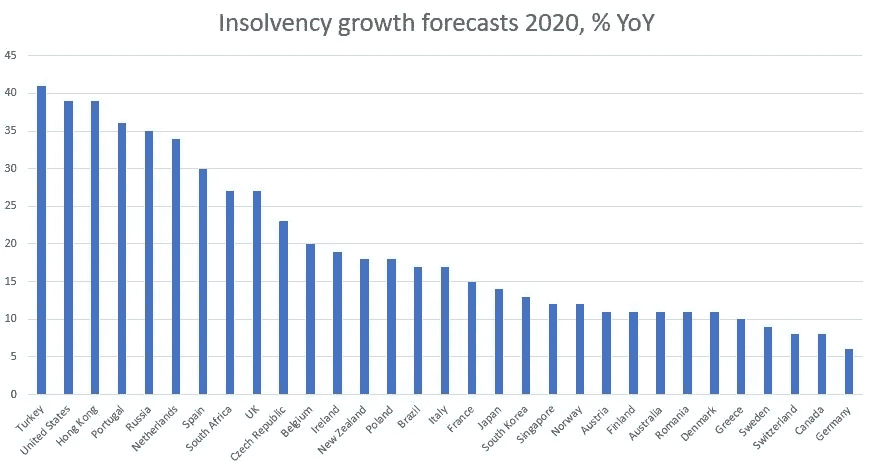

# 哪些机会会浴火重生？

> 原文：<https://medium.datadriveninvestor.com/what-opportunities-will-rise-from-the-ashes-b03dff6b61a0?source=collection_archive---------15----------------------->

## 如果过去可以作为预测，2009 年的金融危机已经指明了方向。

Photo by [Markus Spiske](https://unsplash.com/@markusspiske?utm_source=medium&utm_medium=referral) on [Unsplash](https://unsplash.com?utm_source=medium&utm_medium=referral)

很难想象这对 2020 年震惊世界的冠状病毒危机有什么积极作用。意想不到的积极影响将是很多有才华和努力工作的人的机会。以及前所未有的商业和服务改善。至少从 2009 年开始。

你有没有去过一家餐馆，对那里的食物和服务质量感到惊讶？你是否对这家公司在有时非常好的房地产市场开门营业的情况印象深刻？好吧，2020 年将会是没有人预见到的严峻考验。

2009 年的全球金融危机出乎意料地震撼了世界。在许多方面，经济影响和 COVID 危机一样迅速和灾难性。处于这场风暴边缘的是金融服务业。客户对低质量的服务、官僚作风和多余的流程感到恼火。正如 2009 年所暴露的那样，它缺乏内部控制和激励措施来保持较低的贪婪水平，这也是失败的。

金融危机是一个加速器事件。几起黑天鹅事件引发连锁反应，余波一片黑暗。仅在美国，估计就有 870 万人失业。华尔街最大的六家银行在此期间裁员近 8 万人。一些百年金融机构破产了。一些公司不得不重组合并。许多银行被认为太大而不能倒闭，并得到了政府的救助，止住了更严重的流血。在消费者方面，许多客户的不满情绪高涨，其中大多数是中小企业和个人。媒体揭露了那些已经提供了糟糕服务的机构的贪婪和自私。舞台已经搭好了。

随之而来的是才华横溢的年轻失业者和充裕的资本的不太可能的结合。许多投资者对将资金投入同类资产变得谨慎起来。刚刚从看似“安全”的投资中恢复过来，加上对传统机构的高度不满，现金充裕的投资者开始寻找投资选择。与此同时，市场上到处都是才华横溢、努力工作的年轻人，他们正在寻找机会。许多人对传统职业不再抱有幻想。其他人则被他们自以为拥有的虚假稳定所伤害。一些人把他们的职业生涯带到了不同的一页:企业家精神。

 [## 安全:很好(尤其是对企业家而言)，只要安全完成|数据驱动的投资者

### 未来股权的简单协议，或 SAFE，是越来越受欢迎的融资工具，特别是在…

www.datadriveninvestor.com](https://www.datadriveninvestor.com/2020/10/11/safe-great-esp-for-entrepreneurs-as-long-as-done-safely/) 

过去十年，所谓的金融科技(FinTechs)出现了增长。这些公司利用技术和对消费者的强烈关注来创造更好、更快、更安全的产品和服务。一个例子是前雷曼兄弟员工尼古拉·斯托龙斯基(Nikolay Storonsky)创建的金融科技独角兽 Revolut。前银行员工还创建了其他公司，如 MarketInvoice、Trumid、Zopa 和肉豆蔻。那些不是由失业员工建立的公司仍然吸引了大量的劳动力。对金融科技的投资从 2010 年的 90 亿美元增加到 2019 年的 1350 亿美元。2010 年有 282 家金融科技公司成立。2014 年这个数字是 668。创始人在车库里建立了这些公司，承诺在银行和资本市场等传统领域改革百年机构。这是一个经典的大卫对抗歌利亚的故事。

他们改变了市场。现实是，开立一个银行账户从来都不是那么容易和简单的事情。像巴西 Nubank 这样的公司正在把门槛推得更高。以前，进行简单的交易需要很多官僚主义和努力。如今，只需点击几下按钮。抵达阿姆斯特丹的外籍人士可以看到展示他们五颜六色的 Bunq 卡。原因是 Bunq 把一个痛苦的过程，像在外国开户一样，变得极其容易。荷兰等地拥有快速系统，可以使用二维码进行在线支付，并通过 WhatsApp 拆分账单。像谷歌和苹果这样的竞争者加速了一切，传统机构也适应了。进行日常交易甚至投资中国 ETF 从未如此容易。消费者和社会最终会从中获益。

这和 COVID 危机有什么关系？同样的完美风暴正在餐馆、酒店和旅游行业上演。如果你曾经去过巴黎的一家旅游陷阱餐厅，并支付了比法式焦糖布丁更高的价格，那么你很有可能再也见不到这家餐厅了。随着许多大城市长期缺乏旅游业，留下来的企业是那些有能力吸引当地人的企业。以及那些提供高于平均水平的产品和服务质量的公司。平庸不再有容身之地。

结果是，市场将很快结束那些没有投资于公司专业化和组织账户的企业。对于那些不打算预测未来收入或过度举债的公司来说，已经没有空间了。那些没有把钱从所有者和公司中分离出来，也没有做一个可靠的现金流控制的人将没有空间。那些创造了专业环境的人的胜算将会大大提高。市场将更青睐那些投资于改善劳动关系、流程、惯例和控制的公司。

这场金融危机有着决定性的不同。尽管许多银行和机构得到了政府的救助，以避免系统性风险，但对中小企业来说，这样做的动力就没那么大了。严酷的现实是，除了航空公司，没有多少会直接被救市。其结果将会给业主带来更大的压力。那些不努力的人将会被加速淘汰出市场。企业会倒闭，员工会失业。咨询公司预计，土耳其的破产率将同比上升 41%，美国上升 39%，葡萄牙上升 36%，西班牙上升 27%。2021 年的情况甚至更糟，西班牙的破产率预计将增长 44%。

Image by: Author; Source: [Atradius](https://group.atradius.com/publications/economic-research/2020-insolvencies-forecast-to-jump-due-to-covid-19.html)

从世界末日的场景中，我们看到了希望。这里的一个是，我们将会看到与 2009 年类似的影响。前雇员将组织下一次工业革命。从失败企业的废墟中崛起的将是新一代的企业家。人们满脑子都是想法和才能，但口袋里总是缺少资本。生产线上的厨师用创新的方法烹饪被业主拒绝的食物。这场危机将成为许多有创造力和勤奋工作的人所需要的推动力。这些人将获得一个非凡的资本场景。投资者现在坐拥流动性，并积极寻找人才来掌舵这些行业。

投资者和有才华的员工将有大量机会以折扣价购买资产。现在很多专业配备的厨房都是空的。同样，设备齐全的酒店也在努力开门营业。市场已经在推动许多房屋被前所有者折价出售。下一个伟大的餐馆老板可能是一个失意的厨师，在一家低于平均水平的餐馆里有着伟大的想法。流动性和人才的结合将确保这些在未来得到很好的利用。

希望受益的还是消费者。更好的餐馆，有更好的服务和食物。改进的酒店床位、清洁和舒适度。更少的旅游陷阱和臭虫。全球金融危机非常严重，其影响使经济陷入瘫痪。然而，一些积极的结果是一个新的和不断增长的部门的加速发展——酒店业是下一个目标。

黎明前总是最黑暗的。虽然黑暗的日子还在前面，但期待一些光明的日子并没有坏处。

## 访问专家视图— [订阅 DDI 英特尔](https://datadriveninvestor.com/ddi-intel)