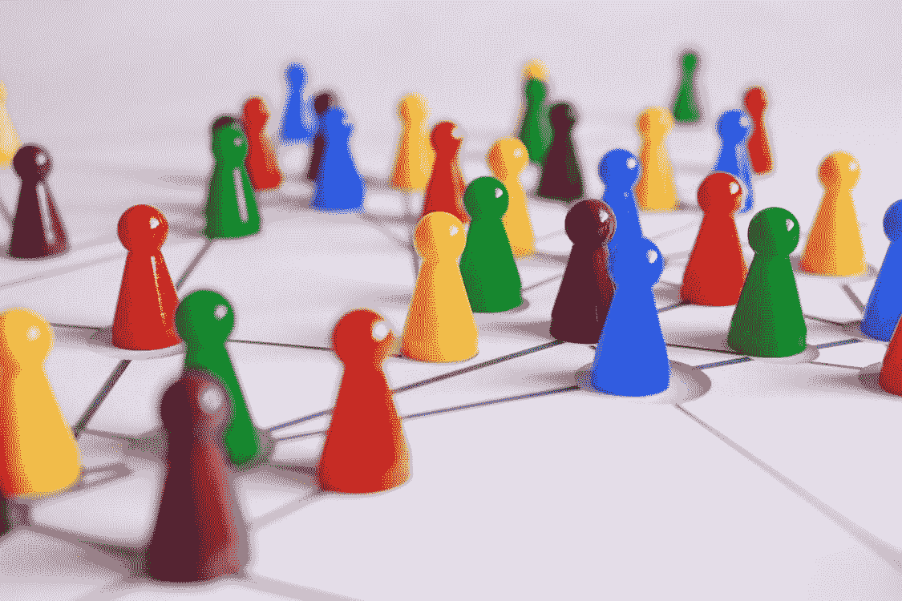

# 区块链还隐藏了哪些王牌？

> 原文：<https://medium.datadriveninvestor.com/what-other-ace-has-the-blockchain-hidden-d6c0c98fa6e3?source=collection_archive---------11----------------------->

区块链被正确地认为是“下一件大事”。因为它预示着一种新的经济秩序，在这种秩序中，公司被去中心化的网络所取代，在线平台成为公共财产。

2009 年初，当中本聪在 P2P 论坛上介绍比特币时，他写道，传统货币的核心问题是让它运转所需的信任。对央行、银行、支付服务提供商等的信任。通过比特币，他展示了一种不再需要信任的替代货币。

甚至连 Satoshi 自己也可能没有忽略他的发明的后果。通过成功开发一种不再需要信任的货币系统，Satoshi 为商业创造了一个新概念:没有组织的经济或没有所有者的组织。没有信任，就没有权力。比特币通常是作为一种资本主义工具出现的。但它的技术核心指向一场和平的社会主义革命，从系统中消除信任、权力和统治的可能性。

 [## 数字货币、区块链和货币的未来|数据驱动的投资者

### “区块链”、“加密货币”、“令牌化”，以及现在的“央行数字货币”已经成为…

www.datadriveninvestor.com](https://www.datadriveninvestor.com/2020/02/18/digital-currencies-blockchain-and-the-future-of-money/) 

从本质上讲，区块链是一个去中心化、不可信的信息处理系统，看起来既不操纵也不黑客，不属于任何人。有了区块链，人类历史上第一次，平台和服务属于每个人。没有企业家，没有公务员，没有黑手党。只是没人和所有人。

# 没有国王，就没有权力

马克思主义者、社会主义者、共产主义者和无政府主义者都想从资本家手中夺取生产资料。当这种情况发生时，国家就成了生产资料的所有者。社会主义者的悲剧性错误是混淆了国家和公民，所以他们没有预见到国家会简单地成为新的资本家，剥削工人，形成逐利脑积水，行使权力。到革命结束时，社会主义者在绿色中有同样的剥削权力关系。也许更糟。

另一方面，区块链不会引发一场用一个国王取代另一个国王的革命。它将国王从系统中移除。删除。不仅仅是在角色上，而是作为一种可能性。所有归档、核实、认证、许可、专利和提供信息的公司和机构都受到了区块链变革的影响:记录土地权利、记录婚姻、授予专利和发放身份证的办公室；证明版权的律师；核实合同和密封遗嘱的公证人；验证股票交易的经纪人，出售东西或人们聚集在一起的平台…

区块链可以在信息得到安全管理的任何地方使用。

通常，分层的集中式组织管理和验证信息。这样的组织有办公室，里面坐着一大群工人，他们的劳动力由上级捆绑和组织。利润通常被“向上”传递，由所有者、股东或政府部门攫取。这种系统通常足够有效，但往往会带来令人不快的影响:在管理层形成水头，吞噬掉越来越大的一部分利润，因此费用高得不必要，员工收入低得不必要；腐败的官员滥用他们的权力来获取个人利益。

亚马逊(Amazon)和 Co .等市场利用其市场力量，通过收取费用将经销商的利润空间降至最低，围绕音乐的许可权和分销渠道最终让艺术家们几乎两手空空。诸如此类。中央集权制当然不能说是完美的。

# 完全透明，完全开放，完全廉洁

所有这些疾病和缺乏症状都是“45 厘米误差”——人类行为——的症状。人类是一种奇妙的生物，但他很少知道如何抵制权力的诱惑。当一个陌生人的经济利益与你的冲突时，信任他是一场危险的游戏。虽然有许多保障措施来支持信任——指导方针、透明政策、道德准则、紧密交织的员工监督网络、反腐败法规等等——但建立信任的方法并不缺乏。但所有这些措施都只是在短期内有所帮助，因为人性总会找到获胜的方法。

区块链通过消除它们的原因:人的因素，消除了所有这些症状。它用平等参与者的分散网络取代了由人领导的组织，这些参与者只遵循协议的规则。就其本身而言，区块链只不过是一个数据库，通过志愿矿工网络每隔几分钟进行一次自我控制。矿工逐块验证信息，并在网络中共享，每个参与者都使用相同的区块链。然而，只有那些遵守协议规则的人才能参加。

区块链是完全透明的，因为每个人都可以以原始形式获得存储的信息。它是完全开放的，因为没有人能阻止任何人的参与，而且它是完全不腐败的，因为没有人能操纵信息。曾经储存在区块链的东西永远留在那里，不可改变，对每个人都是可见的。

区块链完成了许多公司的任务——而不是一家公司。区块链不属于任何人，也不属于任何人，就像一抹夕阳。它们是互联网上的全球公益物，完成一定的任务，就像村庄外围的一片草地，属于所有村民，其苹果树为所有人结出果实。可能目前正在为一种新的经济形式奠定基础，在这种新的经济形式中，几个机构作为占有网络，成为所有人的财产。换句话说——一个比迄今存在的任何历史上的社会主义都更加社会主义的经济。

正如我所说，比特币是区块链的第一个应用:这种货币没有国界，没有政治，没有银行，没有人与人之间的差异。这些钱既不受资本主义银行的控制，也不受渴望权力的国家的控制，而是就在那里，就像互联网的基本服务一样。其他数字货币——替代硬币——也使用区块链，使区块链成为普遍可用的货币创造工具。

# 云存储、身份证、许可证、市场——以分散的方式，一切皆有可能

然而，区块链对经济的真正革命还在后头。数十家初创公司已经在致力于此。这里有几个例子

存在证明，以及 **Blockchainme** ，让验证区块链中的一个文档， **Bitnation** 试图提供所有通过区块链去中心化的信息化政府服务，而虚拟公证人验证任何想要的信息。

另一方面，亚历山大项目希望在区块链中存储无限量的信息， **Siacoin** 和 **Storj** 将成为区块链运营的云存储。

Factum 希望通过区块链管理土地权利。

**OpenBazaar** 是一个类似亚马逊的市场。基于区块链的产品在这个平台上销售。

**比如占卜**，就是一个完全去中心化的预测市场。

正如我所说的，这只是几个例子。所有这些事情，如果成功的话，未来都可以想象成不是由公司运营，而是互联网固有的服务。

# 连锁互联网的黎明

越来越多的人对这一愿景着迷:歌手伊莫金·希普希望区块链将永远改变音乐行业。桑坦德银行的分析师确信，区块链将改变金融的无数方面——从国际转账到证券结算，再到银行间转账的结算。似乎很多人已经开始意识到区块链的潜力。

未来的互联网可能是一个区块链的联盟，它像企业一样运作，但不是，跨越国界，为每一个目的量身定制，并提供一个基础设施，它是网络的一部分，就像氧气是空气一样。使用区块链无需注册；没有人会拥有区块链，也没有人能让区块链“消失”。社交网络、市场、众筹平台、拼车、流媒体门户、维基百科——在未来，所有这些都不再存储在服务器上，由某些人或团体管理，而是可能作为区块链成为互联网自然基础设备的一部分。

有了区块链，信息的处理变得独立。它摆脱了人类的控制，留下了信任某人的必要性。因此，它成为真正意义上的共同利益。

我在每月一期的 [**简讯中分享了更多私密的想法，你可以在这里**](https://mailchi.mp/bf8f8e8ed697/keep-in-touch-with-lukas) 查看。请在评论中告诉我，并在各种社交媒体平台上加入我:

[**推特**](https://twitter.com/WiesfleckerL)●[**insta gram**](https://www.instagram.com/lukaswiesflecker/)●[**脸书**](https://www.facebook.com/lukaswiesfleckerr)●[**Snapchat**](https://www.snapchat.com/add/luggooo)**●[**LinkedIn**](https://www.linkedin.com/in/lukas-wiesflecker-1b11251a5/)**

**无论你做什么，都要带着爱和激情去做！**

****访问专家视图—** [**订阅 DDI 英特尔**](https://datadriveninvestor.com/ddi-intel)**