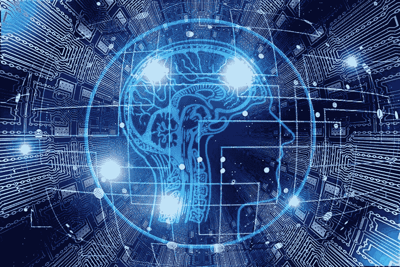

# 是什么阻止了 Neurotech 做大？

> 原文：<https://medium.datadriveninvestor.com/what-prevents-neurotech-from-going-big-ef5b56849ea5?source=collection_archive---------0----------------------->

正如它通常发生在源于具有鼓舞人心的最新进展和突破的新兴高前景科学领域的行业一样，神经技术达到了似乎所有基本发现都已完成、特定技术都在改进的阶段，然而，尽管创业公司和投资量的数量巨大且不断增长，但没有大众市场用户友好的产品和企业至少为 IPO 做好了准备。通常来说，神经科技仍然是一个棘手的问题，市场仍然受到相当低的销量、产品可扩展性的巨大挑战、相对较低的收入和利润率以及医疗保健类公司严峻的商业环境的困扰，原因有很多。

尽管在过去几年中神经科学已经取得了令人印象深刻的成就(包括 Neuralink 最近的一次演示)，但由于普遍缺乏对产品的认识或昂贵的 R&D 成本，没有一家基于新型高前景应用的成功创业公司能够进入大众市场。此外，神经技术产品的 R&D 和专利保护成本仍然非常高，因此，只有能够资助 R&D 和新产品开发的公司才能将其产品推向市场，至少是那些基于客户的销售额高的公司。此外，市场对新技术的接受速度很慢，许多神经科技初创公司现在才开始向客户提供产品，并获得适度的收入。

作为一名风险投资分析师和顾问，我遇到过许多欧洲神经科技风险企业，研究他们行业特有的困扰他们成长的问题。尽管医疗神经技术业务的障碍很简单(临床试验的困难和无法证明临床结果)，但非医疗设备的发展由于相当混杂和独特的一系列问题而受到限制。这类似于 90 年代的手机市场:每个人都认为它很酷，几乎每个人都买得起，但产品只是不够方便和有用，以至于想买。

当然，问题可能因分部门而异。比如说，对于脑机接口来说，主要的限制因素是它们日常使用的不便以及在许多情况下的侵入性要求。对于神经调节，这是安全和伦理问题。然而，许多问题或多或少与每个神经技术分支直接相关。让我们更详细地讨论它们。

1.数据保护和神经伦理学。

欧洲的数据保护法比美国更严格，这大大减缓了该地区神经科技初创公司的发展。此外，还有进一步强化法律的尝试和建议(何晓乐，2020)。

监管一直是该行业的一个限制因素，但 2019 年给了我们一些希望。2019 年 3 月，食品药品监督管理局向神经技术的未来迈出了关键一步，发布了美国食品和药物管理局的神经生物学行业指南，以开发创新的脑机接口设备，这可以刺激对神经生物学创业公司的投资浪潮。

FDA 专员斯科特·戈特利布医学博士在新闻稿中说，“假肢可以与大脑互动的想法一直是许多想象的主题，但现在我们实际上即将实现这个机会。FDA 扮演着重要的角色，它为开发者指明了如何抓住这一前景并推进新设备开发的道路。''

这是一个好消息，然而整个神经技术领域仍然没有被立法者所关注。越来越多的关于神经伦理学的学术论文超过了营销研究本身，这表明对于什么是允许的和合理的，仍然没有达成共识。

关于神经技术有两个广泛的、重叠的担忧。第一个是关于安全:如何验证和监管神经技术的安全和道德使用？第二个问题是，在临床环境中，神经技术最重要的问题可能是什么:如果它失败了怎么办？如果神经假体不起作用会发生什么？这两个问题密切相关:对神经技术研究方法的严重监督可能会导致公众对新神经技术治疗益处的强烈反对，因为它将被用于治疗不代表一般人群的个人。与此同时，神经技术在临床上的失败必然会破坏整个技术的可信度。为了避免这些“疫情”情景，神经技术初创公司需要开发和采用严格的安全监控，与监管机构建立信任，并加强公众对神经技术的信任。

2.设备的便利性。

或者仅仅是人体工程学。神经感觉设备可能已经足够发达，可以在通信、游戏和学习中使用，但除非它们像智能手机一样简单舒适，否则期望客户大量采用它们是幼稚的。

目前，在神经传感器设备的质量和其人体工程学之间有一个非常强的权衡:精确的神经传感器和神经刺激器又大又重，并且具有侵入性。这是应该改变的。具体来说，对于最重要的神经技术，如 EEG 或 fMRI，由于其灵敏度的指数增长，这种权衡应该在未来 5 年内消失。我们已经可以看到这一点的开端:脑电图正在变得更小，小型化和便携，小型化的神经刺激器应该能够生产出尺寸和重量合理的皮肤设备。

3.设备与 IT 基础设施的分离。

每个神经技术设备都应该作为物联网的一部分来生产和销售——否则，它的潜力将永远无法释放。此外，这种设备首先可以作为现有软件和网络产品的补充。最先进的神经传感器，如果没有一个与普通互联网深度融合的平台，就会像没有 AppStore 的 iPhone 一样。目前，既不存在用于神经科技软件开发的集中环境，也不存在神经科技软件产品的大众市场客户平台。尽管我们可以观察到致力于增强现实的整个应用市场，但没有 neuroapps 的迹象。这凸显了工具集的重要性，它可以引领我们走向神经技术革命。这将是一个跨学科的工具，包括硬件(成像、神经技术设备)和软件(神经技术硬件的软件等)的应用。).一个平台可以取代软件开发的僵化过程和困扰我们当前神经技术市场的特定产品变化。

这给我们带来了下一个结论:理想的神经技术设备集成到您的手机中。大概，我们离这个点还有十几年。在现有应用平台的框架内组织神经技术软件的开发要比从头开始容易得多，但有一个明显的缺点:我们需要等到神经设备变得非常小，可以成为智能手机的一部分。

当然，neurotech 与 IT 的整合并不仅限于在软件平台中建立 neurotech 部门。Neurotech 在与各种现代炒作 IT 趋势的融合中激发了潜力，特别是机器学习和人工智能、虚拟和增强现实以及大数据。所有这些技术，结合丰富的数字化神经数据流，可以产生完全意想不到的协同效应和产品。

长话短说:如果没有软件平台、人工智能和网络，神经科技设备就不是用户友好的科技产品，而是医疗或科学工具。

4.无法接触到客户。

人们不知道他们为什么需要它，因为他们没有通过使用神经技术设备获得益处的例子。并且更多的人没有如预期的那样使用 neurotech 设备，这导致了 neurotech 设备的实际应用的进一步限制。这可以被认为是一种网络效应:产品的实际或感知效用随着消费者数量的增加而增加。在休闲生活中，神经科技设备的效用应该在某些部门、地区或者至少是集群中得到清晰的展示。想想看，我们应该关注两个主要的利益来源:休闲和生产力。

5.技术发展水平不足。

很琐碎，但是应该说！例如，许多神经刺激设备确实有用，并为客户增加了一些价值，但这种价值不足以让他们关心这些产品。我们需要完整的语音和图像识别，而不是部分识别。我们需要“群体智慧”，而不是“半群体智慧”。当思想以与普通互联网兼容的质量传输时，大脑网络起作用。

在广泛描述的所有这些问题中，最常见和最普遍的具体问题是:

- *缺乏人体工程学；*

——*缺乏伦理安慰的顾客；*

——*受众少，结果缺乏网络效用；*

- *安全问题；*

- *数据保护障碍。*

基于以上概述，我得出以下 7 个特征，每个非医疗神经技术产品都应该具备这些特征才能在 IT 层面上进入大众市场:

*1。* *无创性。*

*2。* *安全。*

*3。* *机动性强。*

*4。* *人体工程学。*

*5。* *数据保护。*

*6。* *交互性。*

*7。* *联网。*

话虽如此，还是要说一些重要的话。

移动性和非侵入性是必不可少的，不仅为客户提供便利，而且不会让人认为该技术“不自然”，是对人性的一种尝试。焦点小组研究清楚地表明，表面上的“不自然”会导致产品被拒绝的可能性大大增加。

安全的定义不仅包括遵守使用条款时使用设备的安全性，还包括不能因误用设备而受到伤害。

大多数数据保护问题无法在启动阶段解决，需要权威机构的帮助。在我看来，这可能会成为主要的障碍，因为立法者现在似乎并不热衷于挖掘神经技术，我们有许多行业发展因监管(或监管缺失)而停止的先例，特别是在生物技术领域。

谈到休闲、营销、认知增强甚至交易的神经技术，我们不应该忘记，主要的神经技术市场是医疗保健市场，神经退行性疾病患者的需求将在很长一段时间内仍然是主要的行业驱动力。这一领域的成功很可能会导致非医学神经技术的进步。然而，在所有生物医学领域中，神经退行性疾病领域仍然是对风险投资者最没有吸引力的领域，因为即使对于这样一个不可预测的行业，风险也非常高。缺乏对生物医学神经技术的投资和缺乏进展之间存在正反馈。问题是:我们是否需要打破这个非医学神经技术发展的循环？

投资者希望被一些成功的故事说服，这也是事实。很有可能，一只独角兽就足以开始大规模吸引该行业的机构资金。

神经技术创新将是未来经济和技术革命的重要组成部分。神经技术从学术界的一个新奇事物，现在已经成为一个充满机遇的蓬勃发展的行业。对欧洲来说，现在是时候从该领域的早期先驱转变为具有影响力的参与者了。

**参考文献**

Bhattacharyya，r .，Coffman，B. A .，Choe，j .，& Phillips，M. E. (2017)。神经技术能产生更好的大脑吗？。计算机，50(2)，48–58。

卡沃托，J. (2002 年)。神经技术市场。医疗营销杂志，2(3)，263–274 页。

Cavuoto，J. (2018 年)。神经技术市场:2018-2022 年。神经技术报告，1。

伊顿，M. L .，& Illes，J. (2007)。认知神经技术的商业化-伦理领域。*自然生物技术*， *25* (4)，393–397。

Forlini，c .，Lipworth，w .，Carter，a .，& Kerridge，I. (2019)。超越繁荣:神经技术市场的交叉使用和利益。工作神经科学，10(4)，178–180 页。

Garden 和 d . Winickoff(2018 年)。神经技术管理中的问题。

Garden，h .，Winickoff，D. E .，Frahm，N. M .，& Pfotenhauer，S. (2019)。神经技术企业的负责任创新。

Ienca，M. (2019)。认知技术的大众化:一种积极的方法。伦理与信息技术，21(4)，267–280。

Ienca，m .，& Vayena，E. (2019)。直接面向消费者的神经技术:它是什么，有什么用？。

Ienca，m .，Haselager，p .，& Emanuel，E. J. (2018 年)。人才流失和消费者神经技术。自然生物技术，36(9)，805–810。

Karpova，S. V .，& Rozhkov，I. V. (2019 年)。神经营销技术在金融市场中的应用研究。《数字社会中的技术与企业家精神国际会议论文集》(TEDS)(第 126-129 页)。

Kreitmair，K. V. (2019 年)。直接面向消费者的伦理神经技术的维度。工作神经科学，10(4)，152–166 页。

Maiques，a .，& Illes，J. (2019 年)。大脑刺激的伦理考虑:行业观点。*脑刺激:神经调节的基础、转化和临床研究*， *12* (2)，591。

s .何晓乐、k .麦克吉利布雷、s .阿金托耶、t .福瑟吉尔、c .布布利茨和 B. C .斯塔尔(2020)。欧洲数据保护法规是否足以处理与神经技术相关的新兴数据问题？。

医学博士罗宾逊(2019)。金融化如何塑造神经科学、转化医学和生物技术创新。麻省理工出版社。

j . talan(2018 年)。神经技术:神经刺激策略拯救功能网络和恢复记忆。*神经病学今日*， *18* (5)，19–20。

j . talan(2018 年)。神经技术-神经成像:机器学习算法能帮助分类急性神经事件吗？。今日神经学，18(21)，1–21。