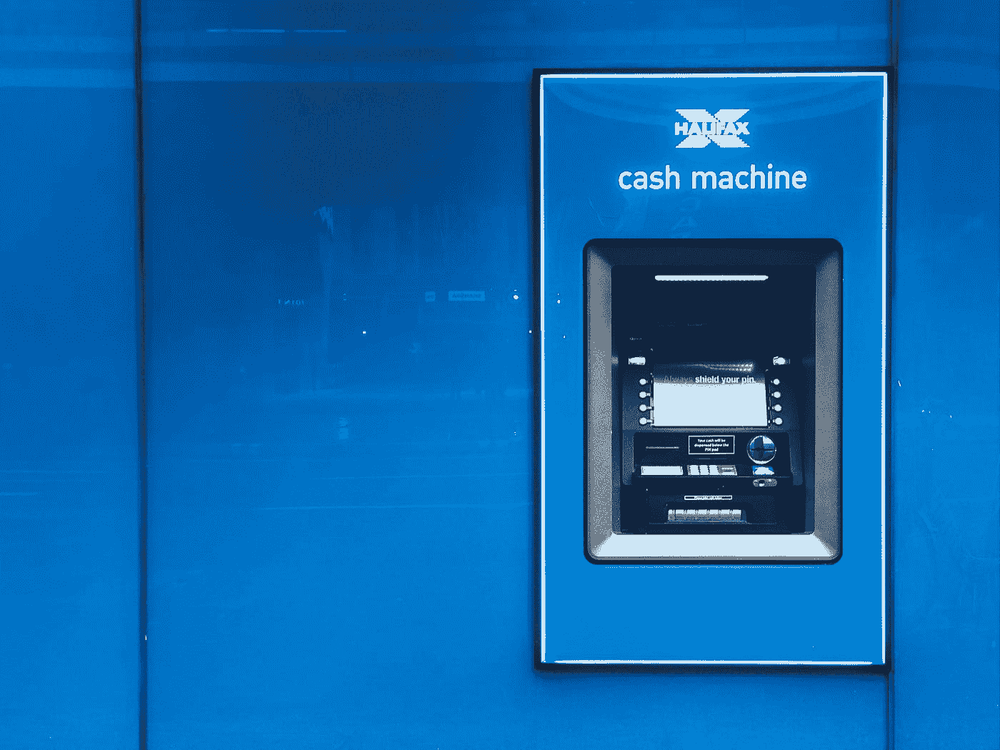
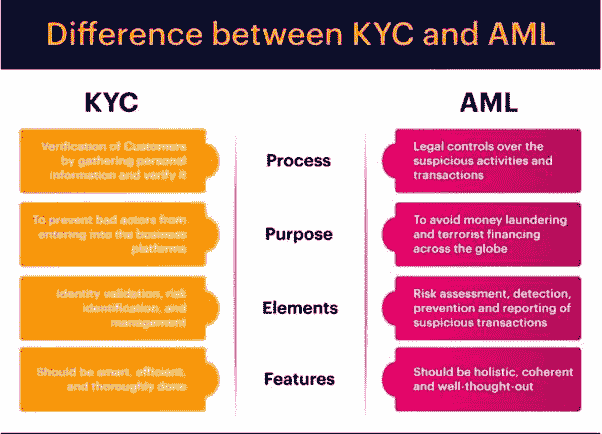

# 数字货币和数字资产交易者面临哪些问题？

> 原文：<https://medium.datadriveninvestor.com/what-problems-do-digital-currency-and-digital-asset-traders-face-bd0b63ae023e?source=collection_archive---------10----------------------->

数字货币个体交易者错过了有利可图的交易机会，因为他们缺乏工具、时间，在很多情况下还缺乏技能。而且，随着新的数字交易所和数字令牌类别的推出，控制、选择和有效的投资组合管理实践的障碍与日俱增，情况只会变得更糟。

# **银行业**

当涉及到市场交易时，无论是数字证券还是货币，无缝银行体验的必要性对于充分利用交易机会至关重要。与银行打交道并不是最令人兴奋的经历，但找到一个好的银行来管理你的钱与正在进行的交易一样重要。当使用数字交易所进行交易时，交易者必须考虑存款和取款的相关流程，包括大多数情况下的外汇汇率。

一般来说，在通过 KYC/反洗钱检查之前，每个交易所的交易员都有存款限额。还有一个事实是，如果他们居住在一个交易所不支持的国家，他们将被要求以该交易所接受的货币开立一个银行账户。这一过程可能非常繁琐，并可能导致被收取昂贵的费用。另一个主要问题是结算时间。全球每个司法管辖区都有自己的银行和结算网络。有些人比其他人更好，重要的是要明白，你可以从任何地方等待 10 多天才能收到资金。

 [## 总部位于瑞士的 ETP 进入加密交易市场|数据驱动的投资者

### 虽然金融市场几乎没有沉闷的时刻，特别是在引入…

www.datadriveninvestor.com](https://www.datadriveninvestor.com/2019/03/10/swiss-based-etp-enters-the-crypto-trading-market/) 

用法定货币和数字货币进行交易的能力是截然相反的。fiat 需要像银行这样的中介来发起和处理交易，而数字货币的交易是即时的，不需要中介来促进交易。无边界支付和 24/7 即时结算的自由在当前的法定货币转移系统中根本不存在。

Photo by [Kolar.io](https://unsplash.com/@jankolar?utm_source=medium&utm_medium=referral) on [Unsplash](https://unsplash.com?utm_source=medium&utm_medium=referral)

# 投资和交易

每次交流都不一样。当交易者在寻找投资机会时，有时很难在正确的时间找到它们。当他们找到这些机会时，如果不需要学习全新的平台或软件来参与市场，就很难足够快地抓住机会并加以利用。

虽然技术在不断发展，但交易者几乎需要计算机科学学位才能使用现有的服务，因为许多这些平台是为具有复杂功能的专业交易者设计的。

另一个至关重要的因素是，当决定进行哪种交易时，关于任何数字货币或资产，交易者都需要有专业的投资洞察力和分析。如果没有，他们实际上是在盲目地“押注”什么样的代币和资产会升值，因为他们不了解自己投资的全部背景情况。

Photo by [Austin Distel](https://unsplash.com/@austindistel?utm_source=medium&utm_medium=referral) on [Unsplash](https://unsplash.com?utm_source=medium&utm_medium=referral)

# 证券管理

每个成功的交易者都有一些有效管理投资组合的方法。

过去，Excel 电子表格被用来跟踪和监控这些资产，一些交易员仍在使用它们。如今，电子表格正被投资组合管理软件应用所取代。

问题是，这些应用程序只监控投资组合，并且受限于它们所具有的功能和连接性。事实上，除了使用多个交换之外，您还需要单独的软件，这可能会令人不知所措，并导致时间和资金的损失，尤其是如果他们不是技术娴熟的个人。

# 规章制度

世界各地的每个司法管辖区都有不同的法律法规，必须遵守这些法律法规来保护交易者免受诈骗和其他恶意犯罪活动的侵害。因此，当涉及到加密货币和数字资产市场的交易时，学习适用于他们如何购买和购买什么的法律非常重要。

要理解的最关键的因素是交易者购买的是数字货币(公用令牌)还是数字证券(安全令牌)。

对这些资产类别的监管最近成为关注的焦点，美国证券交易委员会(SEC)、新加坡金融管理局(MAS)和澳大利亚证券与投资委员会(ASIC)等监管机构正在打击被视为证券发行但未注册的非法 ICO 项目。这导致经营者被处以巨额罚款，并可能入狱。

**证券交易委员会主席杰伊·克莱顿 2018**

> “我想回到把 ico 和加密货币分开的问题上来。ico 是证券产品，我们应该像监管证券产品一样监管它们。故事结束。”

# 安全和监管

任何交易商或交易所必须应对的主要陷阱和风险之一是数字资产的安全性和监管。

当涉及到保护数字资产时，必须将技术与战略规划政策和程序相结合，并且必须遵守这些政策和程序，以实现安全而强大的生态系统。

随着重大黑客攻击和隐私泄露事件的出现，包括关于交易所损失数百万美元客户数字资产和个人信息的新闻文章，了解如何保护数字资产和个人数据不被不良行为者访问是非常重要的。

大多数交易所目前使用专业的第三方服务提供商来保护他们的网络免受入侵，但这些不良行为者仍然能够瞄准并破坏这些系统。这确实是一个全球性的问题，随着互联网发展势头越来越猛，其全球影响力不断扩大，监管机构和政府对这些服务提供商提出了越来越高的要求，要求他们增强和提供既可扩展又安全的服务。

pin 号码和 SMS 双因素身份验证的时代很快受到审查，并使安全协议变得多余。为了降低这些风险，必须设置额外的安全参数层，以保护未来的全球数字经济不被劫持并最终导致崩溃。

区块链技术将在如何解决这一问题方面发挥关键作用，并刺激了经济创新。随着世界上越来越多的资产被令牌化并在二级市场上交易，服务提供商处理这些交易的方式将决定生态系统的成败。

Photo by [Kolar.io](https://unsplash.com/@jankolar?utm_source=medium&utm_medium=referral) on [Unsplash](https://unsplash.com?utm_source=medium&utm_medium=referral)

# KYC 和反洗钱合规部

围绕加密货币和数字资产交易的一个关键问题是，出于了解客户(KYC)验证的目的，需要以合法合规的方式捕获和处理身份证明文件以及收入和资产证明。

确定一项数字资产是否只限于经认证的投资者和未经认证的投资者，还将决定需要获取哪些类型的文档，以符合各司法管辖区的法律法规。不遵守管理这一程序的规则和法律的公司将被起诉和关闭。

还需要制定有效的反洗钱(AML)计划，以确保受制裁国家、黑名单上的个人、公司和恐怖分子无法利用犯罪活动所得资金参与金融服务业务和贸易资本市场。

特别是加密货币，它以在暗网和其他邪恶市场上支付商品和服务的方式而闻名，其好处是交易无法被追踪。虽然这在某种程度上是正确的，但这些交易的收益是非法的，不允许用于参与合法市场和业务，因此需要 KYC 和反洗钱合规制度。

# 结论

上面列出的所有问题给业余交易者制造了极大的障碍，并阻碍了那些更有经验的个人的可扩展性。

***总之，我们必须解决以下问题:***

> 银行业——结算时间长、法定银行账户和外汇汇率；
> 
> 投资和交易——数字货币和资产洞察、分析和交易技术能力；
> 
> 投资组合管理——需要多种软件和过多的行政文书工作来有效管理投资组合分配；
> 
> 监管——不知道公用事业和证券之间的区别，以避免监管机构的起诉；
> 
> KYC/反洗钱合规——没有 KYC/反洗钱政策和计划可能会被当局起诉；
> 
> 安全性和监管——没有安全策略框架，包括离线硬件来减少资本损失；

要解决这些问题，首先，必须对研发进行投资，以便公司和政府能够将所需的技术和立法引入市场。这些问题将继续存在，除非通过参与区块链技术扩散的所有各方的合作加以解决。

本文旨在帮助交易者了解数字货币和数字资产市场中存在的问题，以便他们能够就现有的可能解决方案做出更明智的决策。

> **本文由 KOMPOUND 赞助——一个数字货币和数字资产组合管理交易平台**。
> 
> **更多信息请访问:**[**www . kompund . app**](http://www.kompound.app)