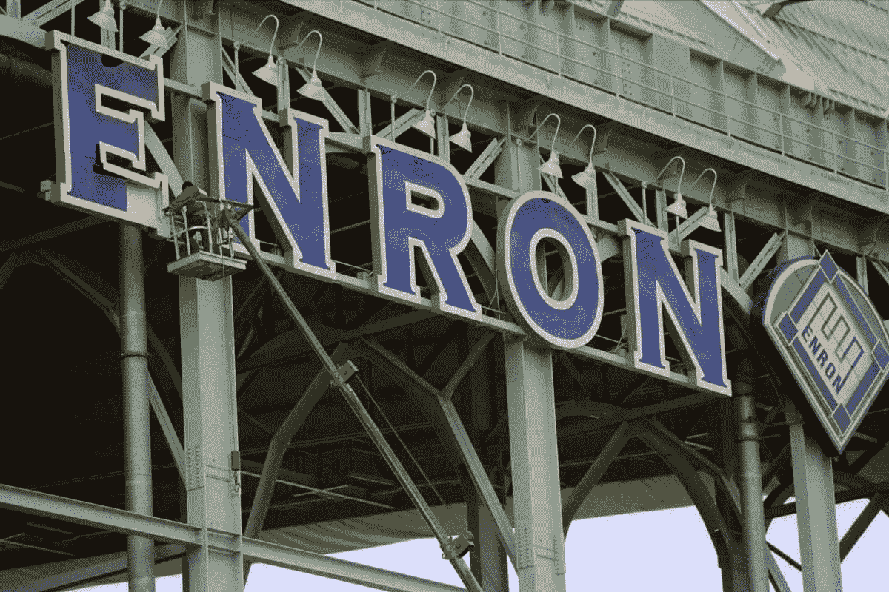

# 安然公司到底发生了什么…

> 原文：<https://medium.datadriveninvestor.com/what-really-happened-at-enron-b4d6ce3bc171?source=collection_archive---------3----------------------->

## 你不想要另一个安然吗？这是你的法律:如果一个公司，不能用一句话解释，它做什么…它是非法的。刘易斯·布莱克

安然公司的故事描述了一个公司达到了惊人的高度，却面临着重重的摔落。这家欺诈性公司的倒闭是以数千名员工的损失为代价的，它彻底震动了华尔街。直到今天，分析家们还不知道安然公司到底发生了什么，以及它是如何蒙混过关，在如此长的时间里显示虚假持股和帐外账目的。

安然由肯尼斯·雷于 1985 年创建，由两家天然气输送公司合并而成，休斯顿天然气公司和 InterNorth 公司；合并后的 HNG 国际公司于 1986 年更名为安然公司。

在杰弗里·斯基林(Jeffrey skilling)的指导下，安然转型为能源衍生合约交易商，充当天然气生产商及其客户之间的中介。斯基林最初是一名交易员，后来成为该公司的首席运营官。这种新的引入导致了极大的利润空间。

 [## 商务沟通不畅是网络安全问题的 5 个原因|数据驱动型投资者

### 沟通是商业的命脉。没有协作就不会有想法，没有合作就不会有交易

www.datadriveninvestor.com](https://www.datadriveninvestor.com/2020/09/01/5-reasons-why-poor-business-communication-is-a-cybersecurity-issue/) 

**文化问题**

斯奇林从改变公司文化开始，他开始从全国顶尖商学院招聘 MBA。他在公司内部营造了一个竞争激烈的环境，人们越来越关注在最短的时间内完成尽可能多的产生现金的交易。

有趣的是，文化是推动你的组织的氛围的不加掩饰的、公开的、最纯粹的表现。任何一家公司要在任何一种文化中茁壮成长，都需要员工和雇主之间保持健康的关系。安然公司这种有毒的企业文化无疑是其垮台的主要原因。在雇主和雇员之间没有信任和坦诚的环境中，实际上只有有毒物质才能生存。

在安然，贪婪是好的，金钱是上帝。很少考虑道德或法律。这种态度影响了整个公司从上到下到每个员工。否认和声誉管理使他们能够继续他们不道德的，往往是非法的活动。

**不诚实的领导**

权力越大，责任越大，但安然并非如此。

Jeffery Skilling 在公司成立几年后被聘用，他的任务是将公司的回报提高到一个新的水平，并组建一个高管团队。他糟糕的领导能力导致他依赖于他过去的成就来管理一个处于动态商业世界的公司，他试图解雇任何挑战或质疑他的做法的人。有许多证据告诉我们，安然公司实际上是像一个邪教一样运作的，以斯基林和雷为其矛头。

**错误会计**

安然在 20 世纪 90 年代中期为能源交易业务引入了“按市值计价会计”，并在交易中以前所未有的规模使用这一方法。根据市值计价规则，每当公司在特定季度末的资产负债表上有未偿的能源相关或其他衍生合约(资产或负债)时，它们必须将其调整为公平市场价值，将未实现的损益计入该期间的损益表。这种技术在证券交易中很管用，但在实际交易中可能会变得相当可耻。对于安然这样的公司来说，在超过收益预期的持续压力下，估值估计可能大大高估了收益。安然拥有独立于会计服务的会计师，他们与安然有着非常稳固的财务关系。让整个纸牌屋开始倒塌的是，安然公司创建了一些特殊目的的合伙企业，其高管在其中拥有金融股份，并从中获利丰厚。经过仔细审查，人们意识到，这些合伙关系造成了一些债务必须回到安然身上的局面。

**巨人的衰落**

结合上述事件，衰落开始了。由于对管理层缺乏信任，安然的股票开始下跌。安然股票的下跌增加了其在一些合伙企业中发行更多股票的义务——这有点像反向庞氏骗局，一场逐底竞赛。2001 年 8 月 14 日，在被任命为首席执行官仅仅六个月后，斯基林自己辞职了，理由是“个人原因”。那一周股价跌破 40 美元。10 月 16 日，安然宣布了四年多来的首次季度亏损，此前该公司因业绩不佳的业务支出了 10 亿美元，并关闭了 Raptor SPV(特殊目的机构)。几天后，安然公司更换了养老金计划管理者，基本上禁止员工在至少 30 天内出售股票。不久之后，美国证券交易委员会宣布正在调查安然公司。然而，在接下来的一年里，安然公司的股票价格开始急剧下跌，从 2000 年 8 月的 90.75 美元跌至 2001 年 11 月 30 日收盘时的 0.26 美元。

**申请破产保护第 11 章**

一旦安然的重组计划得到美国破产法院的批准，他们就开始重组和清算破产前安然的某些业务和资产，以偿还债权人。整个丑闻导致大约 740 亿美元的股东损失。然而，从 2004 年到 2011 年，该公司只能偿还 217 亿美元，上一次支付是在 2011 年 5 月。在接下来的几年里，“安然”这个名字成了大规模公司欺诈和腐败的代名词。政府随后指控斯奇林和莱合谋进行欺诈，并向投资者掩盖公司的财务弱点。

**后知后觉**

2004 年 7 月，休斯顿法院起诉斯基林 35 项罪名，包括欺诈、共谋和内幕交易。雷被指控犯有 11 项类似的罪行。最终，斯基林被判处 24 年监禁，而莱在被起诉两个月后死于心脏病。加强监管和监督有助于防止安然这样的公司丑闻。

干杯

**访问专家视图—** [**订阅 DDI 英特尔**](https://datadriveninvestor.com/ddi-intel)