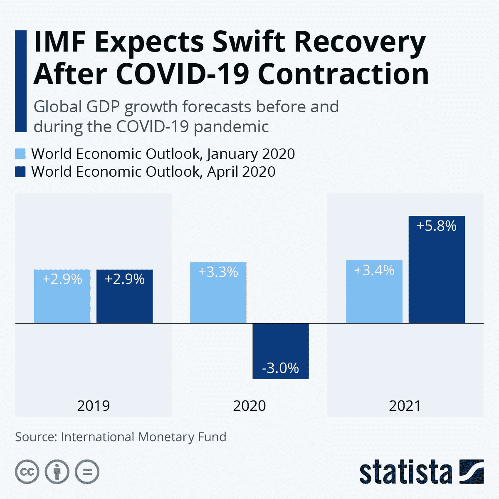
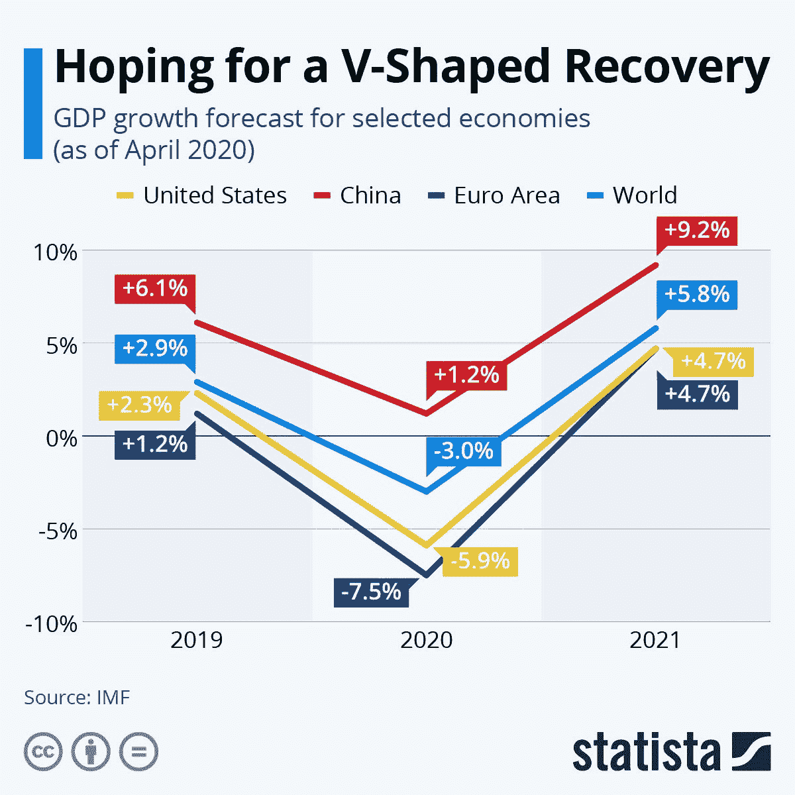

# 后新冠肺炎时代的经济将会是什么样的？

> 原文：<https://medium.datadriveninvestor.com/what-shape-will-the-post-covid-19-economy-take-c8037890dfd?source=collection_archive---------5----------------------->

## 冠状病毒疫情后的商业准备

## 冠状病毒疫情后的经济复苏前景分析

Photo by [Volodymyr Hryshchenko](https://unsplash.com/@lunarts?utm_source=medium&utm_medium=referral) on [Unsplash](https://unsplash.com?utm_source=medium&utm_medium=referral)

> 经济学家是明天就会知道为什么他昨天预测的事情今天没有发生的专家
> 
> *――劳伦斯·J·彼得*

# 介绍

如果你想在大学教师会议上尽可能地开心，这里有一个建议。只要问问两个或更多的经济学家对理财的看法，比如投资、股市、就业市场、大学预算等等。这些颇有学问的人，研究了同样的经典经济理论，很可能会对与金钱有关的事情有截然不同的看法。你将引发一场讨论，甚至可能是一场激烈的辩论，这将保证在那次教师会议上不会有任何成果(是的，许多人会说那还有什么新的)。

现在他们不会无缘无故地称经济学为“沉闷的科学”。当然，很容易把非常真实的事情，比如人们的失业和购买力的缺乏，简化成数字，然后制作出很棒的图表。当供求曲线在抽象的经济学世界中移动时，就没有痛苦了。然而，当他们转变的时候——有时是突然的，有时是非常猛烈和出乎意料的，就像他们在 2020 年的前几个月在这里所做的那样，数百万人的痛苦是非常真实的。

*史无前例*是一个如今被频繁使用的术语。是的，我们已经看到大部分经济前所未有的“关闭”,无论是在美国还是在世界各地。结果，我们看到从华尔街到主街，前所未有的、突然的冲击波及整个经济。我们已经看到[数万亿美元的公司价值在一夜之间消失](https://markets.businessinsider.com/news/stocks/stock-market-outlook-2016-trump-win-gains-erased-coronavirus-risks-2020-3-1028991585)，我们已经看到[失业率突然](https://www.cnn.com/2020/04/16/economy/unemployment-benefits-coronavirus/index.html)——在短短几周内，从历史低点转变为历史高点。所以，是的，当这些天看新闻的时候——如果你足够勇敢去面对冠状病毒在整个经济中造成的所有人类、社会，是的，还有金钱的损失，你就应该聪明地不要在看 CNN、MSNBC、福克斯新闻频道等节目时玩“前所未有”的饮酒游戏。“U”字是一个强有力的、流行的词，用来描述今天周围发生的事情。

 [## 危机？风投适应的 3 种方式|数据驱动的投资者

### 当我写这篇文章的时候，一场全球性的危机正在发生。这不是第一次，也不会是最后一次。很多事情已经…

www.datadriveninvestor.com](https://www.datadriveninvestor.com/2020/03/22/crisis-3-ways-vcs-adapt/) 

现在，将有时间对我们正在经历的[冠状病毒/新冠肺炎疫情](https://www.who.int/emergencies/diseases/novel-coronavirus-2019)的经济方面进行许多、许多经济分析。几十年后，关于这种病毒对我们生活和工作的诸多方面的影响的论文仍会在*中出现。是的，真的会有会议论文和期刊文章试图弄清楚为什么我们会对厕纸如此狂热——在一次*呼吸道*疾病的疫情期间！*

尽管如此，目前每个人心中都有一个主要的经济问题:我们能多快从这一切中恢复过来？对于数以千万计的失业者(在大萧条发生近一个世纪后，这个词甚至很难理解)和数百万小企业主来说，多快这个问题——当然也是必然结果，我们会恢复得多好——是当今最重要的问题。从我们的个人财务到商业规划——比如在危机中——我们都在寻求一点好消息。这一次，经济学家似乎有一个相当乐观的情景。但这是对的吗？

# 国际货币基金组织对经济的预测:前景乐观？

国际货币基金组织(IMF)刚刚发布了其对全球经济的最新展望，这是大流行后对世界经济的首次预测。国际货币基金组织 2020 年 4 月的[世界经济展望](https://www.imf.org/en/Publications/WEO/Issues/2020/04/14/weo-april-2020)谈到了冠状病毒疫情在世界各地造成的破坏的规模和范围。在谈到头条新闻制造者——该组织的经济预测之前，[**Gita Gopinath**](https://www.imf.org/en/About/senior-officials/Bios/gita-gopinath)**，**国际货币基金组织的研究部主任，谈到了这一切:

> 随着各国实施必要的隔离和社交距离做法来遏制疫情，世界已经被置于一个巨大的封锁之中。随之而来的经济活动崩溃的幅度和速度是我们有生以来从未经历过的。这是一场前所未有的危机，其对人们生活和生计的影响存在很大的不确定性。

现在，国际货币基金组织对今明两年的预测显示，全球经济作为一个整体将出现相当快速的“反弹”。图 1 显示了国际货币基金组织经济学家在 Corona 之前对全球经济的预测*(来自其【2020 年 1 月世界经济展望)与其*当前* Corona 对今明两年的预测(来自当前 4 月的报告)之间的比较。可以看出，国际货币基金组织对 2020 年全球 GDP 的经济预测从 3.3%的增长率大幅下调至 3%的经济收缩率。然而，国际货币基金组织乐观地预测，世界经济将很快复苏——预计 2021 年的经济增长率将高达 5.8%。*

**图 1**

**来源** : [Statista](https://www.statista.com/) (经许可使用)([https://www . Statista . com/chart/21397/global-GDP-growth-forecasts-before-and-during-the-新冠肺炎-疫情/](https://www.statista.com/chart/21397/global-gdp-growth-forecasts-before-and-during-the-covid-19-pandemic/) )

在经济方面，国际货币基金组织预计，从今年突然发生的经济衰退中，会出现典型的“V 型复苏”。从图 2 中可以看出，国际货币基金组织认为今年会出现深度的“V”形，然后是 20201 年全球经济的强劲增长。事实上，尽管 2021 年美国的增长率将低于全球平均水平(美国为+4.7%，全球为+5.8%)，但今年我们经济收缩的深度将低于全球“经济痛苦”的平均水平(美国为-5.9%，全球为-3.0%)。

**图 2**

来源: [Statista](https://www.statista.com/) (经许可使用)[https://www . Statista . com/chart/21399/GDP-growth-forecast-for-selected-economies/](https://www.statista.com/chart/21399/gdp-growth-forecast-for-selected-economies/)

> 衰退就是你的邻居失业。抑郁症是指你失去了自己的情绪。”
> 
> *—*[*里根总统*](https://www.whitehouse.gov/about-the-white-house/presidents/ronald-reagan/)

# 分析

那么，核心问题是，就像任何经济预测一样，伟大的——甚至是不那么伟大的——可以——也将会——不同意这样的预测。在这种情况下——也许是*我们一生中所做的最重要的*经济预测——我们有充分的理由怀疑——也许是非常怀疑——国际货币基金组织的预测，如果不是因为病毒本身的不可预测性。是的，美国乃至全世界的经济有多远、多快、多高和多低，对我们所有人都有深远的预测。

现在作为一名管理学教授/顾问，让我澄清一下，我不是经济学家。然而，我确实知道经济分析和预测对管理层有多重要——不管你说的是财富 100 强公司还是小企业主。以我浅薄的经济学知识——是的，我吃力地完成了我学过的每一门经济学课程——我知道两件事是肯定的。首先也是最重要的一点，经济学家——比如那些和我一起工作的人——总是会对数据显示的内容有不同意见。第二，虽然经济周期是必然的——这是许多人都认同的——甚至一些拥有博士学位的人在经历了 10 年的经济扩张后，在经历了上个世纪的黑天鹅之夜、2008 年的金融危机和大衰退之后，已经看不到了——但衰退的持续时间、深度和复苏程度将会有很大的不同。“V”形曲线是我们所能希望的最乐观的情景，但从历史上看，从衰退中复苏有多种形式。

是的，悲观的科学给了我们至少三种历史上出现过的衰退复苏选择。四种基于字母的恢复模式如下:

***【L】***:L 型复苏是最戏剧性的衰退和复苏类型。因为经济增长急剧下降，而且经济在很长一段时间内不会复苏，所以 L 型衰退通常被称为萧条。

*****【V】*T3:[V 型复苏](https://www.investopedia.com/terms/v/v-shaped-recovery.asp)是一种经济衰退和复苏的类型，在图表中类似于“V”形。具体来说，V 形复苏代表了经济学家在研究衰退和复苏时创造的经济指标图表的形状。V 型复苏包括这些指标的急剧下降，然后急剧回升到之前的峰值。****

****W 的中间部分可以代表一个显著的熊市反弹或被额外的经济危机扼杀的复苏。****

**因此，最终，我们都可以期待 V 型复苏的出现——而且会像国际货币基金组织预测的那样迅速。如果这真的发生了，那么所有的创伤和经济痛苦，虽然不会以任何方式抹去或轻易忘记，但大多数企业和个人将能够及时克服(只是可能不会在 2021 年底之前，无论经济反弹可能多么强劲！).然而，在为大大小小的公司提供建议时，我不会像国际货币基金组织的数字那样乐观。**

**为什么不呢？好吧，让我们回到“U”字上来——前所未有的——以及它是如何影响这一切的。国际货币基金组织对经济复苏的预测带有一个重要的警告。正如 Gopinath 博士在她对国际货币基金组织报告的序言评论中所警告的，他说他们组织的预测是基于一个很大的假设，一个非常大的假设:**

> **很大程度上取决于病毒的流行病学、遏制措施的有效性以及治疗方法和疫苗的开发，所有这些都很难预测……假设世界上大多数国家的疫情和所需遏制措施在第二季度达到峰值，并在今年下半年消退。**

**因此，当我们在这种前所未有的情况下集体接近任何经济模型时，对于所有关于重新开放经济和让事情恢复正常的谈论，或者至少对 T2 来说，不管“新常态”可能是什么，所有这些都必须以健康的(*没有双关语的意思*)怀疑态度来对待，原因只有一个。为什么？好吧，让我们来看看疫情最大的明星——[安东尼·福奇博士](https://www.niaid.nih.gov/about/anthony-s-fauci-md-bio)，[国家过敏和传染病研究所](https://www.niaid.nih.gov/)的主任——关于那个经济模型中最大的[外生变量](http://www-personal.umd.umich.edu/~delittle/Encyclopedia%20entries/Endogenous%20variable.htm)，当然，*是*冠状病毒本身:**

> ***你不制作时间轴，病毒制作时间轴……***

# **结论**

**无论你管理的是一家销售额数百亿美元、业务遍布全球的公司，还是只有一个地点和几名员工的企业，我最好的建议是:*为所有四种衰退复苏情景做好计划*！我们根本没有任何真正的先例——历史的、经济的，是的，还有流行病学的——在这里继续。虽然我们可能会期待“V”型经济的出现，但我们有充分的理由相信，我们可能会出现“W”(二次探底)，出现“U”(一位著名经济学家将其描述为试图从拖鞋浴缸中出来！)或者甚至是可怕的“L”——这意味着我们将会看到一场现代的大萧条。**

**新冠肺炎/疫情冠状病毒的规模、范围和不可预测性确实是前所未有的。尽管这次疫情事件具有悲剧性和破坏性，但我们提醒所有 T21 人，最周密的计划和最优雅的预测基本上可以在一眨眼的功夫就变得毫无用处。今天，我们在商业生活和个人生活中痛苦地认识到这一点。因此，当你开始为你的业务复苏、你的职业复苏，是的，还有你的财务复苏制定计划时，不要只听取经济专家的建议——因为现在我们都知道，未来总是会发生变化的。**

**_______________________________________________________**

**大卫·c·怀尔德([dwyld@selu.edu](mailto:dwyld@selu.edu))是新奥尔良郊外[东南路易斯安那大学](https://www.southeastern.edu/)的管理学教授。他是一位著名的商业顾问和当代管理问题的演讲者/作家。**