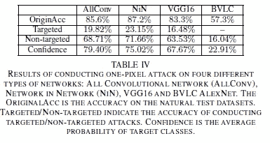
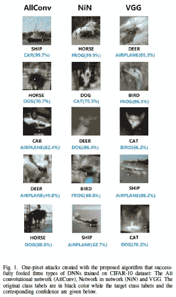
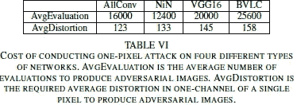
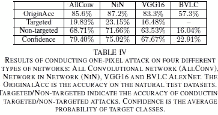
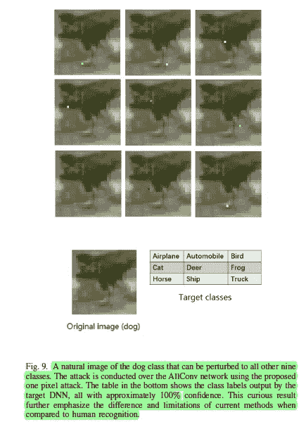

# 我们应该从一个像素的攻击中学到什么？

> 原文：<https://medium.datadriveninvestor.com/what-should-we-learn-from-the-one-pixel-attack-a67c9a33e2a4?source=collection_archive---------1----------------------->

## 动摇昂贵的深度学习图像分类器的论文

Results across models. Stick around to understand the terms.

如果你最近还活着，你可能会意识到深度学习的宣传。人们深信，有了足够的计算能力和数据，DNNs 将解决任何问题。至此，dnn 已经成为可靠的图像分类器。这也是为什么苏佳伟等人的论文“ [**一像素攻击欺骗深度神经网络**](https://arxiv.org/abs/1710.08864) ”不应该被忽视的原因。通过只改变**一个像素**，他们能够可靠地骗过跨不同架构的昂贵 DNNs *。*左边的图片显示了使用不同指标的结果。正如我们所看到的，结果是异常的。甚至使用的扰动协议也非常便宜。如果你想学习更多的技术，看看这篇精彩的文章: [**为什么你应该使用差分进化来解决你的优化问题**](https://medium.com/datadriveninvestor/why-you-should-be-using-differential-evolution-for-your-optimization-problems-b3b2ed622c4a) 。它分解了用于选择要使用的像素的技术。总结一下:DE 很便宜，可以应用于几乎任何问题，并且可以很容易地定制以匹配任何配置。

在这篇文章中，我将从这篇开创性的论文中分解出主要的观点。我们将讨论实现、可能的扩展和结果。我们还将探讨评估中使用的有趣技术。一如既往，附加注释的文件附在最后。请务必查看更多细节和超级彻底的分解。如果这篇文章对你有用/有趣，请一定鼓掌并分享。此外，欢迎任何反馈。

# 这篇论文的一个简短注释很重要

你们中的一些人可能想知道为什么这篇论文如此重要。毕竟改变 1 个像素能做什么？除了被用作未来图像分类模型的潜在基准，一个像素的攻击对我们的隐私有深远的影响。这种攻击可能被用来阻止面部识别软件在未经我们同意的情况下收集信息。由于这些变化人眼是察觉不到的，任何图像仍然可以被人类在需要的时候使用，但大规模的自动化监控可能会被阻止。通过了解这种攻击的细微差别，如何改进它，以及为什么它以某种方式工作，我们可以改进我们的结果，并更好地了解复杂神经网络背后的学习过程。

# 实验设置

实验设计很优雅，我们可以从中学习。实验使用了多个数据集，包括 Kaggle CIFAR 10、Original CIFAR 10 和 ImageNet 数据集。所有使用的数据集都是图像相关工作的行业标准。此外，多个数据集的使用突出了结果的一般性。

An example of the different classes and the attack in action

这些图像取自多个不同的班级(图像所代表的内容)。该模型被训练来识别图像并将其标记到其中一个类别中。一旦训练了图像分类，他们就攻击模型。这些袭击既有针对性的，也有非针对性的。目标攻击试图使模型将图像错误分类为特定的不同类别，而非目标攻击只是试图欺骗分类器。

为了理解这一点，以一个虚构的简单数据集为例，该数据集包含三种类型的图像:猫、狗和老鼠。以我们数据集上训练的模型为例。一个有针对性的单像素攻击一个猫图片可能会试图欺骗模型，图像是一只老鼠。而无针对性的攻击只会试图欺骗模型，使其认为图像不是猫。

# 他们是如何评价改变一个像素的结果的？

随着大量机器学习研究的开展，研究用于评估结果的指标非常重要。通过理解度量标准，我们可以评估一项研究及其对潜在解决方案的效用。我们可以看看使用该方法的可能缺点，以及净范围。研究团队使用 4 种不同的指标来评估结果。

1.  **成功率**:简单地说，这是一个类别的图像可以被改变成另一个类别的百分比。这是最容易理解的一个，它的用途也很明显。
2.  **置信度**:错误分类敌对图像时，目标系统给出的平均置信度。其计算方法为“*”累计每次成功扰动的目标类别的概率标签值，然后除以成功扰动的总数。*“重要的是这个只看成功的案例。
3.  **目标类别数:**统计成功干扰一定数量目标类别的自然图像的数量。*特别是，通过计算不能被任何其他类别干扰的图像的数量，可以评估无针对性攻击的有效性*
4.  **原始-目标类对的数量:**统计每个原始-目标类对被攻击的次数。这就把其他指标放在了正确的位置上。

# **有趣的结果/收获**

这篇论文带来了一些有趣的启示和教训，我们不应该忽视。我发现有趣的是:

## 有效的 ML 研究可以在较低的资源上进行

感觉 ML 研究(尤其是对图像的研究)正在成为计算能力的游戏。团队使用成千上万的计算时间和巨大的数据集。新协议通常非常昂贵。这就是为什么像****和[**rand augment**](https://medium.com/datadriveninvestor/why-randaugment-is-the-best-data-augmentation-approach-4a48f22b2152)**这样的技术总是让我兴奋。这些纸成本极低。看一下下表就明白了。******

************

******评估的成本非常低。大多数强大的计算机可以毫无问题地运行它们。这篇论文能够以如此低的成本欺骗昂贵的 DNN 图像分类器，这一事实充分说明了在研究方向和思路方面需要更多的多样性。******

************

******Hard to argue with the results******

## ******我们需要更好地理解神经网络******

************

******这不是新的拍摄。但是这篇论文真实地展示了理解 DNNs 的黑盒学习过程的需要。而大多数变形是对称的(如果 A 类可以变形为 B 类，反之亦然。)，论文揭示了有一些类更容易转变成其他类。例如，在 AllConv 网络中，狗的图像可能会被误分类为其他东西(包括卡车？一只青蛙？).这显然是一个值得进一步研究的奇怪结果。通过理解这背后的原因(或者至少是如何)，我们有可能释放 ML 的潜力。******

# ******扩展ˌ扩张******

******这篇论文有一些有趣的方向可以探索。这篇论文确实提到了其中的一些，但是让我震惊的是这些图片的低质量。使用高清图像将使研究更直接地应用于现实世界。这也将验证每个口袋里都有高清摄像头的世界的结果。******

# ******纸******

******正如我所承诺的，这是我写的带注释的论文。有空的时候，你可以随意看看这个，检查一下我没有包括的任何东西。一定要评论任何你觉得有趣的东西******

# ******向我伸出手******

******感谢您阅读本文。我会把我所有相关的社交媒体都放在下面。关注任意(或全部)以跨不同平台查看我的内容。我喜欢利用不同平台的优势。留下你可能有的任何反馈，因为它确实帮助像我这样的成长中的内容创作者。如果你觉得这很有用，请分享这篇文章。******

******我用这个[伟大的服务](https://free-url-shortener.rb.gy/)缩短了网址。他们做得很好，所以给他们一些爱。这不是赞助的，但是宣传有用的工作总是好的。******

******查看我在 Medium 上的其他文章。:[https://rb.gy/zn1aiu](https://rb.gy/oaojch)******

******我的 YouTube。这是一个正在进行中的工作哈哈:【https://rb.gy/88iwdd ******

******在 LinkedIn 上联系我。我们来连线:【https://rb.gy/m5ok2y】T4******

******我的推特:[https://twitter.com/Machine01776819](https://twitter.com/Machine01776819)******

******我的子任务:[https://devanshacc.substack.com/](https://devanshacc.substack.com/)******

******如果你想和我一起工作，请发邮件给我:devanshverma425@gmail.com******

******twitch 现场对话:[https://rb.gy/zlhk9y](https://rb.gy/zlhk9y)******

******获取我的内容更新-insta gram:[https://rb.gy/gmvuy9](https://rb.gy/gmvuy9)******

******获得罗宾汉的免费股票:[https://join.robinhood.com/fnud75](https://www.youtube.com/redirect?redir_token=QUFFLUhqa0xDdC1jTW9nSU91WXlCSFhEVkJ0emJvN1FaUXxBQ3Jtc0ttWkRObUdfem1DZzIyZElfcXVZNGlVNE1xSUc4aVhSVkxBVGtHMWpmei1lWWVKNzlDUXVJR24ydHBtWG1PSXNaMlBMWDQycnlIVXNMYjJZWjdXcHNZQWNnaFBnQUhCV2dNVERQajFLTTVNMV9NVnA3UQ%3D%3D&q=https%3A%2F%2Fjoin.robinhood.com%2Ffnud75&v=WAYRtSj0ces&event=video_description)******