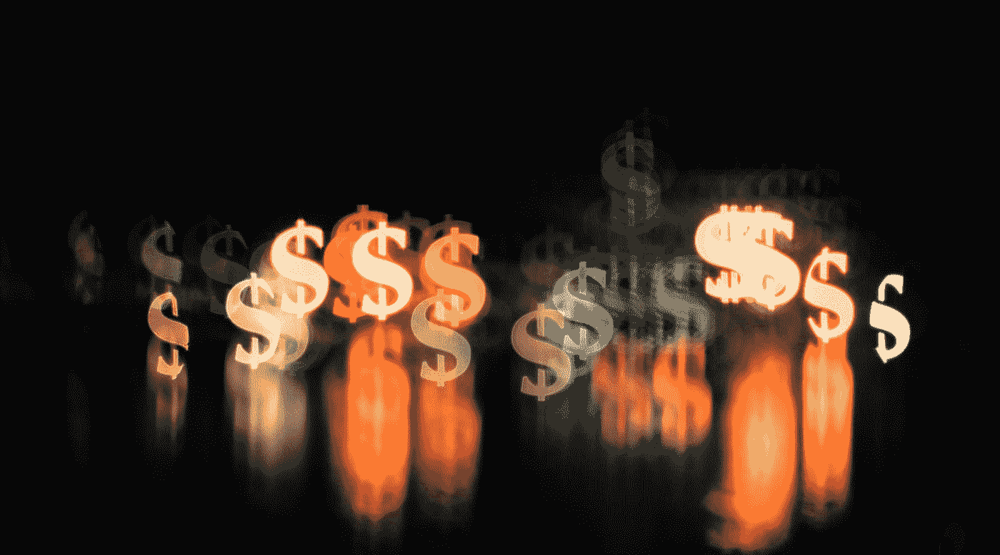

# 区块链对金融市场有什么意义？

> 原文：<https://medium.datadriveninvestor.com/what-significance-does-the-blockchain-have-for-financial-markets-42a6303a6082?source=collection_archive---------13----------------------->

Photo by [Chronis Yan](https://unsplash.com/@chronisyan?utm_source=medium&utm_medium=referral) on [Unsplash](https://unsplash.com?utm_source=medium&utm_medium=referral)

专家们将区块链视为一场小革命，并将其视为一项创造财富的技术。

德国政府也认识到了这项技术的潜力。因此，区块链战略旨在促进德国的分布式账本技术，从而鼓励创新。

尽管有这些基本因素，问题仍然是区块链是否也能影响现有的金融市场？

新的关键技术对保险公司、银行、公共机构和市场监管者等成熟的市场参与者有什么意义？

在下文中，你将了解到更多关于区块链在金融领域的颠覆性潜力。

区块链战略为金融市场的颠覆奠定了基础。
长期以来，德国在区块链一直采取相对被动的态度。相反，政府让其他欧洲国家在这方面起带头作用。

2019 年 9 月，期待已久的《区块链战略》出台，这是经过广泛磋商后才出台的。除了德国之外，法国、爱尔兰和卢森堡也已经通过了这方面的立法。

新战略应该关注数字创新。尤其是金融部门，潜力巨大。在战略文件的帮助下，监管调整和创新应该在这里进行。

特别是，新的、基于代币的融资形式可以彻底改变现有的资本市场。除了比特币或以太坊等经典加密货币之外，基于安全令牌的电子证券也发挥着重要作用。

 [## 区块链投票和美国选举|数据驱动的投资者

### 在不到 70 天的时间里，这个世界上最古老的民主国家将以前所未有的方式面临最大的摊牌…

www.datadriveninvestor.com](https://www.datadriveninvestor.com/2020/08/26/blockchain-voting-and-the-american-elections/) 

# 区块链让银行承压。

金融机构仍然主导着今天的金融市场。从投资者的角度来看，中介机构是一个特别讨厌的东西，造成了额外的成本。银行形式的中介机构提供了获得股权和债务资本的途径。对于这些市场参与者来说，区块链技术是一种倾向性风险。

今天已经很明显，越来越多的公司正在寻找进入资本市场的替代途径。最好的例子是流媒体服务 Spotify 的首次公开募股——首次在证券交易所发行股票。该公司采用直接配售的方式来避免中介费用。

从公司的角度来看，唯一的缺点是定价程序，因为在直接配售中没有建书过程。而是公司的市场价格由供需决定。

因此，在最好的情况下，发行者可以通过认购估值过高的股票获得更多资金。在最坏的情况下，股票上市的价格太低，从股票发行中赚的钱更少。

# 金融中介失去了存在的权利。

相反，在未来，证券可以通过区块链的方式发行——在这种情况下，银行将失去一个很好的收入来源。然而，市场参与者将受益于更快和更电子化的过程。因此，成本正在迅速下降。

今天，已经有第一批公司在代币的帮助下使传统证券可以交易。

特别是在房地产领域，价值投资的符号化起着重要的作用(阅读更多关于这个主题的内容)。原则上，基于区块链的代币流动性很强，可以在二级市场上轻松交易。数字证券的使用增加了市场流动性。专家已经预计，越来越多的公司将使用代币筹集新的股本。

此外，这个用例也可以投射到债务资本的采购上。

最近，戴姆勒和 LBBW 在区块链的帮助下处理了一笔期票贷款。试点项目表明，这种方法在企业融资领域是革命性的。这种基于 DLT 的债券不仅取代了债券，还导致银行业佣金的流失。

# 金融市场面临民主化。

现在问题来了，当然相应的平台不也是中介吗？

标准和交换程序对这个问题的答案有决定性的影响。这些是由开源开发者和约定开发和建立的。只有完全去中心化的网络，才能保证平台不充当中介。

然而，同样明显的是，中介机构的相关性降低也会影响所有市场参与者的框架条件。

因此，与银行顾问的良好关系可能带来的关系优势不再适用。投资银行操纵价格也将成为历史。

因此，区块链技术的使用促进了金融市场的民主化。

特别是，需求者可以期待更公平的条件。相比之下，投资者受益于准入的改善和成本的下降。小额交易可以有利可图——金融市场正日益发展成为一个完美的市场。

# 借助区块链实现金融数字化

金融监管当局必须确定确切的要求。然而，正在进行的变革对立法和市场监管机构产生了影响。相反，新的要求正在出现，必须得到实施。例如，证书必须由电子证券取代，因为现行法律规定了纸面证书。

2018 年 2 月，BaFin 指出，可转让性和可交易性有助于代币实现证券的基本特征。为此，必须对法律进行调整。

区块链战略表明，德国政府已经为建立区块链奠定了基础。

从长远来看，关键技术可能会成为颠覆者，超过现有的供应商。因此，中间商可能会失去他们的地位。另一方面，投资者受益于更多的透明度和公平性。

德国政府明智的做法也值得注意。德国政府没有立即实施一项技术，而是专注于可持续的变革和监管调整。

结论:区块链将在中长期主导金融市场
在 2009 年推出区块链后，它一直被认为是一项利基技术。

然而，DLT 正变得越来越被社会所接受，并越来越多地向主流社会迈出关键的一步。特别是公司看到了技术的优势，并开发了超越经典加密货币的用例。

 [## 有哪些节点？什么是主节点？

### 除了矿工之外，网络还需要节点来运行。

medium.com。](https://medium.com/datadriveninvestor/what-are-the-nodes-what-is-a-master-node-f35e3d71939) 

尤其是在经济环境中使用区块链被认为是一个关键用例。

从长远来看，区块链可能会取代中间人。因此，新的效率将导致所有市场参与者——金融市场将民主化。

金融市场民主化的先决条件是分散的区块链。因此，国家的监管措施也是必要的。

为了营造有利于颠覆性分布式账本技术的环境，德国政府于 2019 年 9 月定义并公布了区块链战略。如果其他州也这样做，这项技术的应用只是一个时间问题。

作为区块链地区的一名作家，可以理解的是，我也看到了区块链的巨大潜力。

原则上，该技术可以使许多应用领域更加高效和创新。安全令牌和加密货币可以优化，特别是金融和房地产市场。

一些央行，如中国人民银行，已经发现了这一潜力。数字日元最早可能在明年出现，并从根本上改变金融交易。

我在每月一期的 [**简讯中分享了更多私密的想法，你可以在这里**](https://mailchi.mp/bf8f8e8ed697/keep-in-touch-with-lukas) 查看。请在评论中告诉我，并在各种社交媒体平台上加入我:

[**推特**](https://twitter.com/WiesfleckerL)●[**insta gram**](https://www.instagram.com/lukaswiesflecker/)●[**脸书**](https://www.facebook.com/lukaswiesfleckerr)●[**Snapchat**](https://www.snapchat.com/add/luggooo)**●[**LinkedIn**](https://www.linkedin.com/in/lukas-wiesflecker-1b11251a5/)**

**无论你做什么，都要带着爱和激情去做！**

****访问专家视图—** [**订阅 DDI 英特尔**](https://datadriveninvestor.com/ddi-intel)**