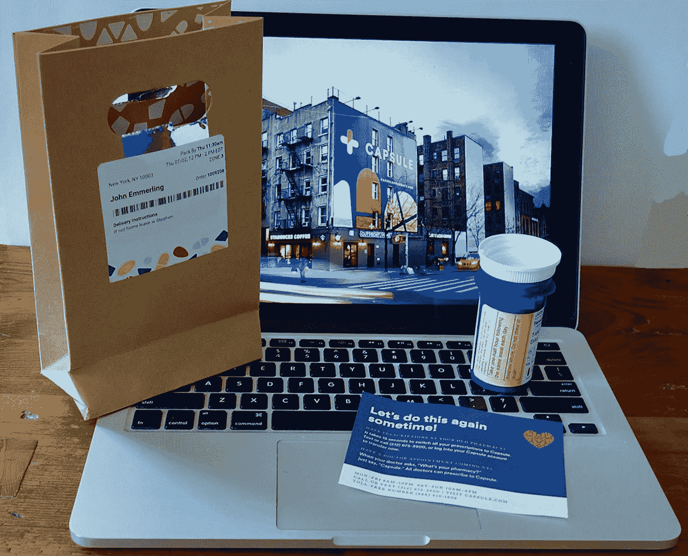

# 创业公司的梦想——创造一个尤里卡营销时刻

> 原文：<https://medium.datadriveninvestor.com/what-startups-dream-about-creating-a-eureka-marketing-moment-f318fbc3aa52?source=collection_archive---------6----------------------->

## 小心 CVS 和 Walgreens——胶囊，一个纽约的处方递送服务，想要吃你的午餐

A killer brand position: “Two-hour free delivery—and pharmacists who text.” Photo by author

这是一个营销冒险故事。这要从我对“尤里卡营销时刻”的定义说起当消费者突然发现市场上一项令人瞠目结舌的创新时，就会发生这种情况——它会改变他们的想法。这些时刻很难得。就像在一千个干草堆中找到一根针。但是，一个灵光一现的营销时刻(姑且称之为 EMM)可以立即颠覆任何消费者长期形成的购买行为。

以下是我最喜欢的一些艾美奖。

## **饼干杰克——一只 EMM**

20 世纪 40 年代末的某个时候，我和我哥哥都得到了第一盒饼干(谢谢妈妈)。在我的盒子里，在那甜脆的爆米花底部，藏着一个玩具哨子。库尔特也得到了一个奖品——一个小小的塑料拼图。我瞬间想到:*哇！奖品不同！想知道我下一个盒子里会有什么吗？*那一刻，我成了重度用户。

## 施乐复印机——EMM

1961 年，大多数办公室仍然用打字机和脏污的复写纸复印文件。或者收发室的热传真机在难看的褐色纸上打印出薄薄的副本。那一年，我观看了一场新型施乐 914 的演示，即所谓的普通纸复印机。这东西很大，有冰箱那么大。售货员递给我一份备忘录:“给——把这个复印一份。”我把备忘录放在一个玻璃盘子上，然后按了一个按钮。几秒钟后，一张纸出现了。*哇！这个复制品看起来和原件一模一样！突然，我知道:施乐将改变工作场所。*

## 索尼随身听——EMM

1983 年，我走进一家大型电器商店，发现了一个时髦的新柜台。索尼推出了随身听，一种带有双立体声声道的便携式媒体播放器。“听听吧”标题卡催促道。(年轻读者请注意:当时大多数户外音乐都是在低保真度的汽车收音机或震耳欲聋的音箱中听到的。所以我戴上了耳机。。。*哇！立体声音乐在我脑海中爆炸！便携式音乐的一切都变了。我买了一个随身听。数百万其他音乐爱好者也是如此。*

## 微软和电子邮件——EMM

1990 年，我在华盛顿州雷蒙德市附近一个不起眼的农场家里采访了一个名叫比尔·盖茨的 34 岁的小伙子。当时，美国几乎没有企业使用电子邮件进行交流。但是当我那天早上 9 点见到盖茨时，他已经发出了 60 封电子邮件。他解释说，他们使用电子邮件在工作团队中交流想法和意见。他的话清楚地表明，这个新手数字工具正在使公司的智商(创新商数)飙升。他的洞察力给我留下了深刻的印象——是的，太棒了！——改变了我在纽约广告公司使用电脑的方式。值得注意的是:在会见盖茨的前一周，我在 IBM 的董事长约翰·埃克斯位于纽约阿蒙克的宽敞办公室采访了他。在那间宽敞的行政办公室里，宽大的办公桌非常整洁——没有电脑。显然，在我到达之前，埃克斯并没有在埋头写电子邮件。(我最近[写了一个关于比尔·盖茨和他惊人的电子邮件秘密的中型故事](https://medium.com/storyville-stories/what-it-was-like-to-interview-bill-gates-age-34-about-creativity-2ffcefb8b224)。这也是我的关于创新的[书](https://www.amazon.com/Only-Takes-One-Create-Idea/dp/1501158732/ref=tmm_pap_swatch_0?_encoding=UTF8&qid=1595519211&sr=8-13)的特色。)

## 苹果包装——EMM

那是 2007 年初。史蒂夫·乔布斯曾高调推出第一代 iPhone。我厌倦了我的摩托罗拉翻盖手机，所以去了第五大道的苹果专卖店。排队等了一个小时后，我找到了一名售货员。他用一个奇妙的盒子“展示”了我的新 iPhone。但那不是一个*盒子*——我拿着一个精密的高光泽*传送装置*。包装是如此美丽，如此优雅，如此精心制作！它重重地打了我的头:*哇！这将永远改变高端电子封装！*

## 胶囊 Rx 交付—EMM

Capsule 是一家处方配送初创公司，于 2015 年在纽约市成立。他们以组合拳领先。

1.  两小时内免费送货。
2.  发短信的药剂师。

想想这里的经济学。大型连锁药店为坐落在城市昂贵角落位置的数百家商店支付天价租金。但是胶囊可以在低租金区域有一个大的位置。他们的快递员骑自行车和地铁到处跑。订购非常简单——只需发短信、发邮件或打电话。去年我的医生推荐胶囊:“这些人都挺好的。”

 [## 您的企业今天需要虚拟现实营销的 3 个原因|数据驱动的投资者

### 新冠肺炎是并将继续是一个前所未有的全球性事件，将医疗保健系统和全球经济带到…

www.datadriveninvestor.com](https://www.datadriveninvestor.com/2020/04/09/3-reasons-why-your-business-needs-vr-marketing-today/) 

我注册了，并且对我的胶囊账户很满意。服务太棒了。发短信请求，有人——一个人——会愉快地回应:“你好，亲爱的。胶囊在这里。”告诉他们你需要的 Rx。他们回短信确认有货，并给你价格(总是很低)。你付钱，选择一个时间段送货。当快递员到达你家门口时，你会收到一个漂亮的带有防篡改封条的小购物袋(又是光滑的包装)。

对于初创公司来说，这些都是聪明的策略。但还不足以成为我的 EMM 绰号。最近，一位专家，不是我的普通医生，开了一种新的药。我让他把剧本送到胶囊。十分钟后，胶囊发短信给我(“你好，亲爱的”)——药剂师说他们有我的药。我选择了第二天中午的送货时间。

时间戳:美国东部时间 2020 年 7 月 2 日星期四上午 8:05

这就是 EMM 发生的时候。我醒来时收到胶囊发来的一条短信:“早上好，约翰，我是药剂师！”他们检查了我的药物清单，发现我的新药与我服用的另一种药物相似。我是否停止了药物 A，转而使用药物 B？请让他们知道。

Text thread with Capsule. Image capture by author

我给专家办公室打了电话。他们检查了一下，说两种药物都可以服用，但不能同时服用。我应该早上吃一片，晚上吃另一片。

*哇！这感觉好大！*

大型连锁药店会花时间对每个新订单进行药物审查吗？不太可能。毕竟，你的处方来自医生——为什么要质疑呢？

我突然意识到:这个敏捷的小公司一定会在全国拥挤的城市市场上掀起轩然大波。在这场争夺消费者心智的网球比赛中，这感觉就像一个突然发现的营销时刻发生了。

优点:胶囊。

*教训:*在启动一家创业公司之前，检查一下你的计划是否包含一个突然发现的营销时刻。有吗？去吧。什么都没有吗？然后让你的想法经受一次考验——延伸它——并推动它。你可能会发现一架隐形 EMM 正等着为你的发射增压。

**访问专家视图—** [**订阅 DDI 英特尔**](https://datadriveninvestor.com/ddi-intel)