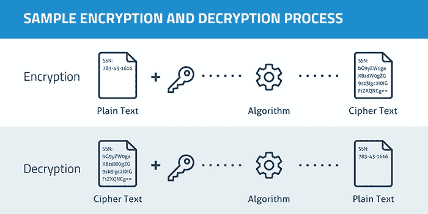

# 苹果和联邦调查局关于加密的争论到底是什么

> 原文：<https://medium.datadriveninvestor.com/what-the-apple-fbi-encryption-debate-is-really-about-3278f9249e63?source=collection_archive---------5----------------------->

最近有很多关于苹果无法解密恐怖分子、罪犯等的 iPhones 的新闻。最近，普雷斯。Trump 和 AG Barr 已经[声明](https://www.politico.com/news/2020/01/22/apple-has-to-help-us-trump-barr-turn-up-heat-on-encryption-fight-102410)“苹果必须帮助(解密手机)，”去年[参议员 Graham 声明](https://arstechnica.com/tech-policy/2019/12/senate-judiciary-committee-interrogates-apple-facebook-about-crypto/)“你们这些科技公司将会找到一种方法来(解密手机&信息】,否则我们将会为你们这么做。

Photo by [Paul Hanaoka](https://unsplash.com/@paul_?utm_source=medium&utm_medium=referral) on [Unsplash](https://unsplash.com?utm_source=medium&utm_medium=referral)

> **这些公共政策辩论很重要，也需要进行，但他们没有意识到这到底是怎么回事。**

这些公共政策辩论很重要，也需要进行，但它们忽略了真正的意义。最终结果是，我们可能会以导致比当前形势更糟糕结果的政府政策/法律而告终。

在这篇简化的文章中，我谈谈这场辩论的全部内容。我会保持客观直到最后，在最后我会分享我对监管该何去何从的个人观点。本文组织如下:

*   加密的工作原理
*   当前状态的后果
*   给执法部门提供后门的后果
*   结论

 [## 苹果会成为新的网飞吗？数据驱动的投资者

### 有可能。然而，该公司肯定会与大公司竞争。许多人不得不看到这一天的到来…

www.datadriveninvestor.com](https://www.datadriveninvestor.com/2019/02/15/will-apple-be-the-new-netflix/) 

# 加密的工作原理

首先，我们需要谈谈加密。加密就是把可读的文本变成不可读的。它是这样完成的:

Encryption & decryption process, where the “key” is your password. [Image](https://www.google.com/url?sa=i&source=images&cd=&ved=2ahUKEwiFuefv3prnAhVVuZ4KHZJaB48QjRx6BAgBEAQ&url=https%3A%2F%2Fcommons.wikimedia.org%2Fwiki%2FFile%3AEncryption1.png&psig=AOvVaw3rDUvHMHpuHDXmeLdrZRzU&ust=1579903914308112) is from wikimedia.org and labeled for reuse

这方面的一个很好的例子是《圣诞故事》中的*解码戒指/糟糕的商业*场景:

# 现状的后果

目前，在某些情况下很难从手机上获取证据，例如:

*   恐怖活动
*   人口贩卖、性虐待和恋童癖
*   等等。

从积极的一面来看，许多犯罪都得到了预防，包括:

*   金融盗窃
*   身份盗窃
*   等等。

是的，所有这些犯罪都会发生，但是由于加密，它们不会像没有加密时那样频繁发生。此外，我们当前的经济、文化和世界从根本上来说是建立在能够加密数据的基础上的。

# 迫使苹果/大科技为执法部门制造后门的后果

加密完全是数学问题。现在，从数学上来说，没有任何方法可以在不让其他人发现和使用后门的情况下，为执法部门创建一个后门。加密算法是(如果不是*)最受审查的安全特性之一。有太多的眼睛盯着加密算法，后门很快就会被发现，特别是如果它是一个公共知识的要求。*

> *那么，如果我们决定放一个后门或“主”钥匙呢？从本质上讲，设备和在线服务将不再安全。*

*那么，如果我们决定放一个后门或“主”钥匙呢？我们生活在一个数字化的世界中(包括那些没有联网的人——他们的信息仍然在线),我们的生活现在已经实现了 b/c，其他人无法拦截我们重要的互联网流量。*

*从本质上讲，设备和在线服务将不再安全。合理的例子包括:*

*   *如果你丢失了你的手机，犯罪分子将会获得你手机上的所有数据(包括照片、账户等)。)*
*   *你的信用卡会在网上购物时被偷*
*   *您银行的用户名和密码会被盗*

# ***有哪些选择***

*最终，我们必须问自己，我们想要生活在什么样的世界里:*

*   *在这个世界上，许多犯罪被阻止了，但是收集一些犯罪的证据却很困难*
*   *一个有很多(严重)犯罪发生但收集证据很容易的世界*

*可能还有其他的解决方案。例如:*

1.  *设备可以保持加密，但[备份可以保持不加密](https://www.reuters.com/article/us-apple-fbi-icloud-exclusive/exclusive-apple-dropped-plan-for-encrypting-backups-after-fbi-complained-sources-idUSKBN1ZK1CT)(组织有保护数据的方法，不一定需要加密)。如果组织需要实施适当的安全控制来保护未加密的数据，这可能是一个明智的选择。*
2.  *众所周知，由于技术变化如此之快，执法官员在如何与技术互动方面没有得到足够的培训。可能执法部门需要的证据是可用的，但他们不知道如何获取。我们可以(I)提供额外的培训和/或(ii)增加资金&雇佣具有广泛技术背景的人。*

# *结论*

*辩论双方的每个人都不想犯罪。他们不希望恋童癖者或恐怖分子逍遥法外。我们都站在同一边。*

*最终，作为一个社会，我们需要决定我们需要生活在一个什么样的世界:一个一些严重犯罪更难被起诉的世界，还是一个许多同样严重的犯罪发生的世界。*