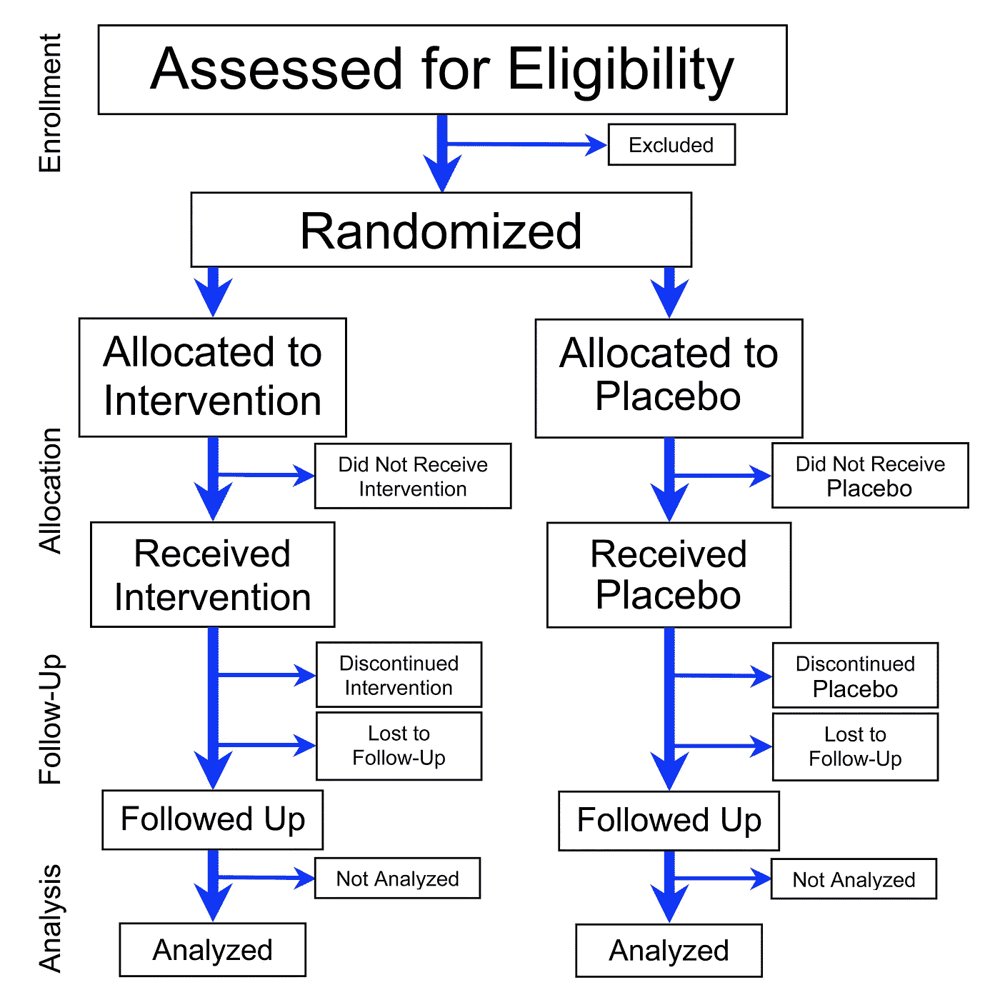

# 芝加哥 Remdesivir 试验到底是什么，没有告诉我们什么

> 原文：<https://medium.datadriveninvestor.com/what-the-chicago-remdesivir-trial-is-and-isnt-telling-us-3cd0f3c1f030?source=collection_archive---------2----------------------->

也许有光，但不是隧道的尽头

The molecule of the hour. By Hbf878 / CC0

今天(4 月 17 日)，当一名研究人员在视频聊天中脱口而出初步临床试验数据，并且这些数据被泄露给 STAT news 时，Gilead 的股票暴涨。

让我们首先说明，这是研究人员非常不恰当的行为。她很有可能会被取消参加任何进一步研究的资格。

故事的核心是，接受雷地昔韦治疗的 113 例 COVID 患者中，有 2 例(1.8%)死亡。

 [## 冠状病毒；惊慌失措；字里行间的 z |数据驱动的投资者

### 围绕冠状病毒的话题；更准确地说，新冠肺炎几乎占据了整个新闻预报的头条…

www.datadriveninvestor.com](https://www.datadriveninvestor.com/2020/03/23/coronavirus-a-to-panic-z-between-the-lines/) 

好吧，假设这些数字是正确的，这是好消息吗？如果不使用雷地昔韦治疗，有多少患者会死亡？要回答这个问题，在试验中你需要一个安慰剂组:相似的病人接受相似的治疗，除了 remdesivir。

Schematic of a placebo-controlled trial. Modified from work by [PrevMedFellow](https://commons.wikimedia.org/w/index.php?curid=9841081) — Own work, CC BY-SA 3.0

但这是一项观察性研究，没有安慰剂组。每个人都注射了 5 天或 10 天的 remdesivir。

那么 1.8%的死亡率是好消息(正如股市所认为的)，没有消息还是介于两者之间？我们能把它比作什么样的致死率？

美国 COVID 患者的总体病死率[似乎在 0.5-5.0%之间](https://www.cdc.gov/mmwr/volumes/69/wr/mm6915e4.htm?s_cid=mm6915e4_x)。我们知道我们低估了病例和死亡人数。我们知道这个数字会随着护理水平的不同而变化。所以这没用。

但是，芝加哥的研究并没有随机登记 COVID 病例。像所有临床研究一样，它有[纳入和排除标准](https://clinicaltrials.gov/ct2/show/NCT04323761?term=remdesivir&draw=2&rank=6)。这里最关键的是，病人的血氧水平较低，但没有严重到需要使用呼吸机。如果他们表现出器官衰竭或感染性休克的迹象，他们也被排除在外。所以他们病得很重(足以住院)，但不严重。这个群体的预期死亡率是多少？

一项对 6168 名确诊时病情相似(低氧血症但无器官衰竭)的中国患者的分析报告称*的病死率为零*，这似乎难以置信。[一项规模小得多的中国研究](https://www.thelancet.com/pdfs/journals/lancet/PIIS0140-6736(20)30566-3.pdf)报道了 22%重症病例的病死率。据我所知，芝加哥研究的预期病死率在 0%到 20%之间的任何猜测都是站得住脚的。

那么，在芝加哥的结果变得无关紧要之前，预期的死亡率可以低到什么程度呢？这是一个我可以更自信地回答的问题。

总共有 113 名患者。如果不使用 remdesivir 的预期死亡率为 6.7%，那么 remdesivir *没有* *效应*(α值)的概率约为 5%(蓝线)。如果预期死亡率为 11%，remdesivir *对* *无影响*的概率下降到 1%。对于 6%或更低的预期死亡率(图表的左侧)，芝加哥的结果不是好消息的可能性激增。

即使是这种有限的分析也是站不住脚的。它假设病人真的被随机分配接受治疗。这是一项开放性试验，意味着医生知道谁在接受治疗。他们可能没有向他们认为可能需要通气的患者提供治疗，即使他们符合标准。或者更积极地招募那些勉强符合标准但有可能康复的病人。医生在治疗病人或发现治疗方法时并不冷静(他们也不应该冷静)。科学家更适合做那种混蛋。

我们都渴望一些好消息，一些生活可能开始恢复正常的迹象。这项研究可能是一个信号，但我对此表示怀疑。尽管 STAT 报道了其他令人鼓舞的证据，但这些也受到医生偏见和热情的影响。我们需要来自随机、盲法、安慰剂对照试验的证据。

remdesivir 的安慰剂对照随机试验于 2 月底开始。他们仍在进行中，虽然预计将很快报告。它们仍在进行的事实令我担忧。

正如我之前所写的，[在相对较少的患者身上发现了强大的治疗效果](https://medium.com/datadriveninvestor/the-chances-for-a-quick-covid-cure-are-slipping-daily-f57ad25d09c0)。如果这些效应被检测到，试验将基于伦理原因被停止，安慰剂组的每个人将开始接受 remdesivir。试验管理者有义务报告这些结果，这样各地的患者都可以开始接受 remdesivir 治疗。这是不可能的。

remdesivir 很有可能有一些益处，至少对一些患者是如此。它治愈 COVID 的可能性不大。Remdesivir 可能对 Gilead 的底线有好处，但它不会结束疫情。

Photo by [Florian van Duyn](https://unsplash.com/@flovayn?utm_source=medium&utm_medium=referral) on [Unsplash](https://unsplash.com?utm_source=medium&utm_medium=referral)

*披露:*自 1999 年 remdesivir 的制造商吉利德收购我的雇主(NeXstar Pharma)以来，我一直持有该公司的股票。我从未为 Gilead 工作过(他们在组织结构图上画了一条线，解雇了上面的所有人),不认识那里的任何人，也没有内部消息。