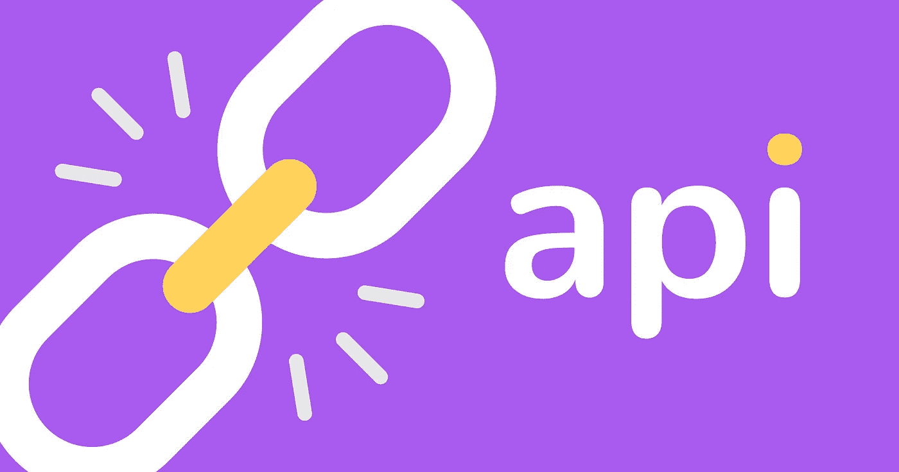
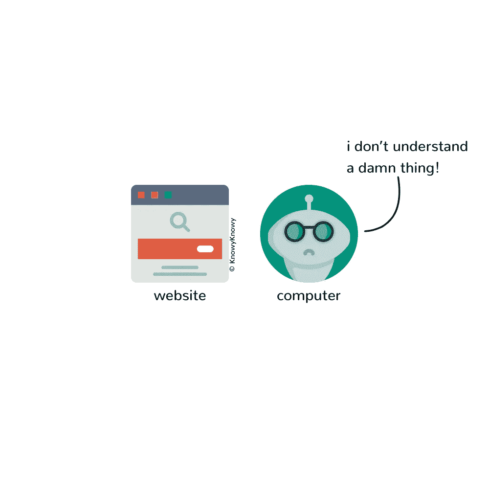
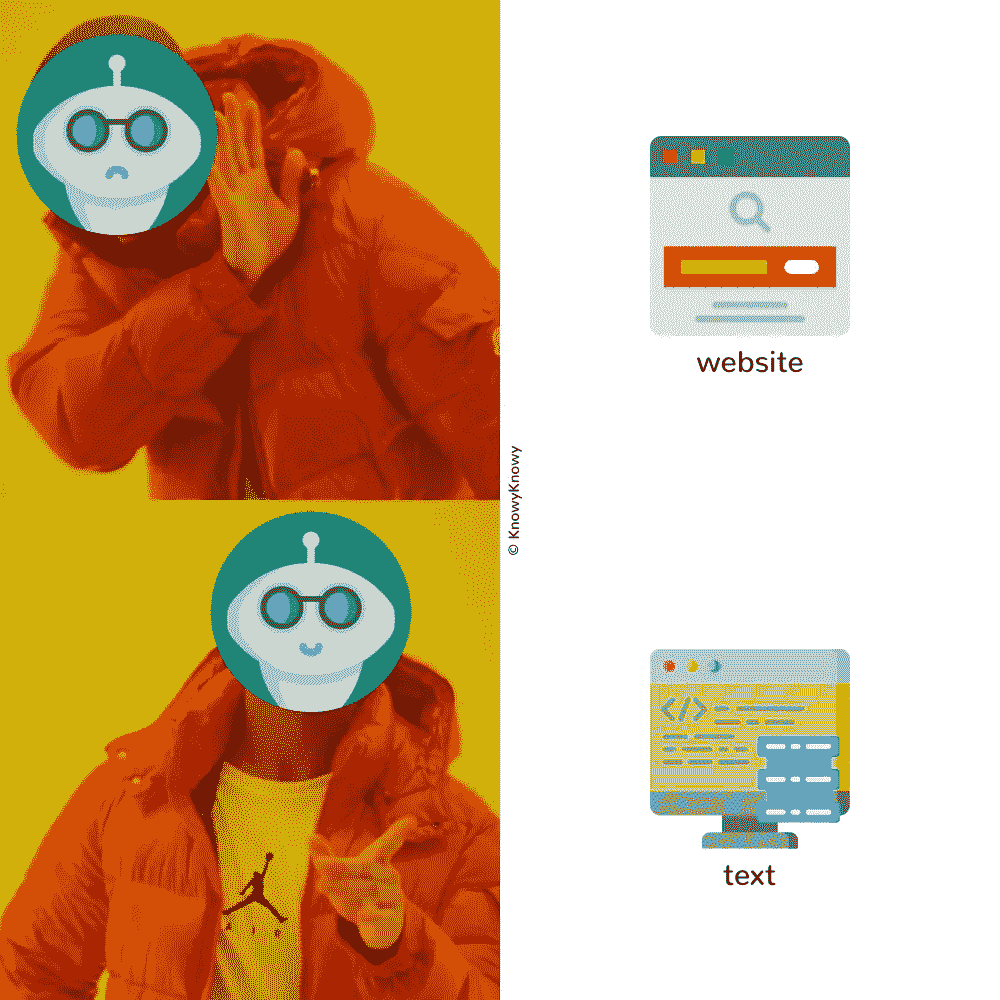
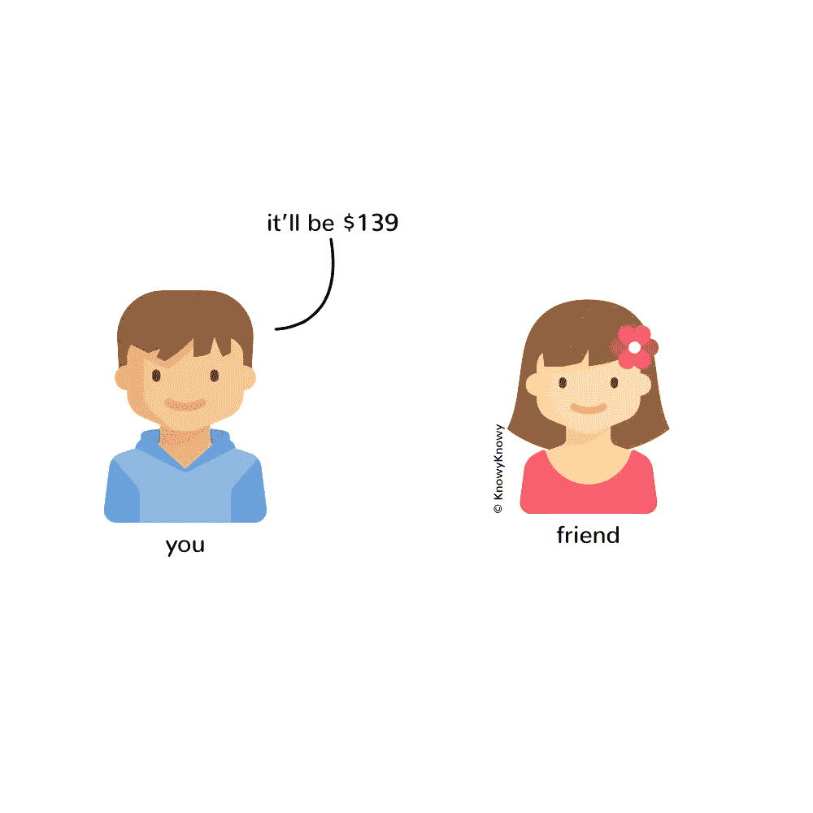
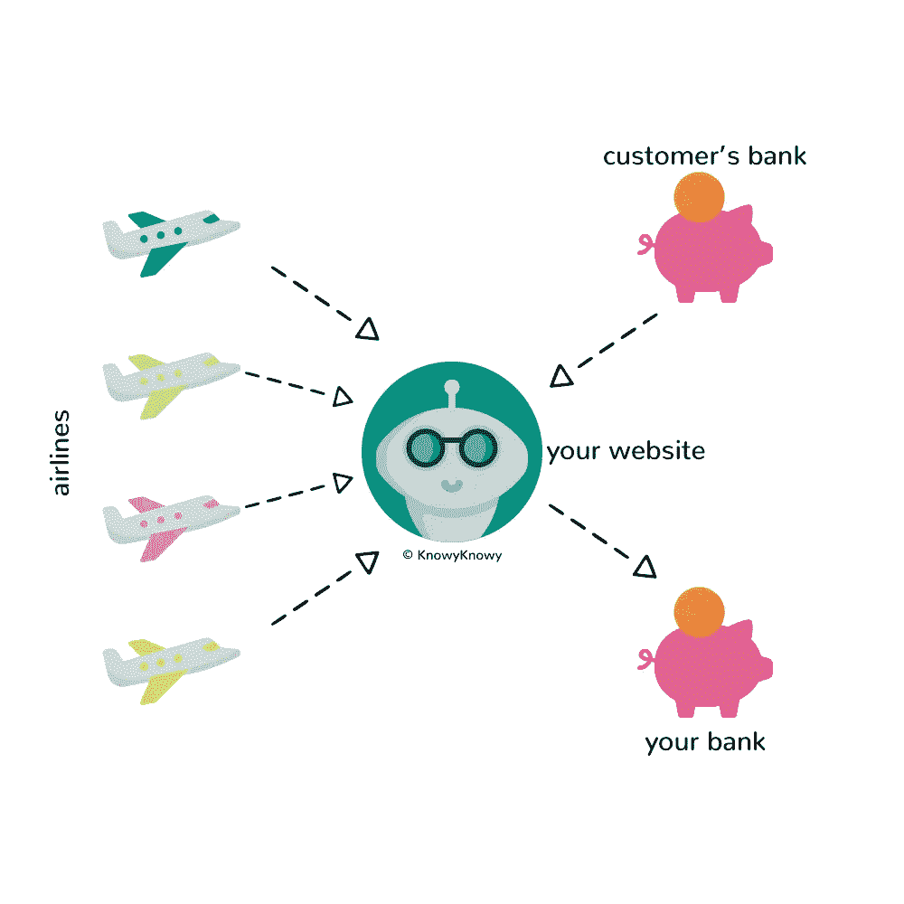
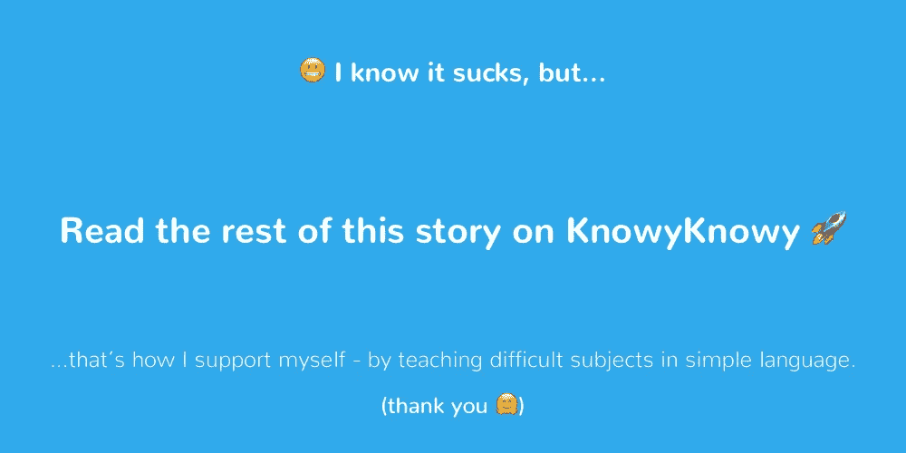

# api 到底是什么？

> 原文：<https://medium.datadriveninvestor.com/what-the-heck-is-an-api-6ed638dff08?source=collection_archive---------3----------------------->

## 用简明英语理解 API 的 2000 字终极指南。

如果 **你曾经接触过计算机工程师，**你肯定会注意到他们放弃了术语——API。一个软件工程师会将这个术语用于如此多不同的目的，以至于很容易失去对话的线索，并停留在那里，想知道“API 到底是什么？”

在我与工程师和经理共事的十年职业生涯中，很少有什么比 API 更令人困惑的了——仅仅是因为这个术语在如此多的不同上下文中使用。所以，让我用简单的英语来解释一下，

*   **如果你是经理**，你可以更好地与工程师交流，
*   如果你是一个极客，你可以让你的经理和非技术类的朋友阅读这篇文章，让他们掌握一些基本知识。

# 什么是 API？

**因为你在这里，**我假设[维基百科提供的定义](https://en.wikipedia.org/wiki/Application_programming_interface)并没有真正派上用场。让我们从 API 的完整形式——应用程序编程接口开始。

哇！那是一大堆术语。别急，我们一个一个分解。

首先，从完整形式来看，我们知道它是某种接口。但是什么是接口呢？我们能想出一些我们可能用过的其他界面吗？嗯，有一个——用户界面，或者简称为 UI。

注:如果你甚至不明白什么是用户界面，在 Twitter 上 ping 我[这里](https://twitter.com/mohitmamoria)，我会帮你分类。

在我们的上下文中，**用户界面**是一个屏幕(在台式机、笔记本电脑或移动设备上)，用户通过它与服务进行交互。这项服务可以是一个社交网站，一个机票预订手机应用程序，或者仅仅是一个像这样的博客。通过这个界面，用户(人类)可以使用服务，因为这些服务针对我们的感官进行了优化——视觉、听觉和触觉。

然而，计算机程序没有这些感觉。

虽然他们很难理解视觉设计，但他们更擅长理解书面文字。为使计算机程序能够与之交互而制作的接口称为应用编程接口(在这种情况下，“应用程序”可以与“计算机程序”互换使用)。

简而言之，API 允许其他计算机程序与服务进行交互。但是为什么我们需要电脑程序来相互交流呢？我们来看看为什么。

> *👋*顺便说一句，我是 [**KnowyKnowy**](https://knowyknowy.com) 的编辑，该杂志用简单的英语来教授像这样困难的科目。

# 为什么世界需要 API？

既然我们知道 API 是计算机程序与服务(其他计算机程序)对话的方式，问题就来了，我们到底为什么需要它们。

为了让我们认识到 API 的价值，让我们考虑一个例子。

# 一个没有 API 的世界

一个阳光明媚的早晨，你向全世界宣布，你开始帮助人们搜索和预订机票。你有一间办公室、一张桌子、一把椅子和一台笔记本电脑。你已经在网络浏览器的不同标签中打开了所有航空公司的网站。您可以开始工作了！

几分钟后，你最好的朋友打电话给你，问:“你好朋友，你能帮我预订从纽约到洛杉矶的最佳航班吗？”

你说，“当然，我的朋友。你想什么时候去？”

“请给我 2 月 14 日，”你的朋友回答。

“早上还是晚上？”

“我打算给我的异地恋男友一个惊喜，所以，早上好。”

“好的，请你稍等一会儿好吗？我会为你搜索最好的航班。”你挂断电话，开始疯狂地寻找最佳航班。你已经锁定了几个选项。你开始告诉你的朋友，“好吧，我有几个选择给你……”

当你正在叙述这些选择时，你的朋友打断了你，说:“嗯，我想，最好是我在 2 月 13 日之前出发。你能搜索一下前一天的最佳航班吗？”

作为一个善良的商人，你会用热情的声音掩饰自己的失望，并回应道:“没关系，我的朋友。请给我一点时间。”

经过一个小时的来回，最后，你能为你最好的朋友找到最好的航班。你让你的朋友马上给你的账户汇 139 美元，这样你就可以代表他们预订机票。

你的朋友摆弄着他们的手机，过了一段时间后，他们在你的账户上进行了一笔 139 美元的在线交易。一旦你收到这笔钱，你开始预订上述航班，这时你意识到票价增加了 35 美元。

有点尴尬的是，你把这个消息传递给你的朋友，他们又花了几分钟给你额外寄了 35 美元。

打了很长时间的电话，疯狂地搜索各种航空公司，进行了多次银行交易，你最好的朋友终于可以给他们的男朋友一个惊喜了。

你一挂断电话，你的邻居就打电话告诉你，“今年夏天我想和家人去冰岛旅游。你能帮我订机票吗？”

你生气地意识到这个电话将会是同样的冒险。不管怎样，你继续帮助你的邻居。

再打几个电话之后，一天就结束了，就这样，你决定关店。不值得！

当人类像“胶水”一样试图让多个部分一起移动时，这就是问题所在——接受客户的指示，在许多航空公司中搜索相同的东西，在头脑中手动比较选项，验证收到的付款，预订航班等。

> *人类是没有效率的粘合剂。电脑是。*

☝ [发这个微博？](https://twitter.com/intent/tweet?url=https%3A%2F%2Fknowyknowy.com%2Fapi&via=knowyknowy&text=Human%20beings%20aren%27t%20efficient%20in%20being%20the%20glue.%20Computers%20are.)

# API 驱动的世界。

**现在，让我们看看这个由 API 驱动的世界**。

你向全世界宣布你从事机票预订业务，任何人都可以“在你的网站上”搜索和预订最好的机票。

您的网站从您的客户那里获取信息，然后通过他们的 API 与所有航空公司对话，收集所有结果，比较并找到最佳航班，并在几秒钟内显示给您的客户。

一旦客户选择了航班，您的网站就会通过 API 与他们的银行沟通并接受付款。

一旦付款被确认，您的网站将代表客户通过 API 向选定的航空公司预订航班。

当你坐在角落的办公室里数钱的时候，你的网站自己做了所有的事情。

计算机程序通过 API 相互对话的能力，使得人们能想到的几乎所有事情都可以自动化。

# 如何可视化 API？

当我能够想象新事物时，我很容易就能学会。我们大多数人都是。所以，让我们试着*看看*API 是什么样子的。

.

.

.

[https://knowyknowy.com/api/](https://knowyknowy.com/rss/)

***(我已经在 KnowyKnowy 上免费提供了。你只需要用你的电子邮件地址订阅。谢谢大家！)***

[@mohitmamoria](https://twitter.com/mohitmamoria)