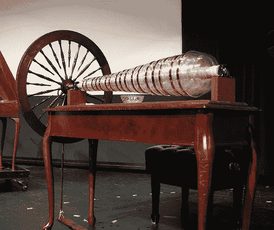
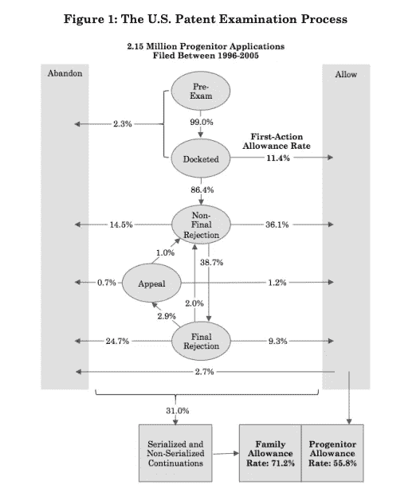
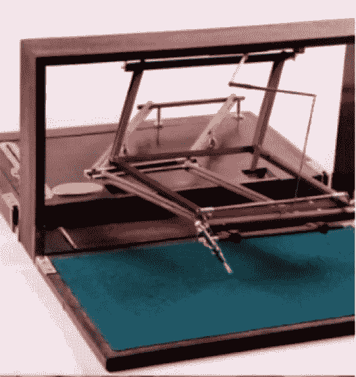
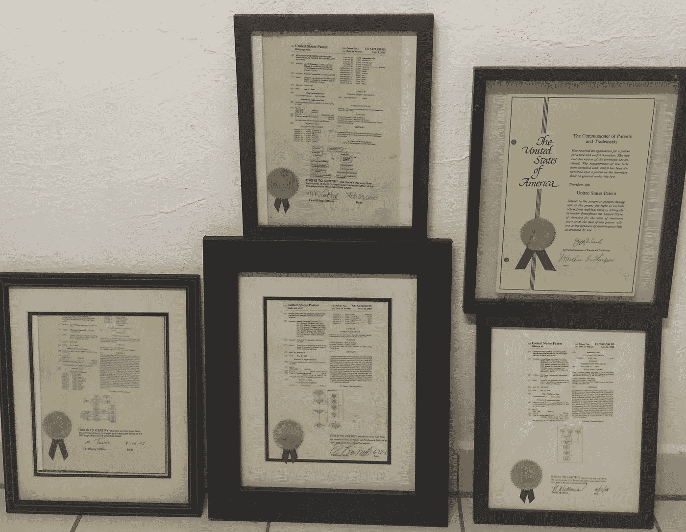
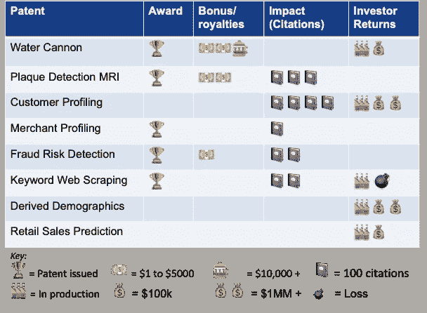
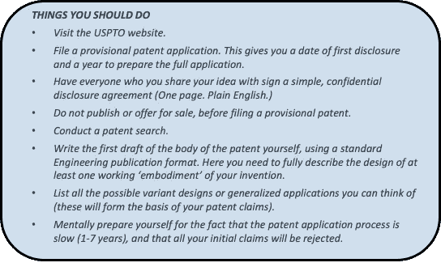
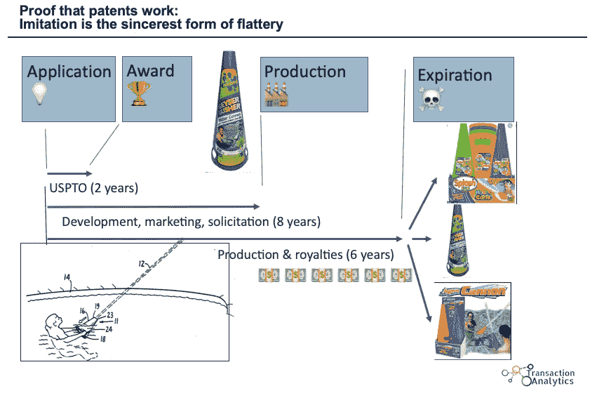

# 专利成功的衡量标准是什么？

> 原文：<https://medium.datadriveninvestor.com/what-the-measure-of-a-successful-patent-31ec17ee494?source=collection_archive---------3----------------------->

## **一个(谦虚地)成功的“专利高手”的智慧是什么**

Figure 1: Ben Franklin’s “Glass Armonica,” an organ built with glass — creating the sounds like those from running your finger around the rim of a wine glass. Image: *Franklin Institute*

据统计，申请专利是最愚蠢的投资。然而，每年有 30 万美国人提交申请(约占总人口的 0.1%)。一个应用程序可能要花费大约 5000 美元——而且只有在你自己完成大部分工作的情况下。89%的申请在初审中被拒绝。最终，经过多年的修改和上诉，大约 50%最终被接受(图 2)。在发布的专利中，只有大约 3%投入生产。当然，少于这个数字，投资就不亏不赚了。所以，如果你有专利产品出售，你就是“那 1%的 1%”如果你的期望是靠版税退休，那你就看错了。

 [## 成为数据科学家所需的 8 项技能|数据驱动型投资者

### 数字吓不倒你？没有什么比一张漂亮的 excel 表更令人满意的了？你会说几种语言…

www.datadriveninvestor.com](https://www.datadriveninvestor.com/2019/02/07/8-skills-you-need-to-become-a-data-scientist/) 

30 年前，当我申请第一项专利时，我就知道这些可能性。我读了十几本“如何做”的书，并开始忽略任何给我带来不便的建议。当然，我浪费了几年的专利寿命，并以艰难的方式了解了一切。尽管如此，我还是又提交了几份。其中两个在传统意义上得到了回报。他们中的两个为我的雇主在 T2 大赚了一笔。但我认为它们都是成功的。

Figure 2: U.S. Patent Process

这不是另一篇“如何做”的文章。(你需要知道的大部分内容都可以在 USPTO 网站上找到。)我希望传达*为什么*你应该获得专利。除了“奖杯”的乐趣和任何直接的经济回报之外，专利还会对你的职业生涯和业务产生影响，并会成为对知识的重大贡献。万一我成功说服了你，我在这过程中增加了一些有用的提示。

**知识产权保护**

*专利*一词来自拉丁语 *patere* ，意为“打开”这是一份合同，在合同中，你同意发表你的发明的完整的、可工作的设计，以换取一段固定时间内的专有权。很难想象一个新产品或公司在没有专利保护的情况下如何起步。

美国开国元勋认为知识产权如此重要，以至于在宪法中加入了知识产权条款。几位开国元勋本身就是发明家。本·富兰克林发明了著名的双光眼镜、富兰克林炉和避雷针。他还发明了导尿管、游泳脚蹼，以及他个人最喜欢的“玻璃 Armonica”(图 1)。托马斯·杰斐逊赞助了这项立法。他的发明包括优化犁、升降机、轮式密码、“旋转柜”和“测谎仪”(图 3)。美国专利成为世界黄金标准不足为奇。有些国家的专利实际上毫无价值，无法实施，但美国专利具有真实的物质价值和力量。

**Figure 3:** Thomas Jefferson’s polygraph (copy machine). **Fun Facts:** One inventor of the modern polygraph was William Moulton Marston, who also was the creator of *Wonder Woman* and her ‘Lasso of Truth’⁴. The Guilty Knowledge Test, developed for the polygraph remains the benchmark performance measure for the deception detection, including approaches using infrared, facial imaging, or fMRI brain imaging⁵.

**奖杯**

最实实在在的好处是*奖杯*——一个可以挂在墙上的专利，为你的简历增色不少，还可以展示给你的孙子们看(图 4)。但是对大多数发明家来说，真正令人兴奋的是看到他们的发明被使用。最终的验证会在你的专利到期的那一天到来，那时会有一些仿制品上市(见附录)。

**Figure 4:** My trophies — All I need is a wall to hang them on

**个人影响**

当我收到我的第一个专利时，我接受了这样一个事实:它注定默默无闻，只存在于我简历的后面和加利福尼亚州门洛帕克专利图书馆布满灰尘的书架上。最近出于虚荣心，我查看了我在谷歌学术的资料，发现我的 4 项专利被引用的次数比我的许多学术出版物都多(图 5)。

在学术界，对你发表的研究的引用被讽刺地称为“院长生产力指数”现在，有人可能会愤世嫉俗地说“认可你的同行”是一个低野心，但引用是一个粗略的衡量你对他人的影响。与学术出版物不同的是，它们被称为“现有技术”,主要是被那些正在建造*真实*事物的人引用——与你建造的基础相关或者在你建造的基础之上。

**Figure 5:** The author’s “patent scorecard.” Of 8 patents filed, 5 have been awarded (Refs 9–16). Five were commercially successful. One employer had a patent incentive/bonus plan. Two others resulted in royalties exceeding the costs. Finally, patent citations can be used as a rough measure of technical impact.

**单干(做任何事都要努力)**

对商业企业来说，专利的激励是显而易见的，而智力资本对初创企业来说至关重要。大公司更加矛盾，尽管知识产权专利是对抗竞争对手和专利流氓的重要防御策略。但是，除非你愿意冒险投入自己的时间和资金，进入一个充满经验丰富的从业者的行业，否则最安全的做法是许可你的想法。

如果你选择了这条路，我能给的最好的建议就是看几集《龙穴⁶.》看着一个发明家被一群投资者挖走内脏可能会很痛苦。但是，无论你做了多少准备，这很可能会发生在你身上。一些要点:

1.建立一个好看的，功能性的原型。如果这个太贵，找专业的渲染/绘图。

2.估计你的产品的潜在市场总量。反转沙袋无伤大雅；这让他们有机会“修正”你的估计…向上修正。

3.创建成本估算(访问一些制造商)。

4.给出一个现实的价格估计。

合理的版税可以是总销售额的 1-5%。注:预期产量越大，制造商可能同意的利润越低。在你的合同中加入两个重要条款，一个是保证最低年版税(GMAR ),另一个是“反搁置”条款——到期日，如果制造商没有在 3 years⁷.内将产品投入生产，你的权利将被恢复

**作为雇员申请专利**

许多商业企业禁止发表研究成果，但*将*支持专利申请。大多数人会支付法律费用，将你个人的 T4 风险降到零。不幸的是，很少有公司提供专利奖金，将你的*奖励*也削减为零。另一方面，大公司允许你接触到你自己难以企及的资源(如法律、市场研究、产品设计)。他们也有办法(现有的产品线、分销渠道、销售力量和投资资本)将产品快速有效地推向市场，从而大大提高您的成功几率。通过这个过程，您还可以获得整个产品开发生命周期的宝贵的第一手经验。

此外，准备专利申请的任务本身就有价值。专利局不要求一个物理的、工作的原型(永动机除外)。但是你需要描述一个完整的工作设计，至少是你发明的一个“体现”。因此，撰写专利要求设计文档的纪律和严谨性。任何管理过技术工作的人都经历过激励他们的团队记录他们的工作的挫折——或者更糟，不理解他们已经建立了什么。该文档实际上是一个设计方案。因此，它也可以用来向你的组织和潜在客户推销你的想法。

最后，考虑一下雇主让你参加的所有活动:合规培训、开放办公室、追踪费用代码、独立审计、重组、团队建设研讨会等等。退后一步，反思一下:你是在拿*的钱去发明* *的东西*。有多少人有那种工作满足感？从哪种世界观来看，这是一件坏事？回顾过去多年的咨询工作，这份工作唯一令人愉快的部分就是创造和发展新 ideas⁸.

**结论**

所以，去做吧！很好玩。这对个人和职业都是有益的。你 95%的时候都会面临拒绝。推行新想法令人疲惫不堪。你已经知道，大多数人本能地抗拒改变，缺乏想象力。这些人找理由说“不”，避开这些人。当你开始遇到越来越多有趣的人时，你知道你离成功越来越近了。

*Russell Anderson 拥有 30 年在金融服务、零售、电子商务和生物医药行业开发数据科学解决方案的经验。他曾在 IBM、KPMG、Opera Solutions、NICE/Actimize、HCL、HNC Software、Mastercard Europe、JP Morgan Chase 和苏格兰哈利法克斯银行担任科学顾问。他拥有加州大学生物工程博士学位，发表了 30 多篇科学论文，并拥有多项商业预测解决方案专利。*

欢迎提问/评论:anderson.transactionanalytics@outlook.com

**参考文献**

1.迈克尔·卡利、迪帕克·海格德和艾伦·马尔科(2015)。获得美国专利的概率有多大？*耶鲁夏河&科技***17(1):**203–223。[https://digitalcommons.law.yale.edu/yjolt/vol17/iss1/5/](https://digitalcommons.law.yale.edu/yjolt/vol17/iss1/5/)

2.美国专利商标局网站[https://www.uspto.gov/](https://www.uspto.gov/)

*3。*美国宪法第一条第八款。“国会有权……通过在有限的时间内保护作者和发明家对他们各自的著作和发现的专有权，来促进科学和实用艺术的进步。”

4.[https://en.wikipedia.org/wiki/William_Moulton_Marston](https://en.wikipedia.org/wiki/William_Moulton_Marston)

5.丹尼尔·朗勒本(2005 年 7 月)。用于检测和评估欺骗和隐蔽识别以及对信息的认知/情感反应的功能性脑成像。美国专利申请 2005/0154290

6.原来，日本电视节目的名字是*金钱老虎*。其他特许经营包括*鲨鱼坦克*(美国)，或者*Die hle der lwen*(德国)。

*7。*果尔德施坦因专利律师事务所网站。获得许可协议的秘密。**[https://goldsteinpatentlaw . com/the-secret-of-obtaining-a-licensing-agreement/](https://goldsteinpatentlaw.com/the-secret-of-obtaining-a-licensing-agreement/)**

**8.拉塞尔·安德森(2019 年 11 月)。你会从这个人那里购买见解吗？*走向数据科学*。https://medium.com/me/stats/post/1a3054574bda**

***9。*拉塞尔·安德森(1990)。“游泳池水炮。”美国专利第 4925181 号(waters ports LLC)[https://www . stream machine . com/ecomm/product/84000-4-geyser-water-cannon](https://www.streammachine.com/ecomm/product/84000-4-geyser-water-cannon)**

**10.____ (2008)."使用内容挖掘的预测模型检测和测量风险."美国专利号 7，376，618 和 8，032，448 (2011) (Fico)。**

**11._____ (2008).“从大型数据库中获取记录关键字描述的系统和方法”美国专利第 7，363，308 号(Fico)**

**12._____ (2010)."血管斑块检测和分析的自动化方法和系统."美国专利第 7，657，299 号和第 8，068，894 号(2011 年)，新加坡和欧亚专利第 119754 号(2007 年)(ISCHEM 公司)。**

**13._____ (2012).“用于构建和利用从客户购买交易数据导出的商家数据库的系统和方法”美国专利第 8，175，908 号(JP 摩根)**

**14._____ (2003)."用于在客户层面聚集和利用零售交易记录的系统和方法."美国部分(CIP)专利序列号 09/988，291 和美国专利申请 10/638，648 (IBM 和 JP 摩根大通)**

**15._____ (2003).“从交易数据导出产品人口统计的系统和方法”美国专利申请序列号 10/638，643 (JP 摩根大通)**

**16._____ (2005).“用于监控零售总额的系统和方法”美国临时专利申请 60/690，386 (JP 摩根大通)。**

****附录****

****

**Appendix: Life cycle of the Swimming Pool Water Cannon. Knock-offs arrived on the market within 2 months of patent expiration date.**