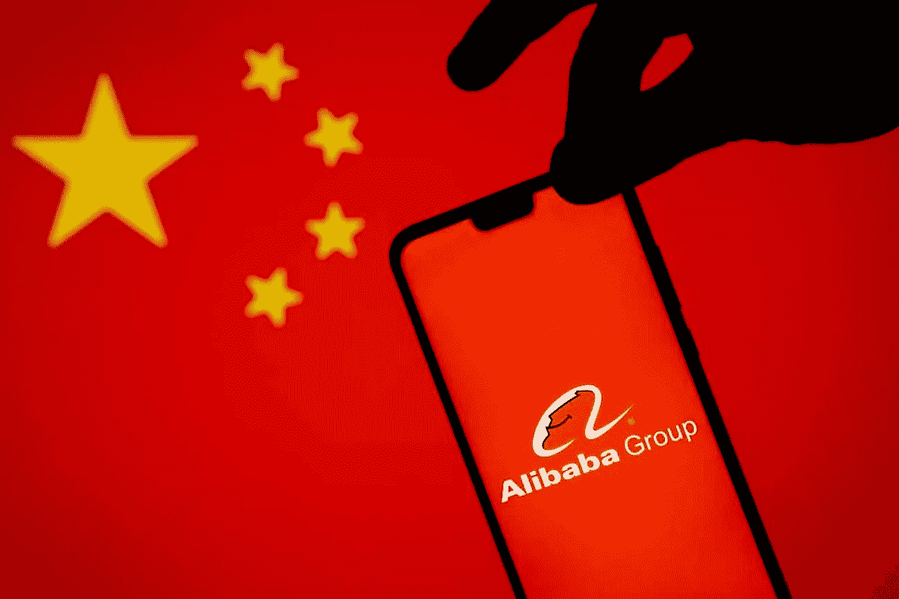

# 中国反垄断法的拟议修改对中国企业意味着什么

> 原文：<https://medium.datadriveninvestor.com/what-the-proposed-changes-to-chinas-anti-monopoly-law-mean-for-businesses-in-china-f8b131b23c6f?source=collection_archive---------34----------------------->

Image via: [Adobe Stock](https://stock.adobe.com/)

# 摘要

在最初的《反垄断法》颁布仅十几年后，目前的修订提案承诺加强中国的反垄断执法，重塑世界第二大经济体的监管格局。监管机构近年来的行动表明，它们致力于更有力地打破垄断，补充法规草案表明，中国希望其执法力度像西方一样强。

***想呆在对一切都了如指掌的中国？订阅我们的简讯*** [***见解直达您的收件箱***](https://thechinaguys.com/newsletter-signup/) ***。***

………

尽管市场经济擅长于促进竞争和鼓励创新，但如果不加控制，问题将不可避免地出现。即使在美国，自里根政府的太平日子以来，放松监管已经成为保守派的一种宗教，一个负责监管私营和上市公司的反应灵敏的官僚机构仍然牢牢地留在原地。反垄断法(在美国以外通常指反垄断法或竞争法)就是这种情况。

尽管一些评论人士哀叹，面对亚马逊、谷歌和脸书等美国巨头创造的新环境，反垄断执法缺乏活力，但反垄断监管仍然不是一件草率的事情。2020 年，远非破纪录的一年，DOJ 仍然征收了高达 5 亿美元的反垄断刑事罚款。虽然中国相对较新的反垄断法没有美国反垄断执法中的传奇历史，但近年来对公司的处罚有所增加。现在，随着反垄断法修订草案和多项明确涉及反垄断问题的法规草案的发布，一切都表明执法将变得更加有力。

# 中国反垄断法的初步形成

如果任其自生自灭，竞争环境中的企业随着实力和影响力的增长，会有动力越来越依赖垄断做法，无论是通过一家公司在特定市场获得主导地位，还是通过少数几家领先公司同意阻止新的挑战者进入它们的领域。19 世纪晚期，美国可能是第一个看到大公司和铁路集团大规模发生这种情况的国家，1890 年通过了谢尔曼反垄断法，打破了新兴的垄断。自那以来，反垄断调查一直是美国监管环境的重要组成部分，具有里程碑意义的反垄断案件每隔几十年就会出现一次，1982 年美国电话电报公司公司和 2001 年微软公司的解体是过去半个世纪中最突出的例子。现在，一些人说是时候进行新一轮里程碑式的反垄断诉讼了。

鉴于反垄断或反垄断法对大型现代经济体监管的重要性，中国等了几十年才在 2008 年颁布专门的反垄断法规或许有点令人惊讶。虽然改革开放前的现代中国法学很少，但中国现行民法典的大部分仍然可以追溯到改革开放初期的 80 年代。然而，几十年来，中国的反垄断法分散在许多不同的法律和监管法规中。

当然，中国反垄断法最初颁布的历史背景与 19 世纪 90 年代美国不受约束的资本主义有很大不同。事实上，国有企业——通常相当于国有垄断企业——是毛时代中国的一个典型特征，并且直到今天也是中国经济的主要组成部分。当然，由于国有企业的主要目的之一是为公民提供就业，其激励机制与西方企业完全不同。在改革开放时期，私营和上市公司之间的垄断行为并不是当务之急，这也许并不奇怪。在这种担忧真正浮出水面之前，中国经济必须首先消化大量低效臃肿的国有企业。

然而，随着世纪之交后非国有企业在中国经济中的地位上升，建立专门的反垄断法规的必要性变得更加明显。2007 年颁布并于 2008 年生效的中国《反垄断法》旨在将这一重要组成部分纳入监管框架。这里还有一个不可告人的动机:尽管大多数中国人见证了中国经济的一些最具爆炸性的增长，但中国国内最大的公司仍主要是国有企业。当时在中国运营的最大非国有企业实体是外国实体，至少有间接证据表明，在中国运营的外国实体可能是中国初出茅庐的反垄断调查的最初目标。例如，在反垄断法颁布后的第二年，它被用来否决可口可乐(Coca-Cola)对中国最大的国内果汁企业汇源(Huiyuan)的收购。

过去十年见证了许多有影响力的中国私营或上市公司的崛起，其中包括华为、平安、JD.com，当然还有阿里巴巴。此外，[尽管仍然严重“臃肿”和过度杠杆化](https://thechinaguys.com/veiled-intentions-long-term-mindset-beijing-rejects-market-oriented-soe-reform/)，多年的改革也只是略微提高了国有企业的效率。随着中国国有企业对竞争的日益重视，反垄断监管在这里也被证明是有价值的(尽管法律有些矛盾，反垄断法第 7 条为国有企业的某些垄断倾向提供了更多的余地，但第五章“滥用行政权力排除、限制竞争”的全部内容旨在监管国有企业和政府机构等)。考虑到中国经济的快速成熟，对反洗钱的修订被提上日程或许并不意外，修订草案将于 2020 年 1 月发布以征询公众意见。

# 《反垄断法》2020 年修订草案的显著变化

总体而言， [2020 年反垄断法修订草案](https://www.chinalawtranslate.com/en/draft-revisions-of-the-anti-monopoly-law-public-comment-draft/)(简称“反垄断法草案”)似乎表明，在反垄断问题上，监管制度将向更积极的方向转变。通过几项新规定，反洗钱法草案既扩大了法律的范围，又增加了执法行动和处罚的力度。具体增加的内容包括“组织和便利其他企业缔结垄断协议”(第 17 条)，这表明涉及协调公司或价格垄断集团的更复杂的计划现在将更容易处理。根据该法第三章，新的语言扩大了滥用支配地位的适用范围，包括专门针对新兴技术公司的语言。第 21 条提出了新的措辞，即“……确认在互联网领域具有市场支配地位的经营者，还应当考虑网络效应、规模经济、锁定效应、确定和处理相关数据的能力等因素。”

修正案还扩大了合并交易需要向监管机构申报的范围，并进一步授权监管机构调查未申报此类通知的情况。法定罚款也显著增加，为全面计算罚款提供了更多的余地。这与过去几年反垄断案件中罚款金额越来越大的趋势一致。这些修订还为反垄断案件中的刑事责任铺平了道路，增加了一个重要的组成部分(虽然在反垄断案件中有几起刑事处罚案件，但这些案件都是在公司员工在案件中实施相邻犯罪行为的情况下发生的，例如当反垄断调查人员对其公司进行突击审计时殴打调查人员)。

负责执行反洗钱的机构是国家市场监管局(“SAMR”)。SAMR 在 2018 年才成立，这是政府部门大规模重组的结果，取消了曾经至关重要的机构，如国家工商行政管理总局(“SAIC”)，同时将其他多个机构直接置于其控制之下，包括国家知识产权局。这次重组导致先前负责反垄断执法的多个政府机构(反垄断和反不正当竞争局、价格监督和反垄断局、反垄断局和反垄断委员会)被合并到 SAMR 反垄断局之下。这在效率方面可能是有利的，因为监管者能够更容易地协调和避免浪费资源。SAMR 的成立代表着监管权力的大规模整合，在其短短两年的历史中，它从未回避在反垄断执法方面挑战极限。去年年初，在对三家制药公司的反垄断调查中，中国被处以 3.255 亿元人民币(5020 万美元)的罚款，这是现行法律允许的最高金额。

# 十一月惊喜

2020 年 11 月 10 日，SAMR 公布了其《平台经济反垄断准则草案》(简称《准则草案》)，邀请有兴趣的各方在 2020 年 11 月 30 日前提交对准则的意见。指导方针草案在反洗钱草案中出现的几个简短段落的基础上增加了一倍，以创建一个强大的框架，SAMR 反垄断局可以通过该框架对互联网公司实施反垄断执法。该准则涵盖垄断协议、滥用市场支配地位问题和经营者集中。

指导意见征求期结束仅几天后，SAMR 就开始猛烈抨击马云。2020 年 12 月 14 日，根据《反垄断法》第 48 条，反垄断局[对阿里巴巴处以 50 万元人民币(77，145 美元)的罚款](http://www.samr.gov.cn/fldj/tzgg/xzcf/202012/t20201214_324334.html)，原因是其违反了收购百货运营商银泰零售集团(Intime Retail Group)的申报要求。截至 2017 年年中，阿里巴巴已收购银泰 73.79%的股权，但未能向 SAMR 提交所需文件。在一项行政裁决中，SAMR 发现阿里巴巴违反了现行反垄断法的[第 21 条，该条规定，“任何集中……必须事先通知反垄断当局……”然而，该裁决也让阿里巴巴逃脱了更严厉的监管执法，例如根据现行反垄断法](https://www.wipo.int/edocs/lexdocs/laws/en/cn/cn099en.pdf)的[第 48 条暂停业务集中，因为发现该收购没有对排除或限制竞争产生任何影响。请注意，如果按照新的反洗钱草案(相关措辞见第 55 条，原第 48 条)计算，罚款可能会高得多，高达经营者上一年销售额的 10%。阿里巴巴在 2019 年的年收入为 3768 亿元人民币(581 亿美元)，因此，仅仅因为没有提交反洗钱草案规定的文件，最高假设罚款可能高达 376.8 亿元人民币(58 亿美元)。](http://english.mofcom.gov.cn/article/policyrelease/Businessregulations/201303/20130300045909.shtml)

或许更令人担忧的是，短短十天之后，SAMR 反垄断局发布了一份简短的公告，表示正在调查阿里巴巴涉嫌垄断的“二选一”行为。“二选一”的做法当然不是阿里巴巴独有的，尽管阿里巴巴可能是罪魁祸首。这种做法涉及强迫较小的商家选择仅在一个电子商务平台上列出产品，如果在另一个主要竞争对手的平台上发现，将面临被阿里巴巴摘牌的风险。这引发了对滥用市场支配地位的担忧，以及对反垄断协议的担忧，如果发现阿里巴巴与其他主要在线平台合作，强迫中小商家签署此类协议。

马云的另一家公司蚂蚁金服(Ant Financial)是过去几个月媒体关注的焦点，迄今为止它成功躲过了反垄断调查——它的麻烦出现在其他监管领域。然而，这可能很快就会改变，因为中国人民银行于 1 月 20 日发布了另一套法规草案——非银行支付机构的[条例(征求意见稿)](http://www.gov.cn/hudong/2021-01/21/content_5581574.htm)。早在 2020 年 11 月，中国人民银行和中国银行业监督管理委员会联合发布了关于网络小贷服务管理的规定，这给去年[备受期待的蚂蚁金服 IPO](https://thechinaguys.com/what-ants-ipo-flop-means-for-chinas-consumer-finance-industry/) 泼了一盆冷水。最新一轮的法规草案包括几项条款，旨在规范支付宝和微信支付等非银行支付机构的反垄断行为。第 55-57 条和第 64 条规定了中国人民银行与 SAMR 合作的途径，即在发现市场支配地位的情况时，向此类实体发出警告或启动反垄断调查。

# 未来会怎样

在 10 多年前建立了最初的反垄断机制后，中国已经在将反垄断执法作为其市场监管的一个关键特征方面取得了长足进展。随着时间的推移，罚款稳步增加，这表明了这一点。在更传统的行业中，许多其他公司被课以重罚。现在，中国监管机构的目标是让中国的科技巨头遵守新的法律法规，根据现行法律对阿里巴巴和其他主要互联网公司处以 50 万元人民币(合 77，145 美元)的罚款可能是一个警告，一旦所有的法律草案和法规草案正式生效，更严格的反垄断监管肯定会到来。

*原载于 2021 年 1 月 28 日 https://thechinaguys.com**[*。*](https://thechinaguys.com/what-the-proposed-changes-to-chinas-anti-monopoly-law-mean-for-businesses-in-china/)*