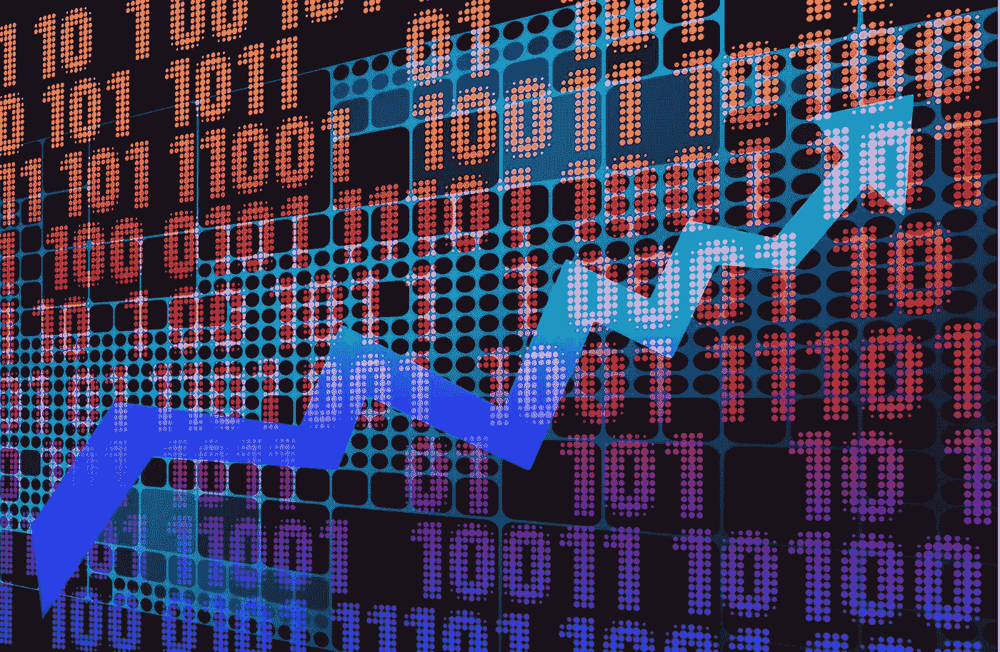

# GameStop 怎么办？

> 原文：<https://medium.datadriveninvestor.com/what-to-do-with-gamestop-c1435665138d?source=collection_archive---------26----------------------->

## 如何处理疯狂？

Image by [Dieter zabel](https://pixabay.com/users/agenciafotografik-8268536/?utm_source=link-attribution&utm_medium=referral&utm_campaign=image&utm_content=5338631) from [Pixabay](https://pixabay.com/?utm_source=link-attribution&utm_medium=referral&utm_campaign=image&utm_content=5338631)

如果你关注财经新闻，那么你可能已经读过 GameStop (GME)的崛起。这家昏昏欲睡的视频游戏零售商几个月前的股价为每股 5 美元，原因是盈利疲软，前景黯淡。昨日，该股收于每股 347.51 美元。

***五个月内增长了 70 倍！***

我不打算讨论为什么会发生这种情况——许多其他文章已经讨论过了。

我想讨论一下你应该做什么或者不应该做什么。

## GameStop 值

大多数人参与股票市场是用心而不是用脑。他们基于希望买入，基于恐惧卖出。不幸的是，结果通常令人失望。投资应该是一件不带感情色彩的事情，逻辑和数字决定了要采取的行动，而不是直觉。投资不应该是令人兴奋的，但应该专注于评估你正在关注的企业，以确定它们是否值得拥有。

当看到像 GameStop 这样的企业时，我们总是要问自己的第一个问题是“价值是什么？”。价格的大幅上涨本身并不能告诉我们这种上涨是否合理。我们必须运行这些数字来了解这只股票以前是被严重低估了还是现在被高估了(或者两者都是！).

有几点需要考虑:

*   GameStop ***过去两年亏损*** 今年又有可能亏损
*   GameStop 的 [10 年平均收益(PE10)](https://www.investopedia.com/terms/p/pe10ratio.asp) 为每年 8730 万美元，但这些收益以每股计算每年缩水约 22%(我用过去 10 年的平均收益来平滑 Covid 锁定等商业周期)
*   [净资产收益率](https://www.investopedia.com/terms/r/returnonequity.asp)的 10 年[年复合增长率(CAGR)](https://www.investopedia.com/terms/c/cagr.asp) 为-3.4%，这意味着 ***他们在过去 10 年里摧毁了价值***
*   公司的 ***债务几乎是股权*** 的 150%
*   [流动比率](https://www.investopedia.com/terms/c/currentratio.asp)刚好在 1.0 以上，意思是 [***流动资产***](https://www.investopedia.com/terms/c/currentassets.asp) ***刚好覆盖*** [***流动负债***](https://www.investopedia.com/terms/c/currentliabilities.asp)

不需要大量的调查就能看出 GameStop 目前的状况并不是一幅财务健康的画面。

> 如果你有一大笔现金，你会买这家资产负债表疲软、亏损不断累积、增长前景不佳的公司吗？

哦，那要看价格了，不是吗？

Image by [Gerd Altmann](https://pixabay.com/users/geralt-9301/?utm_source=link-attribution&utm_medium=referral&utm_campaign=image&utm_content=3972311) from [Pixabay](https://pixabay.com/?utm_source=link-attribution&utm_medium=referral&utm_campaign=image&utm_content=3972311)

## 价格

当 GameStop 在 8 月份以每股 5 美元的价格出售时，这是 10 年收益 3.7 美元的价格，这意味着你每 1 美元的平均收益只需支付 3.7 美元。 ***这个价格可能好，也可能不好，就看你觉得公司以后怎么做了。***

然而，在目前每股 347.51 美元的价格下，十年平均收益的价格已经上升到近 260 美元，这意味着你为平均收益的每一美元支付 260 美元。鉴于当前收益为负，增长前景不确定，这显然是一个很高的价格。

如果你想买你朋友的咨询公司，这家公司在过去十年平均每年盈利 10 万美元，但目前亏损，你会向他支付 2600 万美元吗？不太可能。

***那是 PE10 260 的 GameStop。***

但如果你认为你能扭转局面，你可能会考虑付给他 37 万美元，对吗？

***也就是以 3.7 的 PE10 买 GameStop***。

> 都是同一家公司，唯一的区别就是价格。

## 怎么办？

那么，如果 GameStop 目前的价格太高，投资者能做些什么呢？

1.  你可以购买 GME(直接购买或使用期权)，希望它在当前的投机狂潮中上涨。这是不可取的，很容易导致你失去你的资本。
2.  就像一些对冲基金试图从价格下跌中获利一样，你可以做空, [***做空,***](https://www.investopedia.com/terms/s/short.asp)***【GME】***但做空是很棘手的，因为你使用的是无限下跌的[保证金](https://www.investopedia.com/terms/m/margin_debt.asp)(债务),市场保持非理性的时间可以超过你保持偿付能力的时间，正如一些人在过去几天非常公开地了解到的那样。
3.  ***你什么都不能做*** 。只是坐在一旁，惊奇地看着其他人用他们的钱做疯狂、情绪化的事情。你不会赢得任何东西，但你也不会像许多人一样失去一切。
4.  ***你可以购买*** [***看跌期权***](https://www.investopedia.com/terms/p/putoption.asp) 试图在 GME 未来崩盘时套现，而没有卖空保证金的风险。

> 什么都不做是最安全最聪明的赌注。不参与如此令人兴奋的事情可能很难，但这是在疯狂、高风险的事情发生时保证你保护资本的唯一方法。

Image by [RENE RAUSCHENBERGER](https://pixabay.com/users/rauschenberger-4614580/?utm_source=link-attribution&utm_medium=referral&utm_campaign=image&utm_content=3848628) from [Pixabay](https://pixabay.com/?utm_source=link-attribution&utm_medium=referral&utm_campaign=image&utm_content=3848628)

***如果你不能坐以待毙，那就考虑买入看跌期权。你可能会从一只估值过高的股票未来可能下跌的价格中获利，而你最多可能损失的是你为看跌期权支付的溢价。你避免了保证金债务、无限的下跌空间，以及股价继续上涨时卖空者面临的压力。***

然而，你确实需要知道你在做什么，以确保你得到的期权在执行价格、到期日和支付的溢价方面对你有利。 你可以从这篇 [Investopedia 文章](https://www.investopedia.com/articles/optioninvestor/09/buying-options.asp)开始，了解更多关于期权的信息。

如果你还不熟悉这些选项，你最好不要参与其中。你可以好好学习，努力为下一集市场低效充分展现做好准备！

*免责声明，我在 GME 以看跌期权的形式持有少量看跌头寸，我希望我不会后悔没有做任何事情！*

## 资源:

如果你想了解更多关于投资的知识，可以看看下面的文章:

 [## 2021 年你能做的最精明的财富积累之举

### 如何在“万物泡沫”期间投资

medium.com](https://medium.com/datadriveninvestor/the-shrewdest-wealth-building-move-you-can-make-in-2021-e423001880b2)  [## 市场疯狂

### 埃隆·马斯克解决了一个老问题。

medium.com](https://medium.com/datadriveninvestor/market-madness-3f0b5649e62c)  [## 如何通过投资获得成功

### 来自本杰明·格拉哈姆的永恒教训

medium.com](https://medium.com/the-innovation/how-to-find-success-with-investing-411fb59d54f8) 

我与列出的任何网站都没有关系，也没有从任何合作伙伴或我的文章推荐中赚钱。我不是律师，会计师，或注册理财规划师。所有材料都是基于我的知识和经验，出于提供信息的目的而真诚呈现的。它无意取代专业建议。在做出任何法律、税务或财务决定之前，你都应该向专家咨询。