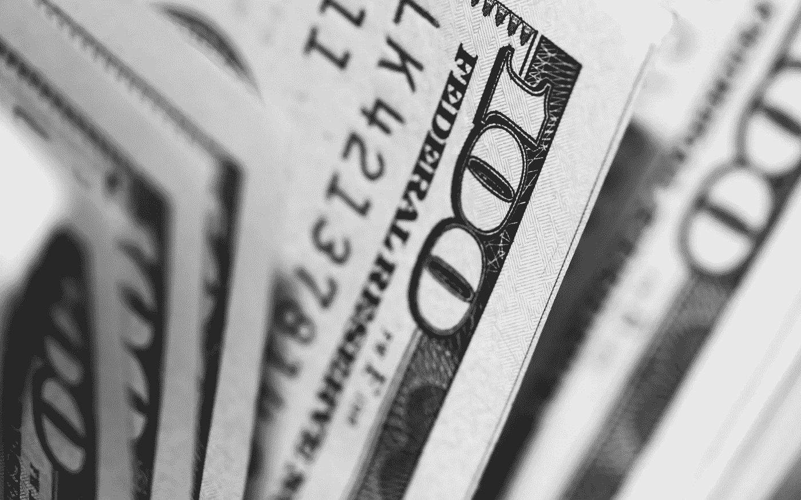

# 在疫情时期，如何处理你的刺激资金？

> 原文：<https://medium.datadriveninvestor.com/what-to-do-with-your-stimulus-money-during-a-pandemic-35212436dbf2?source=collection_archive---------12----------------------->

目前，全世界几乎每个人都受到了冠状病毒的影响。在过去的四个月里，世界已经变得不同了，但是有一件事是肯定的，那就是我们将会度过这个难关，尽管它不会毫发无损。

那么，我该如何为即将到来的事情做准备呢？

即使没有人能预测未来，但有一点是肯定的，我们会保护它。所以问题变成了我现在用我的钱做什么？好吧，如果你只是一起回避新闻，你可能不知道目前的失业率已经上升到 4.4%，并继续增长，这是自 1975 年以来最大的月环比增长。最糟糕的是，这种情况还会继续。目前有超过 700 万人失业，如果冠状病毒继续破坏我们的经济，这个数字可能会增加两倍。

因此，随着我们的国家陷入危机，我们的经济停滞不前，人们失去工作，我应该如何处理我的钱，或者我将收到的刺激支票。

 [## 影响者在聚光灯下表演|数据驱动的投资者

### 影响者营销是一个脱颖而出的游戏。结果是一个令人难忘的-和可信的-连接到一个产品或…

www.datadriveninvestor.com](https://www.datadriveninvestor.com/2020/01/15/influencers-perform-in-the-spotlight/) 

在完成基本的课程(食物、账单、房租)后，你应该做的第一件事是确保你有一个应急基金。你可能听说过每个人都应该有一个 6 个月的应急基金。这可能是你能做的最重要的事情。正如当前事件向我们展示的那样，你无法预测什么时候会发生什么，你需要动用应急基金。

关于应急基金，你需要知道几件事。首先，确保你坚持一个预算，这样你就可以在达到 6 个月的开销之前为基金做贡献。第二，资金应该是流动的。这意味着你可以轻松快捷地拿到钱。想想你可以提取的储蓄账户或货币市场账户。

所以，也许你可以把刺激计划的一部分用于应急基金，而不是全部花在不必要的项目上。如果你能足够自律地坚持储蓄，你会惊讶于你的基金增长有多快。

如果你还没有开始这个基金，你还不算太晚，今天就开始吧。制定你的预算，开始财务保障之旅。

如果你足够幸运，仍然有工作并有应急基金。下一个问题是，我现在应该拿我的钱或那张刺激计划支票做什么？

**我应该把它留在银行吗？**

**我应该把它们都拿出来放在家里吗？**

我应该买我一直想要的新款 70 英寸电视吗？

我应该继续/开始投资股票市场吗，尤其是现在它表现如此糟糕？

虽然你肯定会觉得第一个选项更舒服，另一个选项更开心，但最后一个选项是目前最好的。

需要注意的第一个重要信息是，股市**总是**上涨。现在这种情况发生的时间是不可预测的，但它会回升。对大多数人来说，股票市场是一项长期投资，因此现在是买入的好时机。

每个星期都像是市场中新的一天，一个星期每天都在下跌，而其他几个星期每天都在上涨。把握市场时机是不可能的，所以不要去尝试。那么如何投资呢？

以下是我对如何投资的两条建议。

首先，当你认为市场已经达到一个很好的低点时，你可以一次性购买你喜欢的股票或 ETF。(这个理论的问题是，你永远不会知道什么时候是完美的时机)。

第二个选择，也是我的偏好，是你一次对冲一点点买入。假设你有 1000 美元投资，市场正在下跌，也许你每周买几百美元的股票。这给了你一个更一致的策略，而不仅仅是试图猜测市场何时触底。这可能看起来违反直觉，但请这样想。

如果你一周前以 10 英镑/股买入一只股票，下周又以 9 英镑/股买入，你可能会因为没有等到 9 英镑/股就全买了而感到沮丧，但至少你已经以好价格买了一些。试图等待和猜测底部往往会导致你以更高的价格购买股票，因为你等待了很久，希望股票会进一步下跌，但它最终却上涨了。当你意识到这一点时，你跳进市场，以每股 11 英镑的价格买入了那只股票，却错过了低价买入的机会。相信我，对于新手投资者来说，从长远来看，这通常会给你带来不错的回报。

我的另一个建议是不要投资你通常不会买的股票。例如，仅仅因为像嘉年华或航空公司这样的旅游股票远低于其正常水平，就要确保你在购买任何股票之前都要审查该股票(晨星这样的网站或你的经纪网站如富达可以帮助你找到信息)。虽然这些看起来很划算，因为它们的价格很低，但是在没有任何知识的情况下就跳进去从来都不是一个好的计划。有一点是肯定的，现在是买入的好时机。所以，你能去买你一直想要的新电视吗？当然，但要从长远考虑，以 20%或更高的售价购买这些股票会给你带来巨大的回报。

所以记住，每个人都喜欢大甩卖，现在股票正处于多年来最大的甩卖中。