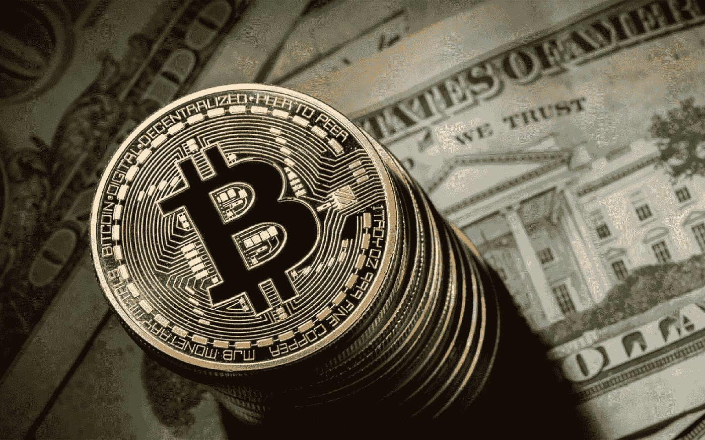

# 都铎琼斯比特币投资对其他机构投资者和比特币意味着什么

> 原文：<https://medium.datadriveninvestor.com/what-tudor-jones-bitcoin-investment-means-for-other-institutional-investors-and-for-bitcoin-4e1cf477306b?source=collection_archive---------9----------------------->

Bitcoin: digital gold and store of value

华尔街投资者保罗·都铎·琼斯最近披露，他的对冲基金将开始交易比特币期货，以获得约占其总投资组合 2%的比特币敞口，这成为了过去一周的财经头条。然而，很少有人讨论的是，对于一位在华尔街备受尊敬的机构投资者来说，是什么原因让都铎·琼斯采取了如此重要且仍然逆势的投资举措。

从正确的角度来看，保罗·都铎·琼斯不是千禧一代。他是婴儿潮时期出生的，是华尔街的老手。一个在 80 年代成名的人，当时迈克尔·米尔肯和伊凡·博斯基咆哮着华尔街，并启发了好莱坞电影 [*华尔街*](https://en.wikipedia.org/wiki/Wall_Street_(1987_film)) 中的虚构人物戈登·盖柯和巴迪·福克斯。在这种情况下，他对比特币的开放甚至更引人注目，因为数字化和加密货币——对于他这个年龄的人来说(无意冒犯，我自己也接近那个年龄组)——并不完全在 DNA 中。相反，考虑像比特币这样具有革命性特征和复杂性的资产，需要开放的思维和批判性的思维。也许，他的医学博士洛伦佐·乔治亚尼对此有所贡献。如果是这样的话——考虑到 Giorgianni 在 IMF 工作了 10 多年——这使得他们的投资信息披露更有价值，值得所有其他机构基金经理仔细考虑。在我看来，这个决定是迄今为止吸引机构资金进入加密领域的最重要的催化剂。远比过去的迈克尔诺沃格拉茨(Michael Novogratz)或安德森霍洛维茨(Andreessen Horowitz)等更年轻的华尔街人士重要。

 [## 加密货币行业是死是活？数据驱动的投资者

### 九月初，我们在 X-Order 内部就代币市场的未来进行了一场辩论。有趣的是，我们的观点是…

www.datadriveninvestor.com](https://www.datadriveninvestor.com/2019/12/12/will-the-cryptocurrency-industry-be-dead-or-alive/) 

都铎·琼斯在一篇短文中总结了他的投资决策[，我建议你阅读这篇短文，以便正确理解他的推理](https://seekingalpha.com/article/4345426-paul-tudor-jones-compelling-case-for-owning-bitcoin)。我将跳过导致都铎·琼斯(Tudor Jones)将比特币视为对抗货币通胀的可投资资产的经济背景(我曾在 2 个月前[写过即将到来的货币海啸对比特币和黄金的影响](https://medium.com/@andreabianconi/covid-19-and-the-effects-of-the-monetary-tsunami-on-bitcoin-and-gold-c1b82b1d8876))以及交易比特币期货而非实物的决定。

我将简单地看看比特币对于像都铎·琼斯这样的人变得“可投资”的原因。

他的分析师团队——在他们所谓的“通胀竞赛”中——比较了十种资产的历史表现，这些资产传统上在这样的宏观经济环境中表现良好，包括黄金、股票、收益率曲线(2 年期长票据与 30 年期短债券)等。

令人惊讶的是比特币排名第四。这更加激发了他们的兴趣，他们决定深入挖掘。因此，他们继续分析了比特币作为价值储存手段在 4 个关键特征上的表现:(1)购买力，(2)可信度，(3)流动性和(4)便携性。即使在这一点上，比特币的得分也很高——尤其是就流动性和便携性而言。由于黄金的波动性和短暂的历史记录，它的两个额外特征就没那么重要了，与黄金的 2000 多年相比，它只有 10 年的历史。

然后，都铎·琼斯继续强调**使比特币成为他的头号赌注的额外特性，他称之为“*最快的马，赌它赢得比赛*:**

**(i)其设计的稀缺性是使其真正独一无二的特征；和**

**(ii)金融资产和黄金的市值非常低。**

**事实上，由于** [**的市值只有 1760 亿美元——即金融资产的 1/1200，黄金的 1/60，正如都铎·琼斯所说——比特币看起来被低估了**。](https://coinmarketcap.com/)

这是来自机构投资者的重要估值。迄今为止，巴菲特、杰米·戴蒙(Jamie Dimon)等其他知名投资者或鲁比尼(Roubini)等经济学家一再将比特币称为“泡沫”(T19)，但从未澄清为什么它是“泡沫”，评估它的标准是什么，更重要的是，比特币被视为“泡沫”的标准是什么。问题是，既然比特币不是一种投资，也不能与任何其他收益资产相提并论——但它主要是金钱和价值储存手段——那么你如何评估它的公平市场价格？

**比特币作为“货币”和价值储存手段的价值，是通过与那些或多或少可以自由贬值的工具(如法定货币)或价格可以通过货币通胀上涨的工具(如所有其他金融资产、房地产、老爷车、艺术品等)进行比较而得出的。预测比特币未来价格的唯一方法是假设目前投资于传统金融资产和黄金的一部分资金将慢慢转移到比特币**。

谈论比特币在 10.000 美元、20.000 美元或 100.000 美元的“泡沫”区域没有任何意义。比特币的未来价值将等于未来全球金融资产(现金、贵金属、艺术品等)转移到这一新资产类别的金额。我们谈论的是超过 300 万亿美元的全球资产。假设其中只有 1%的人迟早会被比特币吸引，这并非不可想象。市值只有 3 万亿美元，货币供应量为 1900 万枚硬币(考虑到至少有 200 万枚已经丢失)，一枚比特币的价值很可能超过 15 万美元。距离巴菲特和鲁比尼很久以前定义的“泡沫”区域还有很长的路要走。

然而，比特币和整个加密领域的“价值”远不止这些。

凯尔·萨马尼 s [*加密大型论文*](https://multicoin.capital/2019/04/24/multicoin-investment-thesis/) ，我已经在文章 [*中讨论过了哎呀！雷伊·达里奥错过了所有范式转变中最大的一个:加密*](https://medium.com/@andreabianconi/oops-ray-dalio-missed-the-biggest-of-all-paradigm-shifts-crypto-79ce826c1445) ”，这使得加密投资成为每个机构投资者的必修课。而比特币——作为一种数字黄金/价值储存手段——只是这种投资案例之一。

分散金融、Web3 网络和新冠肺炎产生的全球数字化催化剂是另外三个。

但在我看来，任何机构投资者的开创性工作都是约翰·普费弗 2017 年的论文“ [*(机构)投资者对加密资产的看法*](https://medium.com/john-pfeffer/an-institutional-investors-take-on-cryptoassets-690421158904) ”。

最后，我将引用 Pfeffer 的话:“*…一项加密资产作为一种占主导地位的非主权货币价值储存手段出现的潜力，* ***，它可能价值数万亿美元*** *。虽然也有风险，但这种潜在价值和它可能发展成为该用例(比特币)的当前领先候选人的概率* ***似乎足够高，使得许多投资者将其资产的一小部分配置给比特币是合理的，具有长期投资视野****。*

***给你，一个理性的赌注和不对称的回报使你可能只将 1-2%的财富分配给 crypto，有一天这很可能成为你财富的最大部分。***

*[www.bianconiandrea.com](http://www.bianconiandrea.com)—2020*

*# bianconiandrea # think block tank #区块链#比特币#加密货币#加密资产#paultudorjones #storeofvalue*

******************************************************************

*如果你喜欢这篇文章，请在左下角“鼓掌”x 次，这样它会被更多的人分享。多谢*

******************************************************************

***法律免责声明**:本网站及其中包含的信息仅供一般指导，并不构成法律意见。因此，它不应被用来替代就具体问题与律师的磋商。本文中的所有信息均按“原样”提供，不保证完整性、准确性、及时性或任何形式的明示或暗示的担保。*

***投资免责声明**:本网站及其中包含的信息无意成为与所提交材料相关的建议或信用分析的来源，本网站中包含的信息和/或文件不构成投资建议。*