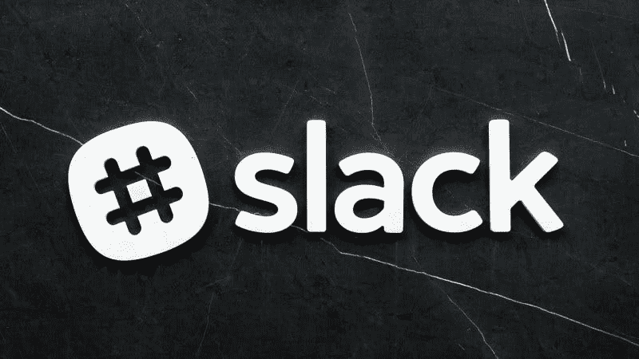

# 懈怠(工作)有什么价值？—市场疯人院

> 原文：<https://medium.datadriveninvestor.com/what-value-does-slack-work-have-market-mad-house-d404e20486b4?source=collection_archive---------25----------------------->

可以预见的是，连接应用平台 **Slack (WORK)** 已经成为市场的宠儿。

2020 年，Slack 的股价从 2020 年 1 月 2 日的 23.02 美元涨到 2020 年 6 月 3 日的 39.90 美元。然而，Slack 的价格在 2020 年 9 月 11 日跌至 25.60 美元。

投资者和一些机构喜欢 **Slack (NYSE: WORK)** ，因为 Slack 的平台[用专用渠道取代了电子邮件](https://slack.com/why/slack-vs-email)。在这个许多人在家工作的时代，这让组织对通信和信息有了更多的控制。

解释一下，在办公室组织可以使用终极专用通信:介质纸。然而，在家工作的人之间的纸张通信几乎是不可能的。

# Slack 出售控制权

为了在家办公，一家公司将不得不雇佣信使，花一大笔钱购买联邦快递(纽约证券交易所:FDX) 或者给每个员工买一台传真机。这些解决方案既昂贵又缓慢。

Slack 提供即时通信，没有电子邮件或社交媒体的安全风险。然而，我认为加密社交媒体，如脸书的免费提供类似的服务。

因此，我认为 Slack 卖的是控制权，而不是连接性、隐私或安全性。具体来说，Slack 向领导者出售一种产品，让他们能够控制下属的内部沟通。该产品是一个基于云的平台，允许从许多位置进行即时连接。

但是，我觉得这样的平台对一些组织和领导有很强的吸引力。例如，僵化和传统束缚的组织，如*纽约时报*或英国广播公司(BBC)。

所以我认为 **Slack (WORK)** 是一款小众产品，吸引力有限。我认为 Slack 永远不会有大众观众。

# Slack(工作)有多少用户？

Statista 估计，Slack Technologies Inc .(纽约证券交易所代码:WORK) 在 2019 年 10 月拥有超过[1200 万日活跃用户](https://marketmadhouse.com/what-value-does-slack-work-have/#:~:text=Slack%20had%20around%2012%20million,expanded%20their%20user%20base%20significantly.)。

此外，Slack 声称，2019 年 1 月，财富 100 强美国公司中有 65 家使用了其平台。作为用户声称 Slack 的组织包括*《纽约时报》*、麻省理工学院(MIT)、英国广播公司、**【甲骨文(NYSE: ORC)** 、**塔吉特(NYSE: TGT)** 、**星巴克(NASDAQ:SBUX)**和 21 世纪福克斯(现在是迪士尼的一部分)。

这些公司中的大多数都没有紧跟时代潮流或精通技术的名声。因此，我不得不怀疑 Slack 如何通过向这种老式公司进行营销来赚钱。

 [## 面向企业转型的 AWS:顶级云架构师的秘密|数据驱动型投资者

### “您使用云实现企业转型的方法是什么？”是人们一直问我的问题，自从我…

www.datadriveninvestor.com](https://www.datadriveninvestor.com/2020/07/15/aws-for-enterprise-transformation-secrets-of-top-cloud-architects/) 

# Slack 是微观管理工具吗？

Slack 面临的一个问题是，只有年长且顺从的员工才会使用 Slack。相反，一个组织的大部分人会使用 WhatsApp，电子邮件，或者电报，而忽略 Slack 的存在。

而且，我怀疑很多人；像《纽约时报》记者这样的人，只会把他们想让老板看的东西放在闲置的地方。他们会通过 Telegram 或 WhatsApp 发送其他所有内容，不让老板看到。

我认为员工们会对 Slack 穷追不舍，因为 Slack 是一个微观管理工具。没人想要微观管理。然而我认为他们为微观管理设计了 Slack。

因此，聪明的投资者会忽略**懈怠(工作)**而买入**脸书(纳斯达克代码:FB)** 。请记住，脸书拥有 WhatsApp，它提供即时加密连接，无需微观管理。

# Slack(工作)赚钱吗？

目前， **Slack(纽交所代码:WORK)** 亏损。例如，Slack 在 2020 年 4 月 30 日报告了 7619 万美元的季度运营亏损。该季度运营亏损从 2020 年 1 月 31 日的-9119 万美元缩减至 2020 年 1 月 31 日的-9119 万美元。

然而，Slack 的季度收入从 2019 年 4 月 30 日的 1.3483 亿美元和 2020 年 1 月 31 日的 1.8190 亿美元上升至 2020 年 4 月 30 日的 2.0165 亿美元。相比之下，Slack 的季度毛利从 2019 年 4 月 30 日的 1.1625 亿美元增长到 2020 年 1 月 31 日的 1.5753 亿美元，再增长到 2020 年 4 月 30 日的 1.7605 亿美元。

令人印象深刻的是，Stockrow 估计 Slack 的收入在截至 2020 年 4 月 30 日的季度增长率为 49.57%。不幸的是，收入增长并没有带来收入。

例如，Slack 报告 2020 年 4 月 30 日季度普通净亏损为-7521 万美元。该季度净亏损从 2020 年 1 月 31 日的-8900 万美元降至 2019 年 4 月 30 日的-3333 万美元。

# 懈怠(工作)产生多少现金？

Slack 的平台没有产生多少现金。例如，Slack 报告 2020 年 4 月 30 日的季度运营现金流为 873 万美元。

相比之下，Slack 当天公布的季度融资现金流为 7.5596 亿美元。我认为融资现金流显示了为维持运营而借入的资金不足。

令人印象深刻的是，Slack 报告称，截至 2020 年 4 月 30 日，其季度末现金流为 12.67 亿美元。Slack 的季度期末现金流从 2020 年 1 月 30 日的 2，252 万美元和 2019 年 4 月 30 日的 2.9498 亿美元增长。

因此，Slack 在 2020 年 4 月 30 日有 15.25 亿美元的现金和短期投资。Slack 的现金和短期投资从 2019 年 4 月 30 日的 7.9266 亿美元和 2020 年 1 月 31 日的 7.6859 亿美元增长。

因此，Slack 的现金在增加，但我不认为 Slack 产生了足够的现金来证明其股票价格。

# 投资者需要避免懈怠

我认为投资者需要避免 **Slack(纽交所代码:WORK)** 因为 Slack 没有安全边际。此外，工作没有回报。

我认为 Slack 唯一的价值就是作为一个收购目标。我怀疑 Slack 可能会崩溃，迫使管理层出售公司。我认为 Slack 的可能买家包括:**微软(纳斯达克股票代码:MSFT)** ，**亚马逊(纳斯达克股票代码:AMZN)，甲骨文(Oracle)，**或**推特(TWTR)** 。

因此，我认为投机者从 Slack 赚钱的唯一方法是做空它或者押注微软会收购它。我认为缺乏安全边际使得懈怠成为一项糟糕的投资。

*原载于 2020 年 9 月 11 日 https://marketmadhouse.com**的* [*。*](https://marketmadhouse.com/what-value-does-slack-work-have/)

**访问专家视图—** [**订阅 DDI 英特尔**](https://datadriveninvestor.com/ddi-intel)