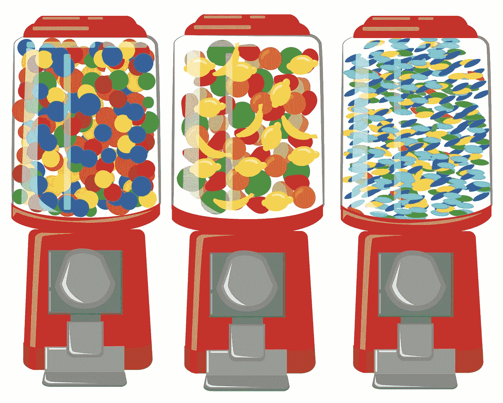

# 风投在早期投资中寻求什么——第三部分

> 原文：<https://medium.datadriveninvestor.com/what-vcs-look-for-in-early-stage-investments-part-iii-1f56a946db6f?source=collection_archive---------6----------------------->

到目前为止，我们已经讨论了[创始人与市场的契合度](https://medium.com/datadriveninvestor/what-vcs-look-for-in-early-stage-investments-part-i-200418d6070d)和[团队结构](https://medium.com/datadriveninvestor/what-vcs-look-for-in-early-stage-investments-part-ii-e227d60c71a5)——现在来谈谈风投寻求的最后两个要素:可重复性(我最喜欢的糖果机类比又回来了)和可保护性。

## 可重复性

你正在做的事情会在业务中产生一些速度，你需要资本来做更多的事情。想想糖果机。你投入一枚 25 美分硬币，糖果就出来了。在给定一些投入的情况下，对产出有一个合理的预期。风险投资可以提供更多的硬币来帮助我们的机器生产糖果。

可重复性应该可以用证明牵引力和价值交付的指标来衡量。例如，SaaS 公司的牵引指标通常是每月经常性收入(MRR)，而价值指标根据客户从您的产品中获得的价值而变化。交付价值指标应该跟踪并确认您向客户交付的主要价值(例如，电子签名公司在执行的合同中进行测量)。

 [## 风险投资家在给创业公司播种时会考虑什么标准？数据驱动的投资者

### 2017 年，风险投资资金攀升至十年来的最高水平。你的创业公司目前吸引风险投资的机会是…

www.datadriveninvestor.com](https://www.datadriveninvestor.com/2018/04/20/what-criteria-do-venture-capitalists-consider-when-seeding-a-startup/) 

## 可保护性

你可能已经听过一千遍了，但是一个创业公司只有在已经成功的情况下还能保持成功的能力才是伟大的。你必须开发独特的方法来保护你的企业免受模仿竞争，使其免受快速跟随者的攻击。(你给过[搬运工五力](https://www.investopedia.com/terms/p/porter.asp#:~:targetText=Porter's%20Five%20Forces%20is%20a%20framework%20for%20analyzing%20a%20company's,products%20influence%20a%20company's%20profitability.)日常感谢了吗？)以下是一些可以表明可保护性的区域:

*   **独特的客户获取** —你可以以一种竞争对手无法轻易复制的方式聚集客户需求。例如，Confluent 的创始人已经在 Apache Kafka 生态系统中拥有关系和声誉，这使他们能够赢得该类别。
*   供应垄断(Supply monopoly)—这种优势可能会以多种方式出现，但最常见的是在人才处于早期阶段时出现。你正在一个新兴领域开发一项创新技术，这个领域的顶尖技术专家正在你的初创公司工作。让我们看看 Cloudera，它最初是一个混合开源的 Apache Hadoop 发行版，它是人才供应垄断的一个例子。Cloudera 的三位技术创始人(Christophe Bisciglia、Amr Awadallah 和 Jeff Hammerbacher)之前是谷歌、雅虎和脸书，他们都是开源嵌入式数据库项目的主要贡献者。第四位联合创始人迈克·奥尔森(Mike Olson)曾是甲骨文的高管，负责监管一个开源业务部门。他们很快吸引了 Doug Cutting 和 Mike Cafarella，他们设计了一些原始的开源技术，为 Cloudera 铺平了道路。继 Accel Partners 的 500 万美元投资(Vertex 美国普通合伙人 Insik Rhee 在 Accel 工作期间进行的投资)之后，Cloudera 继续从 Apache Hadoop 运动中吸引一些最优秀的人才。
*   **科技**——这比你想象的要少。你的知识产权只和你在法庭上捍卫它的能力一样好，很多技术是可以复制的(没人喜欢法律战)。将技术优势视为领先优势。执行力每次都胜过技术。一个普通的开发人员可以毫不费力地构建一个看起来像 Instagram 的应用程序。然而，这位开发者不太可能复制推广 Instagram 成功的精明执行。

既然我已经介绍了风投在早期投资中寻找的要素，现在是时候看看有助于量化成功的硬性指标了。请关注本系列的最后一篇文章。