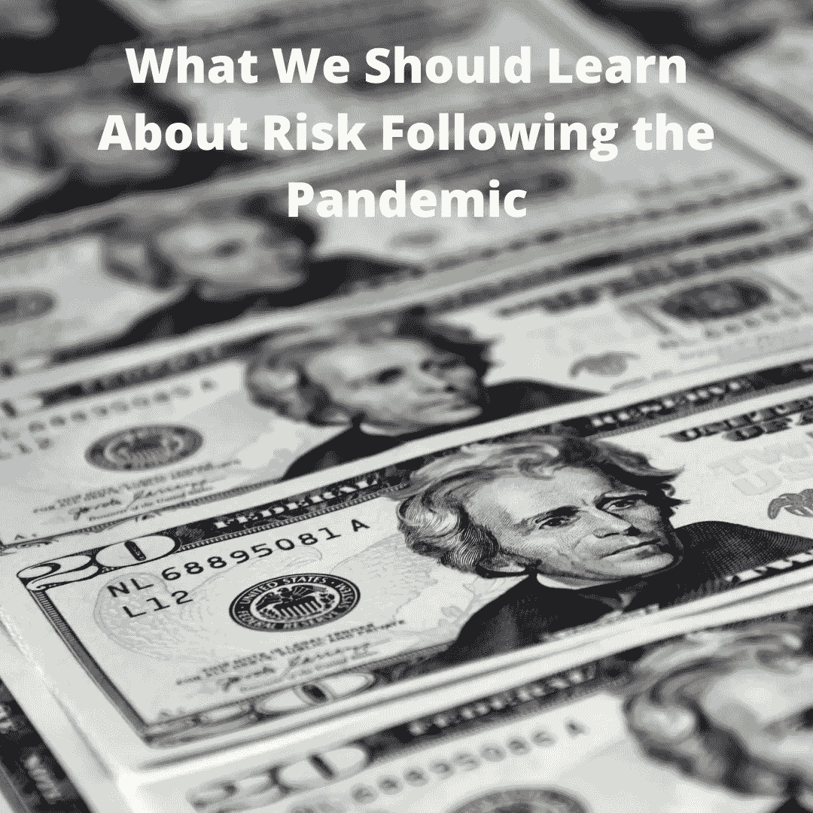

# 疫情之后，我们应该从风险中学到什么

> 原文：<https://medium.datadriveninvestor.com/what-we-should-learn-about-risk-following-the-pandemic-3fb197bfc14e?source=collection_archive---------5----------------------->

# 政府和企业毫无准备

在冠状病毒疫情之前，标准普尔 500 一直徘徊在历史高点附近。在长达十年的牛市中，美国政府降低了公司税率。美联储保持低利率，这鼓励了持续的债务驱动的支出。上市公司在公开市场上回购股票，即股票回购，以推动股价飙升。考虑到公司经理的薪酬是基于他们公司的股票市场估值，他们在财务上被激励去抬高他们的股票价格。随着经济的飞速发展，政府和企业领导人都不重视风险管理。然后，疫情使整个系统崩溃了。在这篇文章中，我分享了疫情之后我们应该了解的风险。

# 纳税人救助是不当激励的结果。他们鼓励企业冒险行为

就像大萧条时期一样，美国政府正在安排[纳税人救助被认为对国家至关重要的企业。波音公司和美国主要航空公司目前名列榜首。虽然很容易认为这些公司确实很重要，但波音和主要航空公司在过去十年里总共花费了](https://www.propublica.org/article/how-the-coronavirus-bailout-repeats-2008s-mistakes-huge-corporate-payoffs-with-little-accountability)[900 亿美元](https://www.newsweek.com/boeing-airlines-under-fire-90-billion-share-buybacks-stoke-controversy-bailout-pleas-least-1493934)用于股票回购。他们现在要求 1100 亿美元的纳税人救助资金。鉴于美国政府向“关键企业”提供金融支持，企业没有理由为危机储蓄。因此，美国政府不鼓励重要公司采取强有力的风险管理措施。公司管理层要求救助是否有错？绝对的。然而，政府需要学习风险管理和重新设计经济体系，以激励公司为危机储蓄。

 [## 冠状病毒；惊慌失措；字里行间的 z |数据驱动的投资者

### 围绕冠状病毒的话题；更准确地说，新冠肺炎几乎占据了整个新闻预报的头条…

www.datadriveninvestor.com](https://www.datadriveninvestor.com/2020/03/23/coronavirus-a-to-panic-z-between-the-lines/) 

我很失望，但并不惊讶，美国政府还没有从法律上限制公司回购股票和支付股息，直到我们从这场危机中恢复过来。CARES 法案中有一些条款阻止接受救助资金的公司从事这些活动。尽管如此，执法机制不健全，立法也存在漏洞。时间会证明公司管理层的表现。希望他们能坚持立法的精神，保护员工免受失业之苦。然而,《关怀法案》并没有强制要求公司使用救助基金来留住员工。如果没有明确的授权，我担心这项立法将无法保护员工在年底前免遭解雇。

# 疫情冠状病毒不是黑天鹅。我们被反复警告

2015 年，比尔·盖茨发表了一次 TED 演讲，谈到这个世界对于疫情是多么的措手不及。他提出了各国可以采取的行动，以应对类似我们正在经历的危机。他表示，由于飞机可以进行全球旅行，流行病的风险是真实的。果然，航空旅行是冠状病毒在中国武汉省以外传播的原因。尽管不听盖茨和塔勒布的话会损失数万亿美元，甚至数百万人的生命，但我们可以防止这种情况再次发生。全球各国必须投资准备抗击下一个致命病毒。有了正确的基础设施和协调一致的应对措施，我们就可以避免在未来遭遇另一个疫情。短期成本转化为长期节约。如果冠状病毒疫情不迫使政府学习风险管理，没有什么会。

# 为什么我们不听？

不幸的是，我们的政府和经济体系是为短期利益而设计的。政治官员通常任期四年，上市公司收益每季度公布一次。政府和企业领导人更喜欢进行能迅速实现切实成果的投资。减税很受欢迎，因为它让更多的钱进入了纳税人的口袋。如果政府要投资于疫情的准备工作，那么在下一届领导人当选之前，准备工作可能不会有回报。虽然公众最终肯定会受益，但远见对连任前景没有什么帮助。

正如我前面所讨论的，股票回购会推高股价，让公司股东受益(最明显的是管理层)。股票回购是一种让股东满意的简单方法。如果将资本投资于未雨绸缪基金，受雇预测公司收益的公司分析师将会质疑这一决定。传统的企业管理智慧指导首席执行官们把钱用在工作上。MBA 教授教导说，应该在 R&D 投资资本，帮助企业创新，超越竞争对手的能力。或者，应该以股息的形式直接分配给股东。为什么要为一场公司管理层可能辩称无法预测的危机储存利润？如果一场危机无法预测，为什么管理层会有错呢？现在应该清楚的是，这种思路是有缺陷的。现在来讨论一下谁来纠正。

# 这个疫情最终会帮助公共和私人部门的领导人了解风险吗？

强有力的政府和企业领导人从长远考虑做出决策。他们认识到不确定性是不可避免的，因此投资于应急计划。政府正在压榨他们的纳税人，这不能无限期地继续下去。随着失业率上升，税基缩小。不断增长的赤字将成为未来几代人的沉重负担。话虽如此，我认为未来几代领导人将会认识到风险管理的价值。毕竟，他们将被迫艰难地了解风险。他们还需要承担纠正企业部门的负担。我认为未来的政府领导人应该规定一定比例的收入留作不时之需。在危机时刻，股价不会过热，公司也不会倒闭。从长远来看，这一指令将节省纳税人的资金。

我们现在已经听到我们的政府和企业领导人提到危机的不可预测性。导致大萧条的金融危机被认为是一生一次的事件。我现在听到纽约市播放的广播广告说冠状病毒疫情将定义我们这一代。会吗？谁能说下一个十年不会发生另一场“定义一代人”的危机呢？它们似乎以相对频率发生！尽管我们作为个人可以学会自给自足，但我们需要公共和私营部门领导人的帮助。他们必须了解风险，并为不确定性做好准备。虽然我确实相信我们会度过这次危机，但下一次我们可能就没那么幸运了。希望我们能做好足够的准备，不需要运气。不管怎样，一个人可以做梦。

最初发布于:[https://bunkerbasics.com/learn-about-risk/](https://bunkerbasics.com/learn-about-risk/)