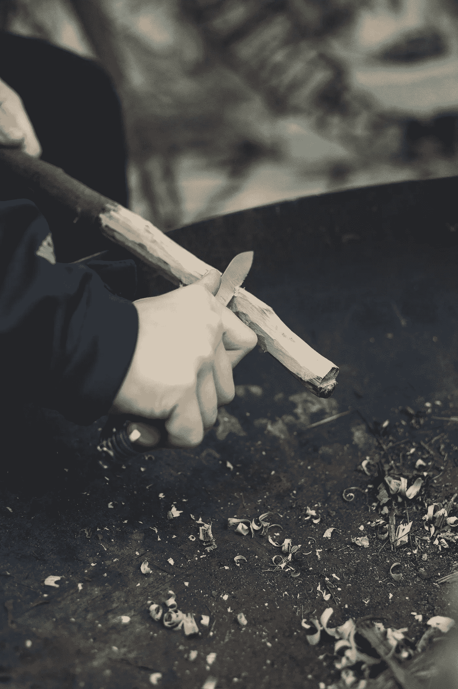

# 我们珍视的东西往往错过了有价值的东西

> 原文：<https://medium.datadriveninvestor.com/what-we-value-often-misses-what-is-valuable-5121d35f5a3b?source=collection_archive---------23----------------------->

Photo by [Markus Spiske](https://unsplash.com/@markusspiske?utm_source=unsplash&utm_medium=referral&utm_content=creditCopyText) on [Unsplash](https://unsplash.com/s/photos/carving-wood?utm_source=unsplash&utm_medium=referral&utm_content=creditCopyText)

詹克斯老了，灰色短发，戴着厚厚的黑框眼镜，打着领结，穿着一套与他年龄相仿的皱巴巴的蓝灰色西装。他坐在教室前排右边一个小窗下的摇椅上，当他向后靠时，摇椅会倾斜成水平位置。他的教室在曾经是高中的初中的地下室里。就在健身房旁边，增加了一点噪音和汗水的味道。这所学校建于 19 世纪晚期，詹克斯先生的教室是一个狭窄、闷热的小房间，只有一扇小窗户。当不断增长的入学人数迫使学校官员使用旧建筑的每一点空间时，地下室被转换成了用途。

就是在这里，在七年级的科学课上，我被告知世界上有两种人。詹克斯先生告诉我们，我们的世界是由“创造”知识的哲学家和应用知识的技术人员组成的。显然，这种简化的人性观遗漏了大部分，但他这样做是为了帮助我们抓住一点。

如果詹克斯先生使用一个更全面的描述，他可能会注意到大约 1%到 5%的人负责基础研究。这项研究的重点是关于宇宙和万物的想法和假设理论。可能会有 10-15%的人接受这些想法，并将其转化为有用的东西。这些人理解由 1-5%的人创造的科学和知识。这些是詹克斯先生的哲学家和技术人员。我们其余的人呢？我们只是简单地使用前两个群体思考和创造的东西。有些人可能对前两组人在做什么有模糊的理解，但我们大多数人只是简单地插上电源，拨动开关，让它工作。我们不知道它是如何工作的，也不知道如何建造一个。

Jenks 先生说，数据消费技术人员每天都在通过将理论转化为我们需要的有用的东西来塑造环境。

另一方面，哲学家被称为惠特勒，他可能会在池塘边舒适地躲在高高的拱形桦树的树荫下，一整天，在他塑造一块木头时，鱼竿放在他身边。惠特勒似乎从未做过任何事情，也从未生产出任何有用的东西，比如汽车、电脑、iPads、智能手机或其他东西。尽管如此，这些木雕师被视为至关重要，因为通过他们的思想和安静的思考，产生了伟大的思想，发现了重力、青霉素和其他东西，这些推动并塑造了我们的文明。惠特勒是思想者，思想者必须有时间无所事事地坐着。

我们大多数人对这些思想家的作用缺乏了解，认为他们和他们的活动是浪费和不必要的。他们很快寻求消除对这种活动和就业的资助。科学总是浮现在脑海中，但是艺术和人文学科也经常被归为不必要和无效的类别。

我们在美国的另一个偏见是我们的优越感和对我们认为是卑微和不需要关键技能的劳动的不尊重。垃圾工、送货工、文员、商店货架保管员、看门人以及其他类似的工作被认为不值得我们尊敬和尊重。想想我们的社会认为什么是有用的工作。我们最不重视那些熵最大的任务。也就是说，我们认为必须每天一遍又一遍或一天几次重复的简单任务没有什么价值。因此，在 ABC 高科技企业扫地的人，或者经营烧烤店为打汉堡店做汉堡的人，工资很低，也不受尊重。他们重复的任务几乎不需要更高层次的思考，价值更低。我们忽略了阿尔伯特·爱因斯坦在当一名普通的专利办事员时就提出了他的相对论。

另一方面，一个公司首席执行官，或者一个擅长投掷和击打棒球的人，会受到更多的尊敬、关注和奖励。我们的文化赋予他们的任务更高的价值。他们的工作被认为比简单的扫地、做汉堡和提供诸如收集和处理垃圾等重要服务更复杂，需要更多的技能。

美国的价值观被我们对财富和物质的获取的错误重视所扭曲。我们非常重视制造计算机、数钱或那些需要技能的思考或身体活动。我们看不到这些同样的特征会阻碍人类精神的进步或发现新知识，如相对论，这对推进文明是必要的。

在东方思想和一些基督教修道团体的实践中，被认为最重要的职能是我们认为最没有价值的任务。这些精神团体认为这些平凡而重复的工作对打开我们的思维至关重要。当你研究道教、佛教禅宗或基督教的修道团体时，你会遇到做清洁、烹饪、园艺或一些同样朴实无华的工作的人。他们做这些工作的原因很快就显而易见了。只有通过最低价值的重复劳动，我们才能看到最伟大的真理。

通常，只有通过从事所谓的琐碎工作，我们才能发现最深刻的真理。人们很容易忘记，当阿尔伯特·爱因斯坦提出相对论时，他只是一名普通的专利办事员。通过履行简单的职责，我们经常看到和感知生命的循环和造物主的完整性。

为了看到最伟大的真理，一个人必须经常从事最小的家务。惠特勒雕刻木头，禅宗信徒扫地，整个宇宙在他们眼前跳舞，就像新夏夜里萤火虫的交配仪式——令人眼花缭乱的脉冲光展示，宣布生命圆满的地点。

生活中的一个选择必然会导致他人的牺牲。惠特勒放弃了制造有用物品的机会和获得丰厚劳动报酬的可能性。他的动机是对理解的渴望。他的回报是看到他的努力会为别人带来更多有用的东西。惠特勒坐在池塘边悠闲地削着木头，意识到身边的钓鱼竿。如果幸运的话，他还可能在他的木头变成一堆刨花之前抓到一条鱼。

当詹克斯先生与我们分享这一点时，他向后一靠，斜靠在他的摇椅上，露出一丝微笑。

同样在[www.jerrymlawson.com](http://www.jerrymlawson.com)

**访问专家视图—** [**订阅 DDI 英特尔**](https://datadriveninvestor.com/ddi-intel)