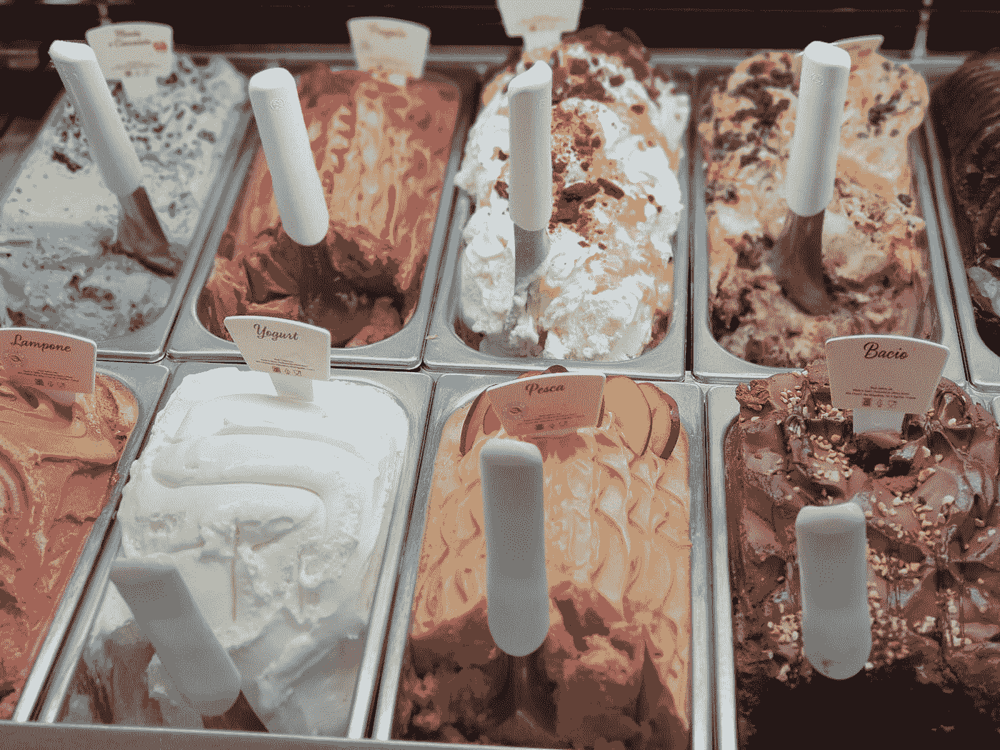

# 我们想要的不是东西本身

> 原文：<https://medium.datadriveninvestor.com/what-we-want-isnt-the-thing-itself-2b09cf8a8b49?source=collection_archive---------21----------------------->

Photo by [Lama Roscu](https://unsplash.com/@lamaroscu?utm_source=medium&utm_medium=referral) on [Unsplash](https://unsplash.com?utm_source=medium&utm_medium=referral)

如果我在你的余生里每个月给你一百万美元，而唯一的收获是你再也不会快乐了，你会接受吗？

我想我们中的一些人会说“是”,我相信在某种情况下“是”可能是一个很好的答案，但我认为对此说“是”会比 NBC 和 CBS 在周一足球之夜通过的协议更糟糕。

每月一百万美元，你可以环游世界，住在最好的酒店，或者买几栋房子，并对它们进行维护。你可以吃最好的食物。你可以做生意，赚更多的钱。

你可以创作你一直想要的艺术品，并且可以访问任何你想要的发行平台。如果你把钱捐出去，你可能是其中之一，而不是世界上最伟大的慈善家。

然而，即使有了这些东西，你甚至不能享受生活本身？用不了多久，你就会开始为幸福买单。

但这不就是我们每月 5000 美元的收入吗？我们不都是在为幸福买单吗？

当我想起这些年来我和朋友们关于得到梦想中的房子、汽车、配偶或这么多钱的对话时，我们都非常兴奋。为什么？因为它会导致多巴胺激增。

但是，当房子不再出售，汽车过时，配偶没有忘记他们的前任，金钱变得如此普遍，以至于失去了新鲜感，没有人会再兴奋了。

在最好的情况下，你还是和以前一样快乐，或者你感觉更糟，因为你的梦想没能让你感觉像个百万富翁。

 [## 改善之旅始于福祉|数据驱动的投资者

### 一场普遍的健康危机让人们认识到将健康融入工作文化的重要性。过去的陈词滥调已经…

www.datadriveninvestor.com](https://www.datadriveninvestor.com/2020/06/01/journey-of-improvement-starts-with-well-being/) 

我们所做的一切都是为了获得幸福。但是当我们不可避免地得不到我们想要的东西时，我们会沮丧，不一定是因为我们没有得到我们想要的东西，而是因为我们没有得到幸福。

然后，我们用沮丧来加重我们的失败，这导致我们更加失败，因为，正如卡尔·荣格所说的，你所抵制的，会持续下去。

然后，即使我们得到了我们想要的，这是一个如此糟糕的旅程(因为我们对失败的态度)，我们想知道它是否真的值得。事实上，我们会停下来庆祝这个里程碑吗？也许不是，因为我们太忙于担心这个应该让我们快乐的新目标。

我是在说我们真的应该专注于获得幸福吗？绝对没有。

这不仅是离家近一度的完全相同的问题，而且艾伦·瓦茨提出的“反向定律”仍然有效。

你所有获得快乐的尝试都会凸显所有的不快乐，就像你所有获得金钱、配偶或智慧的尝试都会让你专注于它们的缺乏。因此，在你的生活中，你再也不会感到破产、无人爱和无知。

我们必须对罪犯更进一步。

我们已经确定我们都想要幸福，但是想要幸福是一个问题。为什么？因为我们会被迫尝试去得到它。但那会引发我们对不快乐的关注，因为正是不快乐阻碍了快乐。但是这样做的话，我们只会*不开心！*

我们必须问自己为什么我们想要幸福，因为这不像说“我只想幸福”那么简单。

有些人很容易交朋友，但他们从来不谈论想交朋友，因为“他们只是想要朋友。”也有轻松赚钱的人，想出很棒的点子或者学习技能的人。其他人都在挣扎，但这些人似乎过得很轻松。他们的秘诀是什么？

他们的秘密是他们没有被强迫去追逐这些东西。他们可能会与幸福和生活中的其他因素作斗争，但他们擅长得到的东西他们从来没有试图去得到。

也许你有那些人们很难得到的东西，但对你来说，它属于你只是时间问题。

那么，为什么我们被迫去追求幸福呢？为什么我们想要那些我们认为会带给我们快乐的东西？

根据我的观察，我们想要幸福有三个原因。

我们想要幸福的第一个原因是因为我们想要幸福带来的安全感，尤其是当幸福是永久的幸福时。

这对我来说是一个重要的认识。我记得在幼儿园的时候，前一秒还很开心，但当一个朋友邀请我和他一起出去玩，只是为了让他在别人面前激怒我或羞辱我时，这种快乐就被剥夺了。

我对这种转瞬即逝的快乐变得非常敏感，它成为了我童年和成年后在未来的友谊和其他生活中出现的东西。它变成了一个潜意识程序。

我不得不拥抱并安慰那个害怕坏事即将发生的孩子。他还在里面，还活着，还在哭。难怪我会焦虑。难怪我追求幸福。

我们想要幸福的第二个原因是因为我们想远离痛苦。这听起来与前一个原因相似的原因是因为它是。不同的是侧重点。

第一个原因集中在幸福的到来，然后生活让你陷入不幸福的漩涡。第二个原因是不快乐本身是可怕的，并且想要逃避它。

我从来没有因为这个原因去追逐快乐，但是我们都知道有些人会竭尽全力去逃避任何一种不舒服的情绪，这当然会把他们推向更不舒服的情绪。但同样，他们不能处理。所以他们继续逃避情感。

这些人当然会追求幸福。不快乐是可怕的，这么多年来有这么多层面没有得到解决，他们甚至应该费心去解决痛苦吗？

我认为他们绝对应该。

我们想要幸福的第三个也是最后一个原因是因为我们想要控制。

这背后的罪魁祸首还是不快乐。我们的痛苦是如此可怕，以至于我们决定采取措施，这样我们就再也不会受苦了。

当时我确信这似乎是一个精明的想法。但它所做的只是让你成为一个控制狂和/或不能关心事情。

例如，你不会开始恋爱，因为你知道他们会结束，所以为什么要经历痛苦呢？或者，你会和你能控制的人在一起，这样他们能给你你想要的。

当你敏锐地意识到你是如何通过不去追求你想要的东西和不去做你想做的事情来自我破坏你的幸福时，你获得幸福的尝试就在你面前破灭了。

但是当你试图冒险的时候，生活又一次用不快乐来打击你。你对着天空大喊你知道得更清楚，然后撤退到你的控制塔。

事实是你可以坐在房间里什么也不做。你仍然会不开心，因为你还没有接受你遭受痛苦并决定成为马基雅维利的那一刻。

底线是我们都必须接受不快乐。不仅仅是因为当我们拥抱伤害我们的事物时，倒推法则会让我们感觉良好，还因为这是我们摆脱大脑痛苦的唯一方法。

我们可以从拥抱我们对生活中正在发生的事情的感受开始。无论是允许自己感受自己的感受，写日记或与朋友或治疗师交谈，当我们相信我们曾经试图逃避的东西时，我们就不再试图逃避不快乐和自己。

然后我们更深入，我们开始允许自己感受或说出我们对不久前和遥远的过去的感受。

当你经历这个过程时，有趣的事情发生了。你发誓你曾经需要的东西已经不再重要了。如果他们来了，太好了。如果他们走了，这很自然，因为一切都结束了。

此外，为了免受伤害而渴望的安全感、分离感和控制感也不再那么重要了。

问题的根本原因已经解决。因此，你是一个全新的你。

不幸的是，你小时候需要的信息没有给你。但是你现在拥有了:拥抱快乐和痛苦。拥抱生活本身

## 访问专家视图— [订阅 DDI 英特尔](https://datadriveninvestor.com/ddi-intel)