# 在疫情期间，我们想在网上看到什么，这说明了我们什么

> 原文：<https://medium.datadriveninvestor.com/what-we-want-online-during-the-pandemic-and-what-that-says-about-us-31d2cd23f1e2?source=collection_archive---------9----------------------->

## 对美国人网上活动的分析揭示了许多关于美国人如何生活、工作、观看、饮食等的信息。在新冠肺炎时代

Photo by [Sincerely Media](https://unsplash.com/@sincerelymedia?utm_source=medium&utm_medium=referral) on [Unsplash](https://unsplash.com?utm_source=medium&utm_medium=referral)

# 介绍

今天，我们几乎已经习惯了这样一种想法，即互联网巨头如谷歌、T2、亚马逊、T4、脸书、推特、网飞和其他人知道我们的一切，甚至比我们自己想承认的还要多。这些不可或缺的互联网巨头不仅能够管理这些数据供自己使用，还能够告诉广告商我们访问了什么网站，我们在网上搜索了什么，我们在网上购买了什么，以及我们观看了什么视频内容，从而赚取了数十亿美元。在很大程度上，我们已经接受了这个对我们来说代表着浮士德式的交易，因为我们用匿名来换取这些工具给我们生活带来的便利。

 [## 将爱好展示变成赚钱机器|数据驱动的投资者

### 这是造梦者奥斯卡·冈萨雷斯响应号召的地方。他是一名独立的在家工作的顾问，担任…

www.datadriveninvestor.com](https://www.datadriveninvestor.com/2020/02/14/turn-hobby-showcase-into-money-maker/) 

对于那些对这些市场信号感兴趣的人来说，有许多方法可以跟上这些公司收集的关于我们所有人的数万亿比特的数据。例如， [Google Trends](https://trends.google.com/trends/?geo=US) 是一个巨大的资源，可以看到美国——实际上是世界——此刻可能的“脉搏”,为数千万营销人员、网站开发者、研究人员等提供可操作的信息。

Photo by [Isaac Smith](https://unsplash.com/@isaacmsmith?utm_source=medium&utm_medium=referral) on [Unsplash](https://unsplash.com?utm_source=medium&utm_medium=referral)

# 窥见大众

最近，我开始熟悉总部设在纽约的“一瞥”(glance)网站的工作，该网站试图从我们所有的在线活动中收集信息，以发现产品、公司和行业的潜在趋势。Glimpse 的关键指标是他们所谓的*消费者兴趣水平*，这是基于该公司对“来自网络的数亿消费者行为信号”的专有分析

因此，看看 Glimpse 对上个月(2020 年 3 月)消费者对各种产品的兴趣水平的统计分析，这个月[新冠肺炎/疫情冠状病毒](https://www.cdc.gov/coronavirus/2019-ncov/cases-updates/summary.html)在美国爆发，并带来了自我和国家强制的居家隔离和检疫，所有这些都揭示了一些非常有趣的美国人的思想和情绪，因为我们集体遭遇了恐惧，不确定性和经济中断，这些都是由这种致命疾病的大范围爆发和我们试图孤立自己以“[拉平曲线](https://www.livescience.com/coronavirus-flatten-the-curve.html)”造成的

以下是在《一瞥》中发现的一些更有趣的趋势——至少从消费者的角度来看——在这个最不稳定的时代。简而言之，他们的数据显示，我们美国人是一个好奇的民族——尤其是现在这个国家几乎 90%的地方基本上都被锁在家里。现在，我们的好奇心在网络上被引向如何适应与世隔绝的生活。然而，尽管冠状病毒疫情对整个经济的影响是毁灭性的，但 Glimpse 收集的这些见解表明，对于许多公司和行业来说，新冠肺炎已经使消费者对他们的产品和/或服务的兴趣出现了意想不到的增长——这意味着*对他们来说有更多的*业务！

那么什么是趋势呢？以下是来自 Glimpse 2020 年 3 月分析的一些见解——并提醒大多数州在 3 月 20 日至 4 月 1 日期间的某个时候实施了他们的居家订单。每个图表代表 2020 年 3 月整月消费者对该主题的兴趣水平数据。当你观察这些趋势时，一定要记住，随着疫情时间的推移，下半月的趋势反映了美国人对这些产品/服务的消费兴趣水平的真实变化，因为疫情导致人们就地避难。例如，可悲的是，疫情的严重性使美国人对他们的遗嘱发生兴趣…以防万一。正如你在下面的图表中看到的，Glimpse 的数据显示，在 2020 年 3 月期间，消费者对该主题的兴趣水平跃升了 70%!

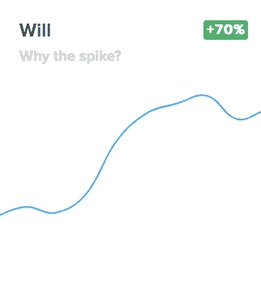

**Source:** *Glimpse* ([https://meetglimpse.com/covid19/](https://meetglimpse.com/covid19/))

在这篇文章中，我们将从两个方面专门研究疫情早期的消费者兴趣水平——我们在网上寻找的适应在家工作的东西，以及我们在互联网上寻找的寻求打发时间的东西——寻求“转移”——因为我们集体寻求在家里隔离。

Photo by [🇨🇭 Claudio Schwarz | @purzlbaum](https://unsplash.com/@purzlbaum?utm_source=medium&utm_medium=referral) on [Unsplash](https://unsplash.com?utm_source=medium&utm_medium=referral)

# 在家工作—协作工具

对 Glimpse 数据的分析显示，消费者对虚拟协作工具的兴趣水平——工作、学校甚至社交聚会——显示，美国人寻求这些平台相互联系的人数大幅上升。

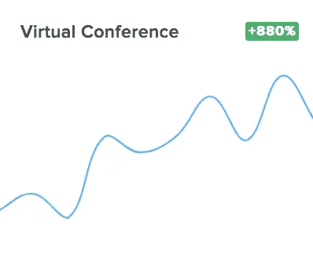

**Source:** *Glimpse* ([https://meetglimpse.com/covid19/](https://meetglimpse.com/covid19/))

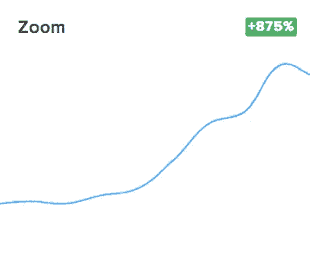

**Source:** *Glimpse* ([https://meetglimpse.com/covid19/](https://meetglimpse.com/covid19/))

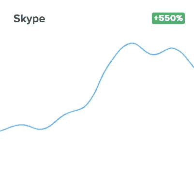

**Source:** *Glimpse* ([https://meetglimpse.com/covid19/](https://meetglimpse.com/covid19/))

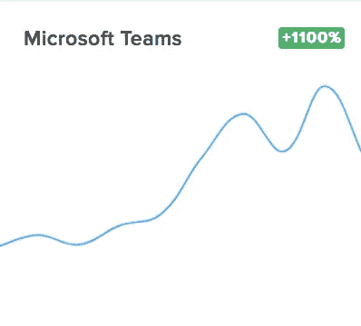

**Source:** *Glimpse* ([https://meetglimpse.com/covid19/](https://meetglimpse.com/covid19/))

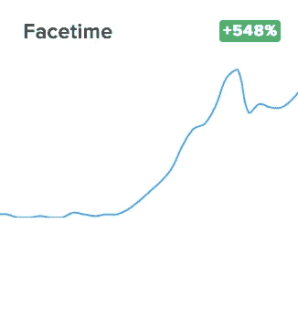

**Source:** *Glimpse* ([https://meetglimpse.com/covid19/](https://meetglimpse.com/covid19/))

Photo by [Norbert Levajsics](https://unsplash.com/@levajsics?utm_source=medium&utm_medium=referral) on [Unsplash](https://unsplash.com?utm_source=medium&utm_medium=referral)

# 在家工作——我们需要的“东西”

对 Glimpse 调查结果的趋势分析表明，在疫情早期，让在家工作成为“工作”的工具有了显著的提升——无论是物理上的*还是技术上的*。

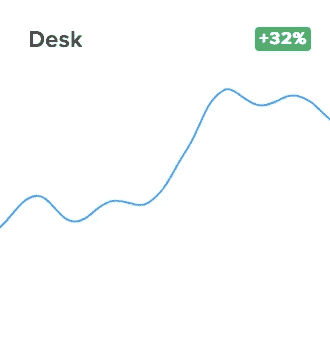

**Source:** *Glimpse* ([https://meetglimpse.com/covid19/](https://meetglimpse.com/covid19/))

**Source:** *Glimpse* ([https://meetglimpse.com/covid19/](https://meetglimpse.com/covid19/))

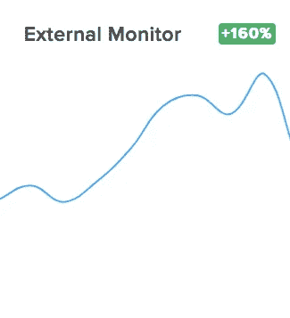

**Source:** *Glimpse* ([https://meetglimpse.com/covid19/](https://meetglimpse.com/covid19/))

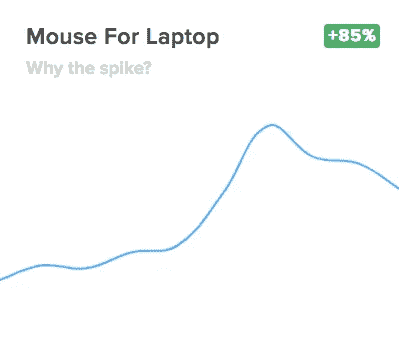

**Source:** *Glimpse* ([https://meetglimpse.com/covid19/](https://meetglimpse.com/covid19/))

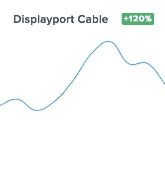

**Source:** *Glimpse* ([https://meetglimpse.com/covid19/](https://meetglimpse.com/covid19/))

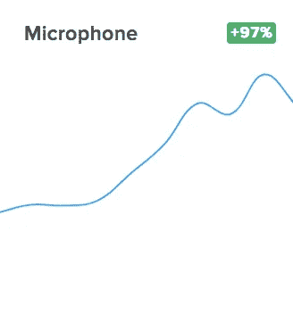

**Source:** *Glimpse* ([https://meetglimpse.com/covid19/](https://meetglimpse.com/covid19/))

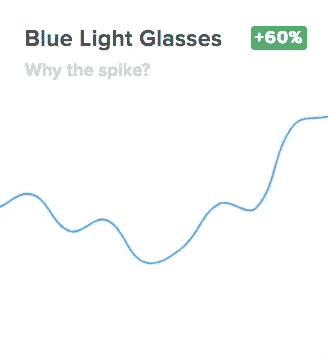

**Source:** *Glimpse* ([https://meetglimpse.com/covid19/](https://meetglimpse.com/covid19/))

Photo by [niklas_hamann](https://unsplash.com/@hamann?utm_source=medium&utm_medium=referral) on [Unsplash](https://unsplash.com?utm_source=medium&utm_medium=referral)

# 寻求“转移”——保持忙碌的活动

在疫情早期，有一件事变得非常清楚，那就是美国人需要互联网来寻找打发孤独时光的方式，无论他们是独自一人还是与家人在一起。根据来自 Glimpse 的消费者兴趣水平数据，以下是 2020 年 3 月美国人在网络上寻找的一些话题。正如你所看到的，我们变得很有创造力，想方设法全天候呆在家里——不仅仅是看电视！我们将关注 Glimpe 2020 年 3 月消费者兴趣水平数据的两个特定领域，首先检查我们在隔离区探索以打发时间的“事情”，然后是我们试图保持身材的“事情”——尽管有所有的零食、网上冲浪、网飞狂欢观看等。

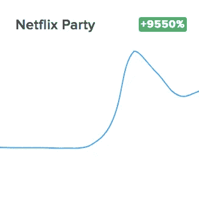

**Source:** *Glimpse* ([https://meetglimpse.com/covid19/](https://meetglimpse.com/covid19/))

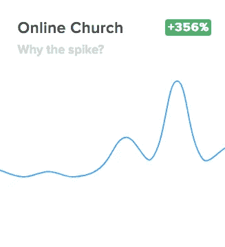

**Source:** *Glimpse* ([https://meetglimpse.com/covid19/](https://meetglimpse.com/covid19/))

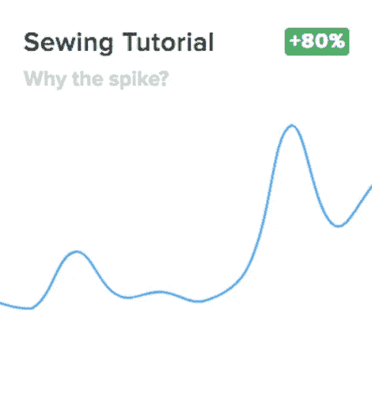

**Source:** *Glimpse* ([https://meetglimpse.com/covid19/](https://meetglimpse.com/covid19/))

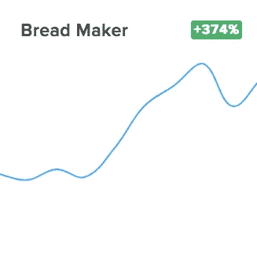

**Source:** *Glimpse* ([https://meetglimpse.com/covid19/](https://meetglimpse.com/covid19/))

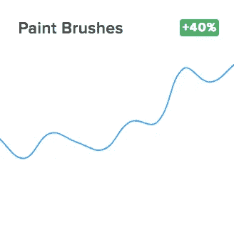

**Source:** *Glimpse* ([https://meetglimpse.com/covid19/](https://meetglimpse.com/covid19/))

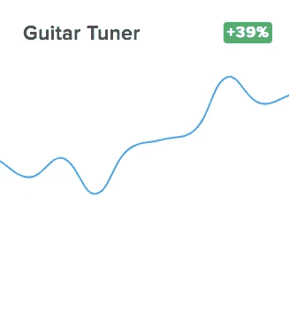

**Source:** *Glimpse* ([https://meetglimpse.com/covid19/](https://meetglimpse.com/covid19/))

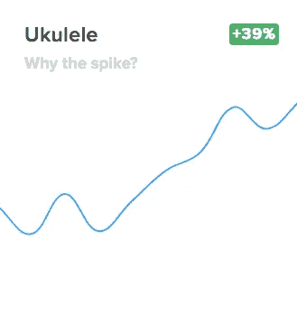

**Source:** *Glimpse* ([https://meetglimpse.com/covid19/](https://meetglimpse.com/covid19/))

Photo by [Dane Wetton](https://unsplash.com/@dane_aw?utm_source=medium&utm_medium=referral) on [Unsplash](https://unsplash.com?utm_source=medium&utm_medium=referral)

# 寻求“转移”——保持身材的活动

在隔离生活中，所有的避难所都已就位，随之而来的就是看电视、吃饭、喝水和睡觉，我们中的许多人迫切需要找到一种在室内进行体育活动的方式。因此，消费者对以下“商店”的兴趣水平在这段时间有所上升。

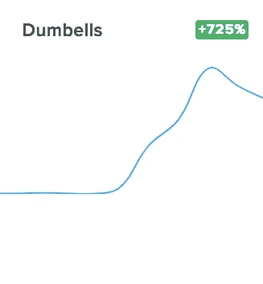

**Source:** *Glimpse* ([https://meetglimpse.com/covid19/](https://meetglimpse.com/covid19/))

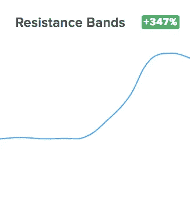

**Source:** *Glimpse* ([https://meetglimpse.com/covid19/](https://meetglimpse.com/covid19/))

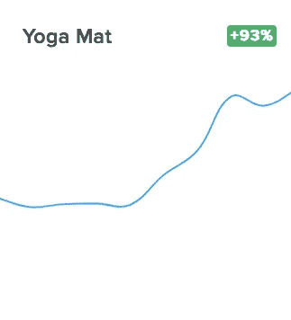

**Source:** *Glimpse* ([https://meetglimpse.com/covid19/](https://meetglimpse.com/covid19/))

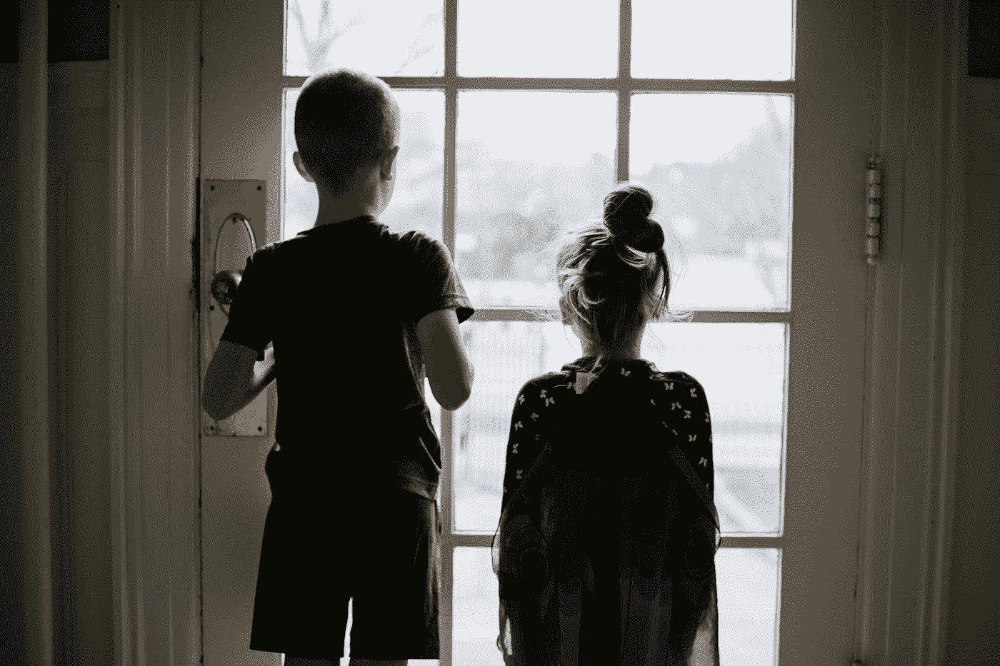

Photo by [Kelly Sikkema](https://unsplash.com/@kellysikkema?utm_source=medium&utm_medium=referral) on [Unsplash](https://unsplash.com?utm_source=medium&utm_medium=referral)

# 结论

是的，我们对杠铃和四弦琴这类东西的集体兴趣可能会像病毒一样传播得很快(对于后者，我们*真的*希望会很快！).然而，各种类型和规模的公司都应该好好看看这次疫情的消费趋势，因为是的，将会有一个大流行后的商业环境。正如其他人从社会科学的角度所写的，我们相信这将产生一个非常变化的美国公众——以及未来几年非常变化的美国消费者——也许是永久性的！

因此，尽管今天在任何公司中处于负责地位的任何人——从管理财富 500 强中最大的公司到拥有当地小企业的人——的大部分注意力只是为了维持运营，但我们敦促经理们开始思考他们企业在大流行后的未来战略。跟随我在 Vocal([https://vocal.media/authors/david-wyld](https://vocal.media/authors/david-wyld))上的文章，为一般企业和特定行业提供实用可行的建议。是的，我将报道将会塑造后新冠肺炎时代商业格局的趋势。这将是一段*非常*坎坷的旅程，但当我们在未来充满挑战的几个月和几年中适应一个变化非常大的环境时，今天开始思考疫情“新常态”之后会是什么样的经理们将比他们的竞争对手拥有竞争优势……这可以归结为从申请失业保险的消费者兴趣水平的一瞥中看到的最后一张悲伤的图表。

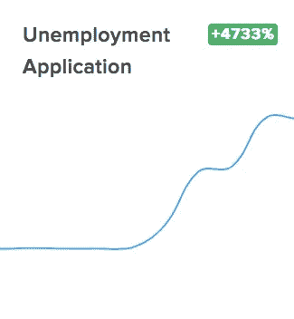

_________________________________

大卫·c·怀尔德([dwyld@selu.edu](https://vocal.media/journal/what-we-want-online-during-the-pandemic-and-what-that-says-about-us))是新奥尔良外东南路易斯安那大学的管理学教授。他是一位著名的商业顾问和当代管理问题的演讲者/作家。

*最初发布于*[*https://vocal . media/journal/what-we-want-online-due-the-America-and-that-say-about-us*](https://vocal.media/journal/what-we-want-online-during-the-pandemic-and-what-that-says-about-us)