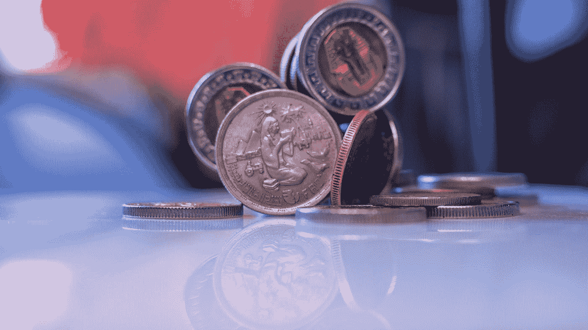

# 2021 年的金融市场将会怎样？

> 原文：<https://medium.datadriveninvestor.com/what-will-2021-have-in-store-for-the-financial-market-43ab681f7454?source=collection_archive---------11----------------------->

## 金融

## 展望您需要了解的未来主要趋势

Photo by [Krisztian Matyas](https://unsplash.com/@imkrisztian?utm_source=medium&utm_medium=referral) on [Unsplash](https://unsplash.com?utm_source=medium&utm_medium=referral)

随着全球疫情导致大范围经济衰退，金融市场今年经历了重大动荡。一些亮点包括标准普尔 500 跌至 2237.40 点，美国油价历史上首次转为负值，以及美联储暂停股票回购并限制大银行的股息。

当然，这只是冰山一角。然而，尽管 2020 年是一场噩梦，但潮流正在慢慢转向。辉瑞公司报道了一种潜在的冠状病毒疫苗的开发。此外，乔拜登(Joe Biden)的当选标志着积极和消极变化的冲击，投资者必须相应地做好准备。让我们回顾一下 2021 年的顶级金融行业趋势。

## 1.银行业 M&A 交易前景喜忧参半

根据一份关于 2020 年下半年和 2021 年市场趋势的[报告，亚太地区、欧洲和美国的银行业并购交易数量将有所不同。专家预测亚太地区的交易将会增加。这里的一些主要驱动因素包括:](https://home.kpmg/xx/en/home/insights/2020/07/global-banking-m-and-a-outlook-h2-2020.html)

国内合并的增加

数字商务的日益普及和移动渗透

消费者中产阶级的出现

B2C 企业数量的增长

取消监管交易壁垒

金融科技企业和金融直觉之间的合作越来越多

活跃的不良贷款市场

另类融资的日益流行

另一方面，由于利率持平和疫情的混乱，美国的交易市场可能会保持缓慢。资金雄厚的机构有可能探索 M&A 交易，并鼓励市场上的更多活动，但一切都不确定。

 [## 疫情不会很快结束，这是一份财务清单|数据驱动的投资者

### 自从世界各国开始实施封锁以遏制这部小说的传播以来，已经过去了八个月…

www.datadriveninvestor.com](https://www.datadriveninvestor.com/2020/10/27/the-pandemic-wont-be-over-anytime-soon-heres-a-financial-checklist/) 

## 2.股票市场趋于稳定

根据[基金经理凯文·尼科尔森](https://www.cnbc.com/2020/09/17/bullish-market-activity-in-2021-will-cost-jobs-7-billion-money-manager.html)的说法，股票市场可能会在 2021 年初变得更加稳定。他还预计牛市趋势将会出现。尼科尔森认为，投资者应该考虑购买能源公司和金融机构的股票。[高盛](https://www.businessinsider.com/goldman-sachs-energy-stocks-to-buy-now-market-recovery-2020-11)也鼓励投资者购买能源股。它们的价值应该会在 2021 年增值。

此外，尼科尔森建议投资者在 2021 年减少对科技股的投资。2020 年是科技行业表现出色的一年， [Zoom 见证了 355%](https://www.globenewswire.com/news-release/2020/08/31/2086444/0/en/Zoom-Reports-Second-Quarter-Results-for-Fiscal-Year-2021.html) 的年收入增长。然而，这些股票可能会在 2021 年下跌。

辉瑞和 BioNTech 报道了一种潜在的冠状病毒疫苗的开发已经影响了 Zoom。根据市场报告，[在辉瑞和 BioNTech 宣布后，Zoom 股票下跌了 20%](https://markets.businessinsider.com/news/stocks/zoom-video-stock-price-pfizer-coronavirus-vaccine-success-telework-zm-2020-11-1029781479) 。据辉瑞公司称，这种疫苗大约有 90%的有效性。

美国食品和药物管理局的批准正在等待中，这仍然需要一些时间来确保疫苗的大规模供应。尽管如此，这一消息还是导致[辉瑞公司的股票上涨了 7%。](https://money.usnews.com/investing/stock-market-news/articles/what-the-pfizer-vaccine-means-for-investors) BioNTech 的股票也上涨了 14%。大盘也呈现积极趋势，标准普尔 500 指数上涨 1.2%。

当然，还有很多不确定性继续困扰着投资者。首先，关于疫苗的长期安全性及其持续时间的信息很少。此外，疫苗对不同年龄组的影响目前还不清楚。

目前，投资者应继续保持谨慎，等待疫苗功效的进一步明朗。鉴于这种病毒几乎已经渗透到了全球的每一个角落，要终结疫情病毒也不仅仅需要一家公司。

## 3.外汇市场将继续表现良好

Photo by [Hamed Taha](https://unsplash.com/@hamedtaha?utm_source=medium&utm_medium=referral) on [Unsplash](https://unsplash.com?utm_source=medium&utm_medium=referral)

金融专家还预计，2020 年至 2025 年期间，全球外汇市场将实现健康增长。根据一份报告，在此期间，外汇市场将观察到 6% 的[复合年增长率(CAGR)。新兴国家和发达国家的持续城市化和数字化是这一增长的原因。支持外汇交易及其在全球被广泛接受的其他功能包括:](https://www.businesswire.com/news/home/20200513005420/en/Global-Foreign-Exchange-Market-2020-2025-Trends-Opportunities-Players-Forecasts---ResearchAndMarkets.com)

最低交易成本

全天候交易机会的可用性

交易的高流动性和透明度

提高电子平台的可用性

发展强化的安全机制

远期和期货合约等灵活的交易选项也将有助于外汇市场。远期合约允许外汇交易员锁定当前汇率。它保护交易方免受未来汇率波动的影响，并使他们能够对冲风险。期货合约的运作方式类似。然而，在远期合同的情况下，结算发生在合同结束时。对于期货合约来说，支付是每天进行的。

就用于交易的流行货币而言，丹麦银行预测，实际收益率水平将是决定全球风险偏好的关键。这也将影响 2021 年货币市场的表现。目前，欧元和斯堪的纳维亚货币正在产生强劲的回报。相比之下，丹斯克预计，如果全球经济强劲反弹，日元将走软。

自 2020 年 3 月以来，美元已经走软，但未来几个月应该会上涨。持续的美中紧张局势可能会增加美元需求，这可能会让人民币复苏。然而，如果美元保持低位，那么大宗商品货币将在 2021 年变得更加自信。

## 4.充满希望的黄金牛市预测

在其他需要关注的金融行业趋势中，我还建议关注 2021 年黄金的价值。黄金从 2019 年的 [-3.73%上涨到 2020 年 9 月的 45.73%](https://markets.businessinsider.com/commodities/gold-price?utm_source=markets&utm_medium=ingest) 。据[高盛](https://markets.businessinsider.com/news/stocks/gold-outlook-bull-market-continue-next-year-reasons-goldman-sachs-2020-11-1029802185)称，我们可以预计黄金牛市将在 2021 年持续。长期来看，黄金可以受益于投资者的高需求。

推动黄金牛市的一些因素包括通货膨胀和美元贬值。高盛(Goldman Sachs)曾预测 2021 年通胀率将上升 3%，这将提振金价。

对于外行人来说，黄金在受通胀打击的经济中往往表现良好。这主要是因为随着生活成本的增加，法定货币的购买力下降。结果，以美元计价的黄金价格上涨。投资者还将黄金作为对冲通胀的工具，这可以刺激进一步的需求。

高盛还预计，新兴市场对黄金的需求将增加，这将导致金价上涨。目前，印度和中国对黄金的需求正在正常化。此外，拜登的胜利和辉瑞疫苗的消息可以支持其他新兴货币。低关税风险是这些货币升值的原因，因为它们保持了购买力。

总体而言，这些因素应该有助于黄金价格的战略性上涨，以维持牛市。

## 包装它

Photo by [Matias Islas](https://unsplash.com/@matt2607?utm_source=medium&utm_medium=referral) on [Unsplash](https://unsplash.com?utm_source=medium&utm_medium=referral)

就金融行业的趋势而言，投资者可以预计 2021 年会发生很多事情。美国 M&A 交易市场可能会保持低迷，但黄金应该会继续表现良好。投资者可以利用牛市通过价格升值获得可观的回报。不过要记住，黄金通常是一种保险。为了更好的投资管理，更明智的做法是尽可能长时间地持有它。

辉瑞疫苗及其对全球经济和股票市场的意义也让投资者感到鼓舞。此外，外汇投资仍然是一个有希望产生回报的途径。

本文仅供参考。不应将其视为财务或法律建议。并非所有信息都是准确的。在做出任何重大财务决定之前，请咨询财务专家。

## 获得专家视图— [订阅 DDI 英特尔](https://datadriveninvestor.com/ddi-intel)