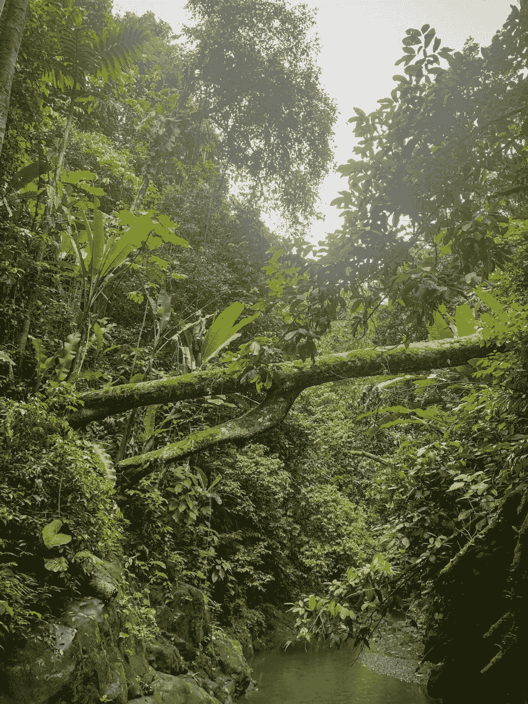
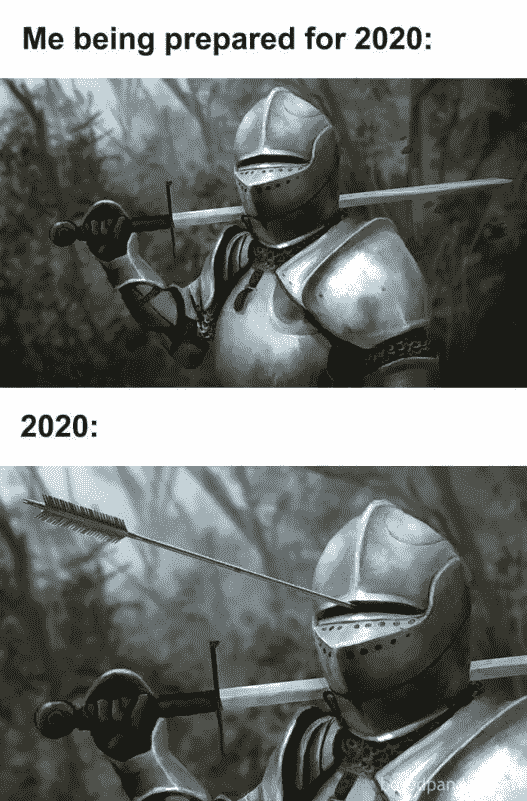

# 新的货币会是什么？

> 原文：<https://medium.datadriveninvestor.com/what-will-be-the-new-currency-5bf4065957d?source=collection_archive---------10----------------------->

在过去的 9 个月里，我一直住在哥斯达黎加/🇨🇷的波多黎各。这是我在周游世界训练、跑步和探险的 3 年中，在一个地方住得最久的一次。

My jungle 🐵

你可以想象，根据我过去的文章 [*创作经历*](https://blog.usejournal.com/our-feedback-after-creating-2-co-living-experiences-no-bullshit-2b8cd3778a1) 这里，这不是我最初的计划，而是疫情进入了画面。那改变了一切，对吗？

已经没有计划了。2020 年，一切皆有可能！

Picture found on the web.

我认为我们都经历过这三个阶段:

*   活跃期我有很多时间和精力。可以一下子看很多文章和书，从来不看！我在我的房子周围徘徊，疯狂地打扫，试图找到一些事情做。
*   **像僵尸一样躺着的日子**——这几天，我躺在床上，看新闻，看(假)新闻，不想做任何有成效的事情。
*   **隔离恐慌症**——我问自己，这辈子我要做什么？我是要继续工作，还是要去找工作？我如何能按时支付我的租金？

> 在这些黑暗的时刻，我相信对我和我们大多数人来说最重要的是我们与周围人的联系。

那么，下一步是什么？

如果你不明白世界上正在发生什么，停止阅读任何预测的文章或新闻。所有这些都是纯粹的猜测或者是假的。没有人真正知道未来。我们没有过去人类历史的度量或快照来预测这个前所未有的时期！但是我们可以在此时此地为自己想象一个更好的未来！

 [## 数字货币——推出 CBDC 需要什么？数据驱动的投资者

### 自 2014 年以来，中国的数字元一直在筹备中。然而，发行日期仍然未知，瑞典银行…

www.datadriveninvestor.com](https://www.datadriveninvestor.com/2020/04/13/digital-currency-what-does-it-take-to-launch-a-cbdc/) 

这是一个值得思考的好问题。

*   如何能改善自己的未来前景？
*   你怎样才能在当下感到更加平静？

这些问题的答案不会马上显而易见，但可以通过集中思考找到。

**和**，在这一片混乱中能找到什么教训？

让我们问另一个相关的问题，它将帮助你找到你正在寻找的答案。当你因为隔离而被困在家里的时候，对你来说最重要的是什么？你最怀念的是什么？

花一点时间停下来，认真思考这个问题:**你最怀念的是什么？**

在你做出回应之前，我先给你详细说说我自己的情况。

在我这边，我有能力走出去(一个机会)。哥斯达黎加/波多黎各的情况很正常。餐馆和商店都关门了。汽车和海滩通行受限。从年初开始基本上一切都停工了。恐惧和惊慌，和我们在这里感受到的一样，蔓延到世界各地。

还有许多时间限制，以及进入任何娱乐区和其他公共场所的限制。此外，进入商店和餐馆时必须戴口罩。没什么太糟糕的，但它确实改变了这个地区每个人的生活方式。

随着所有这些变化的发生，人们很容易感到沮丧或沮丧。但我环顾四周，发现什么才是真正重要的。在这些黑暗的时刻，我相信对我和我们大多数人来说最重要的是我们与周围人的联系。

我不在乎钱，我的意思是，我确实需要钱来维持基本的生存，但更重要的是，我在乎我与他人的联系的质量。

当我的朋友科斯罗(我认为他是我的良师益友)有一天告诉我:“*新的货币将是人际关系时，这种想法变得更加强烈。*

这句话真的适用于我。以至于我全身都起了鸡皮疙瘩(鸡皮😉).

现在，如果我从我生命中这个有趣的时期得到任何建议，那将是这个:**把你的时间、注意力、项目和精力投入到这些给你带来快乐、满足并让你感到活着的联系中。知道自己能支持别人，别人也会支持你，你会感觉很好。**

的确，作为人类，我们能做的最好的事情就是为我们的兄弟姐妹和我们周围的社区提供服务，这样我们才能变得更好，成长。

经济随时可能崩溃。整个系统可能会崩溃。再说一遍，这都是猜测。即使你有一些指标，也不可能定义一个确切的日期。但是，此时此地，你可以打电话给你最好的朋友，你的家人，帮助你的邻居。这是你今天能做的最有价值、最有营养的事情。

所以现在就做这件事，不要把时间浪费在虚拟网页和夸张的媒体宣传上。在你的**物理**空间中与人交谈、倾听、欣赏、拥抱、亲吻。

新货币将会是什么？你和你关心的人的关系。

爱你的❤️

 [## 我们在创建两个同居体验后的反馈。不废话！

### 与人相处是一种挑战。这需要一个强大的基础，也许是一个神奇的酱才能使它发挥作用！

blog.usejournal.com](https://blog.usejournal.com/our-feedback-after-creating-2-co-living-experiences-no-bullshit-2b8cd3778a1) 

## 访问专家视图— [订阅 DDI 英特尔](https://datadriveninvestor.com/ddi-intel)