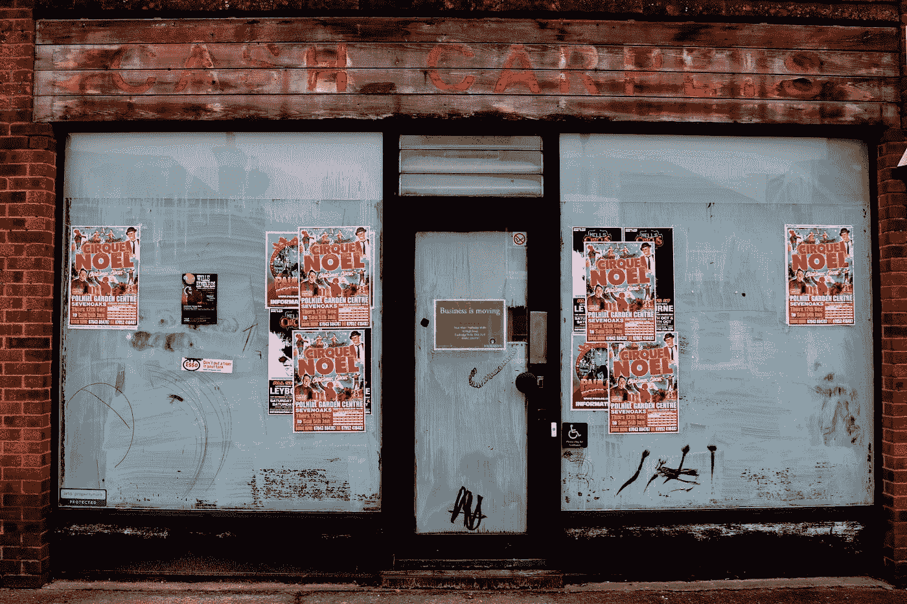
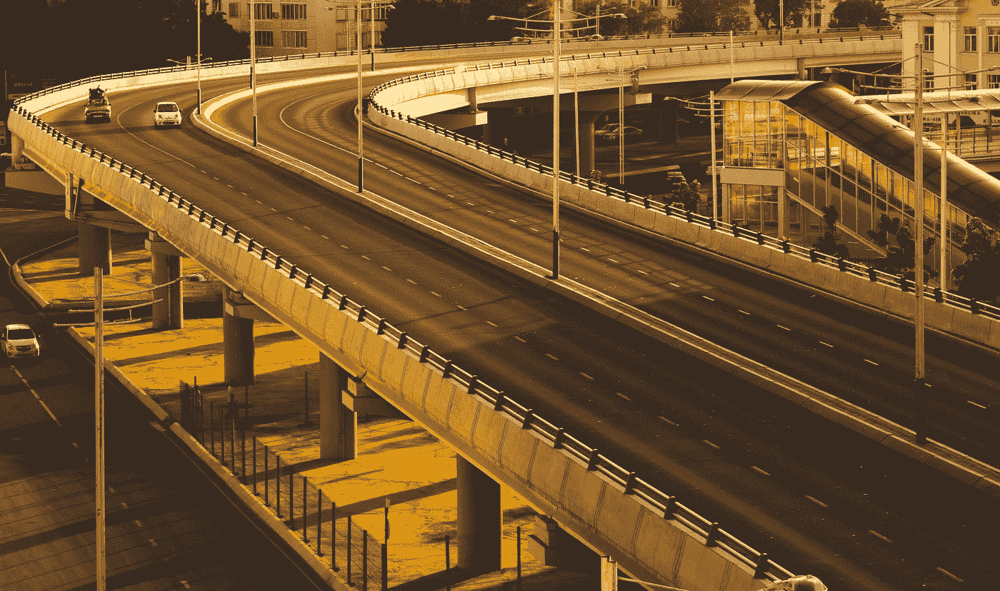

# 科罗纳之后的房地产会怎么样？

> 原文：<https://medium.datadriveninvestor.com/what-will-happen-to-real-estate-after-corona-832a03d68e90?source=collection_archive---------8----------------------->

Photo by [Sean Pollock](https://unsplash.com/@seanpollock?utm_source=medium&utm_medium=referral) on [Unsplash](https://unsplash.com?utm_source=medium&utm_medium=referral)

## 房地产市场和许多其他行业一样停滞不前。后电晕时代，价格将何去何从？在这里，我探讨了几个重要的关键趋势。

现在，买房几乎是死路一条。人们既不被鼓励离开他们的家，也没有人有兴趣马上组织一次搬迁。更别提 T2 创纪录的失业人数和休假工人，他们甚至负担不起。

**关键问题是，这一切结束后，价格会走向何方。**房地产作为一种稳定的投资，在人们心中一直享有特殊的地位。在过去的几十年里，价格几乎总是在上涨，除了少数例外和 2008 年破裂的一个大泡沫。这十年决定价格的主要趋势是什么？

 [## 利用股市相关性的最佳方式|数据驱动的投资者

### 当阿尔弗雷德·温斯洛·琼斯开创了世界上第一个“对冲”基金(后来“d”被去掉了)时，他让其他投资者大吃一惊…

www.datadriveninvestor.com](https://www.datadriveninvestor.com/2020/02/02/the-best-way-to-use-stock-market-correlations/) 

# **空荡荡的店面**

由于对零售业的商业影响，我们现在看到许多公司面临破产。这包括像内曼·马库斯[、迪安](https://www.straitstimes.com/business/companies-markets/us-luxury-retailer-neiman-marcus-advances-bankruptcy-preparations-after)[、迪鲁卡](https://asia.nikkei.com/Business/Food-Beverage/Thai-owned-luxury-grocer-Dean-DeLuca-files-for-US-bankruptcy)和科索·科莫这样的名字。**我们在大多数西方国家的封锁才进行了一个月，接下来还会有更多的封锁。**

> 因此，许多店面将会空空如也。很难想象在危机结束后，它们会再次填满。

封锁的另一个重要影响是，电子商务和交付将达到比以前更高的峰值。**传统零售业将继续承受巨大压力**，实体店铺可能会保持空置。

Photo by [Bruce Williamson](https://unsplash.com/@rbw500?utm_source=medium&utm_medium=referral) on [Unsplash](https://unsplash.com?utm_source=medium&utm_medium=referral)

# **减少对办公空间的需求**

由于每个企业都被迫想方设法让员工为远程办公做好准备，危机过后，员工可能会希望在一定程度上保持工作与生活的平衡。许多人现在发现，他们在家工作的效率有多高，他们可以更好地管理自己的生活。

> 未来的员工不太可能需要同样多的办公空间。我看到更多的公司合作即将到来。

除了更灵活的工作安排，**偏远地区的雇主会发现，大城市之外有很多优秀人才，工资也更合理。这将进一步减少对大城市房地产的需求，无论是私人的还是商业的，因为白领可以很容易地在他们选择居住的更偏远的城镇进行远程办公。**

# **自主共享移动**

全球每家汽车制造商仍在研发无人驾驶汽车。一旦这项技术成为主流，很可能在十年内实现，它将进一步减少对房地产的需求。**当自主移动与共享移动概念和更灵活的工作安排相结合时，我们将看到需求曲线变平**。这将促使我们大幅减少需要停车的车辆数量。

因此，目前用于停放汽车的一部分房地产将开辟新的用途，进入市场。随着更多的供应进入市场，没有明显的额外需求，价格可能会进一步承压。

Photo by [Анатолий Головченко](https://unsplash.com/@anatoliu?utm_source=medium&utm_medium=referral) on [Unsplash](https://unsplash.com?utm_source=medium&utm_medium=referral)

# **城市化——还在继续吗？**

从这个角度来看，一个大问题是城市化的趋势总体上是否仍然完整。**随着中国率先推动城市化进程**并转而发展更大范围的小城市网络，**这可能很快成为全球新的反潮流。**

> 工作和教育机会可能很快不会像现在这样依赖大城市生活。

希望生活在更和谐、更有环保意识的社区的人们可能会选择住在小城镇，而不是远程办公。

目前还没有数据以这样或那样的方式证明这一点——但是我们在过去几十年中看到的城市化的巨大增长可能不会在未来十年中出现。

# **总之**

虽然房地产市场目前处于停滞状态，但主要问题是，一旦当前的封锁结束，价格将走向何方。目前发生的事情对价格可能的走向有几个关键的影响——它们大多指向下方。

当前形势持续的时间越长，这些新趋势出现的影响就越深远，我们就越有可能在未来十年看到更多人们买得起的商业和住宅房地产。

*如果你有任何想法、回应或问题要补充，我很乐意在下面的评论中听到你的意见，或者随时通过* [*LinkedIn*](https://www.linkedin.com/in/smueller1512/) *直接联系我。感谢您的阅读！*