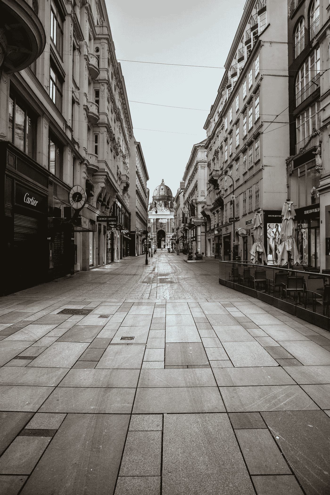

# 我们的新世界会是什么样子？

> 原文：<https://medium.datadriveninvestor.com/what-will-our-new-world-look-like-3f927cab57a1?source=collection_archive---------17----------------------->

## 你将如何适应新常态？

Photo by [Jaël Vallée](https://unsplash.com/@jv_photographer?utm_source=unsplash&utm_medium=referral&utm_content=creditCopyText) on [Unsplash](https://unsplash.com/s/photos/empty-city-streets?utm_source=unsplash&utm_medium=referral&utm_content=creditCopyText)

你必须做的第一件事是意识到我们的世界已经被永久地破坏了，事情再也不会回到疫情之前的样子了。

病毒不会神奇地消失，从长远来看，我们正在努力战胜这种疾病。

即使我们能在今年秋天制造出疫苗，并且在人体试验中获得成功，它仍然需要生产和销售，人们也需要接种疫苗。

**假设疫苗研制成功，考虑以下问题:**

*   没有疫苗是 100%有效的。如果我们能做的最好的事情是创造一种只有 50%或 60%有效的疫苗呢？
*   对于一种伤害或杀死部分接种者的疫苗，世界会有什么反应？
*   随着疫苗的生产，谁将是第一批接受者？
*   生产疫苗的制药公司会允许其他公司生产吗？
*   疫苗生产的利润将如何分配？
*   什么实体将支付接种疫苗的费用——保险公司、政府还是个人？
*   反疫苗运动将如何应对全球大规模疫苗接种的努力？
*   是否会有接种疫苗的法律要求，以及对不遵守的处罚？
*   对于那些缺乏公共卫生基础设施或缺乏用疫苗和适当的卫生方法抗击病毒的政治意愿的地区，我们会面临像封锁和社会距离这样的极端措施吗？
*   我们是否能够将检测和接触者追踪扩大到足以限制下一次疫情严重程度的程度？

**如果你认为这些问题太过牵强，**请记住，许多现有的抗议者携带武器，他们只是在抗议——戴着面具和保持社交距离。

除了面具和社会距离之外，还有可能是一些团体资助了这些抗议活动。从上述问题的一些可能的答案来看，目前的示威变得非常令人担忧。

**这些问题的答案将对我们的经济产生直接而深远的影响。**

**呈现已经发生并可能继续的变化:**

*   在家工作将对房地产价值和税基产生重大影响。一些公司已经宣布，他们将继续允许员工在家工作。如果你可以在任何地方工作，当你可以搬到一个小城镇或农村时，为什么你会选择在一个昂贵的城市工作？就这一点而言，为什么要在美国工作，因为许多其他地方也同样有吸引力？也许有些所得税更优惠？
*   如果大城市出现大范围的流动，这将对城市税收基础的下降产生重大影响，并增加小城镇在教育、消防和警察部门以及教育设施方面的预算压力。
*   随着越来越多的自由主义城市居民迁入越来越保守的小城镇，这将改变政治格局。前面是一个概括，但是大城市人和小城镇人的世界观是不同的。这并不是说一种观点更好或更坏，只是说事情会改变，政治格局也会随之改变。
*   自动驾驶汽车或至少是驾驶辅助车辆的开发和部署将会增加。现有的汽车技术在不太拥堵的地区效果更好，随着这些车辆销量的增加，更好的自动驾驶汽车的开发也会增加。
*   家庭烹饪和餐馆自动送餐将继续发展。我们可能再也看不到我们所熟知的餐馆就餐的回归了。拥挤的酒吧和密集的桌子将成为过去。餐馆不会消失，但其形式和设计需要修改，以解决新的公众问题。
*   育儿行业被破坏了，回归的时候会是新的形态。可能会有更多的公司提供公司赞助的儿童保育设施，也可能一些公立学校系统会扩大为学龄前儿童提供保育服务。有些事情需要改变，因为如果没有儿童保育，女性将被迫退出劳动力市场。许多家庭依靠夫妻双方赚取收入，因此这些情况需要快速补救。
*   一些大公司——比如赫兹——在目前的配置下无法生存。旅游业急剧萎缩，依赖旅行者的汽车租赁公司看到他们的顾客消失了。它也可能扩展到游轮业和航空公司。
*   许多较小的购物中心将无法承受消费者购物方式的变化。随着消费者越来越习惯于在线购物，可能不会有足够多的人回到以前的购物中心购物，以支持所有现有的零售空间。许多较小的商场缺乏现金储备来应对向新零售形式的过渡。
*   零售业的面貌将会改变，以满足公众新的关注。一些大型商场正在考虑使用应用程序让人们预约进入零售店。一些餐厅正在考虑扩大现有应用程序的使用范围，让人们在车里等着，直到他们的桌子准备好。这样，他们将满足他们的社交距离准则。
*   这可能是大银行权力终结的开始。4 月，Pay Pal 成为第一家由联邦政府授权发行刺激支票的网络银行。曾经由大银行拥有的对金钱的垄断正在消失。Quicken Loans 现在是美国最大的抵押贷款机构。越来越多的零售店不希望你用现金支付，因此信用卡公司看到了比以往更多的业务。

**结论:**

我们刚刚开始开放我们的经济，来自这三天周末的报告仍在陆续到来，但到目前为止，结果是描绘了一幅复杂的画面。一些海滩和湖泊见证了大批人群，他们很少或没有戴口罩，也没有社交距离。其他地点的活动有所增加，但有大量的人戴着口罩，练习社交距离。

如果在那些拥挤的海滩上没有爆发报告的感染病例，其他地区的重新开始将会加快。另一方面，如果报告的病例激增，我们可能会看到继续封锁的新动力。还有待观察的是，公众会容忍多少感染和死亡病例，以满足其重返工作岗位的愿望。

许多流行病学家预测，秋季感染将激增，这将对零售业产生重大不利影响。那些解决了网上购物难题的企业将会繁荣发展，而其他企业将面临极具挑战性的时代。

下一篇文章将着眼于不断变化的政治格局，以及政治家们如何看待增加公共卫生资金、全民医疗保健和保证所有人的基本收入等问题。