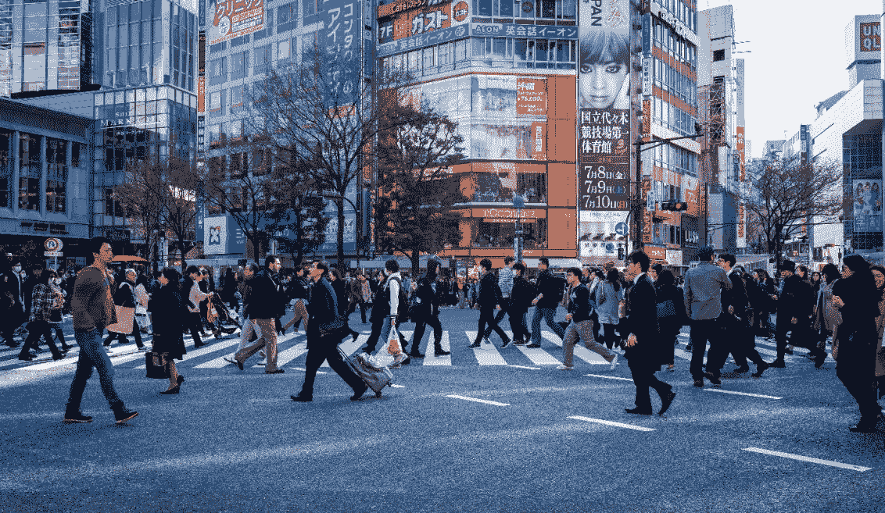
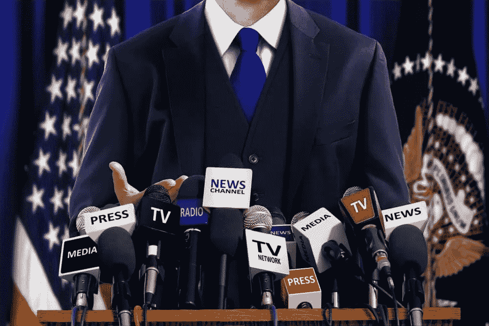

# 无论如何，政府在自由世界中的地位会是怎样的？

> 原文：<https://medium.datadriveninvestor.com/what-would-governments-place-in-a-free-world-look-like-anyway-data-driven-investor-cef21ae390ef?source=collection_archive---------25----------------------->

Photo by [Joshua Sukoff](https://unsplash.com/@joshuas?utm_source=medium&utm_medium=referral) on [Unsplash](https://unsplash.com?utm_source=medium&utm_medium=referral)

撇开政治科学的争论不谈，围绕政府角色的讨论比以往任何时候都更加重要。政治家、经济学家和政策制定者长期以来一直在争论政府的角色和统治者对其臣民的权利。一个政府是最低权威还是最高权威是一次政治旅行。在这篇短文中，我们将思考最低权威政府以及围绕这样一个实体的对话。

政府到底是什么？

让我们快速回顾一下当今西方世界现代治理之父的信念。

 [## 无论如何，政府在自由世界中的地位会是怎样的？数据驱动的投资者

### 撇开政治科学的争论不谈，围绕政府角色的讨论比以往任何时候都更加重要…

www.datadriveninvestor.com](https://www.datadriveninvestor.com/2020/08/20/what-would-governments-place-in-a-free-world-look-like-anyway/) 

基础著作《利维坦》的作者托马斯·霍布斯支持将绝对权力集中在一个实施秩序的国家手中。他认为，没有这样一种力量，人类将无法享受任何不是“孤独、贫穷、肮脏、野蛮和短暂”的存在。相反，英国哲学家约翰·洛克认为个人有生命权、自由权和财产权。这些自然权利限制了统治者的权力，统治者采取行动来实施和保护这些权利。政府应该起到保护财产和鼓励商业的作用。另一位政治哲学家卢梭对自然界中人的状态有不同的看法。他相信人类在自然状态下是“自由、平等、和平和快乐的”财产所有权是不平等、谋杀和战争的一个原因。卢梭主张直接民主和人民意志的原则。与他同时代的孟德斯鸠主张权力分立，而卢梭则主张人民行使权力，政府仅仅由官员组成。

这些想法产生了深远的影响，并在美国宪法中找到了自己的元素，也成为许多其他国家政治制度的灵感。

Photo by [Cory Schadt](https://unsplash.com/@coryschadt?utm_source=unsplash&utm_medium=referral&utm_content=creditCopyText) on [Unsplash](https://unsplash.com/)

快进到今天，我们仍然在辩论政府在我们生活中应该扮演的角色。

让我们不要从政治的角度来审视这个问题，而是以保护私有企业、自由市场和自由为中心。本质上，我们想要“构建”一个支持这些价值观的政府。让我们也考虑另外两个因素。第一:一个正常运转的社会将最大限度地为最大多数人带来幸福。我们不会将幸福定义为由多巴胺、催产素、血清素和内啡肽释放而产生的精神状态，而是一种更具体的可测量的能力。也就是说，幸福可以量化为预期寿命、整体健康、财富、自由和欲望的组合。这些类别将在另一篇文章中详细阐述。“最大的数字”听起来像什么，虽然这将在另一篇文章中详细阐述。第二:社会是一个自下而上的结构，这意味着权力和自由的授权集中在底部，并逐渐流向顶部。底层单纯指个人层面，顶层指最高层面:民族。

我们将这两个考虑因素和我们对政府角色的定义用于缩小我们讨论的范围。现在我们将关注它的用途。

如果我们假设人们是理性的行为者，那么我们可能会被引导去相信我们的行为是为了我们自己的利益和最大化“个人效用”。在个人层面上，这是一个有效的假设，尽管在调和个人偏好和社会利益时会出现麻烦。一个社会可以被看作是一个个体的整体，一个自身的实体，政府是它的大脑决策者，正如军队是它的肌肉组织，个人是建造这些不同器官和系统的细胞。政府的角色是什么？当个体共同努力创造功能器官时，是否应该允许它为身体的其他部分做决定？虽然这肯定是解释组织实体行为的有效方法，但我们不会这样做。相反，我们不认为影射一个比个人更复杂、更官僚的组织的感觉是一个自由人希望进行的心路历程。

相反，我们将扭转这种思路。社会，更确切地说是它的“大脑”，政府应该为它声称代表的个人服务。这个奴性的实体究竟应该如何运作？

管理机构的第一个经济目的是解决个人最优行为在短期或长期内危及公共利益的问题。通常，这种情况出现在非排他性和非竞争性的公共物品中。“公地悲剧”代表了这样一种情况，即共享一种公共资源的不协调的个体为了他们的最大利益而独立行动，将无法最大化群体效用，最终耗尽所述资源。回到我们的身体比喻，如果一个人发现自己处于必须牺牲手臂才能生存的境地(假设这是他们的最佳选择)，理性的决定将是牺牲手臂。然而，想象一下，这只手臂有自己的良心，决定在它自己面前牺牲个人是符合它自己的利益的。最终个人和手臂都会死亡。如果环境设定为身体的任何部分都可以被牺牲，并且每个部分都有良心和意愿以他人为代价生存，那么一个更加难以驾驭的局面就会到来。

在这种情况下，领导层需要做出必要的选择。身体的每个部分都可以投票决定要牺牲的器官，或者他们可以委托一个部分来做出决定。这是管理机构，将作出必要的决定，其中个人利益净负面效用的社会。然而，公地悲剧凸显了人类理性的另一个关键局限性，即它受到时间、信息和认知能力的限制。如果共享公地的每一个人都能够从所做的每一个决策组合中计算出自己以及其他所有参与者的效用，那么这个群体就可以达成共识，并可持续地使用土地。然而，在大多数情况下，这不是一个可行的解决方案，将责任委托给权威人士可以节省做出决策的时间和成本。这是因为虽然个人可能寻求他们自己的局部最大值，但领导者将负责寻求全局最大值。我们的领导人还将被委托自费寻求全球最大化(如有必要)，并得到合理的补偿或胁迫，以使他们接受这个角色总比不接受好。

一个管理机构的行为很大程度上与我们刚刚委托给我们的公地的领导者的行为相同。它以解释个人短视和无能的方式为它所代表的人服务。它可以通过把解决信息不对称问题作为首要目标来做到这一点。

这就是我们描述的管理机构和之前提到的大脑之间的区别。虽然大脑命令身体的其余部分采取行动，并会毫不犹豫地牺牲手臂，但我们的管理机构会向每个成员提供关于情况和权衡的准确信息。如果身体的其他部分决定，他们会牺牲手臂，或者寻求不承担牺牲朋友的罪恶感，简单地把责任委托给大脑。然而，在一个时间敏感的环境中，一个小组不可能对每个问题都经历这个过程。随着问题变得越来越复杂，预先确定的过程开始活跃起来。权力是事先下放的，管理局和其他成员之间的信任成为共生关系的支柱。

当许多私人个人不能或不愿意自己解决的问题出现在不同领域时，他们可以同意将责任集中在一个核心管理机构，或将责任分配给多个专门机构，这些机构可能相互重叠或独立运作。从一个希望在个人层面保留最大权力的社会的角度来看，理性的选择是选择后者。从理论上讲，层次越少的系统反应越快。当社会变得越来越复杂，管理机构产生了几乎像黑匣子一样的官僚机构时，在一个他们不了解其大脑的机构中充当细胞的个人有什么希望尽可能多地收回自由？

如前所述，第一步是翻转叙述。细胞不为身体服务，而是相反。身体和它的控制中心用来保护它所包含的生态系统，维持类似于体内平衡的东西。一个管理机构试图做类似的事情，通过自由和公平的企业和思想的交流，维护社会和平，让社会繁荣。

在我们之前分配责任的功能社会中，个人拥有权利，但也被赋予责任。在一种残酷的情绪中，民主社会(通常是非民主社会)得到了应有的领导。当普通公民未能捍卫他们的自由或接受他们的公民责任时，他们会发现当权者急切地承担更多的责任，并在此过程中进一步集中权力，这一切都符合被统治者的最佳利益。

那么，在我们的治理体系框架内工作时，个人和社会的责任是什么？

首先，社会必须努力保持对有关其长期生存的相关问题的充分了解和教育。尽管主流社会不接受不同的事实，但不同的观点必须得到容忍，以免仁慈的领导人宣扬自己的事实并据此采取行动，压制异议而不受惩罚。适当的教育至关重要。修辞、批判性思维、合作、领导、企业家精神和技术才能等技能必须比数学、历史和写作等科目更有活力。

公民责任也至关重要。社区必须完全参与塑造其直接现实的过程，独立于黑箱官僚。当有效的信息可用并且产权得到执行时，社区成员可以通过科斯式的讨价还价来处理本地冲突，而不是死板的法律和法规。这使人们能够召集并达成更灵活的解决方案，并保留代理权。

健康和生活方式的选择也是个人的责任。一个受过教育的社区，展现出强大的社会联系，将能够做出更好的长期健康和生活决策。这就排除了机构干预的必要性。利用消费者需求和个人自由的力量将获得更健康的结果。当人们能够对自己的行为导致的不利环境承担全部责任时，他们就能过上更充实的生活，体验只有通过行动才能获得的自由。

虽然我们可以研究社会契约和最低权威政府的无数方面，但这将需要一个扩展的部分。我期待在以后的文章中进一步阐述其他想法。

*原载于 2020 年 8 月 20 日*[*【https://www.datadriveninvestor.com】*](https://www.datadriveninvestor.com/2020/08/20/what-would-governments-place-in-a-free-world-look-like-anyway/)*。*

**访问专家视图—** [**订阅 DDI 英特尔**](https://datadriveninvestor.com/ddi-intel)