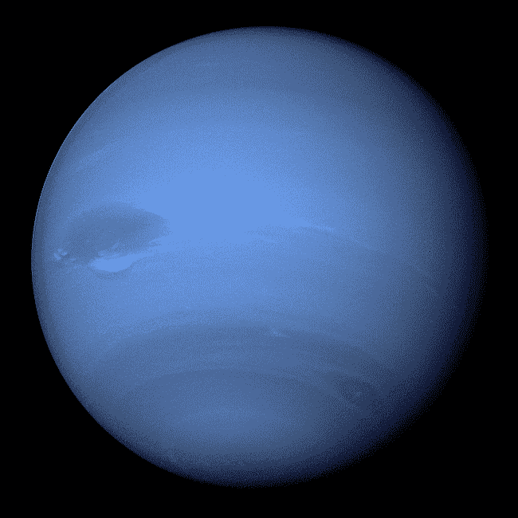
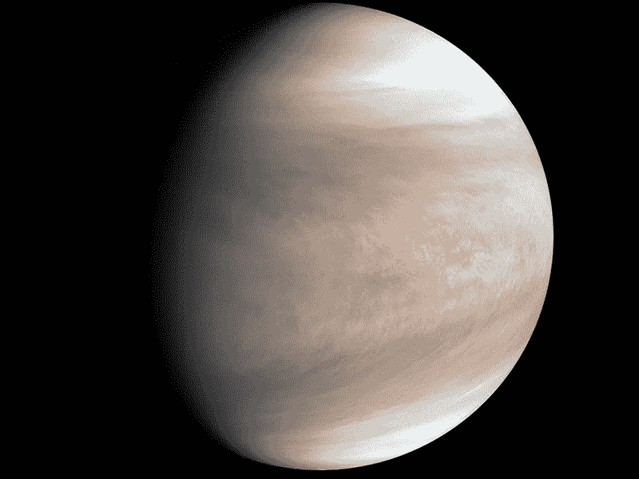
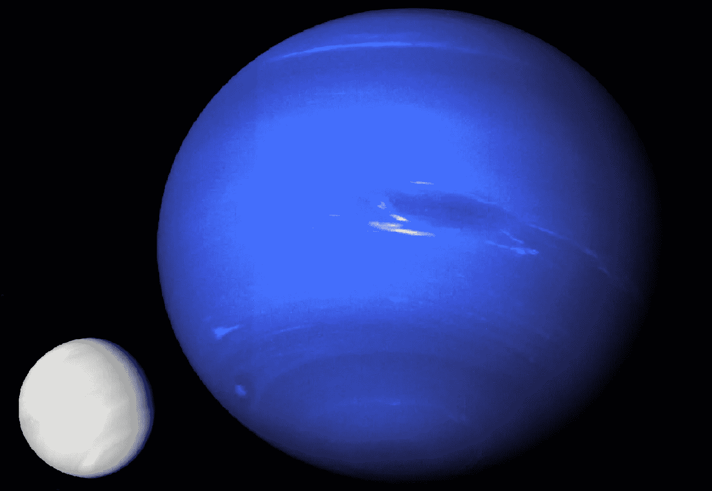
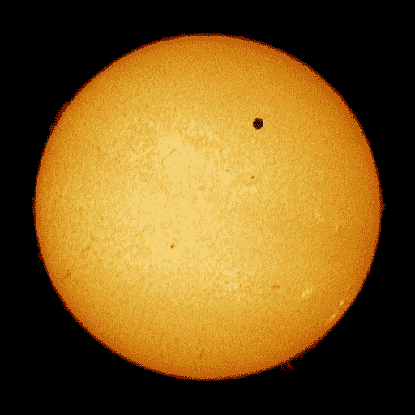

# 如果金星和海王星交换位置会发生什么？

> 原文：<https://medium.datadriveninvestor.com/what-would-happen-if-venus-and-neptune-switched-places-47fe591d5b5?source=collection_archive---------2----------------------->

## 从最热的行星转换到最冷的行星会对太阳系的其他部分造成任何后果吗？

Neptune, photographed by Voyager 2 probe — photo: NASA / JPL

我在 Quora 上看到了这个问题，我很好奇……最热的行星金星，距离太阳只有 1.08 亿公里，是一个地狱般的岩石，表面温度超过 300 摄氏度，会与最冷的行星海王星交换位置，距离我们的恒星 45 亿公里，比金星远 44 倍，是一个冰冷的气体巨星，零下 200 摄氏度。这两个人会怎么样？

Venus, photographed by the Japanese spacecraft Akatsuki — photo: JAXA

更糟糕的是，太阳系会发生什么？

毕竟，海王星的质量比金星大得多……距离我们如此之近的气态巨行星的存在——金星是其轨道与地球轨道最相关的行星——会扰乱我们在太阳系中的位置吗？我们会被拉向太阳还是被扔进一个更开阔的轨道，在那里地球会变冷，我们会被冻死吗？

A comparison of two planets’ size, using images from Voyager 2 and Akatsuki — photos: NASA / JPL and JAXA

我决定使用一个名为“宇宙沙盒 2”的太阳系模拟器，看看会发生什么。我把海王星放在金星绕太阳的轨道上，把金星放在海王星绕太阳的轨道上。我曾经让我的想象力在那里飞翔，我已经准备好看到巨大的灾难在太阳系蔓延……我以为水星和地球会被弹出它们的轨道；火星会落入太阳，金星会被天王星吸引，变成新月…

但不是。

什么都没发生。

没有轨道受到影响。

我已经看了几个世纪的模拟了！

(世纪模拟中，我实际上花了大约二十分钟)。

唯一彻底的变化发生在行星的温度上。海王星在零下 222 摄氏度开始模拟，随着温度稳定，在正 30 摄氏度结束。金星，从 339 摄氏度开始，到零下 148 摄氏度结束。

这种温度变化预计会导致行星的剧烈变化。尽管如此，在“宇宙沙盒”中，除了温度，没有任何东西被注意到，无论是视觉上还是标记上。我不知道这是否是由于程序的限制，通常是非常详细的…

 [## 为什么行星对文化如此重要？数据驱动的投资者

### 为什么冥王星不再是行星了？这个问题困扰着物理学家、前 ABC 新闻科学编辑、作家和教师…

www.datadriveninvestor.com](https://www.datadriveninvestor.com/2020/02/23/why-are-planets-so-darned-important-to-culture/) 

但是我可以推测:

*   随着海王星大气层的膨胀，它会变得稍微大一点。
*   他们的卫星会变得更热。其中一些会融化他们的冰。例如，海王星最大的卫星 Triton 会迅速形成富含甲烷的厚厚的大气层，甲烷是那里的丰富成分。我没有足够的知识来知道来自新轨道的更强的太阳风是否会将这种新的大气带入太空。
*   海王星的凌日在地球上会比金星的凌日更引人注目——“凌日”是我们给这颗行星在太阳前面经过的名字。当它们发生时，我们可能会注意到我们的恒星的亮度下降…下面的图像显示了金星凌日之一。

photo: [CESAR Educational Initiative](http://cesar.esa.int/)

*   反过来，金星会“缩小”一点，因为它的大气层会急剧冷却。今天存在的令人窒息的温室效应将会消失。它的大部分大气将变成固体，因为它主要由二氧化碳组成，二氧化碳在零下 56.57 摄氏度时凝固，而行星的温度现在将是零下 148 摄氏度。

在我运行模拟的几年中，我没有注意到金星的轨道与天王星和其他气态巨行星的轨道有任何不同。但很可能在数百万年后，海王星和金星都引起了太阳系动力学的变化。毕竟，其中一个气态巨行星的迁移导致了所谓的[晚期大爆炸](https://en.wikipedia.org/wiki/Late_Heavy_Bombardment)，这是我们太阳系中大多数陨石坑出现在行星和卫星上的时期。

这种类型的练习对我们认识到太阳系所达到的难以置信的平衡是很有趣的。我们的观点没有帮助的事实使我们把我们的一天 24 小时、三百六十五年和宜人的温度视为理所当然地生活在我们的恒星周围。但事实是，太阳系花了几百万年才稳定在这种构型。许多行星碰撞合并，就像忒伊亚和 Proto-Terra，在[月球形成著名的碰撞](https://en.wikipedia.org/wiki/Theia_(planet))。其他行星已经被抛出了太阳系，现在肯定正在完全冻结的星际空间漫游。

为了得到我们所拥有的，我们已经失去了太多太多。

有人说，如果没有月球的存在，生命就不会出现在地球上，月球稳定了我们的轨道，使我们的季节足够稳定，不会结束生命的出现…

如果这一过程没有发生，我们就不会在这里*确切地说是*。

**访问专家视图—** [**订阅 DDI 英特尔**](https://datadriveninvestor.com/ddi-intel)