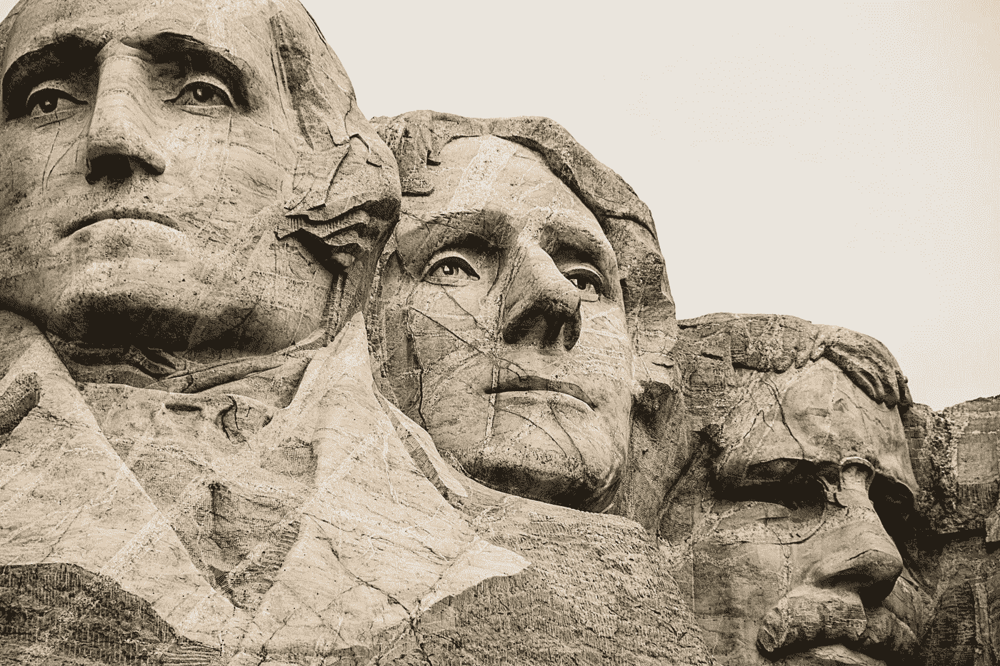

# “爱国主义教育”会是什么样子？

> 原文：<https://medium.datadriveninvestor.com/what-would-patriotic-education-look-like-20e9b3bf667?source=collection_archive---------11----------------------->

我们已经这样教了 200 多年了

Photo by John Bakator on Unsplash

唐纳德·特朗普(Donald Trump)的总统和连任竞选一直是为了他的基础，而且只是为了他的基础。我希望我可以说，我对那些认同他的种族主义、厌女症和无知的人的比例感到震惊。尽管如此，太多互联网帖子的评论部分证明了它们的存在。唐纳德提出美国的学校教授“爱国主义教育”，这已经升级了他的游戏

“左翼暴乱和伤害是我们学校几十年来左翼思想灌输的直接结果。”

特朗普希望我们的学校教授“亲美课程”，并说，“我们的英雄永远不会被忘记。”

*“我们的青年将被教导热爱美国！”*

在他 9 月 17 日在国家档案馆的[演讲中，他继续宣布国家人文科学基金会将拨款支持“亲美课程，颂扬我们国家伟大历史的真相”他说他将创建一个“1776 委员会”来“恢复我们学校的爱国主义教育”他会删掉所有不好的部分，以反驳他所谓的“美国是一个邪恶的种族主义国家”的说法。](https://www.nytimes.com/2020/09/17/us/politics/trump-patriotic-education.html)

特朗普会粉饰这个国家的历史，就像他试图抹去自己的家族历史一样，包括他的祖父弗里德里希·特朗普是个皮条客。他的父亲在一次反对警察的三 k 党暴乱中被捕，他与一名色情明星和一名花花公子模特有染。

*“他从未被捕。他与此事无关。这从未发生过。这是胡说八道，从来没有发生过。这从未发生过。从未发生过。他从未被逮捕，从未被定罪，甚至从未被指控。这是一个完全错误的，荒谬的故事。他从来不在那里！从来没有发生过。从未发生过。”*

特朗普重写历史的计划中最荒谬的部分是假设它还没有发生。美国的教科书很少提到强行强奸奴隶以贩卖后代获利。

 [## 美国的养殖场:历史书从没告诉过你什么

### 1808 年，美国禁止从非洲和西印度群岛进口奴隶。对美国实际奴隶制的影响…

blog.usejournal.com](https://blog.usejournal.com/americas-breeding-farms-what-history-books-never-told-you-6704e8b152a4) 

与 60 年来禁止几乎所有中国移民的 1882 年排华法案相比，特朗普的现代穆斯林禁令并不重要。在事件发生的得克萨斯州，他们对[斯洛科姆大屠杀](https://www.zinnedproject.org/news/tdih/slocum-massacre/)教了些什么？“他们对《T4》中《泪之小径》的报道有多深入？你读过艾萨克·伍德尔德的故事吗？

 [## 记住他的名字:艾萨克·伍德尔德

### 美国的司法真的变了吗？

medium.com](https://medium.com/@williamspivey/remember-his-name-isaac-woodard-4eec5a84c0c6) 

特朗普希望我们的学校给美国历史带来积极的一面。德克萨斯州的学区已经抢先一步，开始教授美国例外论，这种理论认为美国比其他任何国家都伟大，因为白人。因为德州的面积和影响力。许多其他国家利用同样的书籍，传播仇外心理和错误信息。

驱使美国向西扩张到太平洋的“天定命运论”是基于这样一种理论，即上帝宣布太平洋以西及以外的所有土地都是白人的领地。南卡罗来纳州参议员约翰·c·卡尔霍恩在参议院的大厅里说得更清楚了，他提出了不吞并整个墨西哥的理由。

“我们从未梦想过将除高加索人以外的自由白人纳入我们的联邦。合并墨西哥将是第一个合并印度种族的例子；因为一半以上的墨西哥人是印第安人，另一半主要由混合部落组成。我抗议这样的结合！先生，我们的政府是白人的政府。西班牙美洲的巨大不幸可以追溯到致命的错误将这些有色人种与白人平等……”

特朗普会让我们只说建国者的好话，他们把奴隶制写进了宪法，却只字不提。他们给我们带来了[选举团](https://time.com/4558510/electoral-college-history-slavery/)和[第 1 条，第 9 款:第 1 条](https://medium.com/discourse/article-1-section-9-clause-1-898dbdf1f365)，以保护奴隶制不被选民废除。并不是只有拥有土地的白人有资格投票。

特朗普不希望美国被认为是一个“邪恶的种族主义国家”。他的方法是根除任何提及过去的邪恶和种族主义行为。同时，他将它们延续到现在。将棕色人种的孩子与他们的父母分开，可能是永久性的，当然是合格的。

特朗普改变历史的呼吁，联邦政府无法实施。州和地方政府直接控制学校的教学内容。美国国家人文科学基金会的拨款不到 30 万美元，可能不会产生太大影响。我想知道的是，特朗普希望用他公然的种族主义和谎言来刺激谁？他的顾问中有谁认为这个计划是个好主意？这个计划值得一个起源于独裁政权的计划。在特朗普的领导下，鉴于国会未能履行职责，或许这就是我们的现状？