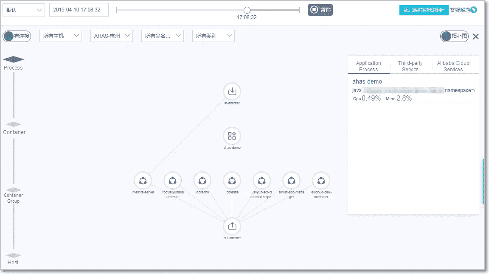
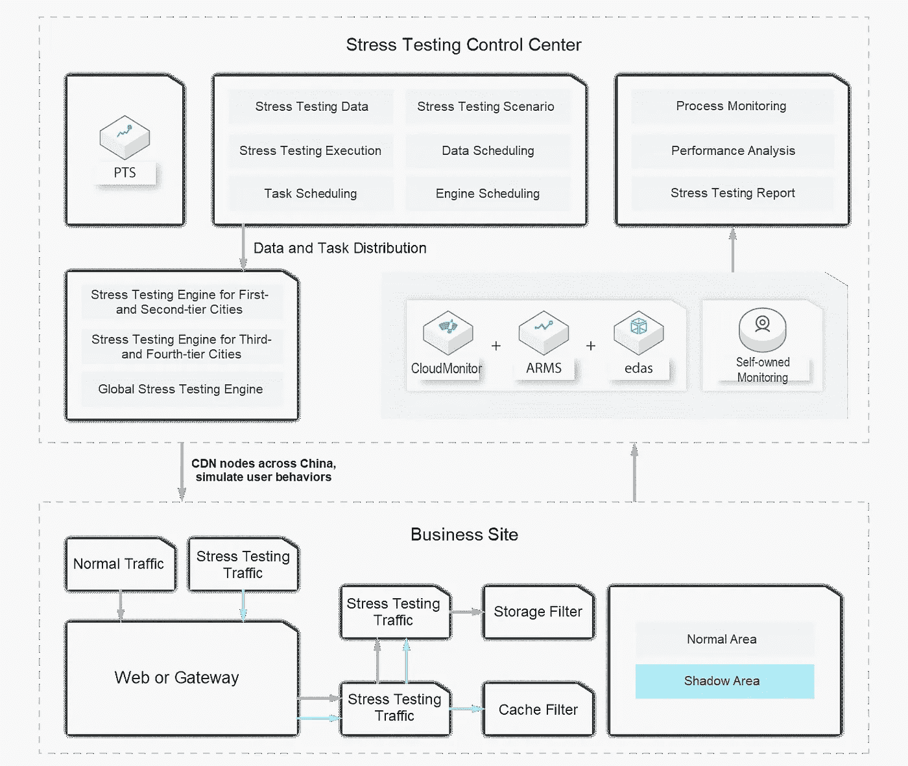
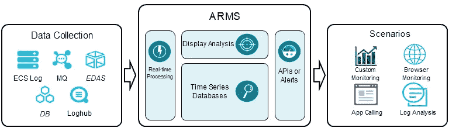
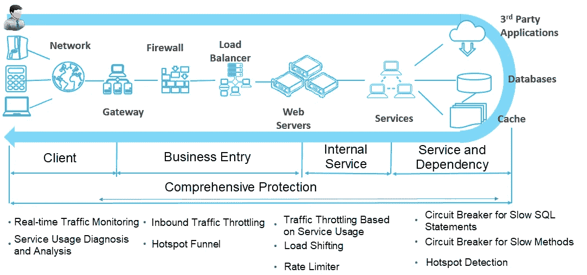
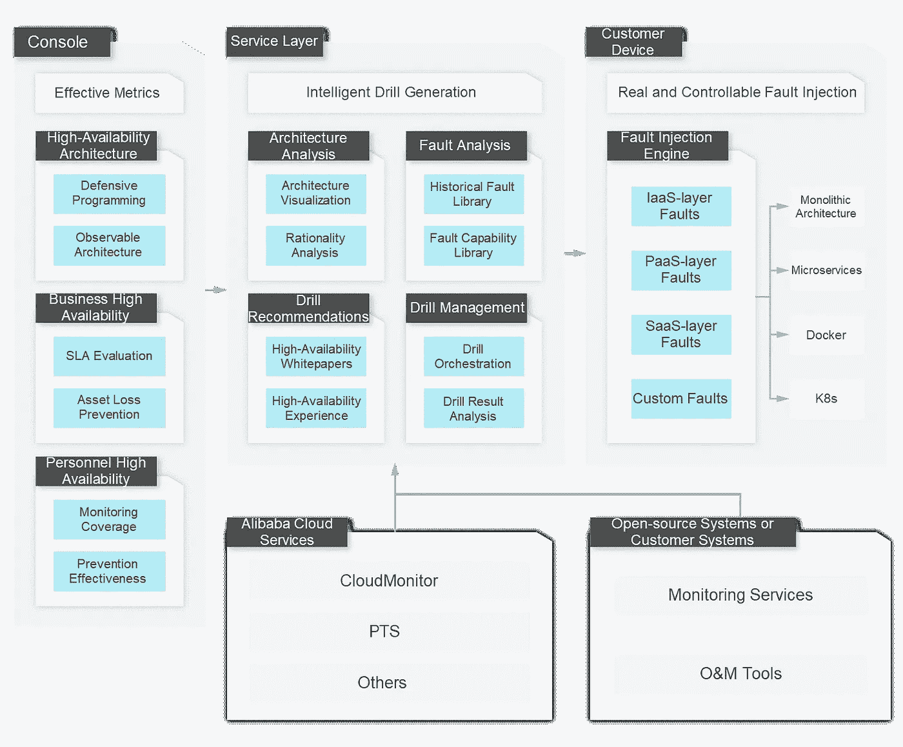

# 如果你的应用在冠状病毒爆发期间崩溃，你会怎么办？

> 原文：<https://medium.datadriveninvestor.com/what-would-you-do-if-your-app-crashes-during-coronavirus-outbreak-c4ebd48cae8?source=collection_archive---------28----------------------->

为了赢得这场不可避免的战斗，抗击新冠肺炎，我们必须携手合作，并在世界各地分享我们的经验。通过全球医疗交易所抗击新冠肺炎(GMCC)计划，加入我们抗击疫情的行列。现在申请[*【https://covid-19.alibabacloud.com/】*](https://covid-19.alibabacloud.com/?spm=a2c41.14244632.0.0)

阿里巴巴昵称为燕顺的丁杰。

在对抗冠状病毒的漫长战斗中，普通人能做些什么？简而言之，大多数人能做出的最重要的贡献就是呆在家里。一些人喜欢通过玩几个小时的视频游戏、狂看在线视频流或点击他们最喜欢的应用程序来逃避现实。但是，假设你是运行这些系统中的一个的人，而你的应用程序碰巧崩溃了，考虑到所有在家使用你的应用程序的人都给你带来了新的峰值，这难道不会对你的业务造成毁灭性的打击吗？这就是为什么制定计划来保护您的应用程序如此重要。

如今，我们依靠一些非常有才华的程序员来保持我们最喜爱的在线游戏、电影和应用程序正常运行。但是随着在线流量的激增，许多在线应用正面临着前所未有的挑战——流量远远超过正常水平。

为了防止您的应用程序在高流量负载和突然流量高峰的压力下崩溃，您需要采取必要的措施来保护您的应用程序。最重要的衡量标准之一就是确定您公司当前的 IT 架构是否能够真正支持未来的业务增长。另一个解决方案是考虑投资云计算，享受它所提供的弹性。

 [## 2019 年移动应用开发之路|数据驱动的投资者

### 任何在移动应用程序开发行业工作的人，无论他们是专注于在伦敦开发 iOS 应用程序还是…

www.datadriveninvestor.com](https://www.datadriveninvestor.com/2019/01/15/the-path-of-mobile-app-development-in-2019/) 

当然，重要的是要知道，并非所有的云供应商都提供相同的软件包。在阿里云，我们已经建立了一个技术系统，该系统具有高并发性、高可用性，并支持大规模流量峰值——这就是我们如何能够支持每年在[双 11](https://www.alibabacloud.com/blog/double-11-with-alibaba-cloud-%241b-gross-merchandise-volume-in-68-seconds-with-zero-downtime_595590?spm=a2c41.14244632.0.0) 出现的大规模流量峰值。在阿里云，我们已经让我们的一些客户为未来可能带来的一切做好了准备。其中一家公司是 Luogic，它在中国有一个娱乐和信息应用程序。我们帮助他们对他们的系统实施端到端压力测试。

在本文中，我们将总结一些高用户量和突然的流量高峰造成困难的实际案例，然后我们将寻求阿里巴巴高可用性架构背后的一些阿里巴巴顶级工程师的帮助和实用建议。我们希望这篇文章能够启发那些目前正在应对 web 应用程序高流量的企业。

# 您的应用程序为什么会崩溃？

# 复杂的服务器环境

通常情况下，应用程序本身相对稳定，所以崩溃通常发生在服务器或云中，而不是应用程序本身。因此，在这种情况下，服务器环境的复杂性是一个主要问题。

让我们来看一个成熟的基于云的架构。在阿里云，当涉及到构建在线服务时，您可以使用大约 200 种云计算产品来构建您企业的 it 基础设施、安全和应用系统。此外，从客户端(如 app 或 PC)访问服务器涉及许多关键节点，如内容交付网络、动态加速器、防 DDoS 服务、应用防火墙、第 4 层和第 7 层负载平衡器、前端和后端服务集、缓存、数据库存储、中间件和基础架构层。该系统可能很复杂。比如负载均衡时影响流量的产品规格有五个，后端服务的规模就更加复杂，难以评估。这些节点中的任何一个出现问题，都可能导致你的服务不可用，让终端用户以为应用已经崩溃。同样的问题也会影响私有云、混合云和内部数据中心系统。

所有企业都需要找到一种方法来有效、全面地测试其服务器的吞吐量，发现所有潜在的问题，甚至规划未来的扩展能力。在这些努力中，流量高峰期的节流和调度是所有公司都必须考虑的方法。

# 没有做相关的规划

如果没有提前规划好自己 app 的服务能力和关键节点，没有任何应对突发事件的在线措施，比如弹性伸缩、在线保护、容错等，那么在流量出现峰值的情况下，很难保证自己系统核心接口的稳定性。一旦他们的应用程序崩溃，许多企业无法采取适当的措施，快速的容量扩展不会解决问题，甚至会导致更多的问题。

除了由于问题检测、容量规划、节流和容错能力下降导致的崩溃之外，还有隐藏的 O&M 风险，涉及故障影响面、配置一致性、监控和根本原因分析工具，以及复杂人员组织的高可用性。如果企业不进行适当的演练并开发验证解决方案，他们的应用程序经常会在关键时刻崩溃。

# 关于构建高可用性架构的建议

接下来，我们将根据阿里巴巴工程师的丰富经验来看看一些高可用性架构的构建实践。

# 建筑设计

当谈到构建高可用性架构时，我们应该做的第一件事是实现架构可视化。通过[应用高可用服务](https://www.alibabacloud.com/help/product/87450.htm?spm=a2c41.14244632.0.0) (AHAS)的架构感知，您可以全面了解云系统架构，直观地展示云资源、容器和应用之间的层次依赖关系。服务器、存储和网络是现代云平台的基础设施。随着云战略的普及，越来越多的企业在云平台上构建自己的业务、服务和系统。

开源软件和云服务的多样性，开发语言的异构性，以及企业 IT 团队的组织和能力差异，使得制定标准非常困难。这导致了 AHAS 建筑感知功能的开发。该功能通过收集和分析操作系统和第三方标准接口来捕获进程级调用关系。然后，它使用特征库算法来识别流程所使用的技术组件。最后，它直观地呈现了应用程序架构，显示了它的服务器、容器和流程。这为您提供了一个清晰全面的云架构图。基于这个基本视图，AHAS 可以导出云资源、容器和应用程序架构的多维架构视图，以及基于场景的视图，如站点迁移、重组和资产管理。这种真实的 CMDB 可视化有助于问题检测，从而实现业务增长，并允许您利用云的更多优势。

关于强依赖和弱依赖的治理，仅仅存在强依赖就意味着您已经将一个组件的稳定性与另一个组件的稳定性联系在一起了。当我们引入并嵌入 AHAS SDK 时，一旦平台的最大吞吐量达到瓶颈，除了门户或 web 应用的峰值流量节流之外，您还可以平稳地禁用之前标记为弱依赖的服务，以释放更多资源并确保核心计算能力。此外，该解决方案可以消除非核心服务对核心服务的影响。最终，我们可以通过合理有效的服务降级来实现业务性能和成本之间的平衡。当使用 AHAS SDK 时，你只需要考虑如何在你的代码中定义资源。这意味着您只需要确定需要保护的方法和代码块，而不是找到保护这些资源的方法。然后，您可以添加规则来保护资源。添加的规则立即生效。

# 容量规划

现在，让我们讨论容量规划涉及的一些要点。

*   模拟公网压力测试:您可以使用[性能测试服务](https://www.alibabacloud.com/blog/unveiling-the-secrets-behind-alibabas-full-scale-stress-testing-for-double-11_595531?spm=a2c41.14244632.0.0) (PTS)高效快速地模拟同型号、同量级的业务流量。这项服务与流行的开源 JMeter 脚本 100%兼容。如果没有脚本可用，可以使用 PTS 开发的可视化交互功能进行零代码编排。编排完成后，从地区互联网运营商启动模拟互联网流量，以模拟特定的业务场景。这使您能够全面验证和检测云或内部架构中任何地方的瓶颈和问题，包括网络访问、应用服务、存储层和基础架构。
*   端到端压力测试:更进一步，如果您想要在生产环境中准确地测量您的业务容量，您可以使用 PTS 解决方案使生产环境能够识别压力测试流量并将其路由到指定的影子存储区域。您需要准备好影子存储区域，然后在相同的生产环境中使用相同规模的基本数据执行业务流量压力测试。这允许您精确地评估在线生产环境。因此，压力测试的流数据将被隔离，因此也易于清理和管理。

# 业务监控

面对复杂的应用环境和快速增长的业务，[应用实时监控服务](https://www.alibabacloud.com/product/arms?spm=a2c41.14244632.0.0) (ARMS)可以帮助您在各种环境下快速搭建完整的监控系统。这允许您实现从页面到数据库、从应用程序性能到基础设施资源的端到端监控。通过使用 arm，您可以减少故障排除时间、跨部门沟通的成本以及故障和糟糕的用户体验所造成的损失。

# 在线管理

新的和现有的应用程序可以使用 AHAS 代理，这是一个轻量级的解决方案，用于高峰时段的强大流量控制和消息场景的负载转移，而不必修改应用程序代码。对于复杂的结构，系统内外的不稳定元素可以快速降级，维持业务稳定。此外，还提供了单机过载保护功能，可以根据响应时间动态调整入站流量。即使对系统进行压力测试为时已晚，或者您不知道如何配置规则，单机智能过载保护也是一个很好的功能。上述所有解决方案都可以在应用运行时和操作维护期间引入和控制。您可以使用 AHAS 交换机模块提供的轻量级解决方案，以安全、统一的方式管理在线配置项目和业务属性值。这项功能将很快推出。

# 常规检查

*   早期风险暴露:通过智能顾问 Intelligent Advisor 对主要云资源进行全面检查和风险识别。这些规则基于我们的技术客户管理(TAM)团队在面向客户的技术系统方面的经验，以及来自阿里巴巴生态系统的站点可靠性工程(SRE)最佳实践的整合。基于前面的架构图和用户输入，您可以在应用程序或业务架构级别进行更深入的检查，并获得适当的建议。

# 常规训练

AHAS 故障演习模块遵循混沌工程实验的原则，并整合了阿里巴巴的内部实践。在此基础上，您可以构建一个具有完整流程集的高度可视化故障钻取系统。这允许您以多维方式轻松地编排和定制基础设施资源、应用服务、容器服务和云平台。它还提供了广泛的经过验证的故障经验库。这可以帮助您提高架构、业务和人员的高可用性。故障演练在依赖管理、业务连续性改进和纠错验证等场景中非常重要。

# 工具列表

## 1.AHAS

AHAS 是一个提高应用程序高可用性的云工具。它提供应用架构的自动检测、故障注入 HA 评估以及一键式应用调节和降级，允许用户以经济高效的方式快速增强应用可用性。

## 2.香港警察训练学校（Police Training School 的缩写）

性能测试服务(PTS)是为所有技术人员设计的基于云的测试工具。它提供了各种功能，例如在线性能测试、API 调试和业务监控。您可以使用内置特性以及与 PTS 兼容的开源特性来模拟任何类型的工作负载。模拟可以在任何适合您的业务的时间进行，并且消除了复杂的准备工作或高昂的维护成本。此外，PTS 还提供高可用性监控和节流功能，帮助您以高效的方式测试和管理您的业务绩效。

## 3.智能顾问

通过观察客户的情况，并利用经过验证的阿里云最佳实践和技术客户管理(TAM)服务系统的核心能力，智能顾问可以为用户提供关于云资源、应用架构、业务性能和安全性的全面诊断和优化建议。目前，越来越多的阿里云原生客户可以通过智能顾问轻松访问专业的 TAM 服务，让他们更好地利用云。智能顾问还允许我们为有相关需求的客户提供深入的 TAM 服务。

## 4.企业级高可用性架构解决方案

我们的高可用性技术系统源于阿里巴巴的电子商务业务，并在双 11 购物节期间的高峰流量条件下以及日常稳定性方面进行了测试。该解决方案服务于整个阿里巴巴生态系统，现已向外部企业客户开放。它为企业提供了对营销活动、总体成本控制(包括端到端压力测试、容量规划、节流和调度)以及应急响应能力(包括交换机和应急计划)的支持。最后，这还包括灾难恢复和避免功能，如体系结构意识、故障演练、多活动地理冗余和单元化。

## 5.混沌刀片

ChaosBlade 是一款混沌工程工具，遵循混沌工程实验原理，基于阿里巴巴过去十年在故障测试和演练方面的实践经验。它整合了阿里巴巴集团各种业务的最佳理念和实践，提供了广泛的故障场景实现。这样有助于分布式系统提高容错和恢复能力。

## 6.哨兵

Sentinel 是一个轻量级节流框架，可以帮助您以多种方式保护服务的稳定性，例如流量节流、容错和系统负载保护。

在继续与全球爆发的疾病进行斗争的同时，阿里云将发挥自己的作用，并尽其所能帮助其他人与冠状病毒进行斗争。点击[*https://www . Alibaba cloud . com/campaign/supports-your-business-anytime*](https://www.alibabacloud.com/campaign/supports-your-business-anytime?spm=a2c41.14244632.0.0)，了解我们如何支持您的业务连续性

# 原始来源:

 [## 如果你的应用在冠状病毒爆发期间崩溃，你会怎么办？

### 阿里云 2020 年 3 月 26 日 500 为了赢得这场不可避免的战斗，对抗新冠肺炎，我们必须努力…

www.alibabacloud.com](https://www.alibabacloud.com/blog/596036?spm=a2c41.14244632.0.0)