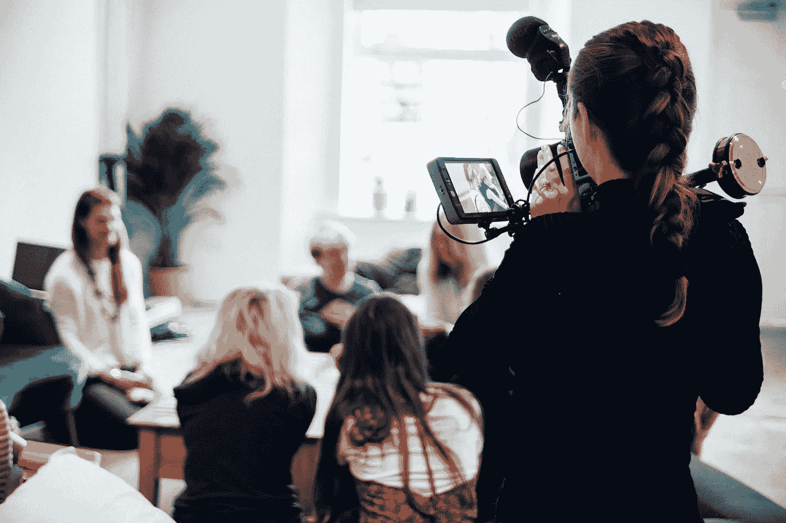

# 你会注意什么？

> 原文：<https://medium.datadriveninvestor.com/what-would-you-pay-for-attention-e5a863c074f0?source=collection_archive---------32----------------------->

Photo by Vanilla Bear Films on Unsplash

虽然人们都说关于你公司的任何消息都是好消息，但事实是所有的企业家都抱着最好的希望。

正如[克里斯蒂娜·尼克尔森](https://twitter.com/ChristinaAllDay/)所说，最好的好报道是应得的，而且不一定很贵。她擅长在主流媒体上免费曝光。

尼克尔森是[媒体专家](https://www.mediamavenandmore.com/)的所有者，他是一名电视主持人、播客、TEDx 演讲者以及前记者和主播。她曾为 [Inc.](https://twitter.com/Inc) 、 [Fast Company](https://twitter.com/fastcompany) 和 [Business Insider](https://twitter.com/businessinsider) 撰稿。

尼科尔森与数字营销专家 Madalyn Sklar 谈论如何让你的企业得到媒体的关注。

“当你在播客上听到某人，在新闻中看到他们，或者在杂志上读到他们时，你会怎么想？”尼科尔森说。“人们的看法是，这个人聪明、成功，值得拥有。现在，*那个*就是你想与之做生意的人。

“把新闻报道当成推荐，”她说。“不是你说你很棒。是别人说你很棒。当一个[知名的、受欢迎的和受信任的](https://blog.markgrowth.com/know-like-and-trust-drive-conversion-and-sales-51c791e7c6b6?source=friends_link&sk=910f20a2541a78982c2c73592527caf7)消息来源报道你的时候，你的可信度会瞬间提升。”

证据就在研究中。

“当人们用谷歌搜索你时，他们看到了什么？”尼科尔森说。“为了打造你的品牌，值得信赖的人和媒体分享你的产品、服务或专业知识是非常重要的。当潜在的客户和顾客在网上搜索你的时候，他们应该会对你有一个好的印象。

她说，“如果你对网上的虚荣指标感兴趣，没有媒体报道，你不可能得到蓝色的复选标记，这些报道是挣来的，不是花钱买的。”

尼科尔森对媒体报道可能来得太早的观点感到困惑。

“每个人都找借口说他们还没准备好，”她说。“如果你为一个顾客或客户做好准备，你就为媒体报道做好了准备。这就是你如何快速获得了解、喜欢和信任的因素。

尼科尔森说:“如果人们不了解你，他们就不会和你做生意。”“新闻报道会让你在最短的时间内出现在最多的人面前，而不用花一分钱做广告。”

# **百万成功**

她回忆了她在全国范围内的一个成功故事。

“我的一个客户有一个副业，”尼科尔森说。“他全职工作，没有顾客，也没什么钱，但《今日秀》喜欢这个故事，并把它讲给数百万人听。”

为媒体报道推销业务是日常事务。

“新闻周期每分钟都在变化，”尼科尔森说。“如果你对一个想法搁置太久，或者没有抓住一个当下有新闻价值的角度——比如公共卫生——你将会错过机会。

“在你的日历上每周至少留出两次时间，在 Twitter 上与记者互动，”她说。“这是我们常去的地方。还有，[用 HARO](https://www.youtube.com/watch?v=9R2HIWYqdt0&t=42s) ，但是要用对。”

Twitter 提供了几种建立媒体关系的方法。

“那是媒体成员出没的地方，”尼科尔森说。“我就是这样认识了马达琳和其他许多人。在我发电子邮件推销之后，我会发推特让人们知道我在他们的收件箱里，以便从那里的众多人中脱颖而出。

“通过关注他们、分享他们的文章——对他们来说非常重要——转发他们的内容，以及回复推文来了解记者，”她说。“那就可以双向对话了。”

当你照顾记者的利益时，报酬甚至更高。

“帮助他们做他们的工作，”尼科尔森说。“你能给他们介绍一个来源吗？你能和你的观众分享一个故事吗？你能给他们喊一声吗？不要只在有收获的时候才伸手。”

# **无法控制**

那些认为自己能够掌控媒体的人会大失所望。

“当你赢得媒体，你无法控制它，”尼科尔森说。“媒体的工作不是宣传你或者给你一个免费的广告。他们的工作是讲述一个能教育和娱乐观众的故事。这对你来说可能是也可能不是积极的。

“如果你想控制信息，你需要做广告，”她说。“它很贵，人们不会对广告给予太多的关注，你也不会得到信任。相反，分享你的专业知识。开诚布公。没有什么是百分百积极的。”

尽管专家们努力尝试，媒体对 T4 的不良报道是不可避免的，也不容易克服。

“你不能‘修复’糟糕的覆盖率，”尼科尔森说。“再说一遍，宣传你不是媒体的工作。这就是广告的作用。只要不断获得正面报道，把坏消息推下去，如果真的发生了。”

她列举了三种媒体:拥有的、赚来的和付费的。

“两个你可以控制，”尼科尔森说。“赚了你也不一定。媒体有工作要做。如果你想要保险，帮助他们做他们的工作，因为这与你的专业知识有关。

“还有一点，如果发生了不好的事情，永远不要说‘无可奉告’，”她说。“这让所有人都认为你有罪。”

尼科尔森在媒体等式两边的职业生涯，给了那些试图自己动手公关的企业家一剂有益的警告。

“当我还是一名电视记者时，我*讨厌公关部门的*人。对不起，”她说。“他们太热衷于宣传，对我的工作进行微观管理，完全不知道在新闻行业工作是什么感觉。如果雇佣，就要谨慎雇佣。”

# **昂贵的提议**

雇佣公关服务可不是等闲之辈，在美国平均每月花费 6000 美元。

“如果你不能改变这一点，你必须学会如何自己处理它，”尼科尔森说。“我在社交媒体、YouTube 和我的播客上分享大量免费资源:成为媒体专家。

“许多记者不喜欢和公关人员一起工作——我不喜欢——因为他们可能会很傲慢，”她说。“在某些情况下，你可以通过推销自己走得更远，但你必须知道如何推销，因为大多数人都做错了。”

人们在公共关系策略中会犯一些常见的错误。

尼科尔森说:“他们的宣传力度太大了。”。“停止推销自己，专注于帮助记者、布克、制片人或播客主持人给观众他们想要的东西。那你就成功了。你将默认获得晋升。

“人们一开始就有不切实际的媒体目标，或者媒体目标与他们的商业目标不一致，”她说。“举例来说，你上一个更小的利基播客会比上一个网络电视节目获得更多的线索。”

基本上非专家不知道该怎么做。

“我免费提供这么多东西，没有任何借口，”尼科尔森说，在一次媒体宣传中，他让一位客户上了当地电视台的一个直播节目。

“人们做很多小事，而不是一件战略性的事情，”她说。“同时向 500 人发送一个推销信息*不起作用*。向 10 个你在 Twitter 上交流过的人发送 10 份推介会让你走得更远。”

**关于作者**

吉姆·卡扎曼是拉戈金融服务公司的经理，曾在空军和联邦政府的公共事务部门工作。你可以在[推特](https://twitter.com/JKatzaman)、[脸书](https://www.facebook.com/jim.katzaman)和 [LinkedIn](https://www.linkedin.com/in/jim-katzaman-33641b21/) 上和他联系。