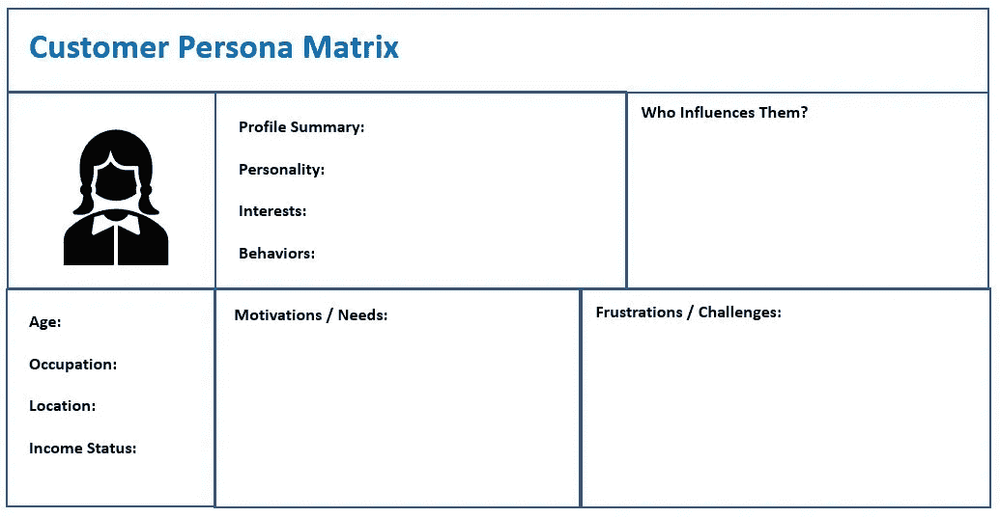

# 如果你的客户知道什么是可能的，他们会想要什么？

> 原文：<https://medium.datadriveninvestor.com/what-would-your-customers-want-if-they-knew-what-was-possible-4304ecdaacdb?source=collection_archive---------17----------------------->

Photo by [Cytonn Photography](https://unsplash.com/@cytonn_photography?utm_source=unsplash&utm_medium=referral&utm_content=creditCopyText) on [Unsplash](https://unsplash.com/s/photos/customer?utm_source=unsplash&utm_medium=referral&utm_content=creditCopyText)

## 顾客理解的简短指南

你知道你的顾客的希望和梦想，他们的目标和抱负，他们的恐惧和担忧吗？你知道他们为什么会访问你的网站，喜欢你最新的推文，或者走进你公司的大门吗？

最重要的是，你知道为什么你能够回答这些问题是至关重要的吗？

在我们的现代世界中，一切都在我们的指尖，给消费者提供了比以往更多的选择。所有这些信息的负面影响是，我们经常淹没购物者，使企业更难脱颖而出——尤其是小企业主。

毫无疑问，有效地营销你的产品或服务需要全面了解你试图接触的客户。但是，当你试图同时兼顾经营企业的日常责任时，获取这些知识所需的研究可能会令人望而生畏。如果你有资金投资这类服务，外包给营销专业人士可能是一个很好的选择。但这可能很快就会达到数千美元。我知道。这是我 20 年来的职业。

***时间和金钱有限的小企业主该怎么办？***

许多人将把精力主要放在挖掘潜在客户并将这些潜在客户转化为收入上。虽然这很重要，当然应该成为你营销计划的一部分，但如果这些策略是你唯一的关注点，它会分散你对更好地了解你的客户这一重要工作的注意力。正是这种理解带来了回头客，这是最有价值的收入。

> 你的客户不知道你知道多少，直到他们知道你有多在乎。—达蒙·理查兹

## 如果你的客户知道什么是可能的，他们会想要什么？

你知道这个问题的答案吗？你知道为什么你的一些客户会给你回头客吗？你知道为什么他们中的一些人经常不结账就把东西放在购物车里，或者多次进出你的商店却不买东西吗？你知道他们对他们的家人和朋友说你什么吗？

你了解的越多，你事业的未来就有越多的可能性。当客户觉得他们的需求得到了满足，并且你非常关心和感兴趣时，他们与你的互动就不仅仅是一次交易了。真正了解客户的企业会在客户关系中灌输一种个人参与和理解的意识。这自动使他们从竞争中脱颖而出，并确保回头客。

 [## 金融科技初创公司正在颠覆全球银行业|数据驱动的投资者

### 传统的实体银行从未真正从金融危机后遭受的重大挫折中恢复过来…

www.datadriveninvestor.com](https://www.datadriveninvestor.com/2018/10/20/fintech-startups-are-disrupting-the-banking-industry-around-the-world/) 

但是，了解客户的购买过程只是强化营销计划过程中的一步。你还应该试着了解他们来自哪里，他们的年龄有多大，他们有什么样的背景，以及他们为什么在花自己辛辛苦苦挣来的钱时做出这样的选择。

# 客户统计数据及其重要性

> 真正的营销始于顾客，他们的人口统计，他们的现实，他们的需求，他们的价值观。它不会问:“我们想卖什么？”它会问:“顾客想买什么？”—彼得·德鲁克

试图应用一个广泛的，大帐篷的方法，一下子照顾到每个人的需求，会给你带来收益递减。这就是为什么许多企业使用人口统计信息将具有相似特征的客户分组。人口统计学回答了这个问题，“谁在购买我的产品或服务？”细分是根据客户的共同特征对他们进行分组。

一旦您收集了这些信息，您就可以通过创建客户人物角色，包括需求、行为和价格敏感度等附加属性，来构建该图片。典型的买家角色通常由三部分组成:

**人口统计。**拼图的第一块。关于你的客户是谁的信息。

**消费者的痛点。**你的潜在客户需要解决的问题。

**产品/服务用途。**关于顾客如何使用你的产品或服务来解决他们的问题的信息。

如果您仍然不清楚客户人口统计的价值，让我们考虑一个例子。

让我们考虑代际差异。有些事情，某些代人会比其他代人更感兴趣。也许你的产品或服务主要吸引千禧一代，而你的客户很少是婴儿潮一代。那些千禧一代喜欢如何与像你这样的供应商互动？定义他们的世代偏好可以帮助您将您的消息传递方法定位到您的客户群的该子群最偏好的格式。

另一个突出的人口统计例子是收入群体。这种人口统计与“需要”和“想要”购买之间的差异紧密相关。

需求，包括食物、房租和账单，是每个人都要支付的东西，不管他们的收入水平如何。提及需求的另一种方式是“必备”另一方面，需求是人们将可支配收入用于购买的东西。你是在营销与娱乐或奢侈品有关的东西吗——一些对生存并不重要的东西，比如食物或人们赖以获得收入的必要专业工具？如果是这样，你应该更好地理解那些有可支配收入的人。他们倾向于在哪里以及如何花钱？他们的消费行为是什么？

如果您仍然想知道人口统计信息和细分如何结合起来改善您的业务，请查看关于该主题的简短教程:

一旦您利用人口统计学将您的客户划分到相似的分组中，您的下一步就是检查特定细分市场的关注点、需求和问题。

# 识别客户的棘手问题

是什么让你的客户在这个时候来到你面前？他们想达到什么目标？他们是想改变自己的社会地位，改善自己的外表，还是想以某种方式获得权力？他们是在增强自信，寻找爱情，还是从失败中继续前进？还是他们有更基本的需求，比如食物和安全？

> 人们不想要你的服务。他们希望他们的问题得到解决。他们想要一个转变。多谈转型，少谈你的产品或服务。—伊丽莎白·麦克拉维

始终将了解客户的挑战放在首位。对他们来说，成本或时间是个问题吗？他们是否经历了挫折或拒绝之类的情感困难？他们只是需要有人教他们完成目标的技能，还是因为他们使用的工具出现故障或在某些方面不完整而苦苦挣扎？如果你能回答这些问题中的几个，你就可以开始确定你的沟通重点和信息。此外，您还可以深入了解未来为您的客户群提供的产品和服务。

俗话说，煮不了海洋。也就是说，你不能同时关注你的整个客户群和你产品的每一个相关信息。那只是噪音，不会和任何人产生联系。此外，你根本没有足够的时间。对于身兼数职、每天被拉向不同方向的小企业主来说尤其如此。为了有效和高效，你需要把你的营销工作分成可管理的部分。

我建议你从开发客户矩阵开始。该工具将包括您收集并分类到组中的人口统计信息。但它还会更进一步，包括我提到的那些客户痛点。这些数据将帮助您确定哪个客户群最适合您的产品或服务。通过这种方式，你可以锁定那些对你的业务有最大好处的客户。

这里有一个客户角色矩阵的例子。您需要为您的客户群的每个群体(细分市场)准备一个。

客户问题和由此产生的需求是你业务的基础。你所创造的一切都应该围绕着它。每当你试图改善服务、创造新的商业模式或开始新的冒险时，想想你的客户所面临的挑战。当你准确并理解地解决他们的需求时，你的努力不会被忽视。

唯一的问题是，您应该如何着手识别您的特定客户群及其所有细分市场中存在的棘手问题？

问自己的第一个问题是，当你的潜在客户拒绝你的服务或产品时，他们是否说出了你的痛点。人们经常会说或暗示是什么影响了他们的决定，是价格、质量还是其他。试着找出他们不喜欢你产品的地方。如果可能的话，你还应该找出客户去哪里寻找替代品以及原因。

另一个可以用来找出客户痛点的资源是在线评论。如果你没有为现有客户提供一个评论你的地方，谷歌也没有捕捉到对你的业务的评论，那就去看看你的竞争对手。客户对竞争产品或服务有什么看法？你的竞争对手有时会不可避免地无法满足特定的需求，如果你在正确的时间观察，你可能会加入进来，把那些客户带到你身边。这也是了解市场缺失的一个好方法。

最后，确定客户最紧迫挑战的最简单、最直接的方法就是直接询问他们。这就是像调查这样的事情出现的地方。各种各样的企业主都使用这些方法来与他们的客户保持联系，更好地了解买家的需求。

如今，由于网上可以找到各种现成的资源，测量变得特别容易。互联网为我们开辟了无数与客户互动的新途径。记住，如果你不花时间更深入地研究你的客户的需求，别人肯定会。

商机挖掘对业务增长至关重要。但是，在你向你的客户名单发送另一封电子邮件，希望参与线索转换策略之前，停下来问问你自己，你是否真的考虑过这些人是谁。

你知道他们最初为什么来找你帮忙吗？你知道他们购买的动机是什么吗？价格优先，还是质量优先，还是介于两者之间？这种购买是满足了一个关键需求，还是他们为了乐趣而挥霍？

你是否足够了解如何与新的销售线索恰当地联系起来？

不要忘记你现有的客户！虽然你总是在追逐新的业务，但重复的收入会让你继续成长。确保回头客的最好方法是花时间尽可能地了解你的客户。当你这样做时，你就成了一个值得信赖的资源，这种业务关系创造了你未来可以依赖的稳定增长。

那么，下一步是什么？

你应该从建立你的顾客角色矩阵开始。如果你的问题多于答案，考虑调查客户——包括那些你已经达成销售的客户和那些改变主意的客户。询问他们的见解，并利用这些知识来促进您的业务增长。

此外，如果你需要调查最佳实践的技巧，请点击这里查看我的最新帖子。