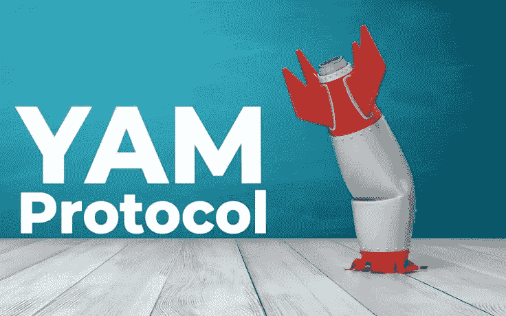
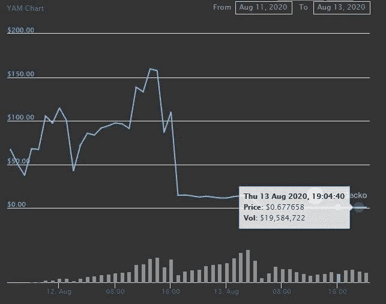

# 你能从加密内爆中学到什么

> 原文：<https://medium.datadriveninvestor.com/what-you-can-learn-from-a-crypto-implosion-167-0-86-41c6cab1d8a3?source=collection_archive---------14----------------------->

YAM 协议是一个实验项目，旨在证明其象征性的 YAM 和美元的 1 比 1 比率。不同于其他稳定货币，如 USDC、双子座美元和币安美元，这种货币采取了不同的稳定方法。

这个项目并没有达到发布时的价格水平。令牌在开始时没有值，并允许它通过协议自然地找到它的$1 值。在其发布的几个小时内，山药在 24 小时后达到 167 美元至 0.86 美元的峰值。它总共锁定了 5 亿美元的总价值(TVL)。

coingecko

**山药**

山药是一种弹性供给加密货币。这意味着它的供应会随着市场而扩张和收缩。这类似于安普尔福思如何管理他们的 1 美元挂钩。一个关键的区别是，山药使用每次供应扩张的一部分来购买 yCurve(一种以美元计价的高收益稳定币)，并将其添加到山药社区治理控制的山药国库中。

Yam 是一个最小可行的货币**实验**，推出是为了让代币持有者决定其价值和未来发展。Rebasement 由称为 Rebaser 的外部契约控制。这类似于 Ampleforth 如何使用其货币政策合同。

Yam 也打算从 Compound、Aave's Lend、Chainlink's Link、Wrapped ETH (WETH)、YFI、Synthetix (SNX)、Maker (MKR)和 uni swap V2 LP token 的赌注池中获得农场。

 [## 为什么参与正确的加密交换至关重要|数据驱动型投资者

### 到目前为止，与黄金和美元相比，加密货币，尤其是比特币，已经显示出巨大的增长

www.datadriveninvestor.com](https://www.datadriveninvestor.com/2020/07/16/why-engaging-with-right-crypto-exchange-matters/) 

**哪里出了问题？**

虽然开发人员知道供应会增加，使价格回落到 1 美元，但他们没有预料到令牌持有者无法做出任何治理决策。开发团队在推特上写道:

> “UTC 时间 8 月 13 日星期四上午 7 点后不久，我们提交了一份治理提案，并投票表决，我们原本认为投票数量足够实施该提案。此后不久，在安全专家的帮助下，我们得出结论，rebaser bug 将与治理模块交互，并阻止该提议的成功。”

好消息是，使用 Yam 协议下注的资产没有丢失。坏消息是，购买资产获利的投机者损失了几乎所有的钱。

我们能学到什么？

对投资者来说，最大的教训是仔细研究你要涉足的任何秘密。了解它的目的，因为它可能与你的截然相反。试图从这种代币上赚钱的投机者应该知道，如果他们只阅读项目中的任何材料，他们将会受到损失。这个词**实验**将会是一个致命的泄露。

对于开发人员来说，花时间全面审计一个项目是很重要的，尤其是如果他们有良好的意图。YAM 团队没有隐瞒没有对代码进行审计的事实，他们在 GitHub 中说:

> **审计。**无。贡献者已尽最大努力确保这些合同的安全性，但不做任何保证。它已经被几双眼睛抽查过了。存在漏洞是一种可能性，而不仅仅是可能性。

对于那些不愿意投入必要的时间来发布一个安全和干净的协议的项目来说，这种程度的损失是可以预料的。尽管没有什么是没有错误的，他们应该努力推迟发布，直到他们确信它不会在几个小时内崩溃。

**访问专家视图—** [**订阅 DDI 英特尔**](https://datadriveninvestor.com/ddi-intel)