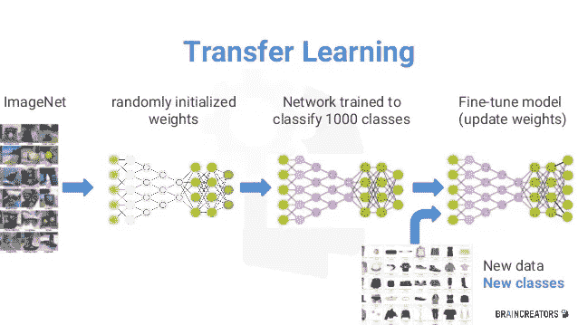
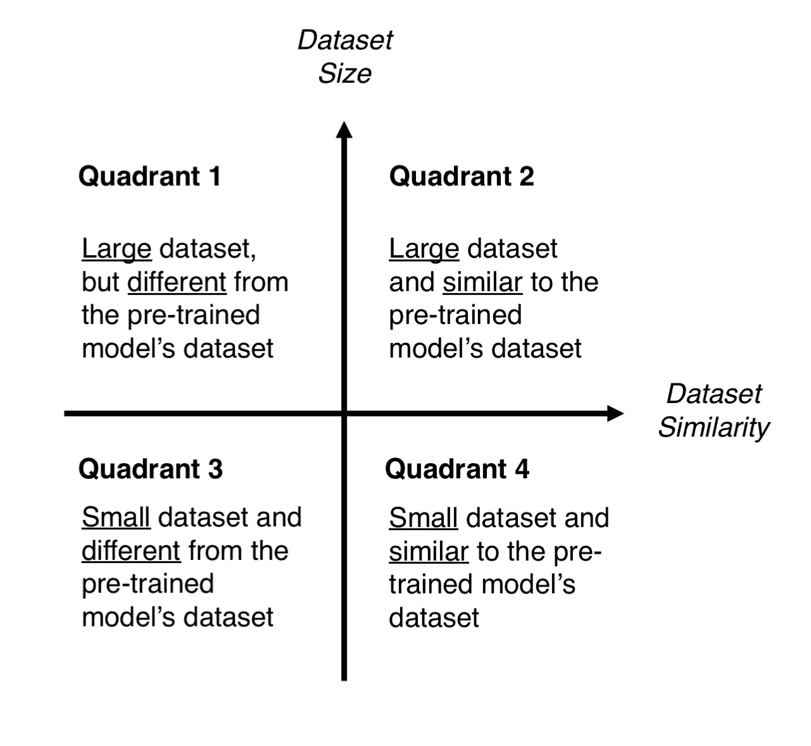

# 关于迁移学习，你必须知道什么

> 原文：<https://medium.datadriveninvestor.com/what-you-must-know-about-transfer-learning-4a6e4cb9fbad?source=collection_archive---------4----------------------->

我现在明白了，你也应该明白第 1 部分！！！

深度学习是机器学习领域的一个子分支，受大脑结构的启发。与许多领域一样，近年来使用的深度学习技术在医学图像处理领域继续表现出令人印象深刻的性能。通过将深度学习技术应用于医疗数据，试图从医疗数据中得出有意义的结果。

 [## 人工智能和监督资本主义|数据驱动的投资者

### 大科技，总是现在:人工智能推动的大科技，已经使购物，搜索，在你的…

www.datadriveninvestor.com](https://www.datadriveninvestor.com/2020/03/04/on-artificial-intelligence-and-surveillance-capitalism/) 

**迁移学习(TL** )是机器学习(ML)中的一个研究问题，专注于存储在解决一个问题时获得的知识，并将其应用于另一个不同但相关的问题。例如，在学习识别汽车时获得的知识可以应用于识别卡车。这一研究领域与学习迁移的心理学文献的悠久历史有一定的联系，尽管这两个领域之间的正式联系是有限的。从实践的角度来看，为了学习新的任务，重用或转移来自先前学习的任务的信息具有显著提高强化学习代理的样本效率的潜力。

# 4.迁移学习过程

从实践的角度来看，整个迁移学习过程可以总结如下:

1.  **选择预先训练好的模特**。从大量可用的预训练模型中，您选择一个看起来适合您的问题的模型。例如，如果您正在使用 Keras，您可以立即访问一组模型，如(Simonyan & Zisserman 2014)、InceptionV3 (Szegedy 等人 2015)和 ResNet5(何等人 2015)。[在这里](https://keras.io/applications/)你可以看到 Keras 上所有的车型。
2.  根据规模-相似性矩阵对你的问题进行分类。在图 3 中，你有“矩阵”来控制你的选择。该矩阵根据数据集的大小及其与训练预训练模型的数据集的相似性，对您的计算机视觉问题进行分类。根据经验，如果每个类的图像少于 1000 幅，则认为数据集很小。关于数据集相似性，让常识占上风。例如，如果您的任务是识别猫和狗，ImageNet 将是一个类似的数据集，因为它有猫和狗的图像。然而，如果你的任务是识别癌细胞，ImageNet 就不能被认为是一个类似的数据集。
3.  对你的模型进行微调。在这里，您可以使用大小-相似性矩阵来指导您的选择，然后参考我们之前提到的关于重新调整预训练模型用途的三个选项。图 4 提供了以下文本的可视化摘要。

*   **象限 1** 。大型数据集，但不同于预训练模型的数据集。这种情况将引导你进入*策略 1* 。因为你有一个大的数据集，你可以从头开始训练一个模型，做任何你想做的事情。尽管数据集不同，但在实践中，使用预训练模型的体系结构和权重从预训练模型初始化模型仍然是有用的。
*   **象限 2。**大型数据集，类似于预训练模型的数据集。你现在在啦啦世界。任何选择都可行。大概，最有效率的选择是*策略 2* 。由于我们有一个大的数据集，过度拟合应该不是问题，所以我们可以想学多少就学多少。然而，由于数据集是相似的，我们可以通过利用以前的知识来节省大量的训练工作。因此，训练分类器和卷积基的顶层应该足够了。
*   **象限 3。**小数据集，不同于预训练模型的数据集。这是计算机视觉问题的第 2-7 手脱衣牌。一切都和你作对。如果抱怨不是一个选项，你唯一的希望就是策略二。很难在训练和冷冻的层数之间找到平衡。如果你走得太深，你的模型可能会过拟合，如果你停留在模型的浅端，你将不会学到任何有用的东西。很可能，您需要比象限 2 更深入，并且您需要考虑数据扩充技术(这里[提供了关于数据扩充技术的很好的总结](https://medium.com/nanonets/how-to-use-deep-learning-when-you-have-limited-data-part-2-data-augmentation-c26971dc8ced))。
*   **第四象限。**小数据集，但类似于预训练模型的数据集。我向尤达大师询问过这个问题，他告诉我‘*是最好的选择，策略 3 应该是*’。我不知道你怎么想，但我不会低估原力。因此，选择*策略 3* 。你只需要去掉最后一个全连接层(输出层)，把预训练好的模型作为固定特征提取器运行，然后用得到的特征训练一个新的分类器。

# 结论:

我希望我能澄清一点，第 2 部分见

欢迎来到我的媒体页面

[Github](https://github.com/zahrael97) ， [LinkedIn](https://www.linkedin.com/in/zahraelhamraoui97/) ， [Zahra Elhamraoui](http://zahraelhamraoui1997@gmail.com/) ， [Upwork](https://www.upwork.com/o/profiles/users/~01e52291fa456a8934/)