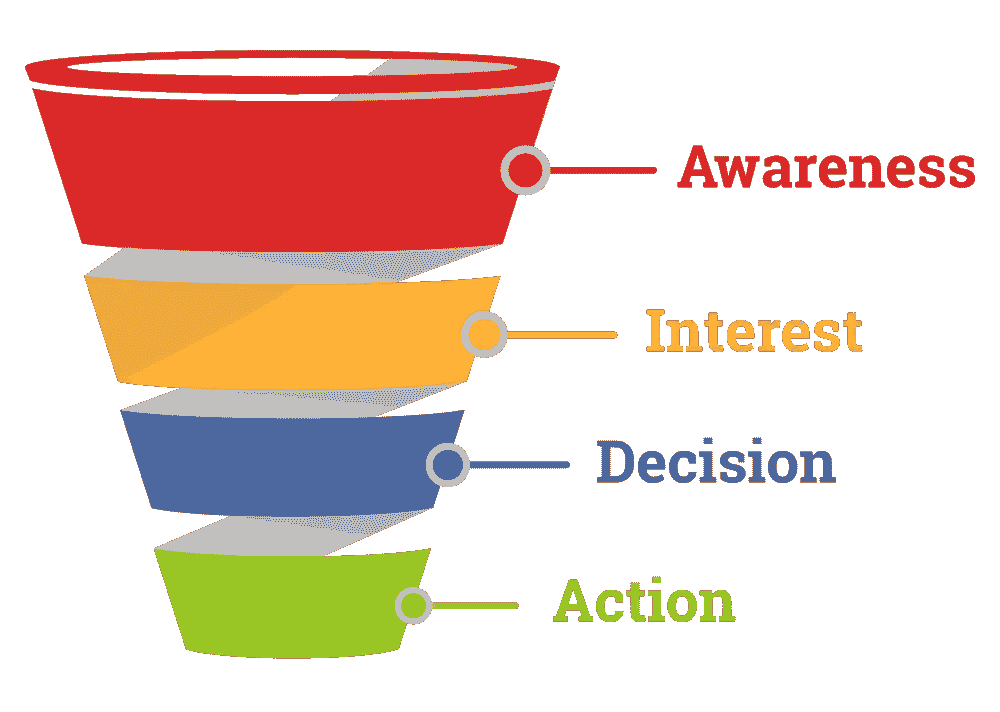

# 比以往任何时候都更快地发展您的公司需要什么

> 原文：<https://medium.datadriveninvestor.com/what-you-need-to-grow-your-company-faster-than-ever-before-d26de73bf441?source=collection_archive---------32----------------------->

## 如何捕捉线索，将其转化为客户，并在此过程中获得有价值的见解

Photo by [Allie Smith](https://unsplash.com/@creativegangsters?utm_source=medium&utm_medium=referral) on [Unsplash](https://unsplash.com?utm_source=medium&utm_medium=referral)

建造它，他们会来的。

即使你有一个很棒的产品，这种策略对你不再有效。

外面有太多的信息和太多的产品，让你无法冲破这些噪音。

那么你能做什么呢？

是的，首先你必须给你的网站带来流量。然而，这并不能保证销量。也许你花钱让访问者来你的网站，或者至少你投入了很多时间。所以你不能让他们离开。但是访问者经常需要看到你的品牌，并多次消费你的内容，直到他们决定购买。

你需要的是一个销售漏斗，它能让你随着时间的推移培养潜在客户。你一开始并没有试图让他们购买。你只是试图抓住他们的注意力，直到他们做出决定。

你不能强迫这个决定。特殊优惠和有限优惠可能偶尔会起作用，但你应该专注于建立信任。

只有信任你的人才会买你的东西。

建立信任的完美销售渠道。

让我解释一下它是如何工作的。

# 销售漏斗的四个阶段

为了简单起见，我将坚持使用基本的 AIDA 模型。

*   意识:潜在客户知道你的存在
*   **兴趣**:潜在客户会了解你能提供什么，以及她是否喜欢你
*   **愿望/决定**:潜在客户信任你和你提供的解决方案。她决定向你购买。
*   **行动:**潜在客户成为客户，现在你的工作是建立长期关系。

[https://www.mailmunch.com/blog/sales-funnel/](https://www.mailmunch.com/blog/sales-funnel/)

## **1。意识**

在认知阶段，人们进入你的销售漏斗。你的目标应该始终是建立信任，与客户建立持久的关系。考虑到这一点，很明显，尽可能多地吸引人并不是你的主要关注点。你必须确切地知道你的理想客户是什么样子的。为了得到一个清晰的想法，你可以设计一个买家角色。点击此处了解更多信息:

 [## 吸引更多顾客你应该做的一件事

### 如何通过比客户的配偶更好地了解客户来推动你的内容营销

medium.com](https://medium.com/datadriveninvestor/the-one-thing-you-should-do-to-attract-more-customers-ae339a3f00b5) 

现在你可以制作吸引合适人群的相关内容。是的，你仍然可以使用付费广告，但是不要使用散弹枪的方法，你可以瞄准特定的人群，为他们提供可以解决问题的内容。不在于你能提供什么，而在于你如何创造价值。

 [## 影响者在聚光灯下表演|数据驱动的投资者

### 影响者营销是一个脱颖而出的游戏。结果是一个令人难忘的-和可信的-连接到一个产品或…

www.datadriveninvestor.com](https://www.datadriveninvestor.com/2020/01/15/influencers-perform-in-the-spotlight/) 

如果你是一个博客写手，你为和你一样的人写稿，那么很容易知道你的读者喜欢什么，想听什么。但作为一家公司，你首先需要了解什么对你的目标受众有价值。

你很幸运。了解你的目标受众比以往任何时候都容易。在社交媒体上，人们表达他们的问题、痛苦、挣扎、愿望、梦想和欲望。你只需要开始倾听。请记住，他们很可能没有指出问题本身——他们只知道症状。

比方说，你在网上卖眼镜，并确定戴眼镜引起的耳痛是一个原因。你可以在谷歌搜索栏输入这个长尾关键词，看看哪些文章排名最好。你可以看看像 [AnswerThePublic](https://answerthepublic.com/) 或 [Quora](https://www.quora.com/) 这样的网站，看看人们在问什么问题。

有了这些知识，你就可以制作内容，为你发现的所有问题提供答案。这样，你不仅将自己定位为专家，还为感兴趣的人提供了许多阅读你的内容并注册更多内容的机会。

**衡量此阶段成功的可能 KPI 有:**

*   网站
    谷歌分析；流量、浏览量、跳出率、页面停留时间、参与度、反向链接和在谷歌的位置。
*   搜索引擎优化和广告
    位置，转化率，点击费
*   社交媒体
    行动号召的参与度和点击量

## **2。利息**

一旦一个潜在客户进入你的世界，你必须不惜一切代价避免失去他。这是你证明他们来到你的页面做出正确决定的机会。这是提供更多价值来换取他们宝贵的电子邮件地址的最佳时机。

你可以建立你的电子邮件列表，并随着时间的推移培养你的线索。但是不要急着走这一步。只是因为有人给了你他们的电子邮件地址，这并不意味着他们希望你用无关的内容轰炸他们。我知道有一些营销人员建议你每天发送电子邮件，庆祝每一次登录，因为发邮件要花钱。然而，你不是一个绝望的门推销员。你必须提供一些有价值的东西，因此你的线索应该得到相应的对待。

让他们了解你的业务，给他们发送有价值的信息。只是偶尔向他们推销，而且只有当你觉得你能给他们提供一笔好交易的时候。

你未来的客户会开始问一些具体的问题，比如如何使用 XYZ。专注于给予，直到他们对你提供的所有信息都不付钱感到难过。

**衡量此阶段成功的可能 KPI 有:**

*   邮件列表
    已发送邮件的选择加入、选择退出、点击率和打开率。
*   社交媒体
    评论、喜欢和分享

## 3.欲望

你不再和无名的潜在客户打交道了。你们互相认识，他们成了主角。现在，他们正在寻找可用的解决方案，如产品和服务。他们的目标是做出明智的购买决定。通过常见问题、视频和教程，你可以消除最后的疑虑，一旦你向他们推销了你的想法和产品，他们就准备向你购买了。

**衡量此阶段成功的可能 KPI 有:**

*   每个销售线索的成本
*   对特定信息的请求

## 4.行动

有许多策略，如限时优惠、闪购、独家网络研讨会等。他们都和*一起工作，害怕错过* FOMO。这很像我们现在看到的卫生纸抢购。随着每一篇新文章的出现，人们越来越关心如何保持臀部清洁，如何避免不理智的行为。FOMO 是营销者的梦想。

但是，对我来说，这样的销售总感觉怪怪的。也许是因为我是瑞士人，而我们是不那么咄咄逼人的卖家，但我认为你应该小心使用它们。

不过，我并不是说你应该害怕出售。你有一个了不起的产品；您的潜在客户已经准备好购买—是时候满足他们的需求了。

只有一小部分进入你的漏斗的人会最终购买你的产品。这并不意味着你做错了什么。也许他们以后会从你这里购买，甚至永远不会购买你提供的任何东西。没关系。

专注于你能控制的，那就是你的产品和售后服务的质量。利用交叉销售和追加销售是从每个客户那里获得最大收益的一个绝佳策略。这些都是在不增加采购成本的情况下增加每位客户收入的简单策略。

最初的购买只是开始；回头客通常愿意在你不增加成本的情况下花更多的钱。因此，如果你能通过维持与客户的关系，将他们转化为固定买家，你的客户的终身价值就会显著增加。

**衡量此阶段成功的可能 KPI 有:**

*   客户获取成本
*   每个客户的收入
*   净推介值(NPS)

# 外卖

销售漏斗将允许你捕捉线索，将他们转化为客户和狂热的粉丝。

销售漏斗将允许您衡量转化率，从而帮助您优化销售流程。

销售漏斗可以让你显著增加每个客户的收入。

简而言之；让你的销售漏斗井然有序，开始赚钱。

# 准备好变得无限了吗？

如果你想变得无限并大大加快你的学习速度，看看我的小抄:

[单击此处立即获取备忘单！](https://roadtolimitless.com/cheatsheet/)