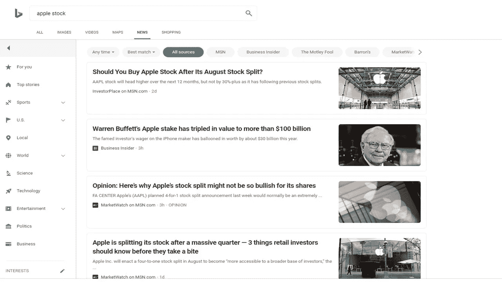
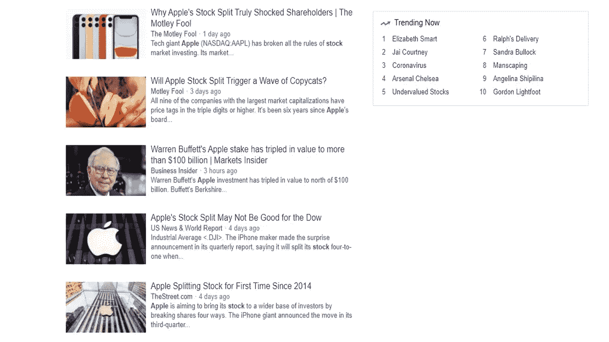

# 关于苹果 4 对 1 股票分割，你需要知道什么

> 原文：<https://medium.datadriveninvestor.com/what-you-need-to-know-about-apples-4-for-1-stock-split-cb8ee151a4c1?source=collection_archive---------6----------------------->

## 看看苹果的历史，产品，过去的股票分割和未来的预测

Photo by [Daria Rem](https://www.pexels.com/@dsh-rem?utm_content=attributionCopyText&utm_medium=referral&utm_source=pexels) from [Pexels](https://www.pexels.com/photo/woman-in-brown-knit-top-1977047/?utm_content=attributionCopyText&utm_medium=referral&utm_source=pexels)

随着苹果公司宣布 4 对 1 的股票分割，苹果公司的股票在过去几天里一直呈趋势。你可能不确定这意味着什么，或者你是否应该在今天或股票分割后购买苹果股票。让我简单地向你介绍一下什么是股票分割，以及这种分割的利弊。然后你可以自己决定是否以及何时购买苹果股票。

Bing

# 苹果的历史

我相信你听说过苹果。1976 年 4 月 1 日，苹果电脑由[史蒂夫·沃兹尼亚克、罗纳德·韦恩和已故的史蒂夫·乔布斯](https://en.wikipedia.org/wiki/History_of_Apple_Inc.)创造。乔布斯在加州的一个电脑俱乐部遇到了沃兹尼亚克。随着这种技术走向市场，两人都对计算机产生了浓厚的兴趣。沃兹尼亚克创造了第一台电脑的原型，乔布斯鼓励沃兹尼亚克出售这台电脑。两人和韦恩一起进入商界，成立了苹果电脑公司。韦恩最终离开，并以 800 美元的价格将自己的公司股份卖给了乔布斯。

Google

从那时起，该公司已经成长为一家为全世界人民服务的价值数万亿美元的公司。苹果是一家领先的技术公司，你甚至可以自己拥有苹果产品。

# 苹果产品

从苹果电脑开始，苹果增加了许多不同类型的电脑和今天使用的其他产品。苹果创造了从苹果电脑到麦金塔到 iMac 和 MacPro 的各种版本。然后他们扩展到其他领域，因为苹果创造了 iTunes、iPhone、iPod、Apple Watch、iPad、Apple TV 和其他一些产品。

在史蒂夫·乔布斯离开并重返公司期间，以及他在 2011 年不幸去世期间，苹果仍然是一家强大的科技公司。

# 苹果过去的股票分割

苹果股票于 1980 年 12 月 12 日上市，股票代码为 APPL。从那以后，苹果股票在其历史上已经分裂了四次。从历史上看，股票价格会随着时间的推移而上涨。苹果股票首次分拆是在 1987 年 6 月，在接下来的 12 个月里上涨了 8%。2005 年 2 月分拆后，苹果在接下来的 12 个月里上涨了 54%。在 2014 年 6 月的最近一次分拆后，苹果股票上涨了 38%。

有一次股票在拆分后下跌，那是在 2000 年 6 月网络泡沫时期。在接下来的 12 个月里，苹果股票下跌了 60%。许多科技股在此期间暴跌，因为许多科技股被视为估值过高。

# 现在买还是以后买

为了理解股票分割，您可以将一张 20 美元的钞票分割成四张 5 美元的钞票。你还有 20 美元，要么是 20 美元，要么是 4 张 5 美元。两种美元形式都等于 20 美元。股票分割也是如此。你还有同样多的股票。

如果股票分割时苹果股票是 400 美元，你将有三股额外的苹果股票。所以今天你可能没有 400 美元去买苹果股票。如果你有钱，那太好了。你可以买股票。在撰写本文时，苹果股票的实际交易价格为 439.37 美元。

股票分割后，苹果股票可能会跌至 400 美元。因此，拆分后苹果股票的交易价格将为 100 美元。如果你今天没有 400 美元，那么你可以等到股票分裂，用 100 美元买股票。无论哪种方式，你都可以购买股票，但这取决于你目前可用的资金。

# 苹果公司 2020-21 年的预期回报

苹果股票今年表现出色，这也是该公司决定 4 对 1 拆分的原因。这也让更多的人拥有这家公司的股份。苹果股价今年迄今上涨了 28%，开始盈利。

在拆分之前，分析师预计苹果将在 2024 年达到 520 美元的价格区间。拆分后，苹果股票应该会有大约 10%的回报。

# 我孩子自己的苹果股票

就我个人而言，我不持有苹果股票，但在 2014 年最后一次股票分拆后，我确实为我的孩子买了苹果股票。当股票分割时，我以 91 美元的价格购买了股票。这次我打算给自己买股票。这不是建议你买股票，而是建议你自己做研究和尽职调查。

你是否拥有苹果股票或计划购买股票？

 [## 帮助你在 2020 年投资的 10 个强有力的建议

### 在你的旅途中避免噪音和所谓的专家

medium.com](https://medium.com/datadriveninvestor/10-powerful-tips-to-help-you-invest-in-2020-be40ecb8edf1)  [## 避免“发光物体综合症”可以让你成为百万富翁

### 3 步到 7 位数账户。

medium.com](https://medium.com/2-minute-madness/avoiding-the-shiny-object-syndrome-can-make-you-a-millionaire-991049a7712a) 

[**汤姆·汉迪**](https://medium.com/@tomhandy1) 是一位顶尖的金融、投资、比特币和育儿作家，也是两个孩子的父亲。他从军队退役，并在几个非营利委员会任职。你可以在推特 [@tomhandy1](http://www.twitter.com/tomhandy1) 上找到他。

本文仅供参考。不应将其视为财务或法律建议。并非所有信息都是准确的。在做出任何重大财务决定之前，请咨询财务专家。