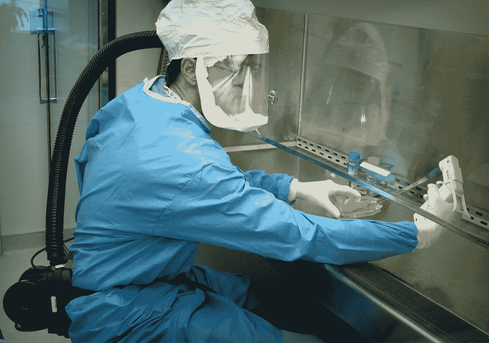
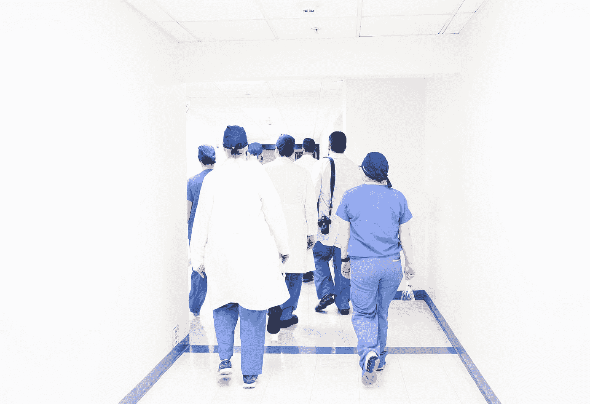

# 关于冠状病毒你需要知道什么

> 原文：<https://medium.datadriveninvestor.com/what-you-need-to-know-about-the-corona-virus-bd8c50158ad6?source=collection_archive---------9----------------------->

## 用这些建议保护你自己和你周围的人

Photo by [CDC](https://unsplash.com/@cdc?utm_source=medium&utm_medium=referral) on [Unsplash](https://unsplash.com?utm_source=medium&utm_medium=referral)

首先，这种让世界恐慌的病毒是什么？嗯，一般来说，冠状病毒(CoV)是一个大的病毒家族，可以引起从普通感冒到更严重疾病的疾病。

一直在威胁我们家园的新型冠状病毒(nCoV)是一种新的毒株，此前尚未在人类中发现。

一些冠状病毒在动物之间传播，一些在动物和人之间传播，还有一些在人与人之间传播。

在人类中，这些病毒引起呼吸道感染，通常是轻微的，包括普通感冒，但更罕见的形式如 SARS 和 MERS 可能是致命的。

# 传动装置ˌ[机]变速器

再次，冠状病毒是人畜共患的，这意味着它们在动物和人之间传播。

关于人与人之间的传播，冠状病毒最常见的传播途径是由感染者通过以下途径传播:

*   咳嗽和打喷嚏
*   亲密的个人接触，如触摸或握手
*   洗手前，触摸带有病毒的物体或表面，然后触摸你的嘴、鼻子或眼睛
*   粪便污染

# 感染的迹象

通常，这些迹象是:

*   发热
*   咳嗽
*   气促
*   肠胃问题

在严重情况下:

*   肺炎
*   严重急性呼吸系统综合症
*   肾衰竭
*   死亡

# 如何降低你感染冠状病毒的风险

永远记得用肥皂和水或含酒精的洗手液洗手。

咳嗽和打喷嚏时，不要忘记用纸巾或屈肘捂住口鼻。

 [## 医疗保健的未来正在被一场大型技术入侵所塑造|数据驱动型投资者

### 过去十年，全球经济的所有部门都经历了大规模的数字颠覆，而卫生部门现在…

www.datadriveninvestor.com](https://www.datadriveninvestor.com/2018/11/02/the-future-of-healthcare-is-being-shaped-by-a-big-tech-invasion/) 

如果可以，请避免与任何有感冒或流感样症状的人密切接触。

这最后一个可能有点太极端了，但是如果你住在这种新病毒的发源地附近，最好在接触活的、野生的或农场的动物时总是戴上防护装备。

Photo by [Luis Melendez](https://unsplash.com/@lcma1028?utm_source=medium&utm_medium=referral) on [Unsplash](https://unsplash.com?utm_source=medium&utm_medium=referral)

目前，中国新病毒爆发的死亡人数刚刚上升到 170 人(截至 1 月 30 日)，来自受影响最严重地区的外国撤离者被允许在密切观察下返回家园。

世界卫生官员表示非常担心这种疾病正开始蔓延到除中国以外的其他国家。已经有来自日本、德国、加拿大和越南等国家的冠状病毒确诊病例。

但在世界卫生组织在日内瓦举行的会议上，他们声称新冠状病毒爆发的传播链仍然可以被中断。

这种新病毒现在在中国感染的人数超过了 2002-2003 年 SARS 爆发期间患病的人数。

Photo by [Alexandre Valdivia](https://unsplash.com/@alevaldivia?utm_source=medium&utm_medium=referral) on [Unsplash](https://unsplash.com?utm_source=medium&utm_medium=referral)

综上所述，中国人最不需要的就是种族主义和歧视。他们的人民和经济在这场闹剧中挣扎得最厉害。

在 1 月 1 日之前出现症状的病例中，超过一半与“海鲜市场”有关。

我们已经看到互联网上出现的图片和文章，关于它为什么以及如何开始的，其中有多少是真的？

他们中有多少人是真正的罪魁祸首，又有多少人是受害者？

正如我们大多数人应该知道的那样，对中国人的歧视和种族主义不仅是错误的，而且还会导致人们拒绝寻求帮助。

保护你自己和你的家人免受冠状病毒的侵害是很重要的，但我们不必为此犯傻。