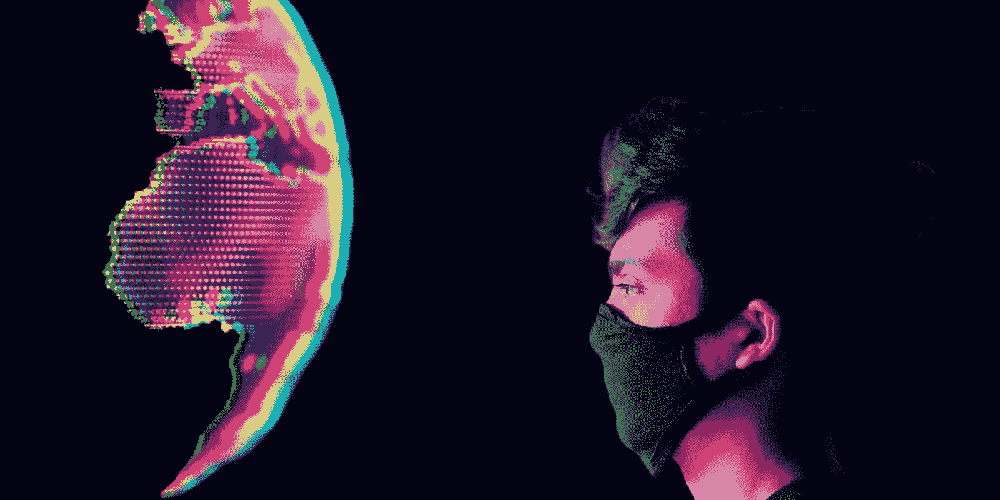

# 在间隔年你应该做什么

> 原文：<https://medium.datadriveninvestor.com/what-you-should-do-in-a-gap-year-9cd3e3b9a924?source=collection_archive---------35----------------------->

## 做你从未做过的事

Created with Canva Design

在某种程度上，传统教育已经阻碍了我们在现实世界经验、曝光度、自信、对话技巧等领域的发展，最重要的是，如何快速学习和遗忘。

我在整个学校生活中都经历过这种情况。我们学到了从细胞、岩石、火山和动物到历史、重力和代数的一切，但在现实生活中从未真正看到或使用过任何东西。

随着科技的快速发展，没有人知道未来会发生什么。没有一份工作是安全的，没有什么是 100%可预测的，发展的步伐只会越来越快。

> 但有一点是肯定的。如果你不能学会快速学习，你就不会成功。

高中之后，社会设定的选项只有一个:大学。这是我无法接受的。我不想用过去 18 年的方式度过接下来的 4 年。所以我选择了间隔年，疫情让我和我的父母做出了一个更容易的决定。

# 过你一直想要的生活

过去的几个月让我可以无忧无虑地尝试新事物，这在学校是不可能的。我获得了许多经验和常识；观察了许多不同的人和不同的生活方式，这帮助我描绘了我长大后想要过的生活。

我是通过去各地旅游来体验这些生活方式的，没错！甚至在 COVID 期间！

我去了最贵的酒店，旅馆，别墅，尝试了不同的美食，住了便宜的酒店，打破了一些规则，被抢劫，帮朋友滚了一些关节，去了海滩，现在我的计划是独自旅行一个月。

有时候我工作很努力，有时候我完全是个废物。我看了大量的动漫和电影，也写博客和制作视频。

旅行是必不可少的，因为你可以看到新的事物，认识新的人，学到很多东西，并且玩得开心。不要住昂贵的酒店，也不要在连锁餐厅吃东西，因为你在哪里都能找到它们。住在当地的旅馆或招待所，吃当地的食物。

> 如果你有任何健康问题，或者家里有家人患有呼吸系统疾病，我不建议你去旅行。

 [## 一到 18 岁就做这些事情，以获得经济保障

### 给未来的自己一份礼物

medium.com](https://medium.com/datadriveninvestor/do-these-things-as-soon-as-you-turn-18-to-be-financially-secure-87e2259764b) 

# 腾出时间思考

当你被一所学校录取时，你没有获得足够的自由精神空间来思考生活和认识自己。你只是随波逐流，做你朋友在做的事情或者学校让你做的事情——***你基本上就成了一个机器人*** 。

你一天中有充足的时间，明智地使用它。不像你的学校，在间隔年，不会有人告诉你该做什么。

很多时候你会想到*做什么*。坐下或躺下，播放一些热的低音量音乐，关掉其他所有的东西。想想你的兴趣是什么，你此刻的感受是什么，你想成为什么样的人，你将如何到达那里，然后做你想做的事情。

你将有如此多的时间和如此多的选择，以至于你不知道该做什么。做任何事都行，即使你认为它对你的未来没有帮助，但你想去做——**就去做**(不说错误的东西)。

相信我，你不会后悔的。

> 间隔年给了我很多不受打扰的时间去思考我自己，我的未来，生活，情感，喜欢，不喜欢，以及我内心深处的渴望。

我意识到我不想赚很多钱但需要很多来改变世界上我不喜欢的东西，不想太出名，不想专攻一件事，不想要某个特定的学位，不想让我的职业代表我的身份。

# 记录一切

对一些人来说这可能看起来很愚蠢，因为它很费时间，但是写下你一天中做的所有事情。写下你得到的所有想法，保存好的视频、文章或任何你觉得有用的东西的链接。我会推荐**概念**应用程序来做笔记。它非常直观，并且兼容你使用的所有设备。

如果可以的话，我强烈建议你开通你的 YouTube 频道或者/和博客。它不仅会付给你一些钱，还会帮助别人。你还会学到很多新东西，比如电影制作、写作、照片/视频编辑、获得自信和公共演讲技巧。

公开分享你的想法会让你完善它们，并在你的等式中加入其他意见。因为多巴胺的刺激，它会激励你发表文章、研究和学习更多。试着不要执着于喜欢和数字。

在我写这篇文章的时候，我在 YouTube 上只有 77 个订阅者，在媒体上只有 164 个关注者。即使是这么微不足道的金额，我也获得了在 LinkedIn 上与许多人交谈的机会，并获得了一些机会和 offers。想象一下它的潜力！

# 你不会再有这种自由/时间了

在整个间隔年期间，只要记住你不会把这段时间追回来。*我知道我又说了一遍，但这真的很重要。是时候尝试一切了，不管它看起来有多愚蠢。**所以，就这么做吧！***

我创建了我的 YouTube 频道、博客、交易密码、创建了我自己的 [Rarible](https://app.rarible.com/token/0xd07dc4262bcdbf85190c01c996b4c06a461d2430:99435:0x678e06e78b65f5f61d715b9619f2f8f1da62b711) token、做了 dropshipping、创建了 Instagram 页面、学习了新的编程语言、照片编辑、插图、视频编辑、摄影以及如何写作。

我想成为艺术家、交易员、摄影师还是程序员？号码

我喜欢做这些事情吗？是的。

> 我本可以通过专注于一件事情并收取更多的费用来赚更多的钱，但这不是我的目标。那就留给 20 岁的我吧(我 18 了)。

我们的目标是学习如何快速学习和遗忘，尝试新事物并擅长它们，而不是最好的。你的目标可能不同，但不要动摇。

**外卖:**在一个空档年，做自己喜欢的事，做自己从来没有做过的事；不要做普通的、可以接受的、容易的事情。