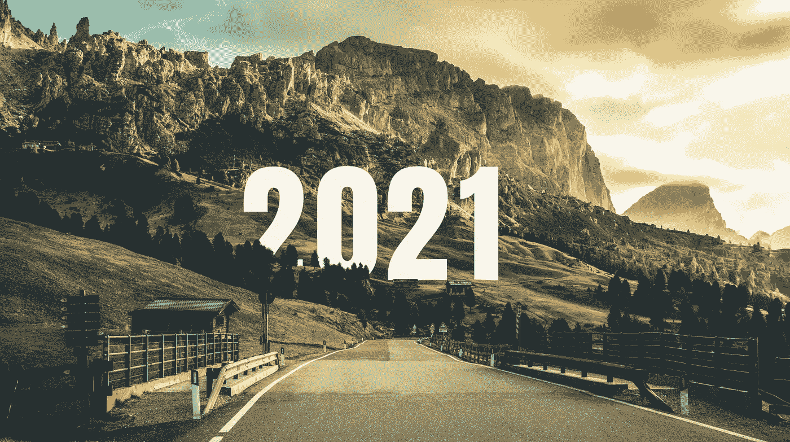

# 你应该知道的新年决心

> 原文：<https://medium.datadriveninvestor.com/what-you-should-know-about-new-year-resolutions-2f3beeb9bf27?source=collection_archive---------4----------------------->

Photo by @freepik via freepik.com

在一年中的这个时候，当我们中的一些人已经在思考我们的新年决心时，我鼓励你花一点时间去理解一些我们可以解决的事情，这些事情会让我们更快乐。我们想要更快乐，过着丰富多彩的生活，但是我们经常追求错误的事情和错误的道路去实现它们。这听起来可能很奇怪，但是，人们很难预测什么会让他们快乐。更令人不安的是，当我们得到了我们自认为想要的东西时，我们常常会失望。在制定新年计划之前，有几件事你应该知道。

在反对改变可能性的最强烈的声明之一中，来自明尼苏达州双胞胎家庭研究的两位研究人员 Lykken 和 Tellegen 表示，“试图变得更快乐可能与试图变得更高一样徒劳。”这项研究还创造了一个短语，即*快乐跑步机*，它暗示着我们想要去某个地方，想要变得更快乐的努力不会让我们去任何地方。我不相信这是真的，下面是你在设定 2021 年目标时可能需要考虑的三件事。

# 新年决心财富与经历之间的选择

关于新年决心，你应该知道的是，它通常是一个在财富和经历之间做出选择的问题。许多人在花钱时会做出一个合乎逻辑的假设，即因为一个物理对象可以持续很长时间，所以它会比一次性的体验(如度假或外出过夜)更让我们快乐。但是，康奈尔大学心理学教授托马斯·吉洛维奇博士 20 年的研究发现事实正好相反。“快乐的敌人之一是适应，”吉洛维奇博士说。“我们买东西是为了让自己开心，我们成功了。但这只是暂时的，不会带来永久的快乐。更糟糕的是，根据这一理论，随着我们赚更多的钱或买更多的东西，我们对它们的期望和欲望也随之上升。

另一方面，经历往往比时间带来更多的满足感。一个可能的解释是人们记忆中的经历的持久性，而物质商品的感知价值会随着时间的推移而减弱。此外，我们的经历比我们的物质财富更能体现我们自身。

> *“你可真喜欢你的物质玩意儿。你甚至可以认为你的身份的一部分与那些东西联系在一起，但尽管如此，它们仍然与你分离。相比之下，你的经历真的是你的一部分。我们是我们经历的总和。”*
> 
> *托马斯·吉洛维奇博士*

经验战胜财富的另一个原因是，它们将我们与其他人更紧密地联系在一起。你更有可能与你一起上学、一起度假的人产生联系，而不是与碰巧买了相同型号汽车或智能手机的人产生联系。

# 在你的新年决心清单上加上:征服消极

一般来说，消极是认为无论发生什么都很可能是坏事。消极事件对我们大脑的影响比积极事件大得多，这无助于我们的大脑，心理学家称之为消极偏见，但消极和消极思维之间有微妙的区别。

好的消极想法是为什么你妈妈会检查你在学校旅行时是否带了一条备用裤子。当你的女儿借你的车时，当有人要求你做一个有风险的投资决定时，有很好的理由考虑最坏的情况，这让你更现实地看待事情，延缓决策，并可能为你省钱，或挽救你的生命。消极思维通常涉及思考未来的事件或结果，而这些事件或结果仍有可能改变；另一方面，消极通常涉及对我们无法改变的事情的愤怒、愤世嫉俗、无助或悲伤的习惯性态度。如果你发现自己沉湎于一种侮辱或固定在你的错误上，你在脑海中一遍又一遍地播放它，这就是消极，它可能对你没有任何好处。

如果你是那种在一件事情发生后，发现自己在想“我不应该那样做”，或者以消极的方式关注事情的人，试着寻找以更积极的方式重新审视这种情况的方法。你学到了什么？下次你会做什么不同的事？

从你的不幸中抢救出一个有趣的故事是扭转消极思想潮流的好方法。那句古老的谚语“同病相怜”只说对了一部分，“同病相怜”更准确。幽默是良药，在困难时刻寻找有趣的一面可以帮助我们忍受它，当用来帮助别人模仿时，可以是利他的。

 [## 在家工作如何提高我的工作效率|数据驱动型投资者

### 在家工作确实激发了我最大的潜能，让我更有效率。因为在家工作给了我…

www.datadriveninvestor.com](https://www.datadriveninvestor.com/2020/07/29/how-working-from-home-increased-my-productivity/) 

# 选择的悖论

心理学家巴里·施瓦茨在他的书《选择的悖论》中瞄准了西方社会的一个核心原则。据施瓦茨估计，选择的自由并没有让我们更自由，而是让我们更加麻痹，没有让我们更幸福，而是让我们更加不满。选择过多会让你在做出决定之前就质疑你所做的决定，会让你产生不切实际的高期望，会让你为所有的失败而自责。从长远来看，这会导致决策瘫痪、焦虑和持久的压力。

在他的书中，巴里·施瓦茨解释说，选择——我们如此珍视的个人自由和自决的标志——对我们的心理和情感健康有害，影响平衡职业、家庭和个人需求的挑战，并且矛盾地成为一个问题而不是一个解决方案。

有太多的选择，或选择超载，是一种认知障碍，人们在面对许多选择时很难做出决定。另一个让我们不太快乐的因素是 FOMO，或者害怕错过 T1。为了说明 FOMO 是如何工作的，想象你看到 5 个多汁的橙子，并被告知其中一个是世界上最好吃的，但你只能摘下一个吃。也许你喜欢你的橙子，但是仅仅因为不知道另外四个橙子的味道会导致不满意。而且，你的选择越多，情况就越糟；如果你有 10 个选择，而你做了一个错误的决定，这将比你只有 5 个选择而做出同样的决定更让人伤心。

# 新年的决心

所以，当谈到今年制定新年计划时，不要因为设定模糊、不切实际或受他人对我们期望影响的目标而让自己失败。因为，如果我们“失败”，我们会感到内疚、失望和自我厌恶——与我们追求的自信和授权感相去甚远。限制你的选择，保持简单，试着寻找一些体验性的东西。新年快乐，祝 2021 年快乐、健康、繁荣！

Joanne Reed The Author
Author of “This Is Your Quest”. You can’t buy happiness but you can buy books. Your mission, should you wish to accept it is to experience happiness

## 获得专家视图— [订阅 DDI 英特尔](https://datadriveninvestor.com/ddi-intel)